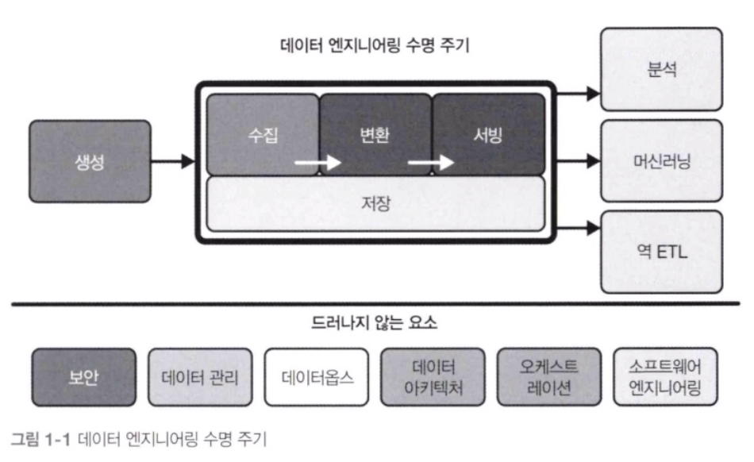

## 1. 데이터 엔지니어링 수명 주기란

데이터 엔지니어링 수명 주기는 원시 데이터의 요소를 분석가, 데이터 과학자, ML 엔지니어 등이 사용할 수 있는 유용한 최종 제품으로 전환하는 단계로 구성된다.

데이터 엔지니어링 수명 주기는 원천 시스템에서 데이터를 가져와 저장하는 것에서 시작한다. 다음으로 데이터를 변환한 뒤 분석가, 데이터 과학자, ML 엔지니어 등에게 데이터를 제공한다는 주요 목표를 향해 나아간다.

#### 데이터 생성
원천 시스템은 데이터 엔지니어링 수명 주기에서 사용되는 데이터의 원본이다. 예를 들어 원천 시스템은 IoT 장치, 애플리케이션 메시지 대기열 또는 트랜잭션 데이터베이스일 수 있다.

원천 데이터의 까다로운 차이점 중 하나는 스키마다.
스키마리스 방식은 스키마가 없다는 뜻은 아니다. 몽고DB와 같은 도큐먼트 데이터베이스에 데이터가 기록될때 스키마를 정의한다.
한편 관계형 데이터베이스 스토리지를 기반으로 구축된 더 전통적인 모델은 데이터베이스에 적용된 고정 스키마 방식을 사용하는데, 애플리케이션 쓰기는 이 스키마를 준수해야 한다.

데이터 엔지니어가 하는 일의 핵심은 원천 시스템 스키마에서 원시 데이터를 입력받고, 이를 분석에 유용한 출력으로 변환하는 것이다.

#### 데이터 저장
데이터를 저장할 공간이 필요하다. 스토리지 솔루션을 선택하는 것은 나머지 데이터 수명 주기에서 성공을 거두기 위한 열쇠이다.
모든 데이터가 같은 방식으로 엑세스되지 않는다. 검색 패턴은 저장 및쿼리되는 데이터에 따라 크게 달라진다. 그에 따라 데이터의 '온도'라는 개념이 나타났는데, 데이터 접근 빈도에 따라 데이터 온도가 결정된다.

가장 자주 엑세스 되는 데이터를 핫 데이터라고 한다. 미온적 데이터는 가끔(예를 들면 매주 또는 매월) 액세스 되는 데이터이다. 콜드 데이터는 거의 쿼리되지 않으며 아카이브 시스템에 저장하는 데 적합하다.

#### 데이터 수집
데이터 엔지니어링 수명 주기의 다음 단계는 원천 시스템에서 데이터를 수집하는 것이다. 이 과정이 가장 큰 병목 현상을 나타낸다. 데이터 수집은 배치 vs 스트리밍과 푸시 vs 풀 이라는 두 가지 주요 데이터 수집 개념이 존재한다.
- 배치 vs 스트리밍
	- 우리가 다루는 대부분의 데이터는 본질적으로 스트리밍이다.
	- 데이터는 거의 항상 원천에서 지속해 생성되고 갱신된다.
	- 배치 수집은 이 스트림을 큰 청크로 처리하는 전문적이고 편리한 방법이다.
	- 스트리밍 수집
		- 다른 애플리케이션이나 데이터베이스 또는 분석 시스템 등의 다운스트림 시스템에 데이터를 실시간으로 연속해 제공할 수 있다.
		- 여기서 실시간이란, 데이터가 생성된 지 얼마 지나지 않은 짧은 시간(1초 미만)에 다운스트림 시스템에서 데이터를 사용할 수 있음을 의미한다.
		- 실시간 인증에 필요한 지연 시간은 도메인 및 요건 사항에 따라 다르다
	- 배치 데이터
		- 배치 데이터는 미리 설정된 시간 간격에 따라 또는 데이터가 미리 설정된 크기 임곗값에 도달하면 수집된다.

스트리밍 우선 방식은 좋은 아이디어처럼 보일 수 있지만 항상 간단하지는 않으며 기본적으로 추가 비용과 복잡성이 발생한다. 모델 훈련이나 주간 리포트와 같은 많은 일반적이 사용 사례에서 배치야말로 뛰어난 접근 방식이라고 생각할 수 있다. 다만 배치 사용에 대한 트레이드오프를 정당화하는 비즈니스 사용 사례를 파악한 뒤에만 진정한 실시간 스트리밍을 채택하기를 권장한다.

- 푸시 vs 풀
	- 푸시 모델에서 원천 시스템은 데이터베이스, 객체 저장소 또는 파일 시스템과 관계없이 타깃에 데이터를 쓴다.
	- 풀 모델에서는 원천 시스템에서 데이터를 검색한다.

일반적인 CDC 방식은 데이터베이스에 대한 모든 커밋을 기록하는 바이너리 로그를 사용하는 것인데, 데이터베이스가 로그를 푸시한다. 수집 시스템은 로그를 읽지만, 그 외에는 데이터베이스와 직접 상호 작용하지 않는다.

#### 데이터 변환
데이터 변환 단계는 데이터를 원래 형태에서 다운스트림 사용 사례에 유용한 형태로 변경해야 한다.
배치 변환은 여전히 압도적으로 인기 있지만, 스트림 처리 솔루션의 인기가 높아지고 스트리밍 데이터양이 전반적으로 증가함에 따라 스트리밍 변환의 인기도 계속 높아져 특정 도메인에서 배치 처리를 완전히 대체할 것으로 예상된다.

#### 데이터 서빙
데이터 엔지니어링 수명 주기의 마지막 단계에 도달했다. 데이터를 수집하고 저장한 뒤에 일관성 있고 유용한 구조로 변환했으니, 이제 데이터로부터 가치를 창출할 때다.
데이터는 실용적인 목적으로 사용될 때 가치가 있다.
- 분석
- 비즈니스 인텔리전스
- 운영 분석
- 임베디드 분석머신러닝
- 역 ETL
	- 역 ETL은 데이터 엔지니어링 수명 주기의 출력 측에서 처리한 데이터를 가져와 원천 시스템에 다시 공급한다.

## 2. 데이터 엔지니어링 수명 주기의 드러나지 않는 주요 요소

#### 보안
데이터 엔지니어는 보안을 최우선으로 생각해야 하며, 이를 무시하는 사람은 위험을 감수해야 한다. 사용자에게 현재 업무를 수행하는 데 필요한 접근 권한만 부여하고 그 이상은 부여하지 않는다. 또한 보안은 접근 타이밍과 관련이 있는데, 해당 작업을 수행하는 데 필요한 기간 동안만 허용해야 한다.

#### 데이터 관리
데이터 관리에는 다음과 같은 여러 측면이 있다.
- 발견 가능성 및 책임을 포함한 데이터 거버넌스
	- 데이터 거버넌스는 무엇보다도 조직이 수집한 데이터의 품질, 무결성, 보안 및 사용성을 보장하기 위한ㄷ ㅔ이터 관리 기능이다.
	- 데이터 중심 기업에서는 데이터를 사용할 수 있고 검색할 수 있어야 한다.
	- 메타데이터는 '데이터에 관한 데이터'로, 데이터 엔지니어링 수명 주기의 모든 부분을 뒷받침한다. 메타데이터는 데이터를 검색하고 제어하는 데 필요한 데이터다.
	- 데이터 책임이란 데이터의 일부를 관리할 개인을 지정하는 것을 의미한다.
	- 데이터 품질은 데이터를 원하는 상태로 최적화하는 것으로 '기대하는 것과 비교해 어떤 결과를 얻을 수 있을까?' 라는 질문을 중심으로 한다.
- 데이터 모델링 및 설계
	- 데이터가 사용 가능한 형태로 제공되어야 한다.
	- 데이터를 사용 가능한 형태로 변환하는 프로세스를 데이터 모델링 및 설계 라고 한다.
- 데이터 계보
	- 데이터 게보란 데이터를 처리하는 시스템과 데이터가 의존하는 업스트림 데이터를 모두 추적해 수명 주기 전체에 걸쳐 데이터의 감사 추적을 기록하는 것을 말한다.
- 저장 및 운영
- 데이터 통합 및 상호 운용성
	- 데이터 통합과 상호 운용성은 여러 도구와 프로세스 전반에 걸쳐 데이터를 통합하는 프로세스다.
	- 데이터 통합은 맞춤형 데이터베이스 연결이 아닌 범용 API를 통해 이루어지는 경우가 늘고 있다.
	- 데이터를 직접 처리하는 대신 데이터 시스템과 통신하는 비교적 단순한 파이썬 코드로 관리할 수 잇다. 데이터 시스템과의 상호 작용의 복잡성은 감소했지만, 시스템 수와 파이프라인의 복잡성은 극적으로 증가했다.
	- 오케스트레이션의 필요성을 실감하게 된다.
- 데이터 수명 주기 관리
	- 데이터 레이크의 등장으로 조직은 데이터 보관 및 파기를 무시하게 됐다.
- 고급 분석 및 ML을 위한 데이터 시스템
- 윤리 및 개인정보보호
	- 지난 몇 년간 발생한 데이터 침해, 잘못된 정보 및 잘못된 데이터 처리 과정에서 한 가지 명백해진 점은 데이터가 사람들에게 영향을 미친다는 사실이다.

#### 데이터옵스
데이터옵스는 다음 사항들을 실현하는 기술 관행, 워크플로, 문화적 규범, 아키텍처 패턴의 집합이다.
- 신속한 혁신과 실험으로 고객에게 새로운 통찰력을 빠르게 제공
- 매우 높은 데이터 품질과 매우 낮은 오류율
- 인력, 기술, 환경의 복잡한 집합 전반에 걸친 협업
- 명환한 측정, 모니터링 및 결과의 투명성

#### 자동화
자동화를 사용하면 데이터옵스 프로세스의 신뢰성과 일관성을 보장할 수 있으며, 데이터 엔지니어가 새로운 제품 기능과 개선 사항을 기존 워크플로에 신속하게 구현할 수 있다.

조직의 데이터 성숙도가 높아짐에 따라, 데이터 엔지니어는 일반적으로 에어플로 또는 대그스터와 같은 오케스트레이션 프레임워크를 채택한다. 데이터 엔지니어들은 에어플로가 운영상의 부담을 초래한다는 것을 알지만, 결국 오케스트레이션의 이점이 복잡성을 능가한다. 엔지니어는 크론 잡을 에어플로 잡으로 단계적으로 이행한다.

핵심은 엔지니어가 워크로드를 줄이고 비즈니스에 제공하는 가치를 높일 수 있는 자동화를 지속해서 구현하려고 한다는 것이다.

#### 오케스트레이션
오케스트레이션은 많은 작업이 예약된 순서대로 최대한 빠르고 효율적으로 실행되도록 조정하는 프로세스이다. 예를 들어 에어플로와 같은 오케스트레이션 도구를 스케줄러라고 부르는 경우가 많지만, 이건 정확하지 않다. 크론과 같은 순수한 스케줄러는 시간만 인식하지만, 오케스트레이션 엔진은 일반적으로 유향 비순환 그래프(DAG)의 형태로 작업 종속성에 따라 메타데이터를 구축한다.

고급 오케스트레이션 엔진은 새로운 DAG 또는 개별 작업이 DAG에 추가될 때 백필 작업을 수행할 수 있다. 또한 시간 범위에 따른 종속성도 지원한다.

#### 소프트웨어 엔지니어링
데이터 엔지니어링 수명 주기 전체에 걸쳐 나타나는 코어 데이터 처리 코드는 여전히 작성되어야 한다. 많은 데이터 엔지니어가 오픈 소스 프레임워크 개발에 크게 관여하고 있다.
