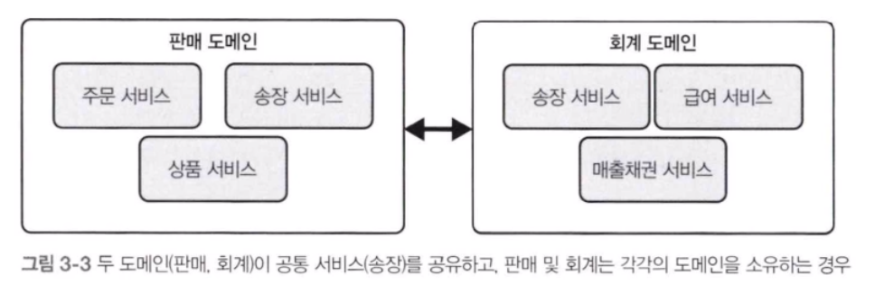
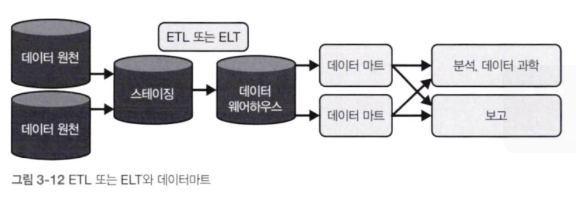
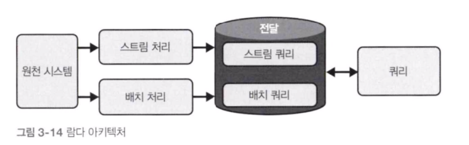
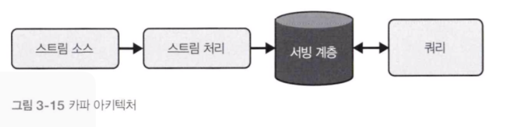
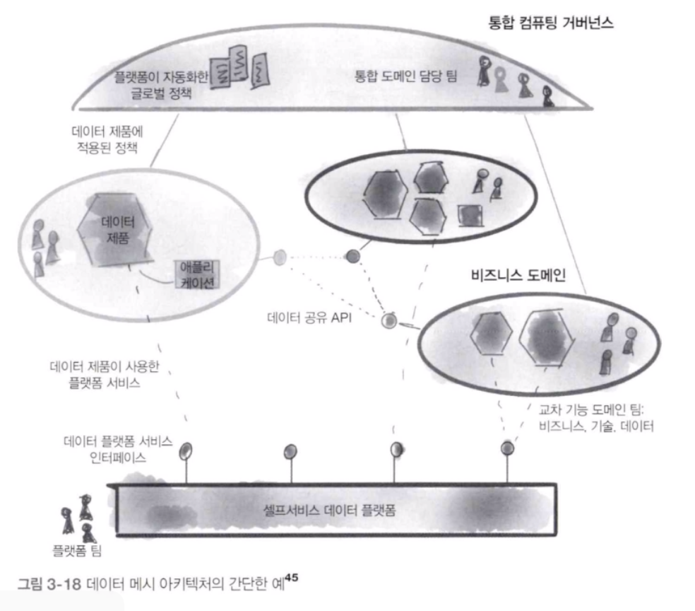

## 1. 데이터 아키텍처란

이 책에서 정의한 엔터프라이즈 아키텍처는 기업의 변화를 지원하는 시스템 설계로, 신중한 트레이드오프 평가를 통해 도달한 유연하고 되돌릴 수 있는 의사결정으로 달성된다. 엔터프라이즈 아키텍처 정의의 핵심은 유연성과 트레이드오프의 균형을 유지하는 것이다.

우수한 데이터 아키텍처는 유연성을 유지하고 적절한 트레이드오프를 실현하는 동시에, 광범위하게 재사용 가능한 공통 구성 요소를 사용해 비즈니스 요건을 충족한다. 우수한 데이터 아키텍처는 유연하고 유지 관리하기 쉽다.

## 2. 우수한 데이터 아키텍처의 원칙

#### 원칙 1 : 공통 컴포넌트를 현명하게 선택해라
공통 컴포넌트는 조직 내에 폭넓게 적용할 수 있는 그 어떤 구성 요소라도 될 수 있다. 여기에는 객체 스토리지, 버전 제어 시스템, 관찰 가능성, 모니터링 및 오케스트레이션 시스템, 처리엔진이 포함된다.

#### 원칙 2 : 장애에 대비하라
엔지니어는 장애에 대비해 설계할 때 허용 가능한 신뢰성, 가용성, RTO 및 RPO를 고려해야 한다.
- 가용성
	- IT 서비스 또는 컴포넌트가 작동 가능한 상태에 있는 시간의 비율
- 신뢰성
	- 지정된 간격 동안 의도된 기능을 수행할 때 시스템이 정의된 표준을 충족할 확률
- 복구 시간 목표
	- 서비스 또는 시스템 장애의 최대 허용 시간. 
	- 복구시간 목표(RTO)는 일반적으로 운영 중단이 비즈니스에 미치는 영향을 판단해 설정된다.
- 복구 시점 목표
	- 복구 후 허용 가능한 상태다. 데이터 시스템에서는 운영 중단 시 데이터가 손실되는 경우가 많다.
	- 이 설정에서 복구 시점 목표(RPO)는 허용 가능한 최대 데이터 손실을 나타낸다.

#### 원칙 3 : 확장을 위한 아키텍처를 설계하라
확장 가능한 시스템은 상당한 양의 데이터를 처리할 수 있도록 스케일 업 할 수 있다.
확장 가능한 시스템 규모를 스케일 다운할 수 있다.
탄력적 시스템은 부하에 따라 동적으로 확장할 수 있으며, 이상적으로는 자동화된 방식으로 확장할 수 있다.

#### 원칙 4 : 아키텍처는 리더십이다.

#### 원칙 5 : 항상 아키텍처에 충실하라
데이터 아키텍트는 단순히 기존 상태를 유지하는 역할만 수행하는 게 아니라, 비즈니스와 기술의 변화에 대응해 새롭고 흥미로운 것들을 끊임없이 설계한다.

#### 원칙 6 : 느슨하게 결합된 시스템을 구축하라
아마존 API 선언문
- 지금부터 모든 팀은 서비스 인터페이스를 통해 데이터와 기능을 공개한다.
- 각 팀은 이러한 인터페이스로 서로 소통해야 한다.
- 다른 형태의 프로세스 간 통신은 허용되지 않는다. 허용되는 유일한 통신은 네트워크를 통한 서비스 인터페이스 호출을 사용한 것이다.
- 어떤 기술을 사용하는지는 중요하지 않다.
- 모든 서비스 인터페이스는 예외 없이 처음부터 외부화할 수 있도록 설계되어야 한다.

#### 원칙 7 : 되돌릴 수 있는 의사결정을 하라
아키텍처를 단순화하고 민첩성을 유지하려면 돌이킬 수 있는 의사결정을 목표로 삼아야 한다.

#### 원칙 8 : 보안 우선순위를 지정하라

#### 원칙 9 : 핀옵스를 수용하라
핀옵스는 진화하는 클라우드 재무 관리 분야이자 문화적 관행으로 엔지니어링, 재무, 기술 및 비즈니스 팀이 데이터 기반 지출 결정을 위해 협업할 수 있도록 지원함으로써 조직이 비즈니스 가치를 극대화할 수 있게 해준다.

## 3. 주요 아키텍처 개념

모든 아키텍처의 주요 목표는 데이터를 가져와 다운스트림 소비에 유용한 결과물로 변환하는 것을 놓치면 안된다.

1. 도메인과 서비스
	- 도메인은 실제 설계를 하는 주제 영역
	- 서비스는 작업 달성이 목적인 기능 집합
	- 도메인은 여러 서비스를 포함할 수 있다. 각 서비스에는 판매 도메인을 지원하는 특정 작업이 있다.
	- 도메인에 포함할 대상과 서비스를 결정할 때 최고의 조언은 사용자 및 이해관계자와 직접 대화하고, 의견을 듣고, 그들의 작업 수행에 도움이 될 서비스를 구축하라는 것이다.

2. 분산 시스템, 확장성, 장애에 대비한 설계
	- 확장성
	- 탄력성
	- 가용성
	- 신뢰성

3. 강한 결합 vs 느슨한 결합 : 계층, 모놀리스, 마이크로 서비스
	- 도메인과 서비스의 모든 부분은 다른 모든 도메인과 서비스에 필수적으로 의존한다. 이처럼 긴밀하게 결합된 패턴을 강한 결합이라고 한다.
	- 스팩트럼의 반대편에는 서로 온전히 의존하지 않는 분산형 도메인과 서비스가 있으며 이를 느슨한 결합이라고 한다.

4. 사용자 접근 : 싱글 vs 멀티테넨트
5. 이벤트 기반 아키텍처
	- 이벤트는 이벤트 생성, 라우팅, 소비의 세 가지 주요 영역으로 요약된다.
6. 브라운필드 vs 그린필드 프로젝트
	- 브라운필드 프로젝트는 기존 아키텍처를 리팩터링하고 재구성하는 경우가 많아 현재와 과거의 선택에 따른 제약을 받는다.
		- 직접 재작성에 대한 대중적인 대안은 스트랭글러 패턴이다. 새로운 시스템은 레거시 아키텍처의 컴포넌트를 천천히 그리고 점진적으로 대체한다.
	- 그린필드 프로젝트를 사용하면 이전 아키텍처의 역사나 레거시에 얽매이지 않고 새롭게 출발할 수 있다.

## 4. 데이터 아키텍처의 사례 및 유형
#### 데이터 웨어 하우스
데이터 웨어하우스는 보고 및 분석에 사용되는 중앙 데이터 허브로, 가장 오래되고 잘 확립된 데이터 아키텍처의 하나다. 데이터 웨어하우스의 데이터는 일반적으로 분석 활용 사례에 맞게 고도로 포맷되고 구조화되어 있다.

데이터 웨어하우스 아키텍처의 두 가지 유형인 '조직'과 '기술'에 주목해야 한다.
조직 데이터 웨어하우스 아키텍처는 특정 비즈니스 팀의 구조 및 프로세스와 관련된 데이터를 구성한다.
기술 데이터 웨어하우스 아키텍처는 MPP와 같은 데이터 웨어하우스의 기술적 본질을 반영한다.

클라우드 데이터 웨어하우스인 구글 빅쿼리, 스노우플레이크 및 기타 경쟁업체는 컴퓨팅과 스토리지를 분리하는 아이디어를 대중화했다. 이 아키텍처에서는 데이터가 객체 스토리지에 저장되므로 사실상 무제한 스토리지를 사용할 수 있다. 이를 통해 사용자는 컴퓨팅 파워를 온디맨드 방식으로 스핀업할 수 있으며 수천 개의 노드에 대한 장기적인 비용 없이 애드훅 빅데이터 기능을 제공한다.

데이터 마트는 단일 하위 조직이나 부서 또는 비즈니스 라인에 초점을 맞춰 분석 및 보고서를 제공하도록 설계된 웨어하우스의 한층 더 정교한 하위집합이다.

데이터 마트가 필요한 이유는 다음 두 가지다. 첫째, 데이터 마트는 분석가와 보고서 개발자가 데이터에 더 쉽게 접근할 수 있도록 한다. 둘째, 데이터 마트는 초기 ETL 또는 ELT 파이프라인이 제공하는 것보다 더 많은 변환 단계를 제공한다. 따라서 보고서 또는 분석 쿼리에 복잡한 데이터 조인 및 집계가 필요한 경우, 특히 원시 데이터가 큰 경우 성능이 크게 향상될 수 있다. 변환 프로세스는 라이브 쿼리의 성능을 개선하기 위해 조인 및 집계된 데이터로 데이터 마트를 채울 수 있다.

#### 데이터 레이크
빅데이터 시대에 등장한 가장 인기 있는 아키텍처는 데이터 레이크다. 데이터에 엄격한 구조적 제한을 가하는 대신, 정형 데이터와 비정형 데이터를 모두 중앙 위치에 저장할 수 있다. 데이터 레이크는 스토리지와 컴퓨팅이 긴밀하게 연결된 단일 데이터 웨어하우스에 의존하는 대신, 모든 크기와 유형의 방대한 데이터를 저장할 수 있다.

#### 데이터 레이크하우스
데이터 레이크하우스는 데이터 웨어하우스에서 볼 수 잇는 제어, 데이터 관리, 데이터 구조를 통합하는 동시에, 객체 스토리지에 데이터를 저장하고 다양한 쿼리 및 변형 엔진을 지원한다. 특히 데이터 레이크하우스는 단순히 데이터를 쏟아보ㅜㅅ기만 하고 갱신하거나 삭제하지는 않는 본래의 데이터 레이크에서 크게 벗어난 ACID 트랜잭션을 지원한다.

#### 람다 아키텍처
카프카가 등장하면서, 스트리밍 데이터 관련 작업의 인기가 폭발적으로 높아졌다. 데이터 엔지니어는 배치 및 스트리밍 데이터를 단일 아키텍처로 조정하는 방법을 찾아야 했다.

람다 아키텍처는 배치, 스트리밍 및 서빙 등의 시스템이 서로 독립적으로 작동한다. 인스트림 처리는 일반적으로 NoSQL 데이터베이스인 속도 계층에서 가능한 한 가장 낮은 지연 시간으로 데이터를 전달하고 한다. 배치 계층에서는 데이터가 데이터 웨어하우스와 같은 시스템에서 처리 및 변환되어 데이터의 사전 계산 및 집계 뷰를 생성한다. 서빙 계층은 두 계층에서 쿼리 결과를 집계해 결합된 뷰를 제공한다.

#### 카파 아키텍처
람다 아키텍처의 단점에 대한 대응책으로 제이 크렙스는 카파 아키텍처라는 대안을 제안했다. 스트림 처리 플랫폼을 데이터 처리, 저장 및 서빙 등 모든 데이터 처리의 백본으로 사용하는 것이다.

이를 통해 진정한 이벤트 기반 아키텍처를 실현할 수 있다. 실시간 이벤트 스트림을 직접 읽고 대량 데이터 청크를 재생해 일괄 처리함으로써 동일한 데이터에 실시간 및 배치 처리를 매끄럽게 적용할 수 있다.

#### 데이터 메시
데이터 메시는 (중앙 집중식 데이터 레이크 및 데이터 웨어하우스 같은) 거대한 모놀리식 데이터 플랫폼과, 운영 데이터와 분석 데이터 사이에서 환경이 구분되는 '데이터 격차'에 대한 최근의 대응책이다. 데이터 메시는 (소프트웨어 아키텍처에서 주로 사용되는 개념인) 도메인 기반 설계 개념을 채택해 데이터 아키텍처에 적용함으로써 중앙 집중식 데이터 아키텍처의 문제를 뒤집으려 한다.

