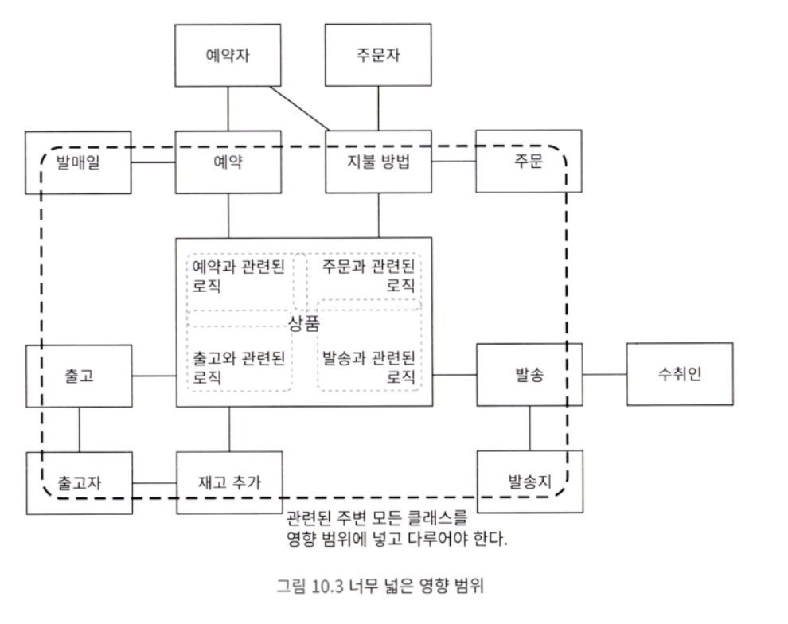
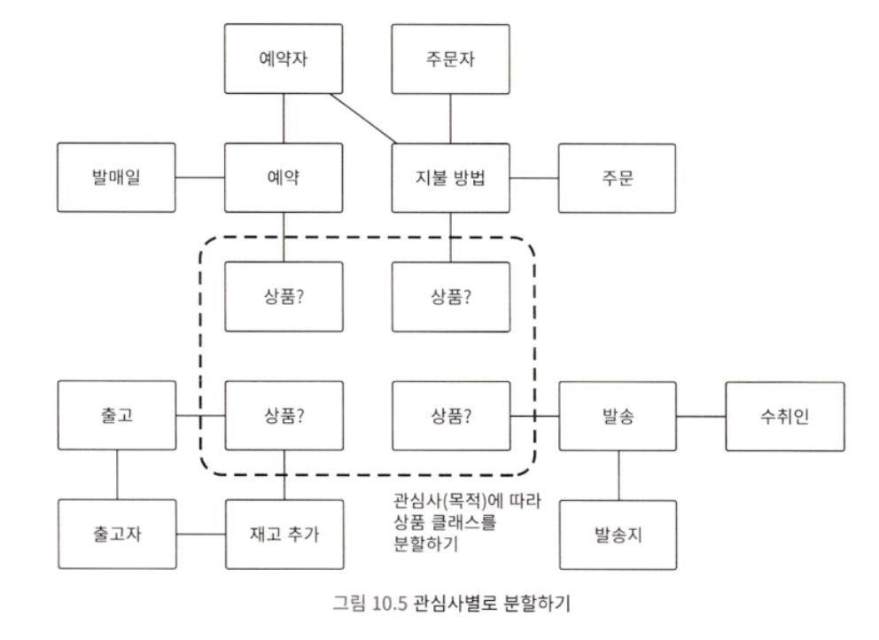
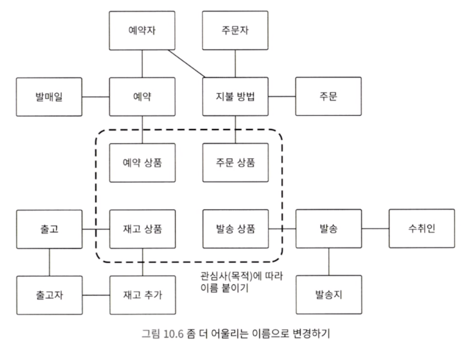
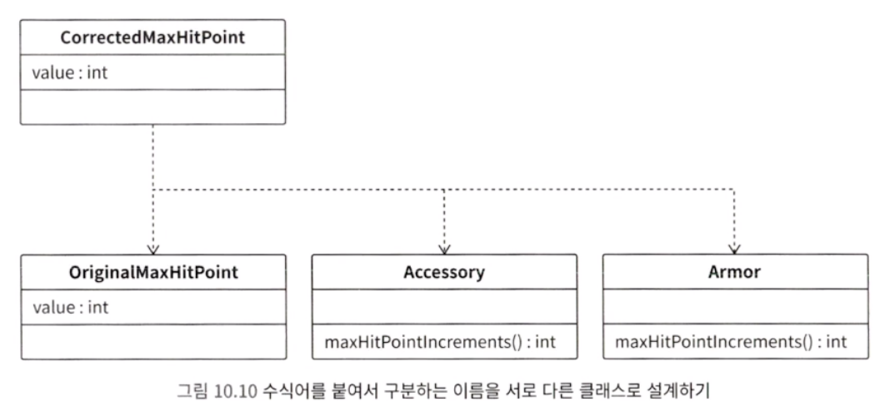
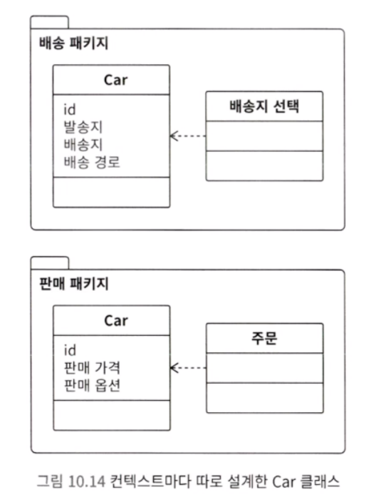
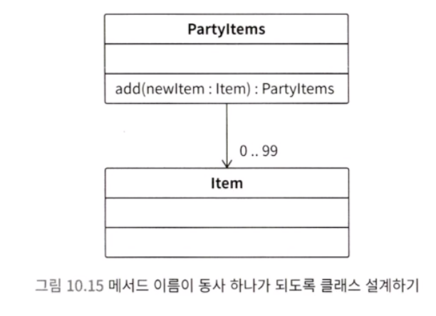

적절한 책무를 생각하고 강한 결합을 방지하려면, 클래스와 메서드에 적절한 이름을 붙여야 합니다.
이번 장에서 이름을 짓는 기본적인 방법은 <span style="color:#ff0000">목적 중심 이름 설계</span>입니다. 이는 소프트웨어가 달성해야 하는 목적을 기반으로 이름을 설계하는 방법입니다.


---

## 악마를 불러들이는 이름

흔히 볼 수 있는 좋지 않은 이름 설계는 상품을 그대로 상품 클래스라고 이름 붙이는 것입니다.



온라인 쇼핑몰은 상품을 중심으로 이루어집니다. 출고, 예약, 주문, 발송 등 상품을 다루는 유스케이스가 많습니다. 따라서 이름을 단순하게 상품 클래스라고 붙이면, 여러 유스케이스와 관계를 맺게 됩니다. 그러면 상품 클래스가 여러 클래스와 관련 있는 로직을 갖게 되고, 점점 거대하고 복잡해질 것입니다. 강한 결합 구조가 되어 버리는 것입니다.

#### 1) 관심사 분리

상품 클래스가 다양한 관심사와 결합되어, 온갖 것과 관련된 로직을 품게 되었습니다. 즉, 강한 결합 구조라는 것입니다.

> 강한 결합을 해소하고, 결합이 느슨하고 응집도가 높은 구조로 만들려면 관심사 분리를 할 수 있어야 합니다.

관심사 분리는 관심사(유스케이스, 목적, 역할)에 따라서 분리한다라는 소프트웨어 공학의 개념입니다.

따라서 상품 클래스는 관심사에 따라서 각각 클래스로 분할해야 합니다.



#### 2) 관심사에 맞는 이름 붙이기

주문 목적의 상품은 어떻게 부를 수 있을까요? 주문 상품이라고 부르는 것은 어떨까요? 마찬가지로 예약에서는 예약 상품, 발송에서는 발송 상품으로 변경해 봅시다.



위 사진 처럼 관심사에 맞는 이름을 붙일 수 있습니다.
분할 후에는 분할한 클래스 각각에 관심사에 맞는 로직을 캡슐화하면 됩니다. 이렇게 관심사에 따라 분리하면, 결합도를 낮추고 응집도를 높일 수 있습니다.

#### 3) 포괄적이고 의미가 불분명한 이름

개발 초기에는 포괄적인 이름을 붙이는 경우가 많습니다. 이름을 이렇게 포괄적으로 붙이면 내부에 온갖 로직을 구현하게 만듭니다.

저자는 이렇게 이름이 너무 포괄적이라서 목적이 불분명한 클래스를 목적 불명 객체라고 부릅니다. 목적 불명 객체는 규모가 커지기 쉽습니다.
이러한 상황에 빠지지 않으려면, 관심사 분리를 고려한 이름을 설계해야 합니다. 관심사 분리를 쉽게 하려면, 비즈니스 목적에 따라 이름을 붙여 보면 됩니다.


---

## 이름 설계하기 - 목적 중심 이름 설계

프로그래밍에서 이름은 가독성을 높이는 역할만 하는 게 아닙니다.
관심사 분리를 생각하고, 비즈니스 목적에 맞게 이름을 붙이는 것은 결합이 느슨하고 응집도가 높은 구조를 만드는 데 굉장히 중요한 역할을 합니다. 설계에 중요한 역할을 하므로 이름을 설계한다 라고 할 수 있을 것입니다.

목적 중심 이름 설계는 목적에 맞게 이름을 설계하는 것입니다. 중요한 포인트는 다음과 같습니다.

- 최대한 구체적이고, 의미 범위가 좁고, 특화된 이름 선택하기
	- 특정한 목적을 달성하는 데 특화된 의미 범위가 좁은 이름을 클래스에 붙입니다.
	- 고객 대상 제품 개발에서의 목적은 회사가 사업적으로 어떤 목적을 달성하고 싶은가 하는 비즈니스 목적이어야 합니다.
	- 비즈니스 목적에 특화하면 다음과 같은 효과가 생깁니다.
		- 이름과 관계없는 로직을 배제하기 쉬워짐
		- 클래스가 작아짐
		- 관계된 클래스 개수가 적으므로, 결합도가 낮아짐
		- 관계된 클래스 개수가 적으므로, 사양 변경 시 생각해야 하는 영향 범위가 좁음
		- 목적에 특화된 이름을 갖고 있으므로, 어떤 부분을 변경해야 할 때 쉽게 찾을 수 있음
		- 개발 생산성이 향상됨

- 존재가 아니라 목적을 기반으로 하는 이름 생각하기
	- 단순하게 존재를 나타내는 이름은 여러 의미가 여러 곳에서 사용되기 쉬우며, 목적이 불분명해지기 쉽습니다. 결국 로직 레벨에서 혼란을 줍니다.
	- 구체적인 목적을 알 수 있게, 목적을 기반으로 이름을 짓는 것이 좋습니다.

- 어떤 관심사가 있는지 분석하기
	- 비즈니스 목적에 특화된 이름을 만들려면, 어떤 비즈니스를 하는지 모두 파악해야 합니다.
	- 이를 위해서는 소프트웨어가 추구하는 목적과 내용을 분석해야 합니다.

- 소리 내어 이야기해 보기
	- 사람이 머릿속에서 생각하는 것은의외로 굉장히 애매모호합니다.
	- 이름도 매우 중요하지만 어떤 목적을 달성하고 싶은지, 어떤 형태로 사용하고 싶은지, 서로 어떤 관련이 있는지 등 배경과 의도도 함께 정리하고, 이를 팀과 소통해서 일치시키는 것이 중요합니다.
	- 프로그래밍에서 어떤 문제가 발생했을 때, 문제를 누군가에게 설명하다 보면 스스로 원인을 깨닫고 해결할 수 있습니다.(고무 오리 디버깅)
	- 적극적으로 이야기하면서, 대화 속에서 사용되는 이름에 주의를 기울여 보세요, 이름과 관심사를 더 수집하고, 자세히 알 수 있게 될 것입니다.
	- 유비쿼터스 언어란 팀 전체에서 의도를 공유하기 위한 언어입니다.

- 이용 약관 읽어 보기
	- 이용 약관에는 서비스와 관련된 규칙이 굉장히 엄격한 표현으로 작성되어 있습니다. 그래서 이를 활용하면 비즈니스와 관련된 이름을 알 수 있습니다.
	- 비즈니스 규칙과 클래스를 일치하게 만들면, 정확하고 빠르게 변경할 수 있습니다.

- 다른 이름으로 대체할 수 없는지 검토하기
	- 다른 이름으로 바꿔 보고, 의미를 더 좁게 만들 수는 없는지, 이상한 점은 없는지 검토하는 것이 좋습니다.
	- 참고로 다른 이름을 생각할 때는 사전에서 유의어를 확인해 보는 것도 도움이 됩니다.

- 결합이 느슨하고 응집도가 높은 구조인지 검토하기
	- 목적에 특화된 이름을 선택하면, 목적 이외의 로직을 배제하기 쉬워집니다. 결과적으로 목적과 관련된 로직이 모이므로, 응집도가 높아집니다. 목적 이외의 로직이 섞인다면, 이름을 잘못 붙인 것은 아닌지 검토해 보아야 합니다.
	- 또한 다른 클래스 몇 개와 관련되어 있는지 개수를 확인해 보세요
	- 여러 의미를 갖고 있다면 분해하세요
	- 관련된 클래스의 개수가 적으면 적을수록 영향 범위가 줄어듭니다.


---

## 이름 설계 시 주의 사항

#### 1) 이름에 관심 갖기

<span style="color:#ff0000">목적 중심 이름 설계는 이름에 주의를 기울기오, 이름과 로직을 대응시킨다 라는 접근 방법을 전제로 합니다.</span>
따라서 이름에 관심을 갖지 않으면, 모든 것이 무너집니다.

팀 개발에서는 이름이 중요합니다. 이름과 로직이 대응된다는 전제, 이름이 프로그램 구조를 크게 좌우한다는 사실을 팀원들과 이야기해야 합니다.

#### 2) 사양 변경 시 '의미 범위 변경' 경계하기

개발 중에 계속해서 반복되는 사양 변경에 의해, 개발 맥락에서 말이 의미하는 바가 점점 변화하는 경우가 있습니다. 따라서 이름 설계는 중간중간 다시 검토해 봐야 합니다.

#### 3) 대화에는 등장하지만 코드에 등장하지 않는 이름 주의하기

대화에는 등장하지만, 코드에 등장하지 않는 이름이 있다면 주의해야 합니다. 대화에 자주 등장하는 중요한 개념이 소스 코드에서는 이름조차 붙어 있지 않고, 잡다한 로직에 묻혀 있는 경우가 꽤 많습니다.

대화에서 등장하는 이름을 신경 쓰고 그 이름을 기반으로 메서드와 클래스를 설계해야 합니다.

#### 4) 수식어를 붙여서 구별해야 하는 경우는 클래스로 만들어 보기

차이를 구분하기 어려운 코드를 단순하게 수식어를 붙여서 동료에게 설명하는 상황은 시스템 개발에서 매우 흔하게 볼 수 있습니다.

의미가 다르거나 조건에 따라 달라지는 대상을 같은 이름으로 표현하면, 차이를 구별하기 어렵습니다. 따라서 수식어를 붙이면서까지 차이를 나타내고 싶은 대상은 각각 클래스로 설계하는 것이 좋습니다.

예를 들어 '장비 착용으로 높아진 최대 히트포인트' 와 '캐릭터의 원래 최대 히트포인트' 를 모두 히트포인트로 하는 것이 아닌 서로 다른 클래스로 설계하는 것이 좋습니다.

이렇게 의미가 다른 개념들을 서로 다른 클래스로 설계해서 구조화하면, 개념 사이의 관계를 이해하기 쉽습니다.
헷갈리는 로직을 동료에게 물어볼 때는 동료가 사용하는 수식어에 주의를 기울이기 바랍니다. 그리고 수식어를 붙여서 차이를 나타낸다면, 각각을 클래스로 설계할 수 없는지 검토해 보기 바랍니다.




---

## 의미를 알 수 없는 이름

일단 의도와 목적을 알 수 없는 이름입니다.

```java
int tmp3 = tmp1 - tmp2;
if (tmp3 < tmp4) {
	tmp3 = tmp4;
}
int tmp5 = tmp3 * tmp6;
return tmp5;
```

인간의 주의력에는 한계가 있습니다. 사양과 로직을 항상 정확하게 해석할 수는 없습니다. 부주의로 인해 잚소 해석하는 경우가 생길 수 있습니다. 그리고 의미가 분명하지 않은 이름은 이러한 해석 오류를 더 크게 만듭니다.

지금부터 의미가 분명하지 않은 이름이 되기 쉬운 경우들에 대해 소개하겠습니다.
#### 1) 기술 중심 명명

프로그래머의 머릿속은 항상 프로그래밍과 관련된 생각으로 가득합니다. 그래서 이름도 프로그래밍과 관련된 용어, 컴퓨터와 관련된 용어에서 유래되는 경우가 많습니다. 이러한 기술 중심 명명은 이름의 의도를 알기 어렵게 합니다.

#### 2) 로직 구조를 나타내는 이름

아래 코드는 어떤 메서드일까요

```java
public Magic {
	boolean isMemberHpMoreThanZeroAndIsMemberCanactAndIsMemberMpMoreThanMagicCostMp(Member member) {
		if (0 < member.hitPoint) {
			if (member.canAct()) {
				if (costMagicPoint <= member.magicPoint) {
					return true;
				}
			}
		}
		return false;
	}
}
```

위 코드의 메서드 이름을 보면 로직 구조를 그대로 드러내고 있습니다. 이것은 무엇을 의도하는지 알기 힘들게 합니다. 따라서 의도와 목적을 이해하기 쉽게 이름을 붙여야 합니다.

위에서 메서드 이름을 canEnchant 로 설정하는 것이 훨씬 의도를 파악하기 좋을 것입니다.

#### 3) 놀람 최소화 원칙

<span style="color:#ff0000">놀람 최소화 원칙</span>이라는 원칙이 있습니다. 사용자가 예상하지 못한 놀라움을 최소화하도록 설계해야 한다는 접근 방법입니다. 이를 위해서는 로직과 이름을 잘 대응시켜야 합니다.

로직을 변경할 때는 항상 놀람 최소화 원칙을 신경 써야 합니다. 로직과 이름 사이에 괴리가 있다면 이름을 수정하거나, 메서드와 클래스를 의도에 맞게 따로 만드는 것이 좋습니다.


---

## 구조에 악영향을 미치는 이름

#### 1) 데이터 클래스처럼 보이는 이름

~Info, ~Data 같은 이름의 클래스는 읽는 사람에게 데이터만 갖는 클래스니까, 로직을 구현하면 안 되는구나 라는 이미지를 심어 줄 수 있습니다. 이러한 인상을 주는 이름은 피하는 것이 좋습니다.

DTO
예외적으로 데이터 클래스를 사용하는 경우가 있습니디.
변경 책무와 참조 책무를 모듈로 분리하는 명령 쿼리 역할 분리(CQRS)라고 불리는 아키텍처 패턴이 있습니다. CQRS에서 참조 책무는 단순히 값을 추출해서 출력하면 되므로, 계산과 데이터 변경을 동반하지 않습니다.

이는 DTO라고 해서, 데이터 전송 용도로 사용되는 디자인 패턴입니다. 값 변경이 필요 없으므로, 인스턴스 변수는 final로 선언하고 생성자에서는 값만 지정합니다. 

#### 2) 클래스를 거대하게 만드는 이름

클래스르 점점 더 거대하고 복잡하게 만드는 이름이 있습니다. 대표적인 이름으로는 Manager 가 있습니다. MemeberManager와 같은 이름을 사용하게 되면 이름 때문에 너무 많은 책무를 떠안아서 단일 책임 원칙을 위반하게 될 수도 있습니다.

실제 개발에서도 Manager라는 이름의 클래스는 여러 책무를 떠안기 쉽습니다. 이러한 모든 문제와 원인은 Manager 즉, '관리'라는 단어가 가진 의미가 너무 넓고 애매하기 때문입니다. 따라서 의미가 좁은 개념을 찾아보는 것이 좋습니다.

#### 3) 상황에 따라 의미가 달라질 수 있는 이름

용어는 상황에 따라 의미가 달라집니다. 예를 들어 Account는 금융 업계에서는 계좌를 의미하지만 컴퓨터 보안에서는 로그인 권한을 의미합니다.

컨텍스트가 다른데도 하나의 Car 클래스에 모든 것을 구현하면, Car 클래스가 여러 컨텍스트의 로직을 갖게 됩니다. 클래스가 거대해지고 개발자가 이해하기 어렵게 됩니다. 컨텍스트가 다르다면, 분리해서 느슨한 결합으로 설계하는 것이 좋습니다.

각 컨텍스트는 서로 다른 패키지로 선언합니다. 이처럼 느슨하게 결합하면, 한쪽을 변경해도 다른 쪽에는 영향을 주지 않습니다. 따라서 배송과 판매가 서로 관여하지 않게 됩니다.



어떤 컨텍스트가 둘러싸고 있는지 분석하세요. 그리고 컨텍스트별로 경계지어 보세요. 이를 기반으로 각 컨텍스트별로 클래스를 설계하면 됩니다.

#### 4) 일련번호 명명

Class001, method001, method002, method003, ... 처럼 클래스와 메서드의 이름에 번호를 붙여 만드는 것을 일련번호 명명이라고 부릅니다.
목적과 의도를 알기 힘들다는 점에서 기술 중심 명명과 비슷하지만, 구조를 개선하기가 훨씬 힘들다는 점에서 훨씬 더 악질적인 방법입니다.


---

## 이름을 봤을 때, 위치가 부자연스러운 클래스

다른 클래스로 이동시켜야 자연스러운 메서드가 있습니다. 이처럼 있어야 할 곳에 있지 않은 부자연스러움은 이름을 통해 판단할 수 있습니다.

#### 1) 동사 + 목적어 형태의 메서드 이름 주의하기

다양한 애플리케이션에서 관심사와 전혀 관계없는 메서드가 클래스에 추가되는 경우가 많습니다. 서둘러서 구현하려고 할 때, 기존 클래스들만 가지고 어떻게든 끝내고자 무리하게 구현했을 때 이렇게 되기 쉽습니다.

그리고 관심사가 다른 메서드는 addItemToParty 처럼 '동사 + 목적어' 형태가 되는 경향이 있습니다.

#### 2) 가능하면 메서드의 이름은 동사 하나로 구성되게 하기

관심사가 다른 메서드가 섞이지 못하게 막으려면 되도록 메서드의 이름이 동사 하나로 구성되도록 설계하는 것이 좋습니다.

> 동사 + 목적어 형태의 메서드   --->  목적어의 개념을 나타내는 클래스를 따로 만듭니다. 그리고 그 클래스에 동사 하나 형태의 메서드를 추가합니다.

위에서 addItemToParty 메서드의 경우 add 메서드를 가진 PartyItems 클래스르 만들면 이후에 아이템을 여러 상황에서 얻을 때 사용하면 됩니다.



#### 3) 부적절한 위치에 있는 boolean 메서드

동사 + 목적어 메서드처럼 boolean 자료형을 리턴하는 메서드도 적절하지 않은 클래스에 정의되어 있는 경우가 많습니다.

```java
class Common {
	// 맴버가 혼란 상태라면 true를 반환합니다.
	static boolean isMemberInConfusion(Member member) {
		return member.states.contains(StateType.confused);
	}
}
```

멤버의 상태트 멤버와 관련된 관심사입니다. 따라서 Member 클래스에 정의하는 것이 자연스럽습니다. 따라서 Common에 정의되어 있는 것은 자연스럽지 않습니다.

메서드가 정의되어 있는 클래스 위치가 적절한지 쉽게 확인할 수 있는 방법이 있습니다. 바로 다음 형태로 바꾸었을 때 위화감이 없으면 좋은 것입니다.

> 클래스 is 상태.

위 코드 예시를 대입해보면 Common is Memeber in confusion
위 문장에서 어색함을 느낄 수 있습니다.

Member is in confusion
위화감이 크게 없습니다. 따라서 멤버가 혼란 상태인지 확인하는 메서드는 Member 클래스에 정의하는 것이 좋습니다.

> 이처럼 boolean 자료형의 메서드를 추가할 때는 <span style="color:#ff0000">클래스 is 상태</span> 형태로 읽어봤을 때 자연스러운 영어 문장이 되는지 확인해 보기 바랍니다.


---

## 이름 축약

#### 1) 의도를 알 수 없는 축약

긴 이름이 싫어서 이름을 축약하는 경우가 있습니다. 주석이 있다고 해도, 주석은 유지보수가 잘 되지 않기 때문에 코드를 이해하기 더 어렵게 할 수도 있습니다.

#### 2) 기본적으로 이름은 축약하지 말기

이름이 길면 타이핑을 많이 해야 해서 과거에는 싫어하는 분위기였습니다. 하지만 최근에는 보통 자동 완성 기능을 제공하는 에디터를 사용하므로, 이름을 입력하는 게 그렇게 힘들지 않습니다.
조금 귀찮더라도 이름을 축약하지 말고 모두 쓰기 바랍니다.

다만 이름 생략을 완전히 금지해야 한다는 말은 아닙니다. 일반적으로도 축약한 이름이 통용된다면 축약해도 괜찮다고 생각합니다.

#### 3) 이름을 축약할 수 있는 경우

for 반복문의 카운터 변수는 관습적으로 i와 j 처럼 짧은 한 글자의 문자로 표현하는 경우가 많습니다. '축약을 어느 정도까지 허용할 것인가?'에 관해서는 다양한 관점이 있습니다. 저자는 최대한 축약하지 않고, 의도를 명확하게 전달하는 것이 중요하다고 생각합니다.

이름을 축약할 때는 의미가 달라지지 않는지, 추가적인 다른 문제가 발생하지는 않는지 등을 꼭 확인해야 합니다. 프로그래밍 언어에 따라서 관례가 다를 수 있으므로, 이러한 점을 고려해 명명 방법을 팀이나 회사 차원에서 결정해 두는 것이 좋습니다.


