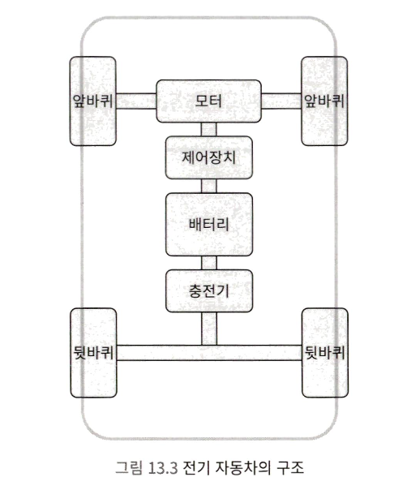
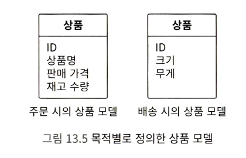
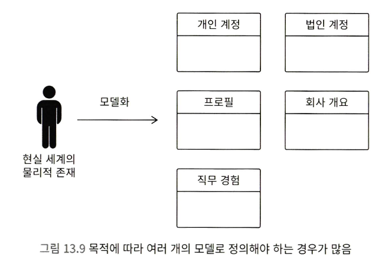
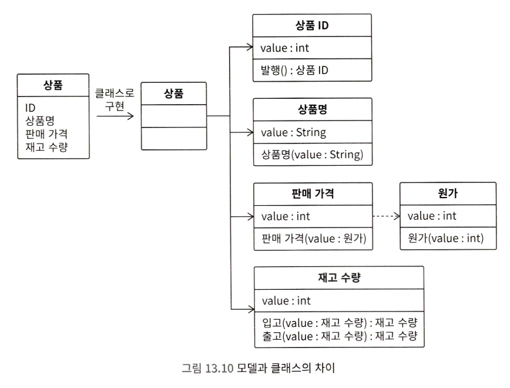
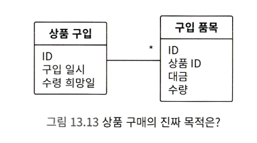
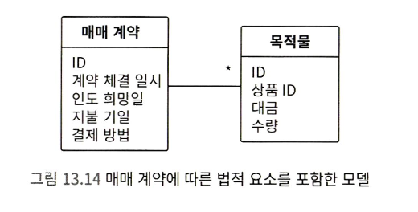
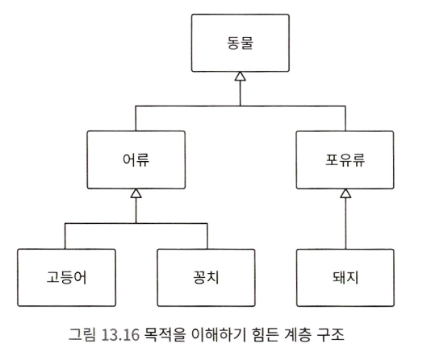
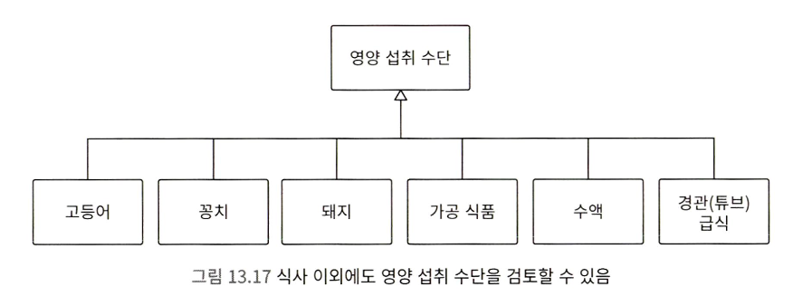

동작 원리와 구조를 간단하게 설명하기 위해, 사물의 특징과 관계를 그림으로 나타낸 것을 모델, 모델을 만드는 활동을 모델링이라고 부릅니다.

## 악마를 불러드리기 쉬운 User 클래스

User 클래스는 사양 변경이 굉장히 잦아서, 여러 가지 문제를 일으키기 쉬운 클래스입니다. 처음은 로그인과 관련된 필드만 있다가, 이후 상품 배송지 지정을 위한 주소와 전화번호, 구매자 프로필 등의 정보가 추가되었습니다.

서비스 출시 이후 다른 업체도 상품을 등록할 수 있는 사양 변경이 일어납니다. 따라서 법인을 구분할 수 있도록 법인 등록번호가 User에 추가됩니다. 이후 법인 사업자와 일반 유저를 관리하는 UserManager, CorporationManager 클래스가 있다고 생각해봅시다.

이러한 구조에서는 버그가 발생할 가능성이 높습니다. 즉, 모델링을 제대로 하지 않기 때문에 발생하는 문제들이 많게 됩니다.

---

## 모델링으로 접근해야 하는 구조

모델은 시스템의 구조를 설명하기 위해서 사용합니다. 따라서 모델링을 이해하려면, 일단 시스템이 무엇인지 이해해야 합니다.

#### 1) 시스템이란

시스템의 사전적 정의는 '수많은 구성 요소로 이루어진 집합체로서, 각각의 부분이 유기적으로 연결되어, 전체적으로 하나의 목적을 갖고 움직이는 것'이라고 되어 있습니다.

사람은 목적지로 이동할때, 두 다리를 이용하거나, 의사소통할 때 발성기관을 이용합니다. 이처럼 사람은 시스템을 사용해서 다양한 사회적인 활동을 합니다. 시스템이라고 하면 개발자들은 컴퓨터와 관련된 것부터 떠올리기 쉽지만, 우리 몸에 있는 기관과 장기 모두 훌륭한 시스템입니다. 그리고 인류는 다양한 도구와 기계를 발명했습니다.

의족 보행 시스템과 비교해서 자동차와 비행기 등의 시스템을 활용하면, 몇 배는 더 빠르게 목적지로 이동할 수 있습니다. 즉, 목적 달성을 더 효율적으로 하기 위해서 또 다른 시스템을 만들어 내는 것입니다. 시스템은 목적 달성을 위한 수단입니다. 기술의 본질은 능력을 확장하는 것입니다.

#### 2) 시스템 구조와 모델링

세상에 있는 편리한 시스템들은 특징적인 구조를 갖고 있습니다. 모델은 이러한 시스템의 구조를 설명하기 위해 사용됩니다.
예를 들어 전기 자동차는 전기를 저장하는 베터리, 차축을 회전시키는 모터, 모터 회전 속도를 제어하는 장치 등으로 구성됩니다.

이처럼 시스템 구조를 설명하기 위해 단순한 상자로 도식화한 것이 모델입니다. 그리고 모델의 의도를 정의하고, 구조를 설계하는 것이 모델링입니다.

> 시스템은 목적을 달성하기 위한 수단입니다. 그리고 모델은 시스템의 구성요소들입니다. 즉, 모델은 목적을 달성하기 위한 수단의 일부를 개념화한 것입니다.

정리하자면 모델이란 특정 목적 달성을 위해 최소한으로 필요한 요소를 갖춘 것입니다.

---

## 소프트웨어 설계와 모델링

모델은 '특정 목적 달성을 위해서, 최소한으로 필요한 요소를 갖춘 것'이라고 설명했습니다. 목적을 조금 더 자세하게 생각해 봅시다.

주문과 배송 시에는 상품에 필요한 요소가 서로 다릅니다.

> 주문과 배송은 달성해야 하는 목적이 다릅니다. 즉, 목적에 따라 상품의 모델이 달라지는 것입니다.

---

## 안 좋은 모델의 문제점과 해결 방법

모델링 관점에서 User 클래스의 문제점을 검토해 봅시다. 일단 User 클래스를 모델로 해석해 보겠습니다.

모델은 특정 목적 달성을 위해서, 최소한으로 필요한 요소를 갖춘 것이라고 이야기했습니다. 기존 유저에는 여러 목적이 존재합니다.(로그인, 법인 번호...)

즉, User 클래스는 '여러 목적에 무리하게 사용되고 있으며, 모델링된 것처럼 보이지만 모델링되어 있지 않다'라고 말할 수 있습니다. 이런 모델을 일관성 없는 모델이라고 부릅니다.

여러 웹 서비스에서 이와 같은 User 클래스를 만듭니다. 그리고 다양한 기능이 추가되어 여러 요소가 User 클래스에 추가되면서, 일관성을 잃게 됩니다. 이는 다양한 문제를 초래합니다.
현장에서 설계 품질이 문제가 될 때 이유를 확인해 보면 모델링이 제대로 되지 않아 그저 작동만 하는 코드로 작성되어 있는 경우가 많습니다. 모델링을 잘하려면, 반드시 대상이 되는 사회적 활동과 목적을 이해해야 합니다.

#### 1) User와 시스템의 관계

User가 대체 무엇인가 부터 생각해봅시다. User를 직역하면 사용자, 이용자입니다. 사용자는 무엇을 사용할까요? 시스템을 사용할 것입니다. 따라서 User는 시스템 사용자라고 생각할 수 있습니다.

#### 2) 가상 세계를 표현하는 정보 시스템

정보 시스템이란 현실 세계에 있는 개념만을 컴퓨터 세계에 투영하는 가상 현실입니다. 이 부분이 바로 현실에 있는 자동차와 비행기 등 물리적인 시스템과 크게 다른 점입니다. 정보 시스템은 현실 세계에 존재하는 개념을 컴퓨터 내부의 가상 세계 안에 만들고, 개념적인 처리를 컴퓨터로 빠르게 만들어 효율을 높일 수 있다는 장점이 있습니다.

#### 3) 목적별로 모델링하기

사용자를 표현하는 수단은 목적에 따라 이름과 형태가 달라집니다. 절대 하나가 아닙니다. 모델은 특정 목적 달성을 위해 최소한으로 필요한 요소를 갖춘 것이라고 설명했습니다. 그럼 사용자와 관련된 목적을 고려한 모델을 생각해 봅시다.

정보 시스템에서는 현실 세계에 있는 물리적인 존재와 정보 시스템에 있는 모델이 무조건 일대일 대응되지 않고, 일대다 대응되는 경우가 많다는 특징이 있습니다. 따라서 설계 품질을 생각할 때 이 부분에 특히 주의해야 합니다.

또 다른 관점으로 User(사용자)라는 이름이 굉장히 애매모호하다는 점입니다. 이름이 '사용자'이기 때문에 개인 사용자와 법인 사용자 모두를 표현할 수 있을 것처럼 보입니다. 목적 중심 이름 설계에서 설명했던 것처럼 구체적이고, 의미 범위가 좁고 목적을 나타내는 이름으로 다시 설계하는 것도 좋습니다.

목적 기반으로 이름을 설계해 보면 아래와 같이 수정할 수 있습니다.

| 목적             | 목적기반 이름          |
| ---------------- | ---------------- |
| 개인 로그인 인증 | PersonalAccount  |
| 법인 로그인 인증 | CorporateAccount |
| 특징 표현        | Profile          |

#### 4) 모델은 대상이 아니라 목적 달성의 수단

모델링이 제대로 되지 않는 원인은 모델을 단순한 '대상'으로 해석하고 있기 때문입니다. 사용자와 상품 모두 단순한 대상으로 해석하면, 여기에 모든 목적이 담깁니다. 데이터는 거대해질 수밖에 없고, 일관성 없는 구조가 됩니다.

모델은 시스템 전체가 아니라 특정한 목적 달성과 관련된 부분만을 추려 표현한, 시스템의 일부입니다. 목적 달성 수단으로 해석해야 제대로 모델링할 수 있습니다.

지금까지 설명했던 '목적 달성 수단으로의 모델'은 10장에서 살펴보았던 '목적 중심 이름 설계'와 관점이 같습니다.

> 목적 중심으로 이름을 잘 설계하면, 목적을 달성하기에 적절한 모델을 설계할 수 있습니다.

#### 5) 단일 책임이란 단일 목적

이 모델과 목적의 관계는 단일 책임 원칙과도 이어집니다. 목적과 책임은 서로 대응되는 관계입니다. 따라서 단일 책임 원칙은 단일 목적 원칙이라고 바꿔 이야기할 수도 있을 것입니다. 클래스가 이루어야 하는 목적은 반드시 하나여야 한다라는 것입니다.

클래스를 공통으로 사용 가능한 범용적인 부품으로 설계해야 한다고 생각하는 분도 있을 것입니다. 하지만 그렇지 않습니다. 반대입니다. 특정 목적에 특화되게 설계해야, 변경하기 쉬운 고품질 구조를 갖게 됩니다.

시스템은 어떤 목적을 달성하기 위해 만들어지는 것이므로, 목적을 먼저 확립해야 관심사에 따라 가져야 할 책임을 정할 수 있습니다.

#### 6) 모델을 다시 확인하는 방법

클래스 구조에 문제가 있다는 것은 모델에 문제가 있다는 말입니다. 모델이 잘못되어 있거나, 부자연스럽거나, 일관성이 없는 경우에는 다음을 검토해 보세요

- 해당 모델이 달성하려는 목적을 모두 찾아냅니다.
- 목적별로 모델링을 다시 수정합니다.
- 목적 중심 이름 설계를 기반으로 모델에 이름을 붙입니다.
- 모델에 목적 이외의 요소가 드러가 있다면 다시 수정합니다.

#### 7) 목적과 구현은 반드시 서로 피드백하기

모델은 구조를 단순화한 것에 불과하므로, 세부적인 내용은 따로 묘사하지 않습니다. 따라서 모델을 기반으로 클래스를 설계하고, 코드를 구현하면 세부적이 내용을 수정해야 합니다.

모델 = 클래스 의 관계는 아닙니다. 일반적으로 모델 하나는 여러 개의 클래스로 구현됩니다.

따라서 모델을 클래스와 코드로 정교화하는 단계에서, 동작에 필수적인 요소들을 간과했음을 깨닫는 경우가 잦습니다. 클래스 설계와 구현에서 무언가를 깨닫는다면, 이를 모델에 피드백해야 합니다. 피드백하면 모델이 더 정확해집니다.

> 피드백 사이클을 계속 돌리는 것이 설계 품질을 높이는 비결입니다.

---

## 기능성을 좌우하는 모델링

기능성이란 소프트웨어 품질 특성 중 하나로 '고객의 니즈를 만족하는 정도'를 의미합니다. 지금부터는 기능성과 모델링의 관계에 대해서 설명하겠습니다.

#### 1) 숨어 있는 목적 파악하기

온라인 쇼핑몰에서 상품 구매 모델링을 생각해 봅시다. 대부분의 온라인 쇼핑몰 이용 약관을 보면, 상품 등의 매매 계약은 구매 회원의 구매 신청에 대하여 회사 또는 판매 회원이 승낙의 의사 표시를 함으로써 체결됩니다 와 같은 내용이 있습니다. 이는 모델링할 때 고려해야 하는 구성 요소가 달라진다는 것을 의미합니다.

매매 계약은 지불 시기와 결제 방법 등 지불 조건을 지정해야 합니다. 위 그림에는 지불 조건에 해당하는 요소가 없습니다. 기능을 제대로 발휘하려면, '개념의 정체'와 '뒤에 숨어 있는 중요한 목적'을 잘 파악해야 합니다.

#### 2) 기능성을 혁시하는 '깊은 모델'

아래와 같은 추상화는 다소 문제가 있습니다. 각 모델이 어떤 역할을 하고 있는지 전혀 알 수 없기 때문입니다.

모델은 목적 달성 수단이라고 설명했습니다. 위 모델을 어떤 목적을 달성하기 위한 수단으로 생각해보겠습니다. 예를 들어 고등어, 꽁치, 돼지를 '영양 섭취 수단'으로 생각해 보면 아래 그림처럼 나타낼 수 있습니다.

영양 섭취 수단이기만 하면 되므로, 돼지 이외에도 야채나 가공 식품 등도 포함할 수 있을 것입니다. 이처럼 목적 달성 수단으로 해석하면, 추상화했을 때 모델의 확장성이 커집니다.

컴퓨터의 본질은 0과 1이라는 신호를 변환하고 신호 변환을 응용해서 연산 하는 것이라고 할 수 있습니다. 뛰어난 변환 능력을 갖춘 모델을 설계하는 것이 곧 기능성의 혁신으로 이어진다고 생각합니다. 도메인 주도 설계에서는 이처럼 '본질적 과제를 해결하고, 기능성 혁신에 공헌하는 모델'을 깊은 모델이라고 부릅니다.

깊은 모델은 하루 아침에 만들어지지 않습니다. 수많은 시행착오를 거듭하고, 모델을 계속해서 개량하는 과정에서 발상이 전환되고, 이 과정에서 기존의 한계를 극복할 수 있는 깊은 모델이 만들어지는 것입니다.

> 설계는 한 번 했다고 끝나는 것이 아니라, 매일매일 반복해서 개선하는 것이 중요합니다.
