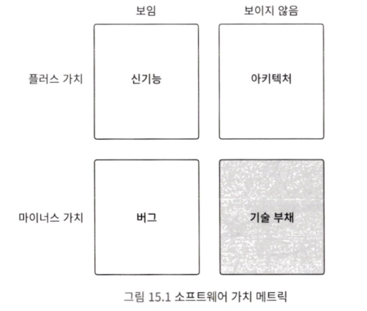

## 이 책은 어떤 설계를 주제로 집필한 것인가

아래 표는 소프트웨어의 품질과 관련된 특성을 정리한 것입니다.

| 품질 특성   | 설명                                                                   | 품질 관련 부가적인 특성                                        |
| ----------- | ---------------------------------------------------------------------- | ---------------------------------------------------------------------------------------- |
| 기능 적합성 | 기능이 니즈를 만족하는 정도                                            | 기능 무결성, 기능 정확성, 기능 적절성                               |
| 성능 효율성 | 리소스 효율과 성능 정도                                                | 시간 효율성, 자원 효율성, 용량 만족성                               |
| 호환성      | 다른 시스템과 정보 공유, 교환할 수 있는 정도                           | 공존성, 상호 운용성                                          |
| 신뢰성      | 필요할 때 기능을 실행할 수 있는 정도                                   | 적절도 인식성, 습득성, 운용 조작성, 사용자 오류 방지성, 사용자 인터페이스 편의성, 접근성 |
| 보안        | 허용되지 않은 사용자로부터 보호할 수 있는 정도                         | 성숙성, 가용성, 장애 허용성, 회복성                                |
| 유지 보수성 | 시스템이 정상 운용되도록 유지 보수하기가 얼마나 쉬운가를 나타내는 정도 | 모듈성, 재사용성, 분석성, 수정성, 시험성                             |
| 이식성      | 다른 실행 환경에 이식할 수 있는 정도                                   | 적용성, 설치성, 치환성                                        |

설계는 어떠한 문제를 효율적으로 해결하는 구조를 만드는 것을 의미합니다.
그렇다면 소프트웨어에서 설계란, '어떤 소프트웨어의 품질 특성을 향상시키기 위한 구조를 만드는 것'이라고 말할 수 있습니다.

이 책은 소프트웨어 개발에서 나타날 수 있는 악마를 퇴치하는 설계 방법을 설명해 왔습니다. 이러한 악마의 성질과 가장 관련 있는 품질 특성은 무엇일까요? 바로 유지 보수성으로 볼 수 있습니다.

유지 보수성은 '시스템이 정상 운용되도록 유지 보수하기가 얼마나 쉬운가를 나타내는 정도'라고 했습니다. 유지 보수성 중에서도 특히 변경 용이성을 목적으로 하는 설계 방법을 이 책은 다루어 온 것입니다.

---

## 설계하지 않으면 개발 생산성이 저하된다.

이 책에서 계속해서 다루었던 '악마를 불러들이는 코드'는 변경 용이성이 낮은 코드입니다. 변경하기 어렵고 버그가 생기기 쉬운 코드를 레거시 코드라고 합니다. 그리고 레거시 코드가 축적되어 있는 상태를 기술 부채라고 합니다. 변경 용이성 설계를 하지 않으면, 개발 생산성이 저하됩니다. 저하 요인으로는 크게 두 가지가 있습니다.

#### 요인 1: 버그가 발생하기 쉬운 구조

코드 변경 시 버그가 발생하기 쉽다면, 버그가 발생하지 않게 하면서 정확히 변경하는 데 시간이 오래 걸립니다.

- 응집도가 낮은 구조로 인해 사양 변경 시 수정 누락이 발생하기 쉬워지고 결국 버그가 발생함
- 코드를 이해하기 어려우므로 구현할 때 실수를 저지르기 쉬워지고, 결국 버그가 발생함
- 잘못된 값이 들어오기 쉬워지고, 결국 버그가 발생함

#### 요인 2: 가독성이 낮은 구조

가독성이 저하되면, 의도를 정확하게 이해하는 데 시간이 오래 걸립니다.

- 로직의 가독성이 낮아, 읽고 이해하는 데 시간이 오래 걸림
- 관련된 로직이 이곳저곳에 흩어져 있어, 사양을 변경할 때 관련된 로직을 찾아서 돌아다니는 데 시간이 오래 걸림
- 잘못된 값이 들어와서 버그가 발생햇을 때, 잘못된 값의 출처를 추적하기 어려워짐

#### 나무꾼의 딜레마

소프트웨어 개발에서도 나무꾼의 딜레마가 꽤 많이 발생합니다. '나무를 자르는 시간'을 로직을 구현하는 시간으로, '도끼의 날을 가는 시간'을 설계하는 시간으로 바꿔 생각해보세요. 제대로 설계하지 않으면, 로직 변경과 디버그에 많은 시간을 소비하게 됩니다. 결국 설계할 시간 여유조차 없어지는 딜레마에 빠지게 됩니다.

#### 열심히 일했지만 생산성이 나쁨

개발 생산성이 나쁘면 새로운 기능을 릴리스하는 데 굉장히 오래 걸립니다. 당연하지만 수익을 내기 힘듭니다. 고질적으로 성과를 낼 수 없게 되어 버리는 것입니다.

#### 국가 규모의 경제 손실

저생산성으로 인한 손실은 계속해서 축적됩니다. 이러한 손실은 사실 레거시 코드의 양에 단순 비례하지 않습니다. 왜냐하면 복잡하고 이해하기 힘든 로직이 있으면, 이로 인해 더 복잡하고 이해하기 힘든 로직이 만들어지기 때문입니다.

> 이러한 점에서 변경 용이성은 매우 중요한 품질 특성이라고 이야기할 수 있습니다.

---

## 소프트웨어와 엔지니어의 성장 가능성

그런데 무엇을 위해 코드를 변경해야 할까요?
소프트웨어의 가치와 매력을 높이기 위해 사양을 추가하고 변경하면서, 코드를 변경합니다. 코드의 변경 용이성이 높을수록, 소프트웨어의 가치를 빠르게 높일 수 있습니다. 소프트웨어가 빠르게 성장하는 것입니다.

따라서 변경 용이성을 높인다는 것은 소프트웨어의 성장 가능성을 높이는 것이라고 바꿔 말할 수 있습니다.

> 소프트웨어의 성장 가능성을 높이는 것이 바로 이 책의 핵심 주제이자 의의입니다.

변경 용이성이 악화되면, 소프트웨어의 성장 가능성도 악화됩니다. 그뿐 아니라, 엔지니어의 기술 성장 가능성도 악화됩니다.

#### 엔지니어에게 자산이란 무엇인가?

'엔지니어'에게 '자산'이란 무엇일까요? 저자는 기술력이라고 생각하고 있습니다. 엔지니어가 기술력이 있다면, 모아 놓은 돈이 없어도 어디서든 돈을 벌 수 있습니다. 따라서 기술력은 엔지니어가 부를 창출하는 원천이라고 이야기할 수 있습니다. 기술력은 그 무엇과도 바꿀 수 없는 엔지니어 자신만의 귀중한 자산입니다.

그런데 레거시 코드는 이러한 자산의 축적, 즉 기술력의 성장을 방해하는 무서운 존재입니다.
그 이유를 차근차근 살펴보겠습니다.
#### 1) 레거시 코드는 발전을 막음

레거시 코드는 다음 사람으로 하여금 레거시 코드를 작성하게 합니다. 즉, 낮은 수준의 기술만 사용하게 만듭니다.

#### 2) 레거시 코드는 고품질 설계 경험을 ㅁ가음

레거시 코드는 이미 균형이 깨져 있어서, 설계를 개선하기가 매우 힘듭니다. 결국에는 고품질 설계 구현 경험을 쌓을 수 없으므로, 설계 능력이 향상되지 않습니다.

#### 3) 레거시 코드는 시간을 낭비하게 만듦

레거시 코드는 이해하는 데 시간이 오래 걸립니다. 하지만 시간은 유한합니다. 따라서 원래 더 가치 있는 일에 사용되었어야 하는 시간이 줄어듭니다.

---

## 문제 해결하기

이러한 문제들을 해결할 수 있는 방법을 정리해 보겠습니다.

#### 1) 문제를 인식하지 못하면 설계에 대한 생각 자체가 떠오르지 않음

문제를 인식하지 못하면 설계에 대한 생각 자체가 떠오르지 않습니다.

#### 2) 인지하기 쉬운 문제와 인지하기 어려운 문제가 있음

아래 그림은 필립 크뤼슈텐이 소프트웨어 시트메에 대해 정의한 메트릭입니다. '보임/보이지 않음'과 '플러스 가치/마이너스 가치'라는 2개의 축으로 사분면을 표현하고 있습니다.

여기에서 '보임/보이지 않음'은 '시스템의 내부 구조가 보이는가'를 나타냅니다.

보이는 쪽은 내부 구조에 대한 이해 없이도 인식할 수 있는 것입니다. 보이는 쪽의 플러스 가치는 신기능, 마이너스 가치는 버그입니다. 이는 화면만 보아도 알 수 있는 것들입니다.

반면, 보이지 않는 쪽은 플러스 가치로 아키텍처, 그리고 마이너스 가치로 기술 부채가 있습니다. 프로그래밍 지식이 없는 분이라면, 시스템 내부 구조를 인식하기 힘듭니다.

지금까지 설명했던 것처럼 어떤 악마가 어떤 문제를 일으키는지 모른다면, 기술 부채의 존재를 인식하기 힘듭니다. 소스 코드를 독해하는 스킬과 기술 부채를 인식하는 스킬은 전혀 다릅니다.

#### 3) 이상적인 형태를 알아야 문제를 인식할 수 있음

'이상적인 형태가 어떤 것인지 스스로 자세하게 정의할 수 있어야, 누군가가 없어도 혼자서 연습할 수 있습니다.' 이상적인 형태를 맞춰 연습하면 되니까요. 잠시 슬럼프에 빠지더라도, 이상적인 형태와 비교해 자기 자신을 점검할 수 있다는 이점이 있습니다.

문제는 항상 이상과 현실의 차이 때문에 발생합니다. 따라서 이상이 무엇인지 알고 있다면, 현실과 비교하며 차근차근 문제를 해결할 수 있습니다. 설계에서도 같습니다. 이상적인 설계와 현재 설계를 비교하면, 기술 부채를 인식할 수 있습니다.

#### 4) 변경 용이성을 비교할 수 없는 딜레마

기술 부채를 줄이는 변경 용이성 설계의 효과는 어떻게 측정하면 좋을까요?
성능을 기준으로 비교한다면 '기존의 코드'와 '성능이 향상되도록 변경한 코드'를 준비하고, 실행 속도 등을 측정하면 곧바로 비교할 수 있습니다.

변경 용이성은 어떨까요? 변경 용이성은 곧바로 비교할 수 없습니다. 시간이 경과해야 알 수 있기 때문입니다. 긴 시간을 들여 확인해야 효과를 관측할 수 있는 특성인 것입니다.

---

## 코드의 좋고 나쁨을 판단하는 지표

미래의 개발 생산성을 측정할 수 있는 방법은 안타깝게도 현재 시점에서는 없습니다. 하지만 현재 소스 코드의 좋고 나쁨을 판단하는 지표는 있습니다. 이와 같이 코드 복잡성과 가독성 등의 품질 지표를 코드 메트릭 또는 소프트웨어 메트릭이라고 부릅니다.

코드 메트릭과 그 분석 도구를 몇 가지 소개하겠습니다.

#### 1) 실행되는 코드의 줄 수

저자가 생각하는 코드 줄 수의 상한입니다.

| 스코프 | 줄 수 상한  |
| --- | ------- |
| 메서드 | 10줄 이내  |
| 클래스 | 100줄 이내 |

줄 수가 너무 많으면 '메서드와 클래스 분할'을 검토해 보십시오.

> 클래스르 분리하면 읽기 어려워질까??
> 대부분 클래스를 너무 작게 분할하면, 로직을 추적하기 힘들다. 라고 생각하는 사람들도 꽤 많습니다.
> 조금 다른 이야기지만, 각 프로그래밍 언어에는 표준 라이브러리가 있습니다. 그런데 라이브러리의 내부 구현이 어떻게 되어 있는지, 하나하나 신경 쓰는 사람이 있나요? 대부분 따로 신경 쓰지 않고 사용할 것입니다. 표준 라이브러리 클래스는 사용 방법과 사양이 명확하고, 신뢰성이 높으므로 내부 구조를 따로 신경 쓰지 않아도 됩니다.

#### 2) 순환 복잡도

순환 복잡도는 코드의 구조적인 복잡함을 나타내는 지표입니다. 복잡도에 따라 아래 표와 같은 상태를 확인할 수 있습니다.

| 순환 복잡도 | 복잡함의 상태                   | 버그 확률 |
| ----------- | ------------------------------- | --------- |
| 10 이하     | 굉장히 좋은 구조                | 25%   |
| 30 이상     | 구조적인 리스크가 존재          | 40%   |
| 50 이상     | 테스트 불가능                   | 70%   |
| 75 이상     | 변경할 때, 반드시 실수가 발생함 | 98%   |

조건 분기, 반복 처리, 중첩은 복잡도를 높입니다. 이 책에서 다룬 조기 리턴, 전략 패턴, 일급 컬렉션 등의 테크닉을 활용하면 복잡도를 줄일 수 있습니다. 순환 복잡도는 앞으로 살펴볼 분석 도구를 활용해서 측정할 수 있습니다. 참고로 저자가 설계할 때 클래스의 복잡도는 일반적으로 10정도, 높아도 15보다는 낮게 설계하고 있습니다.

#### 3) 응집도

응집도는 모듈 내부에서 데이터와 로직이 관련되어 있는 정도를 나타내는 지표입니다.
모듈은 클래스, 패키지, 레이어 등 다양하게 해석할 수 있습니다.

응집도가 높을수록 변경 용이성이 높고 좋은 구조입니다. 응집도를 나타내는 메트릭으로 LOOM(Lack of Cohension in Methods)이 있습니다.

#### 4) 결합도

결합도는 모듈 간의 의존도를 나타내는 지표입니다. 결합도는 분석 도구를 사용해서 계측할 수 있습니다. 도구가 없어도, 호출하는 클래스의 수를 세거나 클래스 다이어그램을 그려 보면, 어느 정도인지 알 수 있습니다. 결합도가 너무 높으면, 클래스가 너무 많은 일을 하고 있을 수 있습니다. 즉, 단일 책임 원칙을 위배하고 있을 수 있습니다. 이때는 의존을 더 줄일 수 없는지, 클래스를 더 작게 분할할 수 없는지 검토해 보는 것이 좋습니다.

#### 5) 청크

청크는 코드 메트릭이 아니지만, 저자가 자주 사용하는 지표입니다. 기억할 수 있는 정보 덩어리의 단위를 청크라고 부릅니다.
연구 결과에 따르면, 인간의 단기 기억은 한 번에 4 +- 1 개의 개념 정도만 파악할 수 있다고 합니다.

클래스를 설계할 때도 매지컬 넘버 4를 여두에 두고 뇌가 쉽게 받아들일 수 있는 구조인지 생각해 보세요. 클래스에서 다루는 개념이 3 ~ 5 개 정도가 되도록 설계하고, 이보다 큰 클래스는 작은 클래스로 분할하는 것이 좋습니다.

> 중요한 것은 밀접한 개념끼리 응집하는 것입니다.

---

## 코드 분석을 지원하는 다양한 도구

#### 1) Code Climate Quality

Code Climate Quality 는 Code Climate 사에서 만든 코드 품질 분석 도구입니다. 깃허브와 연동하면 리포지터리에 저장된 코드의 품질 점수를 자동으로 계산해 줍니다.

#### 2) Understand

Understand는 Scinetific Toolworks, INC 의 코드 품질 분석 도구입니다. 코드 줄 수, 복잡도, 응집도, 결합도 이외에도 다양한 관점의 메트릭을 계측할 수 있습니다.

#### 3) Visual Studio

Visual Studio는 Microsoft에서 만든 IDE 입니다.

---

## 설계 대상과 비용 대비 효과

회사의 예산은 유한합니다. 유한한 예산 안에서 개발 비용이 산출됩니다. 투자한 비용과 제한된 기간 내에 어떻게든 이익을 내야 합니다. 예산과 시간 모두 유한한 자원입니다.

따라서 설계와 리팩터링을 무한히 할 수는 없습니다. 현실적으로 프로젝트의 소스 코드가 전반적으로 나쁘다고 해도, 설계를 바꿔 개선할 수 있는 부분은 일부에 불과한 경우가 많습니다. 따라서 비용 대비 효과가 높은 부분을 노려야 합니다.

#### 1) 파레토의 법칙(80:20의 법칙)

파레토의 법칙이라는 법칙이 있습니다. 전체 결과의 80%가 전체 원인의 20%에서 일어난다는 법칙으로, '매출의 80%는 전체 상품 중 20%의 상품이 만들어 낸다' 라는 의미입니다.
'소프트웨어의 처리 시간 중 80%는 소스 코드 전체의 20%가 차지한다' 등의 현상에 비유됩니다.

기능의 중요성, 사양 변경 빈도 모두 파레토의 법칙에 해당된다고 할 수 있습니다. 중요한 기능에는 고객들이 주목하므로 개선 요구도 당연히 많습니다. 그리고 이러한 요구에 따라 사양도 자주 변경됩니다. 이처럼 중요하고 사양 변경이 빈번한 곳의 설계를 개선하면, 비용 대비 효과가 높을 것입니다.

#### 2) 코어 도메인 : 서비스의 중심 영역

모든 상품과 서비스는 이것이 '우리가 판매하는 것'이라고 말할 수 있는 중심 가치가 있습니다. 이처럼 서비스에서 중심이 되는 비즈니스 영역을 도메인 주도 설계에서는 코어 도메인이라고 합니다. 코어 도메인은 다음과 같이 설명할 수 있습니다.

- 시스템에서 가장 큰 가치를 창출하는 곳
- 가치 있고 중요하고 비용 대비 효과가 가장 큰 곳
- 경쟁 우위에 있고, 차별점을 만들며, 비즈니스 우위를 만들 수 있는 곳

설계에 비용을 투자해야 하는 곳, 비용 대비 효과가 큰 곳이라고 할 수 있습니다.

#### 3) 중점 설계 대상 선정에는 비즈니스 지식이 필요함

도메인 주도 설계는 코어 도메인의 가치를 지속적으로 높이고, 서비스를 장기적으로 성장시키는 설계 방법입니다. 사업 영역과 관련된 지식이 풍부한 사람을 도메인 전문가라고 부릅니다. 설계 비용 대비 효과를 높이려면, 중점적인 설계 대상을 선정할 수 있어야 합니다. 그리고 대상을 잘 선정하려면, 서비스가 해결하고 싶은 고객 과제가 무엇인지, 서비스의 본질이 무엇인지 볼 수 있는 능력이 필요합니다. 즉, 서비스와 관련된 비즈니스 지식이 필요합니다.

구조의 좋고 나쁨에만 주목하면, 설계가 비즈니스 전략을 제대로 뒷받침하지 못할 수 있습니다.

소프트웨어 엔지니어 중에는 아키텍트라는 직종이 있습니다. 아키텍트는 비즈니스 전략을 실현하는 아키텍처를 설계하는 역할을 합니다. 아키텍처 설계라는 직무를 수행하려면, 대상 비즈니스를 깊이 이해해야 합니다. 성장 가능성을 높이기 위한 최적의 설계와 비즈니스 지식은 떼려야 뗄 수 없는 관계라고 이야기할 수 있습니다.

---

## 시간을 다스리는 능력자 되기

변경 용이성 설계는 개발 생산성을 향상시킵니다. 특히 미래의 시간을 다룰 수 있습니다. 레거시 코드를 안고 계속해서 기술 부채를 쌓아갈지, 소프트웨어를 빠르게 성장시킬지는 모두 설계자의 능력에 달려 있습니다.

엔지니어가 아닌 사람들은 시스템의 표면적인 기능만 봅니다. 반면 시스템을 개발하는 엔지니어는 내부 구조를 머릿속에 그릴 수 있습니다. 그리고 설계의 본질을 볼 수 있는 엔지니어는 악마의 정체를 꿰뚫어 볼 수 있는 눈, 즉 레거시 코드를 머릿속에 그릴 수 있는 능력을 갖고 있습니다.

시간이 허비되는 원인을 찾을 수 있는 '눈'을 갖고 있는 것입니다. 이러한 눈을 갖고 있지 않은 사람 입장에서는 이는 초능력과 같습니다.

어려운 능력이지만, 누구나 훈련하면 습득할 수 있습니다. 머릿속에 그리는 능력과 설계 능력을 활용하면 미래의 시간을 조종할 수 있습니다.
