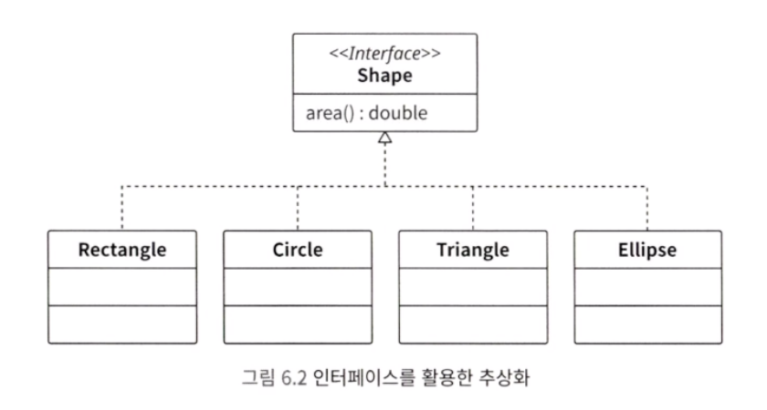

## 조건 분기가 중첩되어 낮아지는 가독성

마법사 예시를 살펴봅니다. 마법을 발동하려면 여러 가지 조건을 모두 통과해야 합니다. 아래 코드는 간단한 if 문들을 이용해 작성한 코드입니다.

```java
// 살아 있는가
if (0 < member.hitPoint) {
	// 움직일 수 있는가
	if (member.canAct()) {
		// 매직포인트가 남아 있는가
		if (magic.costMagicPoint <= member.magicPoint) {
			member.consumeMagicPoint(magic.costMagicPoint);
			member.chant(magic);
		}
	}
}
```

위 코드에서 볼 수 있듯이 if 조건문 내부에 if 조건문, 그리고 내부에 또 if 조건문이 있습니다. 중첩을 하면 어떤 문제가 있을까요? 코드의 가독성이 크게 떨어지는 문제가 있습니다. 어디서부터 어디까지가 if 조건문의 처리 블록인지 이해하기 힘듭니다.

사양 변경은 더 힘듭니다. 코드가 복잡하고 길면 로직을 정확하게 읽고 이해하기 어렵습니다. 그리고 충분히 이해하지 못한 상태에서 로직을 변경하면, 버그가 쉽게 숨어듭니다.

#### 1) 조기 리턴으로 중첩 제거하기

중첩 악마를 퇴치하는 방법 중 하나로 조기 리턴이 있습니다. 조기 리턴은 조건을 만족하지 않는 경우 곧바로 리턴하는 방법입니다.

```java
if (member.hitPoint <= 0) return;
if (!member.canAct()) return;
if (member.magicPoint < magic.costMagicPoint) return;

member.consumeMagicPoint(magic.costMagicPoint);
member.chant(magic);
```

처음 코드와 비교해 가독성이 좋아졌습니다.

> 조기 리턴에는 또 다른 장점이 있습니다. 바로 조건 로직과 실행 로직을 분리할 수 있다는 것입니다.

마법을 쓸 수 없는 조건은 앞부분에 조기 리턴으로 모았고, 마법 발동 때 실행할 로직은 뒤로 모았습니다. 이처럼 조건과 실행을 나누어서 볼 수 있습니다.

> 조기 리턴을 사용해서 조건에 따라 실행 흐름이 달라지는 일을 막는 기법은 앞 3장에서 소개했던 가드와 비슷합니다. 가드와 조기 리턴은 모두 가독성을 좋게 해서, 로직을 빠르게 이해할 수 있게 해줍니다.

#### 2) 가독성을 낮추는 else 구문도 조기 리턴으로 해결하기

else 구문도 가독성을 나쁘게 만드는 원인 중 하나입니다. 중첩된 if 조건문 내부에 else 구문이 섞이면 가독성이 현저히 낮아져서, 코드를 이해하기 힘들어집니다.


---

## switch 조건문 중복

값의 종류에 따라 다르게 처리하고 싶을 때는 switch 조건문을 많이 사용합니다. 하지만 switch 조건문은 악마를 불러들이기 굉장히 쉬운 제어 구문입니다.

#### 1) switch 조건문을 사용해서 코드 작성하기

```java
// 마법의 종류를 정의한 enum
enum MagicType {
	fire,      // 불 계열의 마법
	lighting   // 번개 계열의 마법
}
```

마법에는 각각 이름, 매직포인트 소비량, 공격력 이라는 요구 사항이 설정되어 있습니다.

이때 마법의 이름을 알려주는 getName 메서드를 구현하게 된다면 switch 문에서 magicType 에 따라 조건의 분기가 나뉘게 되는 코드가 나올 수 있습니다.

#### 2) 같은 형태의 switch 조건문이 여러 개 사용되기 시작

마법에 종류에 따라 달라지는 것은 이름 뿐만이 아니라 매직 포인트 소비량, 공격력도 마찬가지입니다. 즉, 같은 형태의 switch 조건문을 여러 번 사용하게 됩니다. 이는 매우 좋지 않은 구조입니다.

#### 3) 요구 사항 변경 시 수정 누락(case 구문 추가 누락)

출시일이 다가와 정신없는 와중에 새로운 마법인 헬파이어가 추가되었다고 가정합니다. 이러면 모든 switch 조건문에 추가해 주어야 합니다.

#### 4) 폭발적으로 늘어나는 switch 조건문 중복

위에서는 단순히 이름, 매직포인트 소비량, 공격력 정도의 요구 사항이 있습니다. 하지만 실제로는 마법 설명, 공격 범위, 명중률 등 여러 속성이 있기 때문에 해당하는 만큼 메서드가 많이 만들어지고 switch 조건문도 중복될 것입니다.

다시 한번 소스 코드를 살펴보면, switch 조건문은 모두 MagicType 을 기준으로 분기하고 있습니다. 분기 후 처리는 메서드마다 다르지만, switch 조건문의 조건식은 모두 MagicType 입니다. 즉, switch 조건문이 중복 코드가 된 것입니다.

switch 조건문의 중복이 많아지면, 주의 깊게 대응해도 실수가 발생할 수밖에 없습니다. 인간의 주의력에는 한계가 있기 때문입니다. 결국 요구 사항이 추가될 때마다 case 구문이 누락될 것이고, 이로 인해 버그가 만들어질 것입니다.

또한 요구 사항을 변경할 때 거대한 switch 조건문 내부에서 관련된 부분이 어디인지 찾아야 합니다. 가독성이 낮기 때문에 이 또한 힘들 것입니다.

> 중복 코드가 불러들이는 악마로, 수정 누락과 개발 생산성 하락이 있습니다. switch 조건문도 중복되면 비슷한 악마들을 불러들일 것입니다.

#### 5) 조건 분기 모으기

switch 조건문 중복을 해소하려면, 단일 책임 선택의 원칙을 생각해봐야 합니다.

> 단일 책임 선택의 원칙이란 소프트웨어 시스템이 선택지를 제공해야 한다면, 그 시스템 내부의 어떤 한 모듈만으로 모든 선택지를 파악할 수 있어야 합니다.

간단하게 말해, 조건식이 같은 조건 분기를 여러 번 작성하지 말고 한 번에 작성하자는 뜻입니다.

#### 6) 인터페이스로 switch 조건문 중복 해소하기

클래스가 거대해지면 관심사에 따라 작은 클래스로 분할하는 것이 중요합니다. 이러한 문제를 해결할 때는 인터페이스를 사용합니다. 인터페이스를 사용하면, 분기 로직을 작성하지 않고도 분기와 같은 기능을 구현할 수 있습니다. 인터페이스는 서로 다른 자료형을 같은 자료형처럼 사용할 수 있게 해줍니다.

> 즉, 각각의 코드를 간단하게 실행할 수 있게 하는 것이 인터페이스의 큰 장점 중 하나입니다.




#### 7) 인터페이스를 switch 조건문 중복에 응용하기(전략 패턴)

