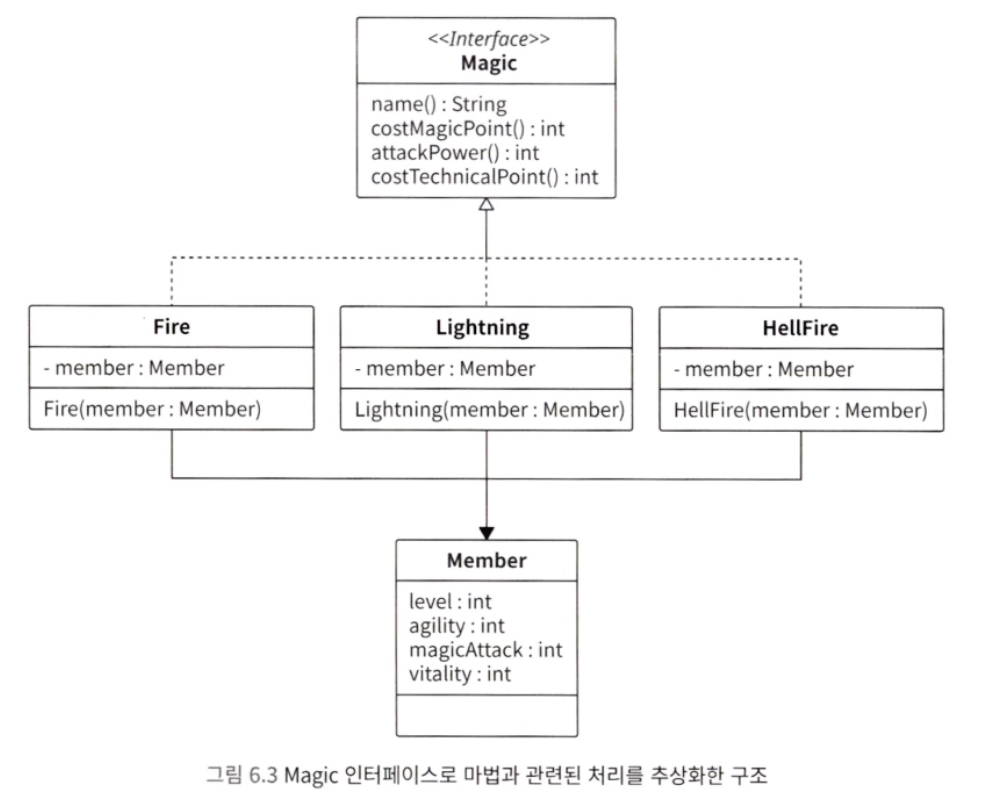
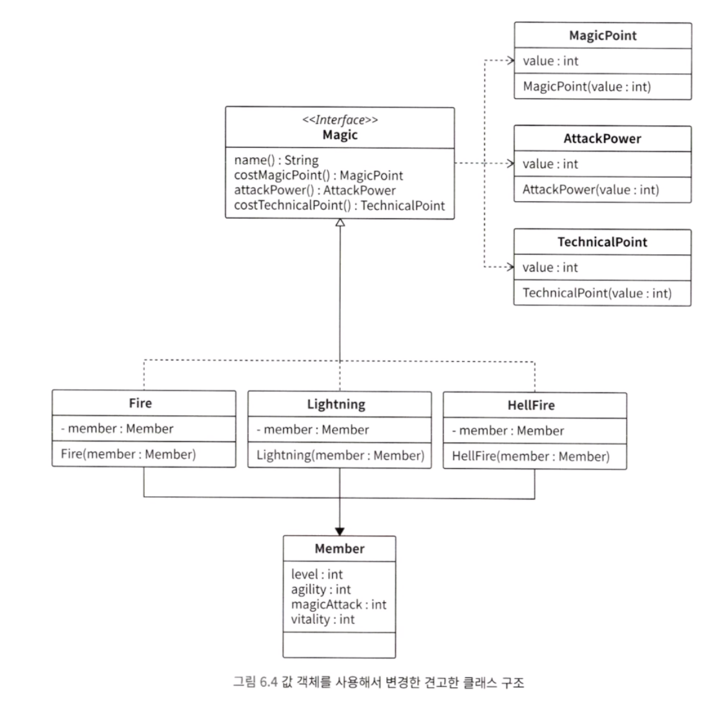
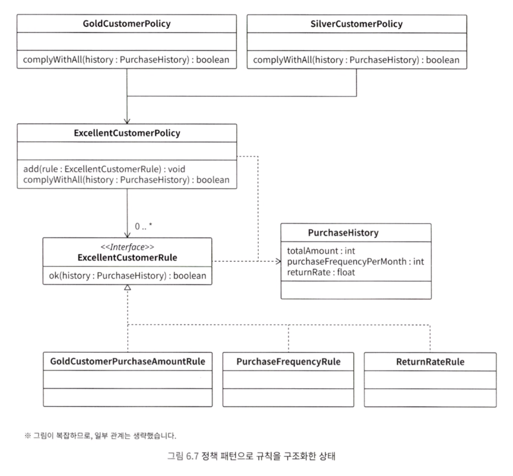
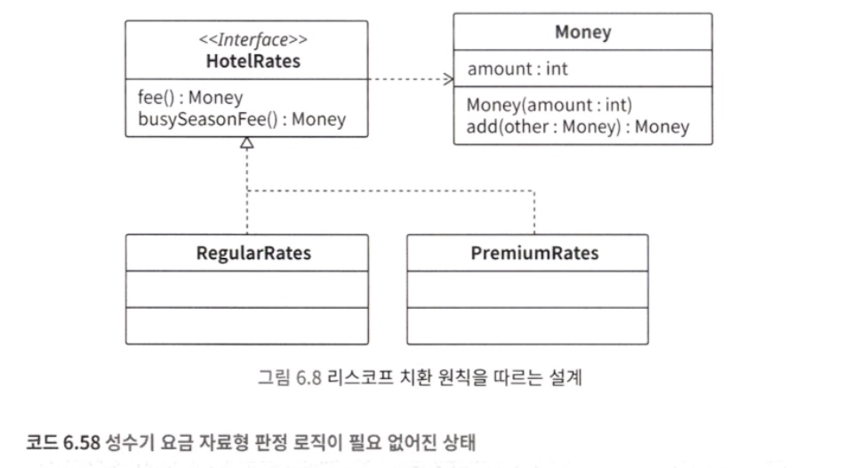
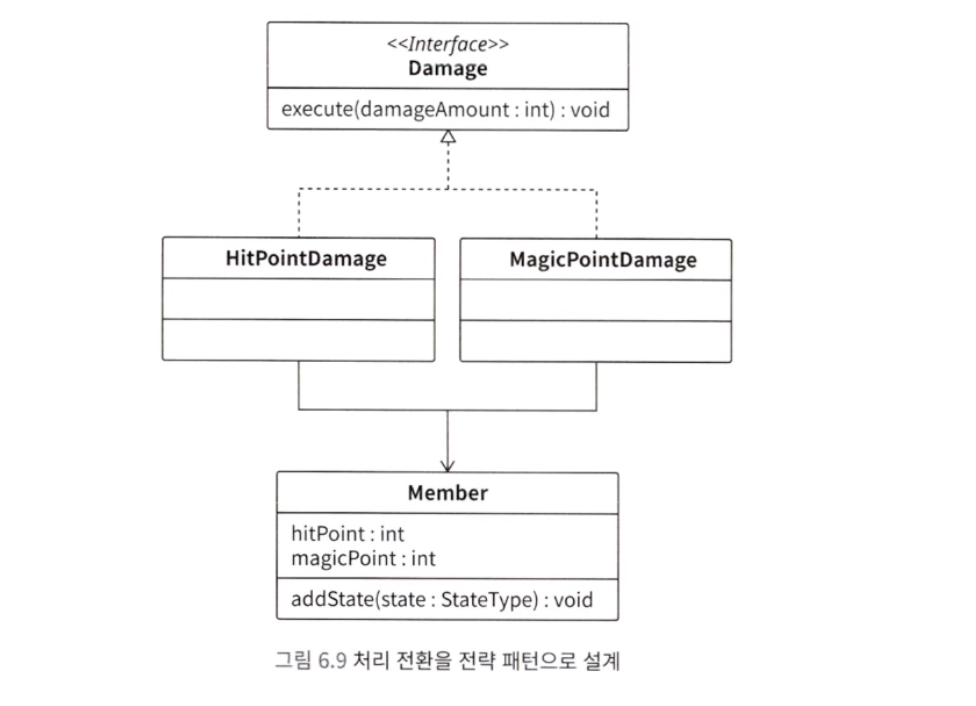

## 조건 분기가 중첩되어 낮아지는 가독성

마법사 예시를 살펴봅니다. 마법을 발동하려면 여러 가지 조건을 모두 통과해야 합니다. 아래 코드는 간단한 if 문들을 이용해 작성한 코드입니다.

```java
// 살아 있는가
if (0 < member.hitPoint) {
	// 움직일 수 있는가
	if (member.canAct()) {
		// 매직포인트가 남아 있는가
		if (magic.costMagicPoint <= member.magicPoint) {
			member.consumeMagicPoint(magic.costMagicPoint);
			member.chant(magic);
		}
	}
}
```

위 코드에서 볼 수 있듯이 if 조건문 내부에 if 조건문, 그리고 내부에 또 if 조건문이 있습니다. 중첩을 하면 어떤 문제가 있을까요? 코드의 가독성이 크게 떨어지는 문제가 있습니다. 어디서부터 어디까지가 if 조건문의 처리 블록인지 이해하기 힘듭니다.

사양 변경은 더 힘듭니다. 코드가 복잡하고 길면 로직을 정확하게 읽고 이해하기 어렵습니다. 그리고 충분히 이해하지 못한 상태에서 로직을 변경하면, 버그가 쉽게 숨어듭니다.

#### 1) 조기 리턴으로 중첩 제거하기

중첩 악마를 퇴치하는 방법 중 하나로 조기 리턴이 있습니다. 조기 리턴은 조건을 만족하지 않는 경우 곧바로 리턴하는 방법입니다.

```java
if (member.hitPoint <= 0) return;
if (!member.canAct()) return;
if (member.magicPoint < magic.costMagicPoint) return;

member.consumeMagicPoint(magic.costMagicPoint);
member.chant(magic);
```

처음 코드와 비교해 가독성이 좋아졌습니다.

> 조기 리턴에는 또 다른 장점이 있습니다. 바로 조건 로직과 실행 로직을 분리할 수 있다는 것입니다.

마법을 쓸 수 없는 조건은 앞부분에 조기 리턴으로 모았고, 마법 발동 때 실행할 로직은 뒤로 모았습니다. 이처럼 조건과 실행을 나누어서 볼 수 있습니다.

> 조기 리턴을 사용해서 조건에 따라 실행 흐름이 달라지는 일을 막는 기법은 앞 3장에서 소개했던 가드와 비슷합니다. 가드와 조기 리턴은 모두 가독성을 좋게 해서, 로직을 빠르게 이해할 수 있게 해줍니다.

#### 2) 가독성을 낮추는 else 구문도 조기 리턴으로 해결하기

else 구문도 가독성을 나쁘게 만드는 원인 중 하나입니다. 중첩된 if 조건문 내부에 else 구문이 섞이면 가독성이 현저히 낮아져서, 코드를 이해하기 힘들어집니다.


---

## switch 조건문 중복

값의 종류에 따라 다르게 처리하고 싶을 때는 switch 조건문을 많이 사용합니다. 하지만 switch 조건문은 악마를 불러들이기 굉장히 쉬운 제어 구문입니다.

#### 1) switch 조건문을 사용해서 코드 작성하기

```java
// 마법의 종류를 정의한 enum
enum MagicType {
	fire,      // 불 계열의 마법
	lighting   // 번개 계열의 마법
}
```

마법에는 각각 이름, 매직포인트 소비량, 공격력 이라는 요구 사항이 설정되어 있습니다.

이때 마법의 이름을 알려주는 getName 메서드를 구현하게 된다면 switch 문에서 magicType 에 따라 조건의 분기가 나뉘게 되는 코드가 나올 수 있습니다.

#### 2) 같은 형태의 switch 조건문이 여러 개 사용되기 시작

마법에 종류에 따라 달라지는 것은 이름 뿐만이 아니라 매직 포인트 소비량, 공격력도 마찬가지입니다. 즉, 같은 형태의 switch 조건문을 여러 번 사용하게 됩니다. 이는 매우 좋지 않은 구조입니다.

#### 3) 요구 사항 변경 시 수정 누락(case 구문 추가 누락)

출시일이 다가와 정신없는 와중에 새로운 마법인 헬파이어가 추가되었다고 가정합니다. 이러면 모든 switch 조건문에 추가해 주어야 합니다.

#### 4) 폭발적으로 늘어나는 switch 조건문 중복

위에서는 단순히 이름, 매직포인트 소비량, 공격력 정도의 요구 사항이 있습니다. 하지만 실제로는 마법 설명, 공격 범위, 명중률 등 여러 속성이 있기 때문에 해당하는 만큼 메서드가 많이 만들어지고 switch 조건문도 중복될 것입니다.

다시 한번 소스 코드를 살펴보면, switch 조건문은 모두 MagicType 을 기준으로 분기하고 있습니다. 분기 후 처리는 메서드마다 다르지만, switch 조건문의 조건식은 모두 MagicType 입니다. 즉, switch 조건문이 중복 코드가 된 것입니다.

switch 조건문의 중복이 많아지면, 주의 깊게 대응해도 실수가 발생할 수밖에 없습니다. 인간의 주의력에는 한계가 있기 때문입니다. 결국 요구 사항이 추가될 때마다 case 구문이 누락될 것이고, 이로 인해 버그가 만들어질 것입니다.

또한 요구 사항을 변경할 때 거대한 switch 조건문 내부에서 관련된 부분이 어디인지 찾아야 합니다. 가독성이 낮기 때문에 이 또한 힘들 것입니다.

> 중복 코드가 불러들이는 악마로, 수정 누락과 개발 생산성 하락이 있습니다. switch 조건문도 중복되면 비슷한 악마들을 불러들일 것입니다.

#### 5) 조건 분기 모으기

switch 조건문 중복을 해소하려면, 단일 책임 선택의 원칙을 생각해봐야 합니다.

> 단일 책임 선택의 원칙이란 소프트웨어 시스템이 선택지를 제공해야 한다면, 그 시스템 내부의 어떤 한 모듈만으로 모든 선택지를 파악할 수 있어야 합니다.

간단하게 말해, 조건식이 같은 조건 분기를 여러 번 작성하지 말고 한 번에 작성하자는 뜻입니다.

#### 6) 인터페이스로 switch 조건문 중복 해소하기

클래스가 거대해지면 관심사에 따라 작은 클래스로 분할하는 것이 중요합니다. 이러한 문제를 해결할 때는 인터페이스를 사용합니다. 인터페이스를 사용하면, 분기 로직을 작성하지 않고도 분기와 같은 기능을 구현할 수 있습니다. 인터페이스는 서로 다른 자료형을 같은 자료형처럼 사용할 수 있게 해줍니다.

> 즉, 각각의 코드를 간단하게 실행할 수 있게 하는 것이 인터페이스의 큰 장점 중 하나입니다.


#### 7) 인터페이스를 switch 조건문 중복에 응용하기(전략 패턴)

switch 조건문 중복 문제를 해결하는 데 인터페이스를 응용해 볼 수 있습니다.

<span style="color:#ff0000">종류별로 다르게 처리해야 하는 기능을 인터페이스의 메서드로 정의하기</span>
인터페이스의 큰 장점 중 하나는 다른 로직을 같은 방식으로 처리할 수 있다는 점입니다.

```java
interface Magic {
	String name();
	int costMagicPoint();
	int attackPower();
	int costTechnicalPoint();
}
```

> 인터페이스의 이름을 결정하는 방법은 여러 가지가 있습니다. 가장 기본적인 방법은 '인터페이스를 구현하는 클래스들이 어떤 부류인가?'를 생각해 보는 것입니다.


<span style="color:#ff0000">각각의 클래스에 인터페이스 구현하기</span>
Fire, Lightning, HellFire 클래스들을 각각 구현합니다. 이와 같이 구현하면, Fire, Lightning, HellFire를 모두 Magic 자료형으로 사용할 수 있습니다.




<span style="color:#ff0000">switch 조건문이 아니라, Map 으로 변경하기</span>
모두 Magic 자료형으로 다룰 수 있게 되었지만, switch 조건문에 의존하지 않고 다른 형태로 전환하기에는 부족합니다. 그러면 Map을 함께 사용해 봅시다.

```java
final Map<MagicType, Magic> magics = new HashMap<>();

final fire fire = new Fire(member);
final Lightning lightning = new Lightning(member);
final HellFire hellFire = new HellFire(member);

magics.put(MagicType.fire, fire);
magics.put(MagicType.lightning, lightning);
magics.put(MagicType.hellFire, hellFire);

void magicAttack(final MagicType magicType) {
	final Magic usingMagic = magics.get(magicType);
	usingMagic.attackPower();
}
```

magicAttack 메서드의 매개변수로 MagicType.hellfire를 전달하면 usingMagic.attackPower() 로 HellFire.attackPower() 메서드가 호출될 것입니다. 즉, Map이 switch 조건문처럼 경우에 따라 처리를 구분하는 것입니다.

> switch 조건문을 전혀 사용하지 않고, 마법별로 처리를 나누었습니다. magics.get(magicType) 으로 모두 한꺼번에 전화하고 있는 점이 특징입니다.
> 이처럼 인터페이스를 사용해서 처리를 한꺼번에 전환하는 설계를 전략 패턴이라고 합니다.

<span style="color:#ff0000">메서드를 구현하지 않으면 오류로 인식하게 만들기</span>
인터페이스의 메서드를 구현하지 않으면 컴파일조차 실패합니다. 인터페이스의 메서드는 반드시 구현해야 컴파일할 수 있기 때문입니다. 따라서 구현하지 않는다는 실수 자체를 방지할 수 있습니다.

<span style="color:#ff0000">값 객체화하기</span>
마지막으로 코드의 품질을 더욱 향상시킬 수 있는 방법이 있습니다. 현재 자료형 int 로 리턴하는 메서드가 있습니다. 이는 실수로 다른 의미의 값을 전달할 가능성이 있습니다. 따라서 매직포인트, 공격력, 테크니컬 포인트를 값 객체로 만들어서 사용합니다.

최종 형상은 아래 사진과 같습니다.




---

## 조건 분기 중복과 중첩

인터페이스는 switch 조건문의 중복을 제거할 수 있을 뿐만 아니라, 다중 중첩된 복잡한 분기를 제거하는 데 활용할 수 있습니다.

아래 코드는 쇼핑몰 우수 고객을 판단하는 로직입니다.
- 지금까지 구매한 금액이 100만 원 이상
- 한 달에 구매하는 횟수가 10회 이상
- 반품률이 0.1% 이하

```java
boolean isGoldCustomer(PurchaseHistory history) {
	if (100000 <= history.totalAmount) {
		if (10 <= hitory.purchaseFrequencyPerMonth) {
			if (history.returnRate <= 0.001) {
				return true;
			}
		}
	}
	return false;
}
```

다음 조건은 실버 회원으로 판정합니다.
- 한 달에 구매하는 횟수가 10회 이상
- 반품률이 0.1% 이하

```java
boolean isSilverCustomer(PurchaseHistory history) {
	if (10 <= history.purchaseFrequencyPerMonth) {
		if (history.returnRate <= 0.001) {
			return true;
		}
	}
	return false;
}
```

#### 1) 정책 패턴으로 조건 집약하기

이러한 상황에서 유용하게 활용할 수 있는 패턴으로 <span style="color:#ff0000">"정책 패턴"</span>이 있습니다. 조건을 부품처럼 만들고, 부품으로 만든 조건을 조합해서 사용하는 패턴입니다.
하나하나의 규칙(판정 조건)을 나타내는 인터페이스를 만듭니다.

```java
interface ExcellentCustomerRule {
	boolean ok(final PurchaseHistory history);
}

class GoldCustomerPurchaseAmountRule implements ExcellentCustomerRule {
	@Override
	public boolean ok(final PurchaseHistory history) {
		return 1000000 <= history.totalAmount;
	}
}

class PurchaseFrequencyRule implements ExcellentCustomerRule {
	@Override
	public boolean ok(final PurchaseHistory history) {
		return 10 <= history.purchaseFrequencyPerMonth;
	}
}

class ReturnRateRule implements ExcellentCustomerRule {
	@Override
	public boolean ok(final PurchaseHistory history) {
		return history.returnRate <= 0.001;
	}
}
```

이어서 정책 클래스를 만듭니다. add 메서드로 규칙을 집약하고, complyWithAll 메서드 내부에서 규칙을 모두 만족하는지 판정합니다.

```java
class ExcellentCustomerPolicy {
	private final Set<ExcellentCustomerrule> rules;

	ExcellentCustomerPolicy() {
		rules = new HashSet<>();
	}

	void add(final ExcellentCustomerRule rule) {
		rules.add(rule);
	}

	boolean complyWithAll(final PurchaseHistory history) {
		for (ExcellentcustomerRule each : rules) {
			if (!each.ok(history)) return false;
		}
		return true;
	}
}
```

Rule 과 Policy를 사용해서 골드 회원 판정 로직을 개선할 수 있습니다.

```java
ExcellentCustomerPolicy goldCustomerPolicy = new ExcellentCustomerPolicy();
goldCustomerPolicy.add(new GoleCustomerPurchaseAmountRule());
goldCustomerPolicy.add(new PurchaseFrequencyRule());
goldCustomerPolicy.add(new ReturnRateRule());

goldCustomerPolicy.complyWithAll(purchaseHistory);
```

if 조건문이 ExcellentCustomerPolicy.complyWithAll 메서드 내부에 하나만 있게 되어 로직이 단순해졌습니다.
이렇게 코드를 클래스에 그냥 작성하면, 골드 회원과 무관한 로직을 삽입할 가능성이 있습니다. 따라서 생성자에 규칙을 추가하는 add 메서드를 추가하여 확실하게 클래스로 만들어줍니다.

```java
class GoleCustomerPolicy {
	private final ExcellentCustomerPolicy policy;

	GoldCustomerPolicy() {
		policy = new ExcellentCustomerPolicy();
		policy.add(new GoleCustomerPurchaseAmountRule());
		policy.add(new PurchaseFrequencyRule());
		policy.add(new ReturnRateRule());
	}

	boolean complyWithAll(final PurchaseHistory history) {
		return policy.complyWithAll(history);
	}
}
```

실버 회원도 같은 방법으로 만듭니다. 규칙이 재사용되고 있으므로, 멀리 내다보았을 때도 괜찮은 클래스 구조라고 할 수 있습니다.

```java
class SilverCustomerPolicy {
	private final ExcellentCustomerPolicy policy;

	GoldCustomerPolicy() {
		policy = new ExcellentCustomerPolicy();
		policy.add(new PurchaseFrequencyRule());
		policy.add(new ReturnRateRule());
	}

	boolean complyWithAll(final PurchaseHistory history) {
		return policy.complyWithAll(history);
	}
}
```


지금까지 객체를 그림으로 나타내면 아래와 같습니다.





---

## 자료형 확인에 조건 분기 사용하지 않기

인터페이스는 조건 분기를 제거할 때 활용할 수 있다고 설명했습니다. 그런데 인터페이스를 사용해도 조건 분기가 줄어들지 않는 경우가 있습니다.

```java
// 숙박 요금을 나타내는 인터페이스
interface HotelRates {
	Money fee(); // 요금
}

// 일반 객실 요금
class RegularRates implements HotelRates {
	public Money fee() {
		return new Money(70000);
	}
}

// 프리미언 객실 요금
class PremiumRates implements HotelRates {
	public Money fee() {
		return new Money(120000);
	}
}
```

이렇게 하면 전략 패턴으로 숙박 요금을 전환할 수 있을 것입니다. 만약 성수기에는 추가 요금이 들어간다는 로직이 생긴다면 자료형을 확인하여 코드를 작성하는 것이 아니라 인터페이스를 수정합니다.

```java
interface HotelRates {
	Money fee();
	Money busySeasonFee(); // 성수기 요금
}
```

이제 성수기 관련 로직을 호출할 때 instanceof로 자료형을 판정하지 않아도 됩니다.




---

## 인터페이스 사용 능력이 중급으로 올라가는 첫걸음

지금까지 살펴본 것처럼 인터페이스를 잘 사용하면 조건 분기를 크게 줄일 수 있습니다. 따라서 코드를 단순하게 만들 수 있습니다. 인터페이스를 잘 사용하는지가 곧 설계 능력의 전환점이라고 할 수 있습니다.

|          | 초보자                    | 중급자 이상      |
| -------- | ---------------------- | ----------- |
| 분기       | if 조건문과 switch 조건문만 사용 | 인터페이스 설계 사용 |
| 분기마다의 처리 | 로직을 그냥 작성              | 클래스 사용      |

> 조건 분기를 써야 하는 상황에는 일단 인터페이스 설계를 떠올려야 합니다. 머릿속에 새겨 두기만 해도 조건 분기 처리를 대하는 방식 자체가 달라질 것입니다.


---

## 플래그 매개변수

아래 코드를 살펴봅시다.

```java
damage(true, damageAmount);

void damage(boolean damageFlag, int damageAmount) {
	if (damageFlag == true) {
		// 물리 대미지 로직
	} 
	else {
		// 마법 대미지 로직
	}
}
```


놀랍게도 첫 번째 매개변수 damageFlag 로 물리 대미지인지, 마법 대미지인지 구분하고 있습니다. 이처럼 메서드의 기능을 전환하는 boolean 자료형의 매개변수를 플래그 매개변수라고 합니다.

플래그 매개변수를 받는 메서드는 어떤 일을 하는지 예측하기가 굉장히 힘듭니다. 예측을 하기 위해서는 반드시 메서드 내부 로직을 확인해야 하므로, 가독성이 낮아지며 개발 생산성이 저하됩니다.

#### 1) 메서드 분리하기

플래그 매개변수를 받는 메서드는 내부적으로 여러 기능을 수행하고 있으며, 플래그를 사용해서 이를 전환하는 구조를 갖습니다. 메서드는 하나의 기능만 하도록 설계하는 것이 좋습니다. 따라서 플래그 매개변수를 받는 메서드는 기능별로 분리하는 것이 좋습니다.

```java
void hitPointDamage(int damageAmount);
void magicPointDamage(int damageAmount);
```

#### 2) 전환은 전략 패턴으로 구현하기

메서드를 기능별로 분활했습니다. 그런데 요구 사항이 달라져 히트포인트 대미지와 매직포인트 대미지를 전환해야 할 수도 있습니다. 이렇게 전환하기 위해 boolean 자료형을 사용하면, 플래그 매개변수로 돌아가 버립니다.

<span style="color:#ff0000">플래그 매개변수가 아니라 전략 패턴을 사용하세요</span>

플래그 매개변수로 전환하는 것은 히트포인트 대미지, 매직포인트 대미지입니다. 따라서 아래 코드처럼 인터페이스를 정의합니다.

```java
interface Damage {
	void execute(final int damageAmount);
}
```





각각의 대미지를 나타내는 HitPointDamage와 MagicPointDamage를 만듭니다. 그리고 Damage 인터페이스를 구현합니다. 마지막으로 앞에서 설명했던 코드와 마찬가지로 enum과 Map으로 변경합니다.

```java
enum DamageType {
	hitPoint,
	magicPoint
}

private final Map<DamageType, Damage> damages;

void applyDamage(final DamageType damageType, final int damageAmount) {
	final Damage damage = damages.get(damageType);
	damage.execute(damageAmount);
}
```


> 기존 코드와 비교해보면 조건 분기를 사용하지 않아 가독성이 높아졌습니다. 또한 이렇게 전략 패턴으로 설계하면, 이후에 새로운 종류의 대미지가 추가되었을 때도 쉽게 대응할 수 있습니다.