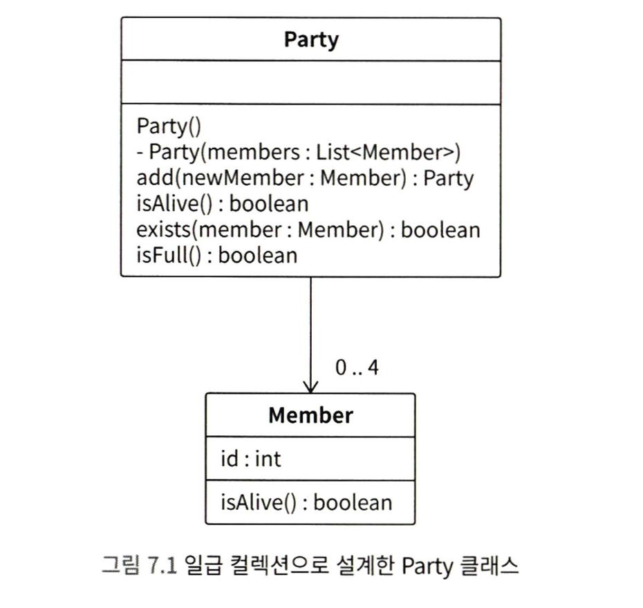

> 해당 장에서는 배열과 List 같은 컬렉션을 따라다니는 악마를 소개하고, 이러한 악마를 퇴치하는 방법을 알아봅니다.

## 이미 존재하는 기능을 다시 구현하지 말기

```java
boolean hasPrisonKey = false;
for (Item each : items) {
	if (each.name.equals("감옥 열쇠")) {
		hasPrisonKey = true;
		break;
	}
}
```

위 코드를 자바 메서드를 이용해 아래 코드로 바꿀 수 있습니다.

```java
boolean hasPrisonKey = items.stream().anyMatch(
	item -> item.name.equals("감옥 열쇠");
)
```

anyMatch 메서드는 자바 표준 라이브러리에 있는 컬렉션 전용 메서드입니다. 조건을 만족하는 요소가 컬렉션 내부에 하나라도 포함되어 있는 경우, true를 리턴합니다. 이처럼 anyMatch 메서드를 알고 있으면, 복잡한 로직을 직접 구현하지 않아도 됩니다.

> 이미 널리 사용되고 있는 기술과 해결법이 존재하는데도, 이를 전혀 모르거나 의도적으로 무시하고 비슷한 것을 새로 만들어 내는 것을 바퀴의 재발명이라고 합니다.
> 참고로 이미 존재하는 것보다 좋지 못한 결과물을 만들어 내는 것을 네모난 바퀴의 재발명이라고 합니다.


---

## 반복 처리 내부의 조건 분기 중첩

#### 1) 조기 컨티뉴로 조건 분기 중첩 제거하기

반복문 내부에 있는 조건 분기 중첩은 6장에서 보았던 조기 리턴을 응용한 조기 컨티뉴로 해결할 수 있습니다.

#### 2) 조기 브레이크로 중첩 제거하기

반복 처리 제어 구문에는 continue 이외에도 break가 있습니다. break는 처리를 중단하고, 반복문 전체를 벗어나는 제어 구문입니다. 조기 컨티뉴와 마찬가지로 조기 브레이크를 사용하면 로직이 단순해지는 경우가 많습니다.


---

## 응집도가 낮은 컬렉션 처리

컬렉션 처리도 응집도가 낮아지기 쉽습니다. 예를 들어 FieldManager 라는 객체가 게임에서 필드 맵을 관리하는 클래스라고 한다면, 해당 객체에서 파티에 맴버를 추가하는 메서드가 있을 수 있습니다.

그런데 필드 맵 말고도 게임에서 맴버를 추가하는 시점이 생긴다면 멤버를 추가하는 로직이 중복되는 것입니다. 이처럼 컬렉션과 관련된 작업을 처리하는 코드가 여기저기에 구현될 가능성이 굉장히 높습니다. 즉 응집도가 낮아집니다.

#### 1) 컬렉션 처리를 캡슐화하기

컬렉션과 관련된 응집도가 낮아지는 문제는 일급 컬렉션 패턴을 사용해 해결할 수 있습니다.

> 일급 컬렉션이란 컬렉션과 관련된 로직을 캡슐화하는 디자인 패턴입니다.

클래스에는 다음 두 가지가 있어야 합니다.
- 인스턴스 변수
- 인스턴스 변수에 잘못된 값이 할당되지 않게 막고, 정상적으로 조작하는 메서드

클래스 설계 원리를 반영하면 일급 컬렉션은 다음과 같은 요소로 구성된다고 할 수 있습니다.
- 컬렉션 자료형의 인스턴스 변수
- 컬렉션 자료형의 인스턴스 변수에 잘못된 값이 할당되지 않게 막고, 정상적으로 조작하는 메서드

일급 객체를 통해 컬렉션과 컬렉션을 조작하는 로직을 한 클래스에 응집한 구조로 만들 수 있습니다.




#### 2) 외부로 전달할 때 컬렉션의 변경 막기

```java
class Party {
	// 생략
	List<Member> members() {
		return members;
	}
}
```

외부에 인스턴스 변수를 그대로 전달하면 Party 클래스 외부에서 마음대로 맴버를 추가하고 제거해 버릴 수 있습니다. Party 클래스를 응집도 높게 설계했지만, 응집도가 낮을 때와 큰 차이가 없습니다.

외부로 전달할 때는 컬렉션의 요소를 변경하지 못하게 막아 두는 것이 좋습니다. 이때는 unmodifiableList 메서드를 사용합니다.

```java
class Party {
	// 생략
	List<Member> members() {
		return members.unmodifiableList();
	}
}
```

unmodifiableList로 리턴되는 컬렉션은 요소를 추가하거나 제거할 수 없습니다. 따라서 Party 클래스 외부에서 마음대로 컬렉션을 조작하는 상황 자체를 방지할 수 있습니다.