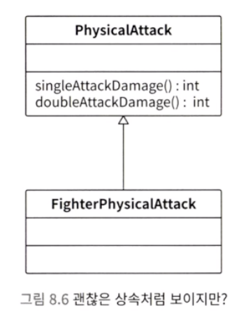
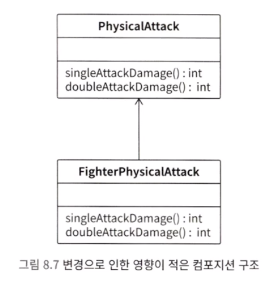
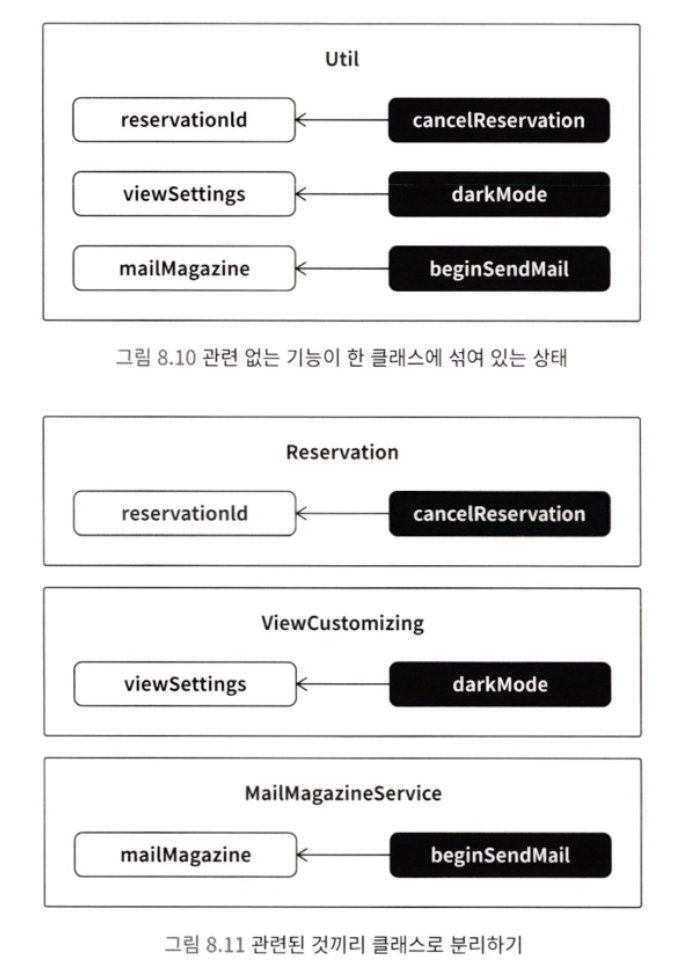
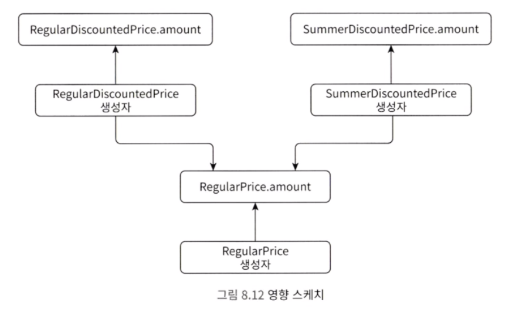
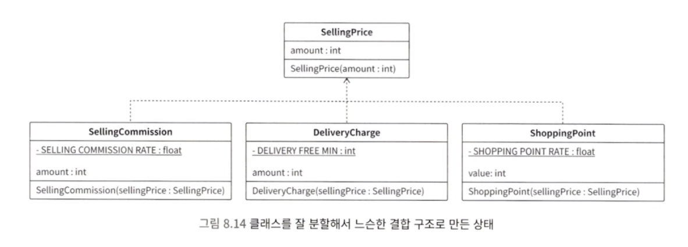
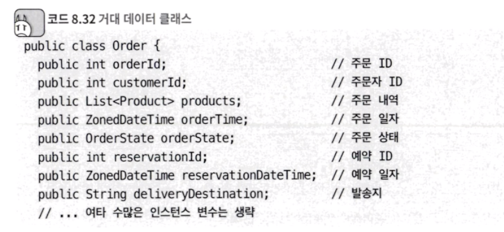

<span style="color:#ff0000">결합도</span>란 모듈 사이의 의존도를 나타내는 지표라고 할 수 있습니다.
어떤 클래스가 다른 클래스에 많이 의존하고 있는 구조를 강한 결합이라고 부릅니다. 강한 결합 코드는 이해하기도 힘들고, 변경하기도 굉장히 힘듭니다.

결합도가 낮은 구조를 느슨한 결합이라고 부릅니다. 느슨한 결합 구조로 개선하면 코드 변경이 쉬워집니다.

강한 결합 문제를 해결하려면, 책무에 대한 접근 방법을 빼놓을 수 없습니다. <span style="color:#ff0000">책무</span>란 어떤 관심사를 정상적으로 작동하게 제어해야 하는 책임으로 생각할 수 있습니다.

---

## 결합도와 책무

책무를 생각하지 않으면 발생하는 문제를 알아보겠습니다,.

온라인 쇼핑몰에 할인 서비스가 추가되었습니다. 이를 '일반 할인'이라고 하겠습니다. 일반 할인의 사양은 다음과 같습니다.
- 상품 하나당 3,000원 할인
- 최대 200,000원까지 상품 추가 가능

```java
class DiscountManager {
	List<Product> discountProducts;
	int totalPrice;

	boolean add(Product product, ProductDiscount productDiscount) {
		// 로직 생략
	}

	static int getDiscountPrice(int price) {
		// 로직 생략
	}
}

// 상품
class Product {
	int id;
	String name;
	int price;
}

// 상품 할인 정보
class ProductDiscount {
	int id;
	boolean canDiscount;
}
```

DiscountManager.add 메서드는 다음을 실행합니다.
- 올바른 상품인지 확인
- getDiscountPrice로 할인 가격을 계산
- productDiscount.canDiscount를 확인하여 할인 가능한 경우에는 할인 가격을 모두 더하고, 할인이 불가능한 경우에는 원래 상품 가격을 모두 더합니다.
- 가격 총합이 상한가인 200,000원 이내인 경우, 상품 리스트에 추가합니다.

그런데 이후, 일반 할인 이외에 여름 할인 사양이 추가되었습니다.
- 상품 하나당 3,000원 할인
- 최대 300,000원까지 상품 추가 가능

DiscountManager 클래스를 구현한 담당자가 아닌 다른 담당자가 SummerDiscountManager 클래스를 구현했습니다.
이때 SummerDiscountManager.add 메서드는 조금 다른 부분이 있지만 대부분 DiscountManager.add 메서드와 비슷합니다.

```java
class SummerDiscountManager {
	DiscountManager discountManager;

	boolean add(Product product) {
		// 로직 생략
	}
}

// 상품
class Product {
	int id;
	String name;
	int price;
	boolean canDiscount;  // 여름 할인이 가능한 경우 true
}
```

위 클래스의 구조는 아래 사진으로 확인 가능합니다.


#### 1) 다양한 버그

어느 날 다음과 같은 사양 변경이 발생했습니다.
- 일반 할인 가격을 3,000 원에서 4,000원으로 변경

따라서 DiscountManager.getDiscountPrice 메서드를 변경합니다.

```java
static int getDiscountPrice(int price) {
	int discoutPrice = price - 4000;
	if (discountPrice < 0) {
		discountPrice = 0;
	}
	return discountPrice;
}
```

그런데 이렇게 하면, 여름 할인 서비스에서도 할인 가격이 4,000원이 되어 버립니다. SummerDiscountManager에서 DiscountManager.getDiscountPrice 메서드를 사용하고 있기 때문입니다.

#### 2) 로직의 위치에 일관성이 없음

현재 할인 서비스 로직은 로직의 위치 자체에 문제가 있습니다.

- DiscountManager가 상품 정보 확인 말고도 할인 가격 계산, 할인 적용 여부 판단, 총액 상한 확인 등 너무 많은 일을 하고 있습니다. SummerDiscountManager도 마찬가지입니다.
- Product가 직접 해야 하는 유효성 검사 로직이 DiscountManager와 SummerDiscountManager에 구현되어 있습니다.
- 여름 할인 가격 계산을 위해서 SummerDiscountmanager가 Discountmanager의 일반 할인 로직을 활용하고 있습니다.

이처럼 로직의 위치에 일관성이 없습니다. 어떤 클래스는 처리해야 할 작업이 집중되어 있는 반면, 어떤 클래스는 특별히 하는 일이 없습니다. 그리고 어떤 클래스는 편의를 위해 다른 클래스의 메서드를 무리하게 활용하고 있습니다.
이런 클래스 설계가 바로 책무를 고려하지 않은 설계라고 할 수 있습니다.

#### 3) 단일 책임 원칙

책임은 누가 책임을 져야 하는가라는 적용 범위와 밀접하다고 볼 수 있습니다. 소프트웨어도 마찬가지 입니다.

> 소프트웨어의 책임이란 자신의 관심사와 관련해서, 정상적으로 동작하도록 제어하는 것이라고 생각해 볼 수 있습니다.

이때 중요한 것이 바로 단일 책임 원칙입니다. 단일 책임 원칙은 클래스가 담당하는 책임은 하나로 제한해야 한다는 설계 원칙입니다.

> 클래스에 변경이 필요한 이유는 오직 하나다!!

#### 4) 단일 책임 원칙 위반으로 발생하는 악마

DiscountManager.getDiscountPrice 는 일반 할인 가격 계산을 책임지는 메서드입니다. 여름 할인 가격을 책임지기 위해 만들어진 메서드가 아닙니다. 따라서 둘 다 책임지는 것은 단일 책임 원칙을 위반하는 것입니다.

추가로 기존 코드에서는 DiscountManager 클래스가 Product 클래스 대신 값을 확인하고 있습니다. 이처럼 책임을 대신 지는 클래스가 만들어지면, 다른 클래스가 제대로 성장할 수 없습니다. 결국 값 확인을 포함해 여러 코드가 중복될 것입니다.

#### 5) 책임이 하나가 되게 클래스 설계하기

상품의 가격을 나타내는 RegularPrice 클래스를 만듭니다. 여기서 잘못된 값이 들어오지 않게 유효성 검사 과정을 추가합니다.

```java
class RegularPrice {
	private static final int MIN_AMOUNT = 0;
	final int amount;

	RegularPrice(final int amount) {
		if (amount < MIN_AMOUNT) {
			throw new IllegalArgumentException("가격은 0 이상이어야 합니다.");
		}

		this.amount = amount;
	}
}
```

일반 할인 가격, 여름 할인 가격과 관련된 내용을 개별적으로 책임지는 클래스도 만듭니다. RegularDiscountedPrice, SummerDiscountedPrice 도 값 객체로 설계합니다.

```java
class RegularDiscountedPrice {
	private static final int MIN_AMOUNT = 0;
	private static final int DISCOUNT_AMOUNT = 4000;
	final int amount;

	RegularDiscountedPrice(final RegularPrice price) {
		int disco8untedAmount = price.amount - DISCOUNT_AMOUNT;
		if (discountedAmount < MIN_AMOUNT) {
			discountedAmount = MIN_AMOUNT;
		}

		amount = discountedAmount;
	}
}

class SummerDiscountedPrice {
	private static final int MIN_AMOUNT = 0;
	private static final int DISCOUNT_AMOUNT = 3000;
	final int amount;

	SummerDiscountedPrice(final RegularPrice price) {
		int disco8untedAmount = price.amount - DISCOUNT_AMOUNT;
		if (discountedAmount < MIN_AMOUNT) {
			discountedAmount = MIN_AMOUNT;
		}

		amount = discountedAmount;
	}
}
```

위 구조를 클래스 다이어그램으로 나타내면 아래 사진과 같습니다.


클래스가 일반 할인 가격, 여름 할인 가격으로 구분되어 있습니다. 따라서 할인과 관련된 사양이 변경되어도 서로 영향을 주지 않습니다. 이와 같이 관심사에 따라 분리해서 독립되어 있는 구조를 느슨한 결합이라고 부릅니다.

> 참고로 느슨한 결합의 반대 용어는 강한 결합입니다. 느슨한 결합의 설계를 권합니다.

#### 6) DRY 원칙의 잘못된 적용

RegularDiscountedPrice와 SummerDiscountedPrice의 로직은 대부분 같습니다. 할인 가격이 DISCOUNT_AMOUNT라는 것만 제외하면 차이가 없습니다.

이때 중복 코드가 작성된 것이 아닌가 생각할 수 있지만 만약 여름 할인 가격은 정가에서 5% 할인한다는 사양으로 변경되면 서로 로직이 달라졌을 것입니다.

책무를 생각하지 않고 로직의 중복을 제거하면 안 됩니다. 그렇게 되면 하나로 모인 로직이 여러 책무를 담당해야 합니다.

DRY 원칙이라는 것이 있습니다. '반복을 피해라'라는 의미입니다. 모든 지식은 시스템 내에서 단 한 번만, 애매하지 않고, 권위 있게 표현되어야 합니다.

여기서 지식이란 세분화된 정도, 기술 레이어 등 다양한 관점으로 생각할 수 있습니다. 그중 하나는 소프트웨어가 대상으로 하는 비즈니스 지식입니다.

비즈니스 지식이란 소프트웨어에서 다루는 비즈니스 개념입니다. 예를 들어 온라인 쇼핑몰에서는 할인, 관심 상품, 크리스마스 캠페인 등이 있습니다.

일반 할인과 여름 할인은 서로 다른 개념입니다. <span style="color:#ff0000">DRY는 각각의 개념 단위 내에서 반복을 하지 말라는 의미입니다.</span>

> 같은 로직, 비슷한 로직이라도 개념이 다르면 중복을 허용해야 합니다. 개념적으로 다른 것까지도 무리하게 중복을 제거하려 하면, 강한 결합 상태가 됩니다. 단일 책임 원칙이 깨지는 것입니다.


---

## 다양한 강한 결합 사례와 대처 방법

강한 결합은 다양한 원인으로 발생합니다. 다양한 강한 결합 사례와 대처 방법을 소개하겠습니다.

#### 1) 상속과 관련된 강한 결합

상속은 주의해서 다루지 않으면, 곧바로 강한 결합 구조를 유발하는 위험한 문법입니다. 

> 그래서 이 책에서는 상속 자체를 권장하지 않습니다.

숙련된 엔지니어 커뮤니티에서는 상속과 관련해 의문을 많이 제기하고, 상속을 위험하게 여기는 경향이 있습니다. 지금부터 이유를 알아보겠습니다.


1. 슈퍼 클래스 의존

게임을 예시로 설명합니다. 단일 공격과 2회 연속 공격이 있다고 가정합니다.

```java
class PhysicalAttack {
	// 단일 공격 대미지 리턴
	int singleAttackDamage() {};

	// 2회 공격 대미지 리턴
	int doubleAttackDamage() {};
}
```

이후 직업이 격투가라면, 단일 또는 2회 연속으로 공격할 때 대미지를 추가로 입힌다고 가정합니다. 그리고 이를 다음과 같이 PhysicalAttack을 상속받아서 구현했다고 합니다.

```java
class FighterPhysicalAttack extends PhysicalAttack {
	@Override
	int singleAttackDamage() {
		return super.singleAttackDamage() + 20;
	}

	@Override
	int doubleAttackDamage() {
		return super.doubleAttackDamage() + 10;
	}
}
```





처음에는 문제 없이 작동하다 어느 날을 기점으로 격투가의 2회 공격 대미지 값이 10 만큼 증가해야 하는데, 50이나 증가하는 문제가 발생했습니다.

이러한 문제의 원인은 슈퍼 클래스인 Physicalattack 에 변화가 있기 때문이었습니다. doubleAttckDamage 메서드가 singleAttackDamage 메서드를 2번 실행하도록 바뀐 것입니다. 이처럼 상속 관계에서 서브 클래스는 슈퍼 클래스에 굉장히 크게 의존합니다. 따라서 서브 클래스는 슈퍼 클래스의 구조를 하나하나 신경 써야 합니다.


2. 상속보다 컴포지션

슈퍼 클래스 의존으로 인한 강한 결합을 피하려면 상속보다는 컴포지션을 사용하는 것이 좋습니다.

```java
class FighterPhysicalAttack {
	private final PhysicalAttack physicalAttack;

	int singleAttackDamage() {
		return physicalAttack.singleAttackDamage() + 20;
	}

	int doubleAttackDamage() {
		return physicalAttack.doubleAttackDamage() + 10;
	}
}
```





> 컴포지션 구조를 사용하면, PhysicalAttack의 로직을 변경해도 FighterPhysicalAttack이 영향을 적게 받습니다.


3. 상속을 사용하는 나쁜 일반화

상속을 사용하면 서브 클래스가 슈퍼 클래스의 로직을 그대로 사용하게 되므로, 슈퍼 클래스가 공통 로직을 두는 장소로 사용됩니다. 상속으로 무리하게 일반화하려고 하면 강한 결합이 발생하기 쉽습니다.

아래 코드처럼 일반 할인과 여름 할인은 상속으로 사용하는 경우 슈퍼 클래스가 일반 할인과 여름 할인 이라는 두 가지 책임을 지게 되므로, 단일 책임 원칙을 위반합니다. 따라서 좋은 구현이라고 할 수 없습니다.

```java
// 할인을 위한 슈퍼 클래스
abstract class DiscountBase {
	protected int price;  // 원래 가격

	// 할인 가격 리턴
	int getDiscountedPrice() {
		int discountedPrice = price - discountCharge();
		if (discountedPrice < 0) {
			discountedPrice = 0;
		}
		return discountedPrice;
	}

	// 할인 금액
	protected int discountCharge() {
		return 3000;
	}
}

// 일반 할인
class RegularDiscount extends DiscountBase {
	@Override
	protected int discountCharge() {
		return 4000;
	}
}
```


위 형태면 할인 금액만 discountCharge 메서드로 분리하고 RegularDiscount에서 이를 오버라이드 하는 형태입니다. 그런데 discountCharge 메서드를 오버라이드 하려면 슈퍼 클래스의 getDiscountedPrice 가 어떤 형태의 로직인지 알아야 합니다. 즉, 하나의 로직을 봐야 하는 흐름이 두 클래스에 분산되어 있는 설계는 좋은 설계라고 말할 수 없습니다.

추가로 여름 할인의 사양이 한 제품당 5% 할인으로 변경된다면 어떻게 될까요?

```java
// 여름 할인
class SummerDiscount extends DiscountBase {
	@Override
	int getDiscountPrice() {
		return (int) (price * (1.00 - 0.05));
	}
}
```

물론 위처럼 코드를 작성해도 동작은 합니다. 하지만 SummerDiscount와 DiscountBase.discountCharge 는 서로 큰 관계가 없습니다. 서브 클래스 중 일부와만 관련된 메서드가 등장하면 여러 가지 문제가 발생할 수 있습니다. 어디부터 어디까지가 관련 있는지 로직을 추적하기가 매우 어려워져, 디버깅과 요구 사항 변경이 매우 힘들어집니다.

상속받는 쪽에서 차이가 있는 로직막 구현하는 <span style="color:#ff0000">템플릿 메서드</span> 라는 디자인 패턴도 있습니다. 즉, 잘만 설계하면 상속도 아무 문제 없습니다. 하지만 예로 소개했던 것처럼 상속은 강한 결합과 로직 분산 등 여러 악마를 불러들입니다. 따라서 신중하게 사용해야 합니다.

> 상속은 반드시 단일 책임 원칙을 염두에 두고 구현하도록 합시다. 그리고 값 객체와 컴포지션 등 다른 설계를 사용할 수는 없는지 반드시 검토해 보기 바랍니다.

#### 2)  인스턴스 변수별로 클래스 분할이 가능한 로직

아래 코드는 쇼핑몰에서 사용되고 있는 가상의 코드입니다.

```java
class Util {
	private int reservationId;   // 상품 예약 ID
	private ViewSettings viewSettings;   // 화면 표시 설정
	private MailMagazine mailMagazine;   // 메일 매거진

	void cancleReservation() {
	}

	void darkMode() {
	}

	void beginSendMail() {
	}
}
```

cancelReservation(예약 취소), darkMode(다크모드로 전환), beginSendMail(메일 보내기)은 모두 책임이 완전히 다른 메서드입니다. 그런데 이러한 메서드가 모두 Util 이라는 클래스 하나에 정의되어 있습니다.

따라서 Util 클래스를 3개의 클래스로 분리하면, 강한 결합 문제가 사라집니다.





Util 클래스의 예시에서는 의존 관계가 단순했기 때문에 분리가 어렵지 않았습니다. 하지만 실제 제품 코드에서는 클래스 간 의존 관계가 훨씬 복잡합니다. 클래스를 잘 분리하려면, 각각의 인스턴스 변수와 메서드가 무엇과 관련 있는지 잘 파악해야 합니다. 관계를 파악할 때는 아래와 같은 그림을 활용해 보는 것이 좋습니다.




이러한 의존 관계 그림을 영향 스케치 라고 부릅니다.

> 복잡한 소스 코드는 이러한 영향 스케치를 그리기 어렵습니다. 이럴때는 자동으로 분석해서 영향 스케치를 그려주는 Jig 같은 도구를 활용해봅시다.

#### 3) 특별한 이유 없이 public 사용하지 않기

public 과 private 같은 접근 수식자를 붙이면, 클래스와 메서드의 가시성을 제어할 수 있습니다. 그런데 특별한 이유 없이 public을 붙이면, 강한 결합 구조가 되어 버립니다.

숨겨진 요소로, 내부에서 제어할 목적으로만 사용하고 싶은 로직이 있을때 해당 로직 까지 public으로 선언해버리면, 다른 지에서 접근할 수 있게 됩니다.

> 강한 결합을 피하려면, 접근 수식자로 가시성을 적절하게 제어해야 합니다.

| 접근 수식자 | 설명                                      |
| ----------- | -------------------------------------------------------- |
| public      | 모든 클래스에서 접근 가능                          |
| protected   | 같은 클래스와 서브 클래스에서 접근 가능                  |
| 없음        | 같은 패키지에서만 접근 가능, package private 이라고 부름 |
| private     | 같은 클래스에서만 접근 가능                         |

패키지들의 불필요한 의존 관계를 피할 때 package private이 적절합니다. 패키지는 밀접한 클래스끼리 응집하게 설계합니다. 반면 패키지 바깥의 클래스와는 느슨하게 결합하도록 설계합니다. 즉, 외부에서는 접근할 수 없게 하는 것입니다. 그리고 외부에 정말로 공개하고 싶은 클래스만 한정해서 public을 붙입니다.

> 클래스는 기본적으로 package private 으로 만듭니다. 패키지 외부에 공개할 필요가 있는 클래스에 한해서만 public으로 선언합시다.

#### 4) private 메서드가 너무 많다는 것은 책임이 너무 많다는 것

소프트웨어의 기능이 많아질수록 클래스는 점점 커집니다. 규모가 커진 클래스에는 여러 개의 메서드가 정의됩니다.

```java
class OrderService {
	// 생략
	private int calcDiscountPrice(int price) {
		// 할인 가격 계산 로직
	}

	private List<Product> getProductBrowsingHistory(int userId) {
		// 최근 본 상품 리스트를 확인하는 로직
	}
}
```

주문 시 할인을 적용하고 싶은 상황, 최근 본 상품 리스트에서 곧바로 주문하고 싶은 상황 등이 있을 수 있습니다. 이처럼 여러 상황에 대응할 수 있게 코드를 구현하기 위해 cacDiscountPrice와 getProductBrowsingHistory 등을 기존 클래스에 작성하곤 합니다.

그런데 책임의 관점에서 생각해 봅시다. 가격 할인과 최근 본 상품 리스트 확인은 주문과 다른 책임입니다.

저자의 경험에 따르면 private 메서드가 너무 많이 쓰인 클래스는 하나가 아닌 너무 많은 책임을 갖고 있을 가능성이 높았습니다. 여러 책임 로직이 private 메서드로 구현되어 있는 것입니다.

책임이 다른 메서드는 다른 클래스로 분리하는 것이 좋습니다. 예를 들어 할인 가격은 DiscountPrice 클래스, 최근 본 상품 리스트는 ProductBrowsingHistory 클래스로 분리합시다.

#### 5) 높은 응집도를 오해해서 생기는 강한 결합

관련이 깊은 데이터와 논리를 한곳에 모은 구조를 응집도가 높은 구조라고 합니다. 그런데 높은 응집도를 잘못 이해해서 강한 결합이 발생하는 경우가 있습니다.

아래 코드는 판매 가격 클래스 SellingPrice 객체입니다. 아래 코드는 시간이 지날수록 다양한 계산 메서드가 추가된 상태입니다.

```java
class SellingPrice {
	final int amount;

	SellingPrice(final int amount) {
		if (amount < 0) {
			throw new IllegalArgumentException("가격은 0 이상이어야 합니다");
		}
		this.amount = amount;
	}

	// 판매 수수료 계산하기
	int calcSellingCommision() {
	}

	// 배송비 계산하기
	int calcDeliveryCharge() {
	}

	// 추가할 쇼핑 포인트 계산하기
	int calcShoppingPoint() {
	}
}
```


응집도에 대해 약간의 지식이 있는 일부 엔지니어는 '판매 수수료와 배송비는 판매 가격과 관련이 깊을 것이다'라고 생각해서 SellingPrice 클래스에 계산 메서드를 추가할 수 있습니다. 하지만 판매 가격에 판매 가격과 다른 개념이 섞여 있으므로 강한 결합에 해당합니다.

calcShoppingPoint 메서드는 쇼핑 포인트를 다룹니다. 포인트는 분명히 판매 가격과 다른 개념입니다. 마찬가지로 calcDeliveryCharge 메서드는 배송비, calcsellingCommision 메서드는 판매 수수료를 다룹니다. 모두 판매 가격과 다른 개념입니다.

> 응집도가 높다는 개념을 염두에 두고, 관련이 깊다고 생각되는 로직을 한곳에 모으려고 했지만, 결과적으로 강한 결합 구조를 만드는 상황은 매우 자주 일어납니다.

누구라도 빠질 수 있는 함정입니다. 각각의 개념을 분리해야, 느슨한 결합 구조로 만들 수 있습니다. 그렇기 때문에 <span style="color:#ff0000">결합이 느슨하고 응집도가 높은 설계</span>라고 한 덩어리로 묶어 이야기하는 경우가 많습니다.

> 응집도를 높이는 설계를 할 때는 다른 개념이 섞여 들어와 강한 결합을 만드는게 아닌지 항상 주의하기 바랍니다.




위 그림을 살펴보면 각각의 클래스로 분리하여 메서드에서 SellingPrice를 의존하도록 수정하여 느슨한 결합 구조로 변경한 모습니다.

#### 6) 스마트 UI

화면 표시를 담당하는 클래스 중에서 화면 표시와 직접적인 관련이 없는 책무가 구현되어 있는 클래스를 스마트 UI 라고 부릅니다.
예를 들어, 개발 초기 단계에는 서비스를 서둘러 런칭하기 위해, 복잡한 금액 계산 로직 등을 프런트 쪽에 구현하기도 합니다.

> 스마트 UI는 화면 표시에 관한 책무와 그렇지 않은 책무가 강하게 결합되어 있기 때문에, 변경하기가 아주 힘듭니다. 이들은 서로 다른 클래스로 분할하는 것이 좋습니다.

#### 7) 거대 데이터 클래스

1장에서 다루었던 데이터 클래스가 더욱 커지면, <span style="color:#ff0000">거대 데이터 클래스</span>가 됩니다. 거대 데이터 클래스는 수많은 인스턴스 변수를 갖습니다.



거대 데이터 클래스는 작은 데이터 클래스보다 훨씬 더 많은 악마를 불러들이므로 주의해야 합니다. 거대 데이터 클래스는 다양한 데이터를 가지므로, 수많은 유스케이스에서 사용됩니다. 결국 전역 변수와 같은 성질을 띠게 됩니다. 동기화하느라 성능이 저하되는 등 전역 변수와 동일한 유형의 다양한 폐해가 발생합니다.

#### 8) 트랜잭션 스크립트 패턴

메서드 내부에 일련의 처리가 하나하나 길게 작성되어 있는 구조를 <span style="color:#ff0000">트랜잭션 스크립트 패턴</span>이라고 합니다. 데이터를 보유하고 있는 클래스(데이터 클래스)와 데이터를 처리하는 클래스를 나누어 구현할 때 자주 발생하는 형태입니다. 이를 남용하면 ㅔㅁ서드 하나가 길게는 수백 줄의 거대한 로직을 갖게 됩니다.

그러면 응집도는 낮아지고 결합은 강해지므로 변경하기 매우 어려워집니다.

#### 9) 갓 클래스

트랜잭션 스크립트 패턴에서 한 단계 더 나아가면, 갓 클래스가 됩니다. <span style="color:#ff0000">갓 클래스</span>는 하나의 클래스 내부에 수천에서 수만 줄의 로직을 담고 있으며, 수많은 책임을 담당하는 로직이 난잡하게 섞여 있는 클래스입니다.

갓 클래스는 일반적으로 잘못된 값을 검출하는 로직조차 난잡하게 작성되어 있는 경우가 많으며, 최악의 상황에는 아예 작성되어 있지 않은 경우도 있습니다. 따라서 잘못된 값 대문에 문제가 생겨도 대체 무엇이 원인인지 추적하기 힘듭니다. 원인을 추적하는 작업만으로도 많은 시간이 걸립니다.

#### 10) 강한 결합 클래스 대처 방법

거대 데이터 클래스, 트랜잭션 스크립트 패턴, 갓 클래스처럼 강한 결합 클래스에 대처하는 방법은 모두 같습니다. 지금까지 설명했던 객체 지향 설계와 단일 책임 원칙에 따라 제대로 설계하는 것입니다.

거대한 강한 결합 클래스는 책임별로 클래스를 분할해야 합니다. 단일 책임 원칙에 따라 설계된 클래스는 아무리 많아도 200줄 정도, 일반적으로는 100줄 정도입니다.

조기 리턴, 전략 패턴, 일급 컬렉션 등 이 책에서 소개하는 다양한 방법을 활용해 볼 수 있으며, 목적 중심 이름 설계(10장) 방법도 큰 도움이 됩니다.


