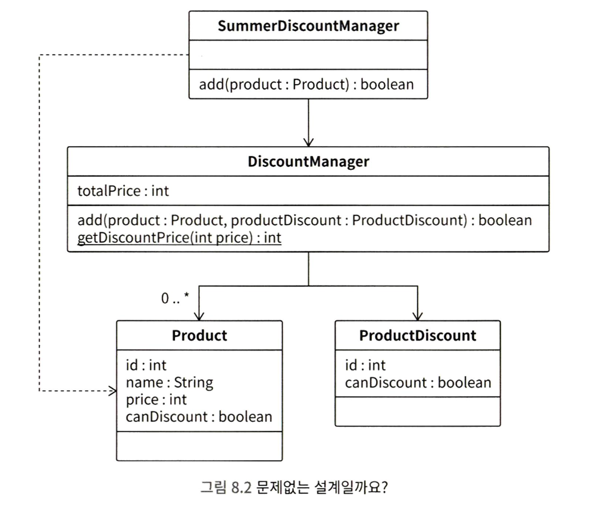
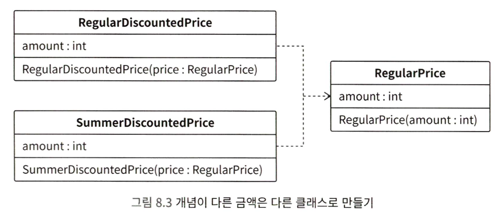

<span style="color:#ff0000">결합도</span>란 모듈 사이의 의존도를 나타내는 지표라고 할 수 있습니다.
어떤 클래스가 다른 클래스에 많이 의존하고 있는 구조를 강한 결합이라고 부릅니다. 강한 결합 코드는 이해하기도 힘들고, 변경하기도 굉장히 힘듭니다.

결합도가 낮은 구조를 느슨한 결합이라고 부릅니다. 느슨한 결합 구조로 개선하면 코드 변경이 쉬워집니다.

강한 결합 문제를 해결하려면, 책무에 대한 접근 방법을 빼놓을 수 없습니다. <span style="color:#ff0000">책무</span>란 어떤 관심사를 정상적으로 작동하게 제어해야 하는 책임으로 생각할 수 있습니다.

---

## 결합도와 책무

책무를 생각하지 않으면 발생하는 문제를 알아보겠습니다,.

온라인 쇼핑몰에 할인 서비스가 추가되었습니다. 이를 '일반 할인'이라고 하겠습니다. 일반 할인의 사양은 다음과 같습니다.
- 상품 하나당 3,000원 할인
- 최대 200,000원까지 상품 추가 가능

```java
class DiscountManager {
	List<Product> discountProducts;
	int totalPrice;

	boolean add(Product product, ProductDiscount productDiscount) {
		// 로직 생략
	}

	static int getDiscountPrice(int price) {
		// 로직 생략
	}
}

// 상품
class Product {
	int id;
	String name;
	int price;
}

// 상품 할인 정보
class ProductDiscount {
	int id;
	boolean canDiscount;
}
```

DiscountManager.add 메서드는 다음을 실행합니다.
- 올바른 상품인지 확인
- getDiscountPrice로 할인 가격을 계산
- productDiscount.canDiscount를 확인하여 할인 가능한 경우에는 할인 가격을 모두 더하고, 할인이 불가능한 경우에는 원래 상품 가격을 모두 더합니다.
- 가격 총합이 상한가인 200,000원 이내인 경우, 상품 리스트에 추가합니다.

그런데 이후, 일반 할인 이외에 여름 할인 사양이 추가되었습니다.
- 상품 하나당 3,000원 할인
- 최대 300,000원까지 상품 추가 가능

DiscountManager 클래스를 구현한 담당자가 아닌 다른 담당자가 SummerDiscountManager 클래스를 구현했습니다.
이때 SummerDiscountManager.add 메서드는 조금 다른 부분이 있지만 대부분 DiscountManager.add 메서드와 비슷합니다.

```java
class SummerDiscountManager {
	DiscountManager discountManager;

	boolean add(Product product) {
		// 로직 생략
	}
}

// 상품
class Product {
	int id;
	String name;
	int price;
	boolean canDiscount;  // 여름 할인이 가능한 경우 true
}
```

위 클래스의 구조는 아래 사진으로 확인 가능합니다.




#### 1) 다양한 버그

어느 날 다음과 같은 사양 변경이 발생했습니다.
- 일반 할인 가격을 3,000 원에서 4,000원으로 변경

따라서 DiscountManager.getDiscountPrice 메서드를 변경합니다.

```java
static int getDiscountPrice(int price) {
	int discoutPrice = price - 4000;
	if (discountPrice < 0) {
		discountPrice = 0;
	}
	return discountPrice;
}
```

그런데 이렇게 하면, 여름 할인 서비스에서도 할인 가격이 4,000원이 되어 버립니다. SummerDiscountManager에서 DiscountManager.getDiscountPrice 메서드를 사용하고 있기 때문입니다.

#### 2) 로직의 위치에 일관성이 없음

현재 할인 서비스 로직은 로직의 위치 자체에 문제가 있습니다.

- DiscountManager가 상품 정보 확인 말고도 할인 가격 계산, 할인 적용 여부 판단, 총액 상한 확인 등 너무 많은 일을 하고 있습니다. SummerDiscountManager도 마찬가지입니다.
- Product가 직접 해야 하는 유효성 검사 로직이 DiscountManager와 SummerDiscountManager에 구현되어 있습니다.
- 여름 할인 가격 계산을 위해서 SummerDiscountmanager가 Discountmanager의 일반 할인 로직을 활용하고 있습니다.

이처럼 로직의 위치에 일관성이 없습니다. 어떤 클래스는 처리해야 할 작업이 집중되어 있는 반면, 어떤 클래스는 특별히 하는 일이 없습니다. 그리고 어떤 클래스는 편의를 위해 다른 클래스의 메서드를 무리하게 활용하고 있습니다.
이런 클래스 설계가 바로 책무를 고려하지 않은 설계라고 할 수 있습니다.

#### 3) 단일 책임 원칙

책임은 누가 책임을 져야 하는가라는 적용 범위와 밀접하다고 볼 수 있습니다. 소프트웨어도 마찬가지 입니다.

> 소프트웨어의 책임이란 자신의 관심사와 관련해서, 정상적으로 동작하도록 제어하는 것이라고 생각해 볼 수 있습니다.

이때 중요한 것이 바로 단일 책임 원칙입니다. 단일 책임 원칙은 클래스가 담당하는 책임은 하나로 제한해야 한다는 설계 원칙입니다.

> 클래스에 변경이 필요한 이유는 오직 하나다!!

#### 4) 단일 책임 원칙 위반으로 발생하는 악마

DiscountManager.getDiscountPrice 는 일반 할인 가격 계산을 책임지는 메서드입니다. 여름 할인 가격을 책임지기 위해 만들어진 메서드가 아닙니다. 따라서 둘 다 책임지는 것은 단일 책임 원칙을 위반하는 것입니다.

추가로 기존 코드에서는 DiscountManager 클래스가 Product 클래스 대신 값을 확인하고 있습니다. 이처럼 책임을 대신 지는 클래스가 만들어지면, 다른 클래스가 제대로 성장할 수 없습니다. 결국 값 확인을 포함해 여러 코드가 중복될 것입니다.

#### 5) 책임이 하나가 되게 클래스 설계하기

상품의 가격을 나타내는 RegularPrice 클래스를 만듭니다. 여기서 잘못된 값이 들어오지 않게 유효성 검사 과정을 추가합니다.

```java
class RegularPrice {
	private static final int MIN_AMOUNT = 0;
	final int amount;

	RegularPrice(final int amount) {
		if (amount < MIN_AMOUNT) {
			throw new IllegalArgumentException("가격은 0 이상이어야 합니다.");
		}

		this.amount = amount;
	}
}
```

일반 할인 가격, 여름 할인 가격과 관련된 내용을 개별적으로 책임지는 클래스도 만듭니다. RegularDiscountedPrice, SummerDiscountedPrice 도 값 객체로 설계합니다.

```java
class RegularDiscountedPrice {
	private static final int MIN_AMOUNT = 0;
	private static final int DISCOUNT_AMOUNT = 4000;
	final int amount;

	RegularDiscountedPrice(final RegularPrice price) {
		int disco8untedAmount = price.amount - DISCOUNT_AMOUNT;
		if (discountedAmount < MIN_AMOUNT) {
			discountedAmount = MIN_AMOUNT;
		}

		amount = discountedAmount;
	}
}

class SummerDiscountedPrice {
	private static final int MIN_AMOUNT = 0;
	private static final int DISCOUNT_AMOUNT = 3000;
	final int amount;

	SummerDiscountedPrice(final RegularPrice price) {
		int disco8untedAmount = price.amount - DISCOUNT_AMOUNT;
		if (discountedAmount < MIN_AMOUNT) {
			discountedAmount = MIN_AMOUNT;
		}

		amount = discountedAmount;
	}
}
```

위 구조를 클래스 다이어그램으로 나타내면 아래 사진과 같습니다.




클래스가 일반 할인 가격, 여름 할인 가격으로 구분되어 있습니다. 따라서 할인과 관련된 사양이 변경되어도 서로 영향을 주지 않습니다. 이와 같이 관심사에 따라 분리해서 독립되어 있는 구조를 느슨한 결합이라고 부릅니다.

> 참고로 느슨한 결합의 반대 용어는 강한 결합입니다. 느슨한 결합의 설계를 권합니다.

#### 6) DRY 원칙의 잘못된 적용

RegularDiscountedPrice와 SummerDiscountedPrice의 로직은 대부분 같습니다. 할인 가격이 DISCOUNT_AMOUNT라는 것만 제외하면 차이가 없습니다.

이때 중복 코드가 작성된 것이 아닌가 생각할 수 있지만 만약 여름 할인 가격은 정가에서 5% 할인한다는 사양으로 변경되면 서로 로직이 달라졌을 것입니다.

책무를 생각하지 않고 로직의 중복을 제거하면 안 됩니다. 그렇게 되면 하나로 모인 로직이 여러 책무를 담당해야 합니다.

DRY 원칙이라는 것이 있습니다. '반복을 피해라'라는 의미입니다. 모든 지식은 시스템 내에서 단 한 번만, 애매하지 않고, 권위 있게 표현되어야 합니다.

여기서 지식이란 세분화된 정도, 기술 레이어 등 다양한 관점으로 생각할 수 있습니다. 그중 하나는 소프트웨어가 대상으로 하는 비즈니스 지식입니다.

비즈니스 지식이란 소프트웨어에서 다루는 비즈니스 개념입니다. 예를 들어 온라인 쇼핑몰에서는 할인, 관심 상품, 크리스마스 캠페인 등이 있습니다.

일반 할인과 여름 할인은 서로 다른 개념입니다. <span style="color:#ff0000">DRY는 각각의 개념 단위 내에서 반복을 하지 말라는 의미입니다.</span>

> 같은 로직, 비슷한 로직이라도 개념이 다르면 중복을 허용해야 합니다. 개념적으로 다른 것까지도 무리하게 중복을 제거하려 하면, 강한 결합 상태가 됩니다. 단일 책임 원칙이 깨지는 것입니다.


---

## 다양한 강한 결합 사례와 대처 방법
