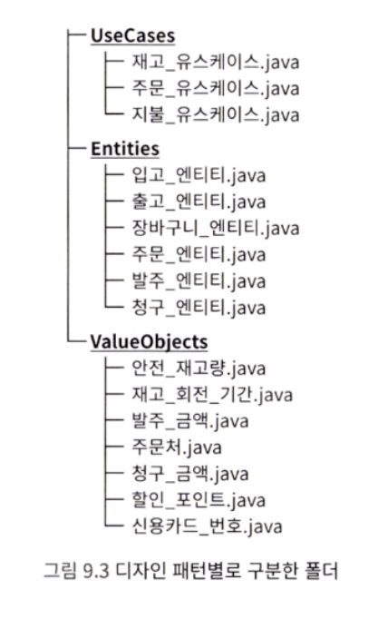

## 데드 코드

절대로 실행되지 않는 조건 내부에 있는 코드를 <span style="color:#ff0000">데드 코드</span> 또는 도달 불가능한 코드 라고 부릅니다. 이러한 코드는 일단 가독성을 떨어뜨립니다. 즉, 읽는 사람을 혼란스럽게 만듭니다.

또한 언젠가 버그가 될 가능성도 있습니다. 지금까지는 실행되지 않던 죽은 코드가 사양 변경에 의해 도달 가능한 코드로 바뀔 수도 있습니다.

데드 코드는 발견하는 즉시 제거하는 것이 좋습니다.


---

## YAGNI 원칙

실제 개발을 할 때 미래를 예측하고, 미리 만들어 두는 경우가 있습니다. 하지만 이렇게 미리 구현한 로직은 실제로 거의 사용되지 않고, 버그의 원인이 되기도 합니다.

YAGNI 라는 소프트웨어 원칙이 있습니다. You Aren\`t Gonna Need It 의 약자로, 번역하면 '지금 필요 없는 기능을 만들지 말라!' 입니다.

예측이 들어맞지 않는 로직은 데드 코드가 됩니다. 또, 이렇게 만들어진 로직은 일반적으로 복잡합니다. 결국 가독성을 낮추고, 읽는 사람을 혼란스럽게 만듭니다. 예측해서 코드를 미리 작성해 두어도 결국 시간 낭비입니다. 지금 필요한 기능을 최대한 간단한 형태로 만드는 것이 가독성과 유지 보수성을 높입니다.


---

## 매직 넘버

설명이 없는 숫자는 개발자를 혼란스럽게 만듭니다. 로직 내부에 직접 작성되어 있어서, 의미를 알기 힘든 숫자를 <span style="color:#ff0000">매직 넘버</span>라고 부릅니다. 매직 넘버를 사용하지 않으려면, 상수를 활용하면 됩니다.

서비스를 바로 동작시켜 보고 싶을 때, 매직 넘버를 사용하기 쉽습니다. 그래도 래포지터리에 커밋할 때는 상수로 변경하고 커밋하기 바랍니다.


---

## 문자열 자료형에 대한 집착

하나의 String 변수에 여러 값을 쉼표로 구분해서 저장하는 경우가 있습니다.

```java
String title = "타이틀,255,250,240,64";
```

읽어 들인 CSV 파일에서 데이터를 추출할 때 split 메서드를 사용하는 경우가 있습니다. 하지만 그런 용도가 아닌데, 의미가 다른 여러 개의 값을 하나의 String 변수에 무리하게 넣으면, 의미를 알기 어렵습니다. 또한 split 메서드 등을 활용하므로 로직이 쓸데없이 복잡해집니다. 결국 가독성이 크게 저하됩니다.


---

## 전역 변수

모든 곳에서 접근할 수 있는 변수를 전역 변수라고 부릅니다.

```java
public OrderManager {
	public static int currentOrderId;
}
```

자바 언어 사양에는 전역 변수가 없습니다. 하지만 위 코드처럼 public static 으로 선언하면, 모든 곳에서 접근할 수 있습니다. 모든 곳에서 참조할 수 있고 조작도 할 수 있는 변수이므로, 어떻게 보면 편리한 기능이라고 생각할 수도 있습니다. 하지만 실제로는 반대입니다.

여러 로직에서 전역 변수를 참조하고 값을 변경하면, 어디에서 어떤 시점에 값을 변경했는지 파악하기 대단히 힘듭니다. 또한 전역 변수를 참조하고 있는 로직을 변경해야 할 때, 해당 변수를 참조하는 다른 로직에서 버그가 발생하는지도 검토해야 합니다.

또한 동기화가 필요한 경우에도 문제가 발생합니다.

참고로 전역으로 선언된 변수만이 전역 변수의 성질을 갖는 것은 아닙니다. 거대 데이터 클래스도 전역 변수와 같은 성질을 띠는 경우가 많습니다. 너무 많은 데이터를 가지고 있으므로, 여러 곳에서 참조하기 때문입니다. 또한, 동기화와 고나련해서도 거대 데이터 클래스는 전역 변수보다 훨씬 악질적입니다. 동기화를 하고 싶은 인스턴스 변수가 하나뿐이라고 해도, 해당 인스턴스의 다른 인스턴스 변수까지 모두 잠그므로(lock), 성능상 문제가 큽니다.

> 전역 변수를 직접적으로 상요하지 않더라도, 전역 변수와 같은 개념을 알게 모르게 사용하고 있는 것입니다. 꽤 자주 발생하는 문제이므로 주의해야 합니다.

#### 1) 영향 범위가 최소화되도록 설계하기

영향 범위가 가능한 한 되도록 좁게 설계해야 합니다. 관계없는 로직에서는 접근할 수 없게 설계해야 합니다. 호출할 수 있는 위치가 적고 국소적일수록 로직을 이해하고 구현하기 쉽습니다.

전역 변수를 만들기보다는 최대한 한정된 클래스에서만 접근할 수 있는 형태로 설계하는게 좋습니다.


---

## null 문제

null 이 들어갈 수 있다고 전제하고 로직을 만들면, 모든 곳에서 null 체크를 해야 할 것입니다. 결국 null 체크 코드가 너무 많아져서 가독성이 떨어질 것이고, 실수로 null 체크를 안 하는 곳이 생기면 곧바로 버그가 될 것입니다.

> null 자체가 잘못된 처리를 의미합니다.

무언가를 갖고 있지 않은 상태와 무언가 설정되지 않은 상태는 그 자체로 의미가 있는 훌륭한 상태입니다. null은 이러한 상태조차 존재하지 않음을 뜻합니다.

#### 1) null을 리턴/전달하지 말기

null 체크를 하지 않으려면, 애초에 null을 다루지 않게 만들어야 합니다.

- null 을 리턴하지 않는 설계
- null 을 전달하지 않는 설계

null을 리턴하지 않는 설계란 메서드에서 null을 리턴하지 않게 작성하는 것을 말합니다. 그리고 null을 전달하지 않는 설계란 메서드에서 null을 변수에 할당하지 않는 것입니다.

#### 2) null 안전

null 안전이란 null에 의한 오류가 아예 발생하지 않게 만드는 구조입니다. null 안전을 구현하기 위한 기능으로 null 안전 자료형이 있습니다.

> null 안전을 지원한다면 적극적으로 사용하는 것이 좋습니다.


---

## 예외를 catch 하고서 무시하는 코드

try-catch로 예외를 catch 해놓고도, 별다른 처리를 하고 있지 않는 경우가 있습니다. 이처럼 예외를 무시하는 코드는 굉장히 사악한 로직입니다.

#### 1) 원인 분석을 어렵게 만듦

이러한 코드의 문제는 오류가 나도, 오류를 탐지할 방법이 없어진다는 것입니다.

#### 2) 문제가 발생했다면 소리치기

잘못된 상태에 어떠한 관용도 베풀어서는 안 됩니다. 예외를 확인했다면 곧바로 통지, 기록하는 것이 좋습니다. 상황에 따라서는 바로 복구합니다.

예를 들어 가드가 있는 생성자도 잘못된 상태를 막아 주는 설계입니다. 생성자에 잘못된 데이터가 전달되는 즉시 예외를 던지므로 잘못된 인스턴스가 만들어지는 일 자체를 막을 수 있습니다. 문제가 발생하는 즉시 소리쳐서 잘못된 상태를 막는 좋은 구조라고 할 수 있습니다.


---

## 설계 질서를 파괴하는 메타 프로그래밍

프로그램 실행 중에 해당 프로그램 구조 자체를 제어하는 프로그래밍을 메타 프로그래밍이라고 부릅니다. 자바에서 메타 프로그래밍을 활용해 클래스 구조를 읽고 쓸 때는 리플렉션 API를 사용합니다.

메타 프로그래밍은 용법과 의도를 제대로 이해하지 못하고 사용했을 때, 전체적인 설계를 무너뜨릴 수도 있는 매우 위험한 기술입니다.

#### 1) 리플렉션으로 인한 클래스 구조와 값 변경 문제

리플렉션을 이용해 불변 변수의 값을 바꿀 수 있습니다. 또한 로직 상 설정한 min, max 의 범위를 넘어선 값으로 설정할 수도 있습니다. 리플렉션을 사용하면 이처럼 final로 지정한 변수의 값도 바꿀 수 있고, private 으로 외부에서 접근하지 못하게 만든 변수에도 접근할 수 있습니다.

#### 2) 자료형의 장점을 살리지 못하는 하드 코딩

자바로 대표되는 정적 자료형 언어는 정적 분석으로 정확한 코드 분석이 가능하다는 장점이 있습니다. 하지만 메타 프로그래밍은 이러한 장점조차 무너뜨립니다.

메타 프로그래밍을 남용하면, 개발 도구의 지원을 받을 수 없게 됩니다.

#### 3) 단점을 이해하고 용도를 한정해서 사용하기

메타 프로그래밍을 사용하고 싶다면 시스템 분석 용도로 한정하거나, 아주 작은 범위에서만 활용하는 등 리스크를 최소화해야 합니다.


---

## 기술 중심 패키징

아래 패키지 구조를 살펴봅시다.



디자인 패턴에는 이전에 다루었던 값 객체 이외에도 유스케이스를 표현한 유스케이스 패턴, 고유성을 책무로 하는 엔티티 패턴 등이 있습니다. 위 사진의 폴더 구성은 디자인 패턴에 따라서 분류한 것입니다. 각각의 파일은 구조에 따라 폴더와 패키지를 나누고 있는데 이를 <span style="color:#ff0000">기술 중심 패키징</span>이라고 부릅니다.

비즈니스 클래스는 아래 그림처럼 관련된 비즈니스 개념을 기준으로 폴더를 구분하는 것이 좋습니다.


위처럼 구성하면 재고 유스케이스에서만 사용되는 안전 재고량 클래스를 package private 으로 만들 수 있으며, 주문과 결제 등 관계없는 유스케이스에서 참조할 위험을 방지할 수 있습니다.

또한 관련된 개념끼리 모여 있으므로, 예를 들어 결제와 관련된 사양이 달라졌을 때, 결제 폴더 내부의 파일만 읽으면 됩니다. 관련 파일을 이리저리 찾아다니지 않아도 됩니다.


---

## 샘플 코드 복사해서 붙여넣기

대부분의 라이브러리 문서에는 샘플 코드가 함께 적혀 있습니다. 이때 주의할 것이 샘플 코드를 그대로 복사하고 붙여 넣어 구현하면, 설계 측면에서 좋지 않은 구조가 되기 쉽다는 점입니다.

샘플 코드는 어디까지나 언어의 사양과 라이브러리의 기능을 설명하기 위해 작성된 것입니다. 유지 보수성과 변경 용이성까지 생각해서 작성된 코드가 아닙니다.

> 샘플 코드는 어디까지나 참고만 하고, 클래스 구조를 잘 설계해서 사용하는 것이 좋습니다.


---

## 은 탄환

현실에서 발생하는 여러 문제는 특정 기술 하나로 해결할 수 있을 정도로 단순하지 않습니다.

어떤 문제를 해결하는 비장의 무기, 묘책을 '은 탄환'이라고 부릅니다. 하지만 소프트웨어 개발에는 은 탄환은 없습니다.

중요한 것은 어떤 문제가 있을 때, 어떤 방법이 해당 문제에 효과적인지, 비용이 더 들지는 않는지 평가하고 판단하는 자세입니다.

> 설계에 Best 라는 것은 없습니다. 항상 Better를 목표로 할 뿐입니다.

