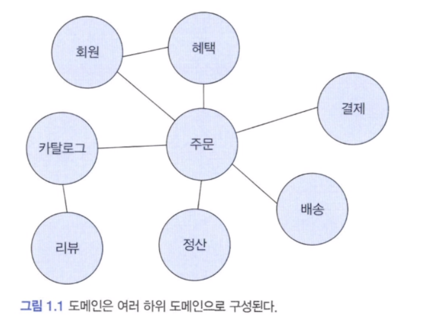
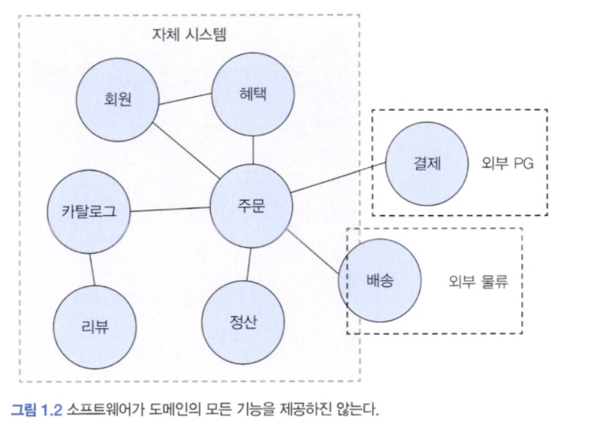
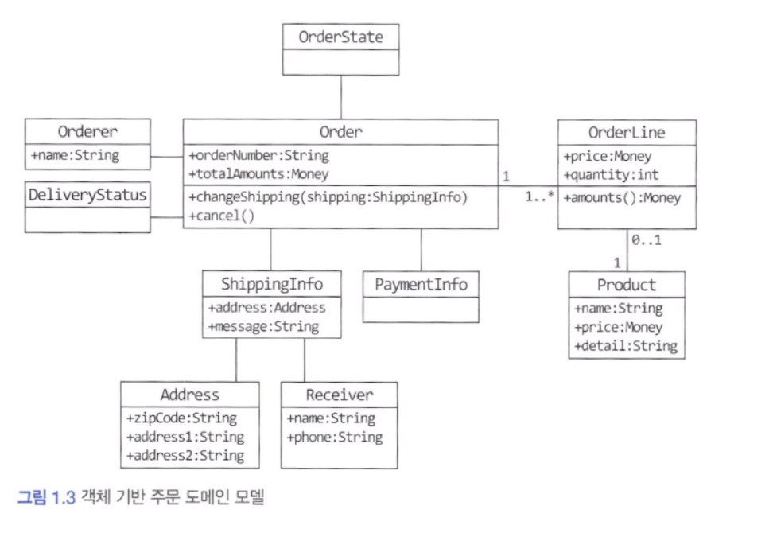
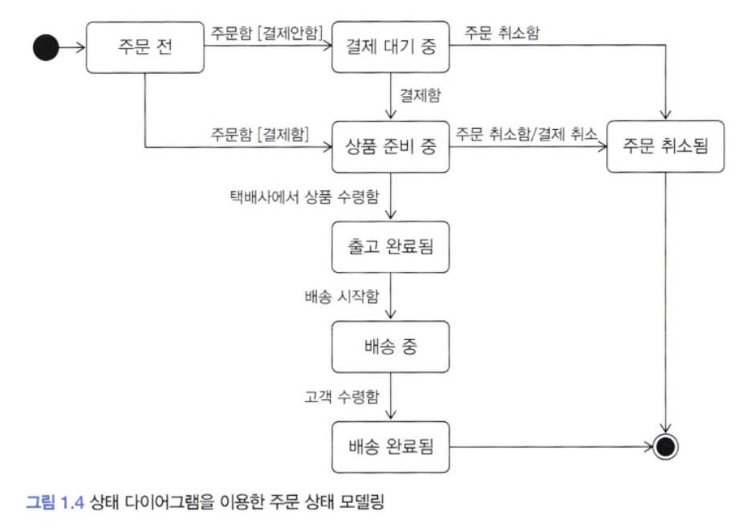
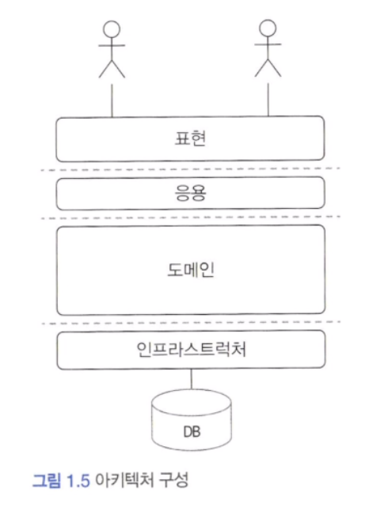
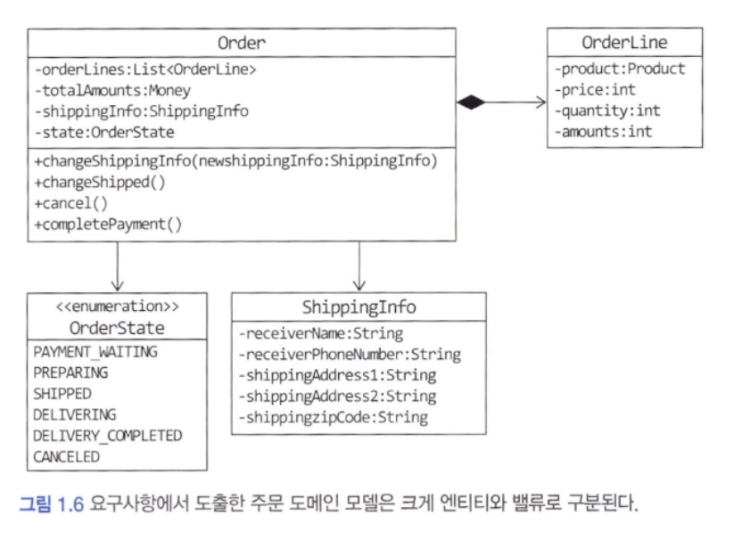
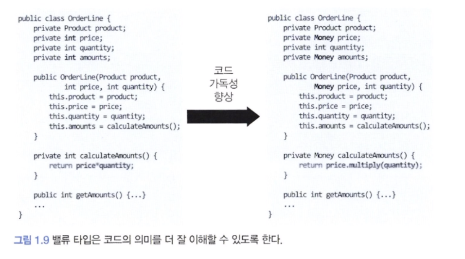

## 도메인이란

온라인 서점 서비스가 있다고 생각해봅니다. 개발자 입장에서 바라보면 온라인 서점은 구현해야 할 소프트웨어의 대상이 됩니다. 온라인 서점 소프트웨어는 온라인으로 책을 판매하는 데 필요한 상품 조회, 구매, 결제, 배송 추적 등의 기능을 제공해야 합니다. 이때 온라인 서점은 소프트웨어로 해결하고자 하는 문제 영역, 즉 도메인에 해당합니다.

한 도메인은 다시 하위 도메인으로 나눌 수 있습니다. 





카탈로그 하위 도메인은 고객에게 구매할 수 있는 상품 목록을 제공하고, 주문 하위 도메인은 고객의 주문을 처리합니다. 혜택 하위 도메인은 쿠폰이나 특별 할인과 같은 서비스를 제공하고, 배송 하위 도메인은 고객에게 구매한 상품을 전달하는 일련의 과정을 처리합니다. 한 하위 도메인은 다른 하위 도메인과 연동하여 완전한 기능을 제공합니다.

특정 도메인을 위한 소프트웨어라고 해서 도메인이 제공해야 할 모든 기능을 직접 구현하는 것은 아닙니다. 배송 도메인의 일부 기능은 자체 시스템으로 구현하고, 나머지 기능은 외부 업체의 시스템을 사용합니다. 이와 같이 결제 시스템도 직접 구축하기보다는 결제 대행업체를 이용해서 처리할 때가 많습니다.





도메인마다 고정된 하위 도메인이 존재하는 것은 아닙니다. 모든 온라인 쇼핑몰이 고객 혜택을 제공하는 것은 아니며 규모가 크지 않은 소규모 업체는 엑셀과 같은 도구를 이용해서 수작업으로 정산을 처리할 수도 있습니다.

하위 도메인을 어떻게 구성할지 여부는 상황에 따라 달라집니다.


---

## 도메인 전문가와 개발자 간 지식 공유

온라인 홍보, 정산, 배송 등 각 영역에는 전문가가 있습니다. 이들 전문가는 해당 도메인에 대한 지식과 경험을 바탕으로 본인들이 원하는 기능 개발을 요구합니다.

개발자들은 이런 요구사항을 분석하고 설계하여 코드를 작성하며 테스트하고 배포합니다. 이 과정에서 요구사항은 첫 단추와 같습니다. 첫 단추를 잘못 끼우면 모든 단추가 잘못 끼워지듯이 요구사항을 올마르게 이해하지 못하면 요구하지 않은 엉뚱한 기능을 만들게 됩니다.

> 그래서 코딩에 앞서 요구사항을 올바르게 이해하는 것이 중요합니다.

요구사항을 올바르게 이해하기 위한 간단한 방법으로는 개발자와 전문가가 직접 대화하는 것입니다. 개발자와 전문가 사이에 내용을 전파하는 전달자가 많으면 많을수록 정보가 왜곡되고 손실이 발생하게 되며, 개발자는 최초에 전문가가 요구한 것과는 다른 무언가를 만들게 됩니다.

> 도메인 전문가 만큼은 아니겠지만 이해관계자와 개발자도 도메인 지식을 갖춰야 합니다.

> 추가로 개발자는 요구사항을 이해할 때 왜 이런 기능을 요구하는지 또는 실제로 원하는 게 무엇인지 생각하고 전문가와 대화를 통해 진짜로 원하는 것을 찾아야 합니다.


---

## 도메인 모델

도메인 모델은 다양한 정의가 존재하는데, 기본적으로 도메인 모델은 특정 도메인을 개념적으로 표현한 것입니다.
아래 주문 도메인을 생각해봅시다.



주문(Order)은 주문번호(orderNumber)와 지불할 총금액(totalAmounts)이 있고, 배송정보(ShippingInfo)를 변경(changeShipping) 할 수 있음을 알 수 있습니다. 또한 주문을 취소(cancel) 할 수 있다는 것도 알 수 있습니다. 도메인 모델을 사용하면 여러 관계자들이 동일한 모습으로 도메인을 이해하고 도메인 지식을 공유하는 데 도움이 됩니다.

위 그림은 객체를 이용한 도메인 모델입니다. 도메인을 이해하려면 도메인이 제공하는 기능과 도메인의 주요 데이터 구성을 파악해야 하는데, 이런 면에서 기능과 데이터를 함께 보여주는 객체 모델은 도메인을 모델링하기에 적합합니다.

객체 모델 뿐만 아니라 상태 다이어그램을 이용해 주문의 상태 전이를 모델링할 수 있습니다. 아래 그림을 보면 상품 준비 중 상태에서 주문을 취소하면 결제 취소가 함께 이루어진다는 것을 알 수 있습니다.





도메인 모델을 표현할 때 클래스 다이어그램이나 상태 다이어그램과 같은 UML 표기법만 사용해야 하는 것은 아닙니다.

> 도메인을 이해하는 데 도움이 된다면 표현 방식이 무엇인지는 중요하지 않습니다.

도메인 모델은 기본적으로 도메인 자체를 이해하기 위한 개념 모델입니다. 개념 모델을 이용해서 바로 코드를 작성할 수 있는 것은 아니기에 구현 기술에 맞는 구현 모델이 따로 필요합니다. 개념 모델과 구현 모델은 서로 다른 것이지만 구현 모델이 개념 모델을 최대한 따르도록 할 수 있습니다.

#### 하위 도메인과 모델

앞서 말했듯 도메인은 다수의 하위 도메인으로 구성됩니다. 각 하위 도메인이 다루는 영역은 서로 다르기 대문에 같은 용어라도 하위 도메인마다 의미가 달라질 수 있습니다. 예를 들어 카탈로그 도메인의 상품이 상품 가격, 상세 내용을 담고 있는 정보를 의미한다면 배송 도메인의 상품은 고객에게 실제 배송되는 물리적인 상품을 의미합니다.

도메인에 따라 용어 의미가 결정되므로 여러 하위 도메인을 하나의 다이어그램에 모델링하면 안됩니다. 모델의 각 구성요소는 특정 도메인으로 한정할 때 비로소 의미가 완전해지기 때문에 각 하위 도메인마다 별도로 모델을 만들어야 합니다. 결과적으로 카탈로그 하위 도메인 모델과 배송 하위 도메인 모델을 따로 만들어야 한다는 것을 의미합니다.


---

## 도메인 모델 패턴

일반적인 애플리케이션의 아키텍처는 아래 그림과 같이 네 개의 영역으로 구성됩니다.



각 영역의 역할을 아래 표와 같습니다.

| 영역                            | 설명                                                                            |
| ----------------------------- | ----------------------------------------------------------------------------- |
| 사용자 인터페이스 또는 표현(Presentation) | 사용자의 요청을 처리하고 사용자에게 정보를 보여줍니다. 여기서 사용자는 소프트웨어를 사용하는 사람뿐만 아니라 외부 시스템일 수도 있습니다. |
| 응용(Application)               | 사용자가 요청한 기능을 실행합니다. 업무 로직을 직접 구현하지 않으며 도메인 계층을 조합해서 기능을 실행합니다.                |
| 도메인                           | 시스템이 제공할 도메인 규칙을 구현합니다.                                                       |
| 인프라스트럭처(infrastructure)       | 데이터베이스나 메시징 시스템과 같은 외부 시스템과의 연동을 처리합니다.                                       |

도메인 모델은 아키텍처 상의 도메인 계층을 객체 지향 기법으로 구현하는 패턴을 말합니다. 도메인 계층은 도메인의 핵심 규칙을 구현합니다. 주문 도메인의 경우 출고 전에 배송지를 변경할 수 있다라는 규칙과 주문 취소는 배송 전에만 할 수 있다라는 규칙을 구현한 코드가 도메인 계층에 위치하게 됩니다. 이런 도메인 규칙을 객체 지향 기법으로 구현하는 패턴이 도메인 모델 패턴입니다.

아래 코드를 살펴봅니다.

```java
public class Order {
	private OrderState state;
	private ShippingInfo shippingInfo;

	public void changeShippingInfo(ShippingInfo newShippingInfo) {
		// 배송지 변경 로직
		if (!state.isShippingChangeable()) {
			throw new IllegalStateException("can`t change shipping in " + state);
		}
		this.shippingInfo = newShippingInfo;
	}
}

public enum OrderState {
	PAYMENT_WAITING {
		public boolean isShippingChangeable() {
			return true;
		}
	},
	PREPARING {
		public boolean isShippingChangeable() {
			return true;
		}
	},
	SHIPPED, DELIVERING, DELIVERY_COMPLETED;

	public boolean isShippingChangeable() {
		return false;
	}
}
```


위 코드는 주문 도메인의 일부 기능을 도메인 모델 패턴으로 구현한 것입니다. 주문 상태를 표현하는 OrderState는 배송지를 변경할 수 있는지를 검사할 수 있는 isShippingChangeable() 메서드를 제공하고 있습니다.

또한 OrderState는 주문 대기 중이거나 상품 준비 중에는 배송지를 변경할 수 있다는 도메인 규칙을 구현하고 있습니다.

만약 배송지 변경이 가능한지를 판단할 규칙이 주문 상태와 다른 정보를 함께 사용한다면 OrderState 만으로는 배송지 변경 가능 여부를 판단할 수 없으므로 Order에서 로직을 구현해야 합니다.

배송지 변경 가능 여부를 판단하는 기능이 Order에 있든 OrderState에 있든 중요한 점은 주문과 관련된 중요 업무 규칙을 주문 도메인 모델인 Order나 OrderState에서 구현한다는 점입니다. 핵심 규칙을 구현한 코드는 도메인 모델에만 위치하기 때문에 규칙이 바뀌거나 규칙을 확장해야 할 때 다른 코드에 영향을 덜 주고 변경 내역을 모델에 반영할 수 있게 됩니다.

> 개념 모델을 구현 가능한 형태의 모델로 전환하는 과정을 거치게 되는데, 결국 프로젝트를 진행하다보면 모델을 보완하거나 변경하는 일이 발생합니다.
> 따라서 처음부터 완벽한 개념 모델을 만들기보다는 전반적인 개요를 알 수 있는 수준으로 개념 모델을 작성해야 합니다. 프로젝트 초기에는 개요 수준의 개념 모델로 도메인에 대한 전체 윤곽을 이해하는 데 집중하고, 구현하는 과정에서 개념 모델을 구현 모델로 점진적으로 발전시켜 나가야 합니다.


---

## 도메인 모델 도출

제아무리 뛰어난 개발자라 할지라도 도메인에 대한 이해 없이 코딩을 시작할 수 없습니다. 구현을 시작하려면 도메인에 대한 초기 모델이 필요합니다.

도메인을 모델링할 때 기본이 되는 작업은 모델을 구성하는 핵심 구성요소, 규칙, 기능을 찾는 것입니다. 이 과정은 요구사항에서 출발합니다. 아래 주문 도메인과 관련된 몇 가지 요구사항을 보겠습니다.

- 최소 한 종류 이상의 상품을 주문해야 한다.
- 한 상품을 한 개 이상 주문할 수 있다.
- 총 주문 금액은 각 상품의 구매 가격 합을 모두 더한 금액이다.
- 각 상품의 구매 가격 합은 상품 가격에 구매 개수를 곱한 값이다.
- 주문할 때 배송지 정보를 반드시 지정해야 한다.
- 배송지 정보는 받는 사람 이름, 전화번호, 주소로 구성된다.
- 출고를 하면 배송지를 변경할 수 없다.
- 출고 전에 주문을 취소할 수 있다.
- 고객이 결제를 완료하기 전에는 상품을 준비하지 않는다.

위 요구사항을 통해 알 수 있는 것은 주문은 '출고 상태로 변경하기', '배송지 정보 변경하기', '주문 취소하기', '결제 완료하기' 기능을 제공해야 한다는 것입니다. 따라서  Order에 관련 기능을 메서드로 추가할 수 있습니다.

```java
public class Order {
	public void changeShipped() {};
	public void changeShippingInfo(ShippingInfo newShipping) {};
	public void cancel() {};
	public void completePayment() {};
}
```


아래 요구사항은 주문 항목이 어떤 데이터로 구성되는지 알려줍니다.

- 한 상품을 한 개 이상 주문할 수 있다.
- 각 상품의 구매 가격 합은 상품 가격에 구매 개수를 곱한 값이다.

두 요구사항에 따르면 주문 항목을 표현하는 OrderLine은 적어도 주문할 상품, 상품의 가격, 구매 개수를 포함해야 하는 것을 알 수 있습니다. 추가로 각 구매 항목의 구매 가격도 제공해야 합니다.

```java
public class OrderLine {
	private Product product;
	private int price;
	private int quantity;
	private int amounts;
}
```


다음 요구사항은 Order와 OrderLine 과의 관계를 알려줍니다.

- 최소 한 종류 이상의 상품을 주문해야 합니다.
- 총 주문 금액은 각 상품의 구매 가격 합을 모두 더한 금액이다.

```java
public class Order {
	private List<OrderLine> orderLines;
	private Money totalAmounts;

	public Order(List<OrderLine> orderLines) {
		setOrderLines(orderLines);
	}

	private void setOrderLines(List<orderLine> orderLines) {
		verifyAtLeastOneOrMoreOrderLines(orderLines);
		this.orderLines = orderLines;
		calculateTotalAmounts();
	}
}
```

앞서 요구사항 중에 '주문할 때 배송지 정보를 반드시 지정해야 한다' 라는 내용이 있습니다. 이는 Order를 생성할 때 OrderLine의 목록뿐만 아니라 ShippingInfo도 함께 전달해야 함을 의미합니다.

```java
public class Order {
	private List<OrderLine> orderLines;
	private Money totalAmounts;

	public Order(List<OrderLine> orderLines, ShippingInfo shippingInfo) {
		setOrderLines(orderLines);
		setShippingInfo(shipingInfo);
	}

	private void setShippingInfo(ShippingInfo shippingInfo) {
		if (shippingInfo == null) {
			throw new IllegalArgumentException("no ShippingInfo");
		}
		this.shippingIngo = shippingInfo;
	}
}
```

생성자에서 호출하는 setShippingInfo() 메서드는 ShippingInfo가 null 이면 익셉션이 발생하는데, 이렇게 함으로써 '배송지 정보 필수'라는 도메인 규칙을 구현합니다.


지금까지 주문과 관련된 요구사항에서 도메인 모델을 점진적으로 만들어 나갔습니다. 일부는 구현 수준까지 만들었고 일부는 이름 정도만 결정했습니다. 모델을 공유할 때는 화이트보드나 위키와 같은 도구를 사용해서 누구나 쉽게 접근할 수 있도록 하면 좋습니다.

> 문서화
> 상위 수준에서 정리한 문서를 참조하는 것이 솦프트웨어 전반을 빠르게 이해하는 데 도움이 됩니다. 전체 구조를 이해하고 더 깊게 이해할 필요가 있는 부분을 코드로 분석해 나가면 됩니다.
> 
> 코드 자체도 문서화의 대상이 됩니다. 단순히 코드를 보기 좋게 작성하는 것뿐만 아니라 도메인 관점에서 코드가 도메인을 잘 표현해야 비로소 코드의 가독성이 높아지고 문서로서 코드가 의미를 갖습니다.


---

## 엔티티와 밸류

도출한 모델은 크게 엔티티와 밸류로 구분할 수 있습니다. 앞서 요구사항 분석 과정에서 만든 모델은 아래 그림과 같은데, 이 그림에는 엔티티도 존재하고 밸류도 존재합니다.





엔티티와 밸류를 제대로 구분해야 도메인을 올바르게 설계하고 구현할 수 있기 때문에 이 둘의 차이를 명확하게 이해하는 것은 도메인을 구현하는 데 있어 중요합니다.

#### 1) 엔티티

엔티티의 가장 큰 특징은 식별자를 가진다는 것입니다. 식별자는 엔티티 객체마다 고유해서 각 엔티티는 서로 다른 식별자를 갖습니다. 예를 들어 주문 도메인에서 각 주문은 주문번호를 가지고 있는데 이 주문번호는 각 주문마다 서로 다릅니다. 따라서 주문 번호가 주문의 식별자가 됩니다.

주문에서 배송지 주소가 바뀌거나 상태가 바뀌더라도 주문번호가 바뀌지 않는 것처럼 엔티티의 식별자는 바뀌지 않습니다. 엔티티의 식별자는 바뀌지 않고 고유하기 때문에 두 엔티티 객체의 식별자가 같으면 두 엔티티는 같다고 판단할 수 있습니다.

#### 2) 엔티티의 식별자 생성

엔티티의 식별자를 생성하는 시점은 도메인의 특징과 사용하는 기술에 따라 달라집니다. 흔히 식별자는 다음 중 한 가지 방식으로 생성합니다.

- 특정 규칙에 따라 생성
- UUID나 Nano ID 와 같은 고유 식별자 생성기 사용
- 값을 직접 입력
- 일련번호 사용(시퀀스나 DB의 자동 증가 칼럼 사용)

흔히 사용하는 규칙은 현재 시간과 다른 값을 함께 조합하는 것입니다. 날짜와 시간을 이용해서 식별자를 생성할 때 주의할 점은 같은 시간에 동시에 식별자를 생성해도 같은 식별자가 만들어지면 안 된다는 것입니다.

UUID를 사요해서 식별자를 생성할 수 있습니다. 다수의 개발 언어가 UUID 생성기를 제공하고 있으므로 마땅한 규칙이 없다면 UUID를 식별자로 사용해도 됩니다.

> 최근에는 고유 식별자 생성을 위해 Nano ID를 사용하는 곳도 증가하고 있습니다.

회원의 아이디나 이메일과 같은 식별자는 값을 직접 입력합니다. 사용자가 입력하는 값이기 때문에 식별자를 중복해서 입력하지 않도록 사전에 방지하는 것이 중요합니다.

일련번호 방식은 주로 데이터베이스가 제공하는 자동 증가 기능을 사용합니다. 자동 증가 칼럼을 제외한 다른 방식은 다음과 같이 식별자를 먼저 만들고 엔티티 객체를 생성할 때 식별자를 전달합니다.

```java
// 엔티티를 생성하기 전에 식별자 생성
String orderNumber = orderRepository.generateOrderNumber();

Order order = new Order(orderNumber, ...);
orderRepository.save(order);
```

자동 증가 칼럼은 DB 테이블에 데이터를 삽입해야 비로소 값을 알 수 있기 때문에 테이블에 데이터를 추가하기 전에는 식별자를 알 수 없습니다. 이것은 엔티티 객체를 생성할 때 식별자를 전달할 수 없음을 의미합니다.

#### 3) 밸류 타입

ShippingInfo 클래스는 아래와 같이 받는 사람과 주소에 대한 데이터를 갖고 있습니다.

```java
public class shippingInfo {
	private String receiverName;
	private String receiverPhoneNumber;

	private String shippingAddress1;
	private String shippingAddress2;
	private String shippingAddress3;
}
```

ShippingInfo 클래스의 receiverName 필드와 receiverPhoneNumber 필드는 서로 다른 두 데이터를 담고 있지만 두 필드는 개념적으로 받는 사람을 의미합니다. 즉, 두 필드는 실제로 하나의 개념을 표현하고 있습니다. 비슷하게 ShippingAddress 필드들도 주소라는 하나의 개념을 표현합니다.

> 밸류 타입은 개념적으로 완전한 하나를 표현할 때 사용합니다.

```java
public class Receiver {
	private String name;
	private String phoneNumber;

	// 생성자, getter, setter
}
```

위 코드를 통해 밸류 타입을 사용함으로써 개념적으로 완전한 하나를 잘 표현할 수 있는 것입니다. 마찬가지로 Address 라는 밸류타입도 만들 수 있습니다. 이를 이용해 ShippingInfo 클래스를 다시 구현해봅시다. 배송정보가 받는 사람과 주소로 구성된다는 것을 쉽게 알 수 있습니다.

```java
public class ShippingInfo {
	private Receiver receiver;
	private Address address;
}
```

> 밸류 타입이 꼭 두 개 이상의 데이터를 가져야 하는 것은 아닙니다. 의미를 명확하게 표현하기 위해 밸류 타입을 사용하는 경우도 있습니다.

OrderLine 객체의 price와 amounts 는 int 타입의 숫자인데 이는 돈을 의미하므로 Money 타입을 만들어 사용하면 코드를 이해하는 데 도움이 됩니다.

```java
public class Money {
	private int value;

	public Money(int value) {
		this.value = value;
	}
}
```

다음은 Money를 사용하도록 OrderLine을 변경한 코드입니다. Money 타입 덕에 price나 amounts 가 금액을 의미한다는 것을 쉽게 알 수 있습니다.

```java
public class OrderLine {
	private Product product;
	private Money price;
	private int quantity;
	private Money amounts;
}
```

밸류 타입의 또 다른 장점은 밸류 타입을 위한 기능을 추가할 수 있다는 것입니다. 예를 들어 Money 타입에 돈 계산을 위한 기능을 추가할 수 있습니다.




밸류 객체의 데이터를 변경할 때는 기존 데이터를 변경하기보다는 변경한 데이터를 갖는 새로운 밸류 객체를 생성하는 방식을 선호합니다. 이러한 객체는 데이터 변경 기능을 제공하지 않는 타입인 불변 객체라고 표현합니다.

밸류 타입을 불변으로 구현하는 여러 이유가 있는데 가장 중요한 이유는 안전한 코드를 작성할 수 있다는 데 있습니다.

> 참고로 두 밸류 객체를 비교할 때는 모든 속성이 같은지 비교합니다.

#### 4) 엔티티 식별자와 밸류 타입

엔티티 식별자의 실제 데이터는 String과 같은 문자열로 구성된 경우가 많습니다. Money가 단순 숫자가 아닌 도메인의 '돈'을 의미하는 것처럼 이런 식별자는 단순한 문자열이 아니라 도메인에서 특별한 의미를 지니는 경우가 많기 때문에 식별자를 위한 밸류 타입을 사용해서 의미가 잘 드러나도록 할 수 있습니다.

```java
public class Order {
	// OrderNo 타입 자체로 id가 주문번호임을 알 수 있다.
	private OrderNo id;

	...
}
```

#### 5) 도메인 모델에 set 메서드 넣지 않기

도메인 모델에 get/set 메서드를 무조건 추가하는 것은 좋지 않은 버릇입니다. 특히 set 메서드는 도메인의 핵심 개념이나 의도를 코드에서 사라지게 합니다. 습관적으로 작성한 set 메서드는 필드값만 변경하고 끝나기 때문에 상태 변경과 관련된 도메인 지식이 코드에서 사라지게 됩니다.

```java
public class Order {
	// 도메인의 의도를 코드에서 사라지게 합니다.
	public void setShippingInfo(ShippingInfo newShippingInfo) {};
	public void setOrderState(OrderState state) {};
}
```

set 메서드의 또 다른 문제는 도메인 객체를 생성할 때 온전하지 않은 상태가 될 수 있다는 점입니다.

```java
Order order = new Order();
order.setOrderLine(lines);
order.setshippingInfo(shippingInfo);

// 주문자(Orderer)를 설정하지 않은 상태에서 주문 완료 처리
order.setState(OrderState.PREPARING);
```

도메인 객체가 불완전한 상태로 사용되는 것을 막으려면 생성 시점에 필요한 것을 전달해 주어야 합니다. 즉 생성자를 통해 필요한 데이터를 모두 받아야 합니다.

생성자로 필요한 것을 모두 받으므로 생성자를 호출하는 시점에 필요한 데이터가 올바른지 검사할 수 있습니다.

불변 밸류 타입을 사용하면 자연스럽게 밸류 타입에는 set 메서드를 구현하지 않습니다. set 메서드를 구현해야 할 특별한 이유가 없다면 불변 타입의 장점을 살릴 수 있도록 밸류 타입은 불변으로 구현합니다.

> DTO의 get/set 메서드
> 예전에 사용하는 프레임워크는 DB 칼럼의 값을 설정할 때 set 메서드를 필요로 했기 때문에 어쩔수 없이 set 메서드를 구현했지만 요즘 프레임워크나 개발 도구는 set 메서드가 아닌 private 필드에 직접 값을 할당할 수 있는 기능을 제공하고 있어 이런 기능을 사용하고 set 메서드를 사용하지 않도록 해야 불변의 장점을 DTO 까지 확장할 수 있습니다.


---

## 도메인 용어와 유비쿼터스 언어

코드를 작성할 때 도메인에서 사용하는 용어는 매우 중요합니다. 도메인에서 사용하는 용어를 코드에 반영하지 않으면 그 코드는 개발자에게 코드의 의미를 해석해야 하는 부담을 줍니다.

```java
public OrderState {
	STEP1, STEP2, STEP3, STEP4, STEP5, STEP6
}
```

실제 OrderState 코드를 이해하려면 STEP1 과 STEP2 가 각각 '결제 대기 중' 상태와 '상품 준비 중' 상태를 의미한다는 것을 알아야 합니다.

즉 도메인 용어를 사용하면 이러한 불필요한 과정 없이 코드를 보고 바로 이해할 수 있게 됩니다.

에릭 에반스는 도메인 주도 설계에서 언어의 중요함을 강조하기 위해 <span style="color:#ff0000">유비쿼터스 언어</span>라는 용어를 사용했습니다. 전문가, 관계자, 개발자가 도메인과 관련된 공통의 언어를 만들고 이를 대화, 문서, 도메인 모델, 코드, 테스트 등 모든 곳에서 같은 용어를 사용한다는 의미입니다.

시간이 지날수록 도메인에 대한 이해가 높아지는데 새롭게 이해한 내용을 잘 표현할 수 있는 용어를 찾아내고 이를 다시 공통의 언어로 만들어 다 같이 사용합니다. 새로 발견한 용어는 코드나 문서에도 반영해서 산출물에 최신 모델을 적용합니다.

이때 알맞는 영단어를 찾는 것은 쉽지 않습니다. 하지만 시간을 들여 찾는 노력을 해야 합니다. 한영사전을 사용해서 적당한 단어를 찾는 노력을 하지 않고 도메인에 어울리지 않은 단어를 사용하면 코드는 도메인과 점점 멀어지게 됩니다. 그러니 도메인 용어에 알맞은 단어를 찾는 시간을 아까워하지 말아야 합니다.