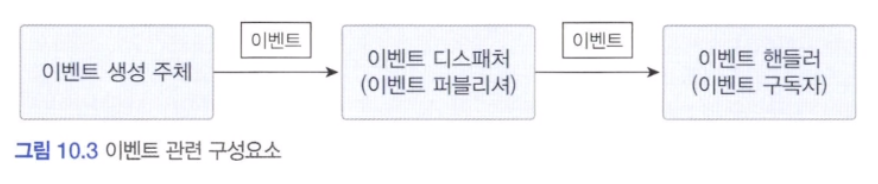
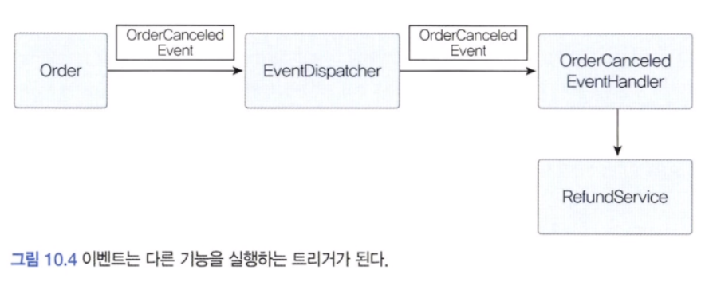
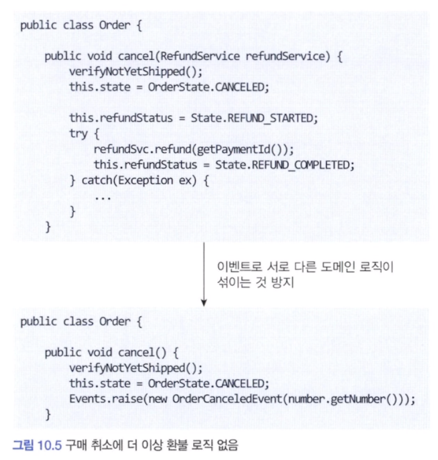
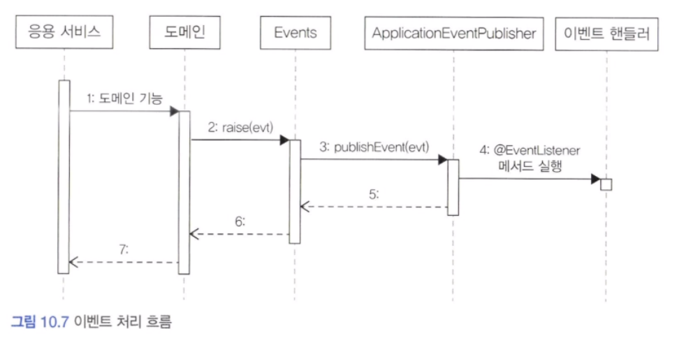
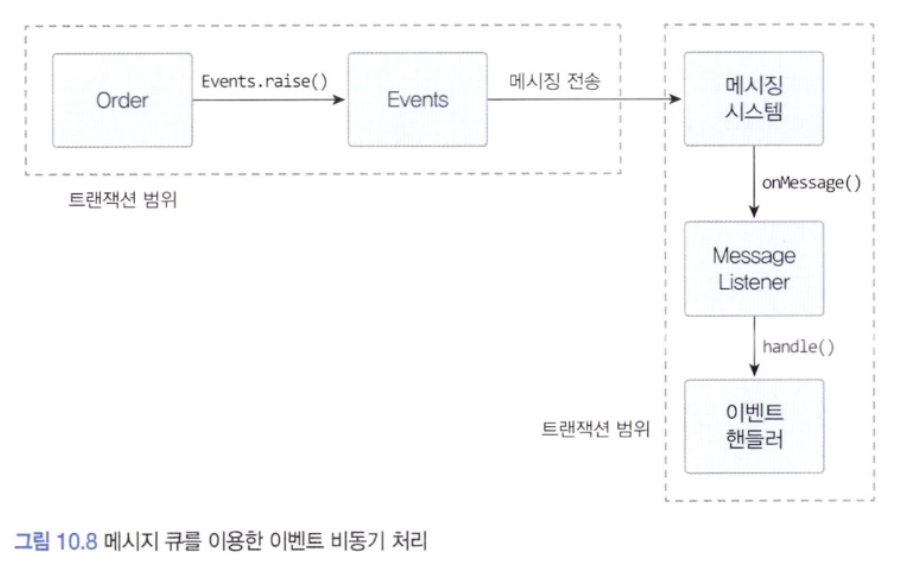
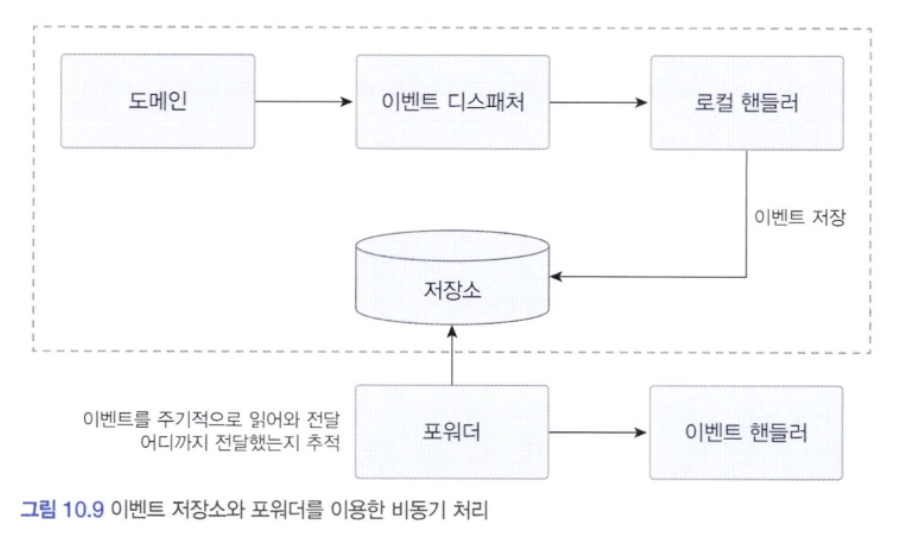
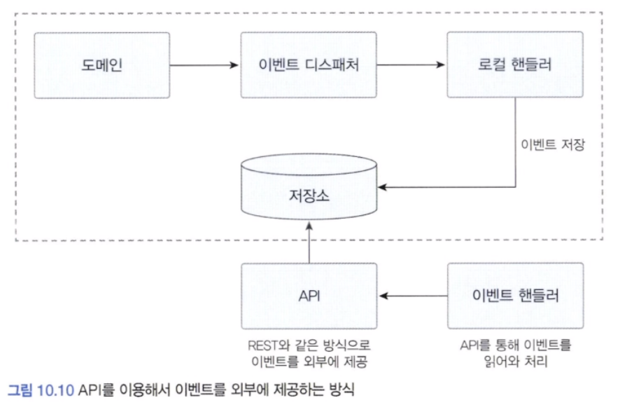
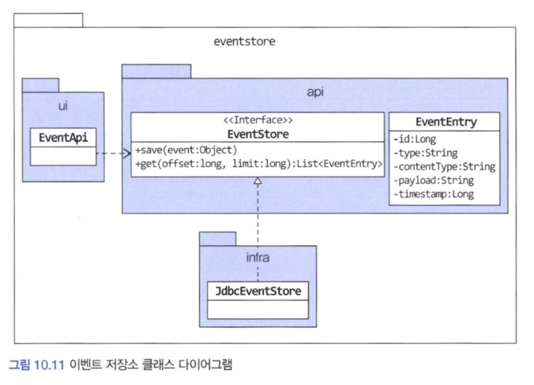
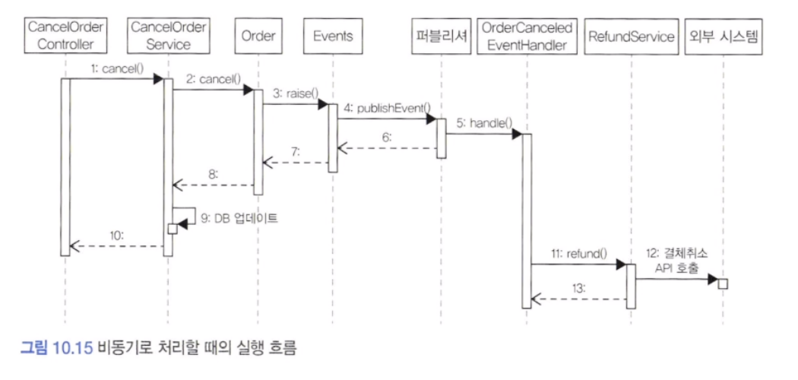

## 시스템 간 강결합 문제

쇼핑몰에서 구매를 취소하면 환불을 처리해야 합니다. 이때 환불 기능을 실행하는 주체는 주문 도메인 엔티티가 될 수 있습니다. 도메인 객체에서 환불 기능을 실행하려면 도메인 서비스를 파라미터로 전달받고 취소 도메인 기능에서 도메인 서비스를 실행하게 됩니다. 물론 응용 서비스에서 환불 기능을 실행할 수도 있습니다.

보통 결제 시스템은 외부에 존재하므로 RefundService는 외부에 있는 결제 시스템이 제공하는 환불 서비스를 호출합니다. 이때 두 가지 문제가 발생할 수 있습니다. 첫 번째 문제는 외부 서비스가 정상이 아닐 경우 트랜잭션 처리를 어떻게 해야 할지 애매하다는 것입니다. 반드시 트랜잭션을 롤백 해야 하는 것은 아니고, 주문은 취소 상태로 변경하고 환불만 나중에 다시 시도하는 방식으로 처리할 수도 있습니다.

두 번째 문제는 성능에 대한 것입니다. 환불을 처리하는 외부 시스템의 응답 시간이 길어지면 그만큼 대기 시간도 길어집니다. 즉, 외부 서비스 성능에 직접적인 영향을 받게 됩니다.

두 가지 문제 외에 도메인 객체에 서비스를 전달하면 추가로 설계상 문제가 나타날 수 있습니다.

```java
public class Order {
	public void cancel(RefundService refundService) {
		verifyNotYetShipped();
		this.state = OrderState.CANCELED;

		this.refundStatus = Status.REFUND_STARTED;
		try {
			refundSvc.refund(getPaymentId());
			this.refundStatus = State.REFUND_COMPLETED;
		} catch(Exception ex) {
			...
		}
	}
}
```


Order는 주문을 표현하는 도메인 객체인데 결제 도메인의 환불 관련 로직이 뒤섞이게 됩니다. 이것은 환불 기능이 바뀌면 Order 도 영향을 받게 된다는 것을 의미합니다. 주문 도메인 객체의 코드를 결제 도메인 때문에 변경할지도 모르는 상황이 좋아 보이지 않습니다.

도메인 객체에 서비스를 전달할 시 또 다른 문제는 기능을 추가할 때 발생합니다. 만약 주문을 취소한 뒤에 환불뿐만 아니라 취소했다는 내용을 통지해야 한다면 어떻게 될까? 외부 서비스가 증가하고 트랜잭션 처리가 복잡해지게 됩니다.

지금까지 언급한 문제가 발생하는 이유는 주문 바운디드 컨텍스트와 결제 바운디드 컨텍스트 간의 강결합 때문입니다. 주문이 결제와 강하게 결합되어 있어서 주문 바운디드 컨텍스트가 결제 바운디드 컨텍스트에 영향을 받게 되는 것입니다.

이런 강한 결합을 없앨 수 있는 방법이 있습니다. 바로 이벤트를 사용하는 것입니다. 특히 비동기 이벤트를 사용하면 두 시스템 간의 결합을 크게 낮출 수 있습니다. 한번 익숙해지면 모든 연동을 이벤트와 비동기로 처리하고 싶을 정도로 강력하고 매력젹인 것이 이벤트입니다.


---

## 이벤트 개요

이 절에서 사용하는 이벤트라는 용어는 과거에 벌어진 어떤 것을 의미합니다. 이벤트가 발생한다는 것은 상태가 변경됐다는 것을 의미합니다. 이벤트는 발생하는 것에서 끝나지 않습니다. 이벤트가 발생하면 그 이벤트에 반응하여 원하는 동작을 수행하는 기능을 구현합니다.

도메인 모델에서 도메인의 상태 변경을 이벤트로 표현할 수 있습니다. 보통 '~ 할 때', '~가 발생하면', '만약 ~ 하면' 과 같은 요구사항은 도메인의 상태 변경과 관련된 경우가 많고 이런 요구사항을 이벤트를 이용해서 구현할 수 있습니다.

#### 1) 이벤트 관련 구성 요소



도메인 모델에서 이벤트 생성 주체는 엔티티, 밸류, 도메인 서비스와 같은 도메인 객체입니다. 이들 도메인 객체는 도메인 로직을 실행해서 상태가 바뀌면 관련 이벤트를 발생시킵니다.

이벤트 핸들러는 이벤트 생성 주체가 발생한 이벤트에 반응합니다. 즉 이벤트를 전달받아 이벤트에 담긴 데이터를 이용해서 원하는 기능을 실행합니다.

이벤트 생성 주체와 이벤트 핸들러를 연결해 주는 것이 이벤트 디스패처입니다. 이벤트 생성 주체는 이벤트를 생성해서 디스패처에 이벤트를 전달합니다. 이벤트를 전달받은 디스패처는 해당 이벤트를 처리할 수 있는 핸들러에 이벤틀르 전파합니다. 이벤트 디스패처의 구현 방식에 따라 이벤트 생성과 처리를 동기나 비동기로 실행하게 됩니다.

#### 2) 이벤트의 구성

이벤트는 발생한 이벤트에 대한 정보를 담습니다. 이 정보를 다음을 포함합니다.

- 이벤트 종류 : 클래스 이름으로 이벤트 종류를 표현
- 이벤트 발생 시간
- 추가 데이터 : 주문번호, 신규 배송지 정보 등 이벤트와 관련된 정보

배송지 변경 이벤트를 생각해보면 아래와 같이 작성할 수 있습니다.

```java
public class ShippingInfoChangedEvent {
	private String orderNumber;
	private long timestamp;
	private ShippingInfo newShippingInfo;
}
```

클래스 이름을 보면 'Changed' 라는 과거 시제를 사용했습니다. 이벤트는 현재 기준으로 과거에 벌어진 것을 표현하기 때문에 이벤트 이름에는 과거 시제를 사용합니다.

#### 3) 이벤트 용도

이벤트는 크게 두 가지 용도로 쓰입니다.
첫 번째 용도는 트리거입니다. 도메인의 상태가 바뀔 때 다른 후처리가 필요하면 후처리를 실행하기 위한 트리거로 이벤트를 사용할 수 있습니다.



예매 결과를 SMS로 통지할 때도 이벤트를 트리거로 사용할 수 있습니다.

이벤트의 두 번째 용도는 서로 다른 시스템 간의 데이터 동기화입니다. 배송지를 변경하면 외부 배송 서비스에 바뀐 배송지 정보를 전송해야 합니다. 주문 도메인은 배송지 변경 이벤트를 발생시키고 이벤트 핸들러는 외부 배송 서비스와 배송지 정보를 동기화할 수 있습니다.

#### 4) 이벤트 장점

이벤트를 사용하면 서로 다른 도메인 로직이 섞이는 것을 방지할 수 있습니다.




구매 취소 로직에 이벤트를 적용함으로써 환불 로직이 없어진 것을 알 수 있습니다. cancel() 메서드에서 환불 서비스를 실행하기 위해 사용한 파라미터도 없어졌습니다. 환불 실행 로직은 주문 취소 이벤트를 받는 이벤트 핸들러로 이동하게 됩니다. 이벤트를 사용하여 주문 도메인에 결제(환불) 도메인으로의 의존을 제거했습니다.

이벤트 핸들러를 사용하면 기능 확장도 용이합니다. 구매 취소 시 환불과 함께 이메일로 취소 내용을 보내고 싶다면 이베일 발송을 처리하는 핸들러를 구현하면 됩니다.


---

## 이벤트, 핸들러, 디스패처 구현

지금까지 이벤트에 대한 내용을 살펴봤는데 실제 이벤트와 관련된 코드를 구현해 보겠습니다. 이벤트와 관련된 코드는 다음과 같습니다.

- 이벤트 클래스 : 이벤트를 표현합니다.
- 디스패처 : 스프링이 제공하는 ApplicationEventPublisher 를 이용합니다.
- Events : 이벤트를 발행한다. 이벤트 발행을 위해 ApplicationEventPublisher 를 사용합니다.
- 이벤트 핸들러 : 이벤트를 수신해서 처리합니다. 스프링이 제공하는 기능을 사용한다.

#### 1) 이벤트 클래스

이벤트 자체를 위한 상위 타입은 존재하지 않습니다. 원하는 클래스를 이벤트로 사용하면 됩니다. 이벤트는 과거에 벌어진 상태 변화나 사건을 의미하므로 이벤트 클래스의 이름을 결정할 때에는 과거 시제를 사용해야 한다는 점만 유의하면 됩니다.

OrderCanceledEvent 와 같이 클래스 이름 뒤에 접미사로 Event 를 이용해서 이벤트로 사용되는 클래스라는 것을 명시적으로 표현할 수도 있고 OrderCanceled 처럼 간결함을 위해 과거 시제만 사용할 수도 있습니다.

이벤트 구성에서 설명한 것처럼 이벤트 클래스는 이벤트를 처리하는 데 필요한 최소한의 데이터를 포함해야 합니다. 모든 이벤트가 공통으로 갖는 프로퍼티가 존재한다면 관련 상위 클래스를 만들 수도 있습니다. 예를 들어 발생 시간이 있을 수 있습니다.

#### 2) Events 클래스와 ApplicationEventPublisher

```java
public class Events {
	private static ApplicationEventPublisher publisher;

	static void setPublisher(ApplicationEventPublisher publisher) {
		Events.publisher = publisher;
	}

	public static void raise(Object event) {
		if (publisher != null) {
			publisher.publishEvent(event);
		}
	}
}
```

#### 3) 이벤트 발생과 이벤트 핸들러

이벤트를 발생시킬 코드는 Events.raise() 메서드를 사용합니다. ApplicationEventPublisher#publishEvent() 메서드를 실행할 때 OrderCanceledEvent 타입 객체를 전달하면, OrderCanceledEvent.class 값을 갖는 @EventListener 애너테이션을 붙인 메서드를 찾아 실행합니다.

#### 4) 흐름 정리



코드 흐름을 보면 응용 서비스와 동일한 트랜잭션 범위에서 이벤트 핸들러를 실행하고 있습니다. 즉, 도메인 상태 변경과 이벤트 핸들러는 같은 트랜잭션 범위에서 실행됩니다.


---

## 동기 이벤트 처리 문제

이벤트를 사용해서 강결합 문제는 해소했지만 아직 남아 있는 문제가 하나 있습니다. 바로 외부 서비스에 영향을 받는 문제입니다. 만약 외부 환불 서비스가 느리다면 전체 로직이 느려지게 됩니다. 또한 롤백에 대한 문제도 있습니다.

여기서 생각해볼 부분은 외부 환불 서비스 실행에 실패했다고 해서 반드시 트랜잭션을 롤백해야 하는지에 대한 문제입니다. 일단 구매 취소 자체는 처리하고 환불만 재처리하거나 수동으로 처리할 수 있습니다.

외부 시스템과의 연동을 동기로 처리할 때 발생하는 성능과 트랜잭션 범위 문제를 해소하는 방법은 이벤트를 비동기로 처리하거나 이벤트와 트랜잭션을 연계하는 것입니다.


---

## 비동기 이벤트 처리

'A 하면 이어서 B 하라' 는 내용을 담고 있는 요구사항은 실제로 'A 하면 최대 언제까지 B 하라'인 경우가 많습니다. 즉 일정 시간 안에만 후속 조치를 처리하면 되는 경우가 적지 않습니다. 또한 실패 시 일정 간격으로 재시도를 하거나 수동 처리를 해도 상관없는 경우가 있습니다.

이러한 요구사항은 이벤트를 비동기로 처리하는 방식으로 구현할 수 있습니다. 이 절에서는 네 가지 방식으로 비동기 이벤트 처리를 구현하는 방법에 대해 살펴보겠습니다.

- 로컬 핸들러를 비동기로 실행하기
- 메시지 큐를 사용하기
- 이벤트 저장소와 이벤트 포워더 사용하기
- 이벤트 저장소와 이벤트 제공 API 사용하기

#### 1) 로컬 핸들러 비동기 실행

이벤트 핸들러를 비동기로 실행하는 방법은 이벤트 핸들러를 별도 스레드로 실행하는 것입니다. 스프링이 제공하는 @Async 애너테이션을 사용하면 손쉽게 비동기로 이벤트 핸들러를 실행할 수 있습니다.

- @EnableAsnyc 애너테이션을 사용해서 비동기 기능을 활성화합니다.
- 이벤트 핸들러 메서드에 @Async 애너테이션을 붙입니다.

#### 2) 메시징 시스템을 이용한 비동기 구현

비동기로 이벤트를 처리해야 할 때 사용하는 또 다른 방법은 카프카나 래빗와 같은 메시징 시스템을 사용하는 것입니다. 메시지 큐는 이벤트를 메시지 리스터에 전달하고, 메시지 리스너는 알맞은 이벤트 핸들러를 이용해서 이벤트를 처리합니다. 이때 이벤트를 메시지 큐에 저장하는 과정과 메시지 큐에서 이벤트를 읽어와 처리하는 과정은 별도 스레드나 프로세스로 처리됩니다.




필요하다면 이벤트를 발생시키는 도메인 기능과 메시지 큐에 이벤트를 저장하는 절차를 한 트랜잭션으로 묶어야 합니다. 도메인 기능을 실행한 결과를 DB에 반영하고 이 과정에서 발생한 이벤트를 메시지 큐에 저장하는 것을 같은 트랜잭션 범위에서 실행하려면 글로벌 트랜잭션이 필요합니다.

글로벌 트랜잭션을 사용하면 안전하게 이벤트를 메시지 큐에 전달할 수 있는 장점이 있지만 반대로 글로벌 트랜잭션으로 인해 전체 성능이 떨어지는 단점도 있습니다.

메시지 큐를 사용하면 보통 이벤트를 발생시키는 주체와 이벤트 핸들러가 별도 프로세스에서 동작합니다. 이것은 이벤트 발생 JVM과 이벤트 처리 JVM이 다르다는 것을 의미합니다.

#### 3) 이벤트 저장소를 이용한 비동기 처리

이벤트를 비동기로 처리하는 또 다른 방법은 이벤트를 일단 DB에 저장한 뒤에 별도 프로그램을 이용해서 이벤트 핸들러에 전달하는 것입니다.




이벤트가 발생하면 핸들러는 스토리지에 이벤트를 저장합니다. 포워더는 주기적으로 이벤트 저장소에서 이벤트를 가져와 이벤트 핸들러를 실행합니다. 호워더는 별도 스레드를 이용하기 때문에 이벤트 발행과 처리가 비동기로 처리됩니다.

이 방식은 도메인의 상태와 이벤트 저장소로 동일한 DB를 사용합니다. 즉, 도메인의 상태 변화와 이벤트 저장이 로컬 트랜잭션으로 처리됩니다. 이벤트를 물리적 저장소에 보관하기 때문에 핸들러가 이벤트 처리에 실패할 경우 포워더는 다시 이벤트 저장소에서 이벤트를 읽어와 핸들러를 실행하면 됩니다.

이벤트 저장소를 이용한 두 번째 방법은 아래와 같이 이벤트를 외부에 제공하는 API를 사용하는 것입니다.



API 방식과 포워더 방식의 차이점은 이벤트를 전달하는 방식에 있습니다. 포워더 방식은 포워더를 이용해서 이벤트를 외부에 전달한다면, API 방식은 외부 핸들러가 API 서버를 통해 이벤트 목록을 가져갑니다.

> 포워더 방식은 이벤트를 어디까지 처리했는지 추적하는 역할이 포워더에 있다면 API 방식에서는 이벤트 목록을 요구하는 외부 핸들러가 자신이 어디까지 이벤트를 처리했는지 기억해야 합니다.

#### 이벤트 저장소




이벤트는 과거에 벌어진 사건이므로 데이터가 변경되지 않습니다. 이런 이유로 EventStore 인터페이스는 새로운 이벤트를 추가하는 기능과 조회하는 기능만 제공하고 기존 이벤트 데이터를 수정하는 기능은 제공하지 않습니다.

#### REST API 구현

API를 사용하는 클라이언트는 일정 간격으로 다음 과정을 실행합니다.

1. 가장 마지막에 처리한 데이터의 offset인 lastOffset을 구합니다. 저장한 lastOffset이 없으면 0을 사용한다.
2. 마지막에 처리한 lastOffset을 offset으로 사용해서 API를 실행한다.
3. API 결과로 받은 데이터를 처리합니다.
4. offset + 데이터 개수를 lastOffset으로 저장한다.

클라이언트 API를 이용해서 언제든지 원하는 이벤트를 가져올 수 있기 때문에 이벤트 처리에 실패하면 다시 실패한 이벤트부터 읽어와 이벤트를 재처리할 수 있습니다.

#### 포워더 구현

포워더는 앞서 봤던 API 방식의 클라이언트 구현과 유사합니다. 포워더는 일정 주기로 EventStore 에서 이벤트를 읽어와 이벤트 핸들러에 전달하면 됩니다. 이때 @Scheduled 애너테이션을 사용할 수 있습니다.

```java
public interface EventSender {
	void send(EventEntry event);
}
```

이 인터페이스를 구현한 클래스는 send() 메서드에서 외부 메시징 시스템에 이벤트를 전송하거나 원하는 핸들러에 이벤트를 전달하면 됩니다. 이벤트 처리 중에 익셉션이 발생하면 그대로 전파해서 다음 주기에 getAndSend() 메서드를 실행할 때 재처리할 수 있도록 합니다.


---

## 이벤트 적용 시 추가 고려 사항

이 장에서 구현하지는 않았지만 이벤트를 구현할 때 추가로 고려할 점이 있습니다. 첫 번째는 이벤트 소스를 EventEntry에 추가할지 여부입니다. 앞서 구현한 EventEntry는 이벤트 발생 주체에 대한 정보를 갖지 않습니다. 이벤트 발생 주체 정보를 추가해야 할 수도 있습니다.

두 번째로 고려할 점은 포워더에서 전송 실패를 얼마나 허용할 것인가에 대한 것입니다. 포워더는 이벤트 전송에 실패하면 실패한 이벤트부터 다시 읽어와 전송을 시도합니다. 그런데 특정 이벤트에서 계속 전송에 실패하면 어떻게 될까? 그렇게 되면 그 이벤트 때문에 나머지 이벤트를 전송할 수 없게 됩니다. 따라서 포워더를 구현할 때는 실패한 이벤트의 재전송 횟수 제한을 두어야 합니다.

세 번째 고려할 점은 이벤트 손실에 대한 것입니다. 이벤트 저장소를 사용하면 괜찮지만 로컬 핸들러를 이용해서 이벤트를 비동기로 처리할 경우 이벤트 처리에 실패하면 이벤트를 유실하게 됩니다.

네 번째 고려할 점은 이벤트 순서에 대한 것입니다. 이벤트 발생 순서대로 외부 시스템에 전달해야 할 경우, 이벤트 저장소를 사용하는 것이좋습니다. 이벤트 저장소는 저장소에 이벤트를 발생 순서대로 저장하고 그 순서대로 이벤트 목록을 제공하기 때문입니다. 반면에 메시징 시스템은 사용 기술에 따라 이벤트 발생 순서와 메시지 전달 순서가 다를 수도 있습니다.

다섯 번째 고려할 점은 이벤트 재처리에 대한 것입니다. 동일한 이벤트를 다시 처리해야 할 때 이벤트를 어떻게 할지 결정해야 합니다. 가장 쉬운 방법은 마지막으로 처리한 이벤트의 순번을 기억해 두었다가 이미 처리한 순번의 이벤트가 도착하면 해당 이벤트를 처리하지 않고 무시하는 것입니다. 이 외에 이벤트를 멱등으로 처리하는 방법도 있습니다.

#### 1) 이벤트 처리와 DB 트랜잭션 고려

이벤트를 처리할 때는 DB 트랜잭션을 함께 고려해야 합니다. 이벤트를 비동기로 처리할 때도 DB 트랜잭션을 고려해야 합니다.



이벤트 핸들러를 호출하는 5번 과정은 비동기로 실행합니다. 이벤트 처리를 동기로 하든 비동기로 하든 이벤트 처리 실패와 트랜잭션 실패를 함께 고려해야 합니다. 트랜잭션 실패와 이벤트 처리 실패를 모두 고려하면 복잡해지므로 경우의 수를 줄이면 도움이 됩니다.

> 경우의 수를 줄이는 방법은 트랜잭션이 성공할 때만 이벤트 핸들러를 실행하는 것입니다.

스프링은 @TransactionalEventListener 애너테이션을 지원합니다. phase 속성 값으로 TransactionPhase.AFTER_COMMIT을 지정하면 됩니다.

이벤트 저장소로 DB를 사용해도 동일한 효과를 볼 수 있습니다. 이벤트 발생 코드와 이벤트 저장 처리를 한 트랜잭션으로 처리하면 됩니다. 이렇게 하면 트랜잭션이 성공할 때만 이벤트가 DB에 저장되므로 트랜잭션은 실패했는데 이벤트 핸들러가 실행되는 상황은 발생하지 않습니다.

트랜잭션이 성공할 때만 이벤트 핸들러를 실행하게 되면 트랜잭션 실패에 대한 경우의 수가 줄어 이제 이벤트 처리 실패만 고민하면 됩니다. 이벤트 특성에 따라 재처리 방식을 결정하면 됩니다.