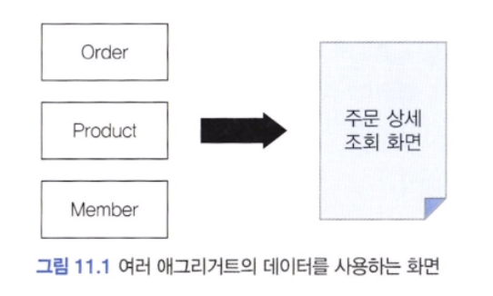
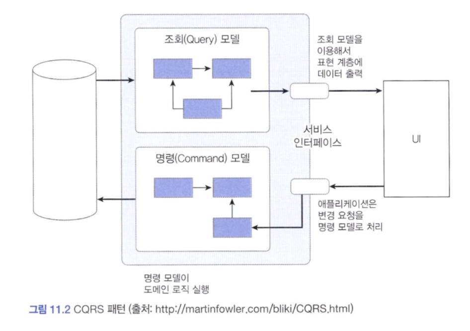
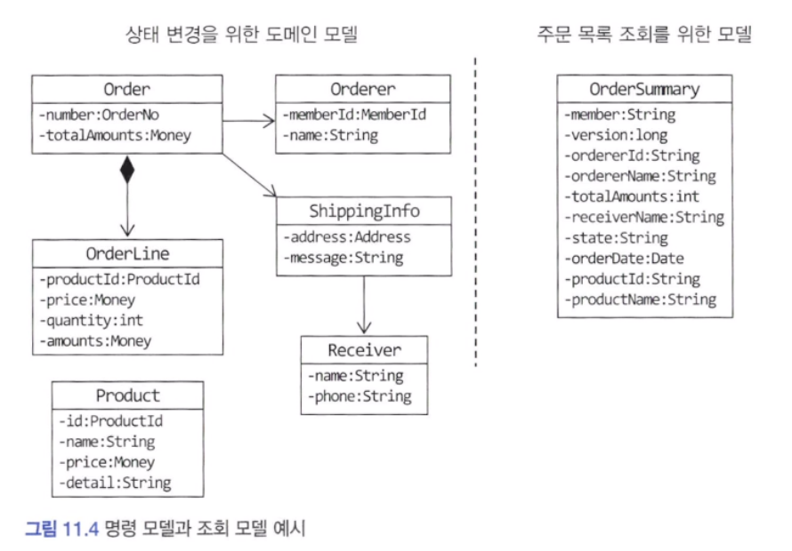
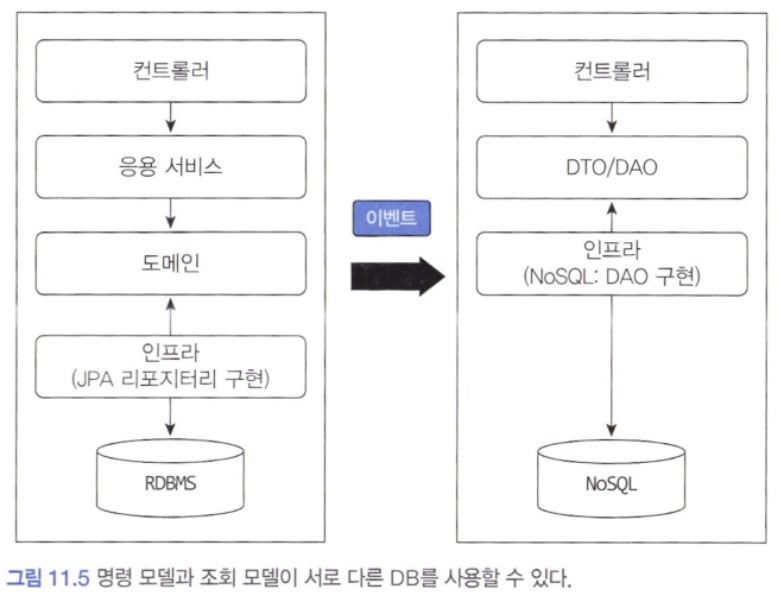
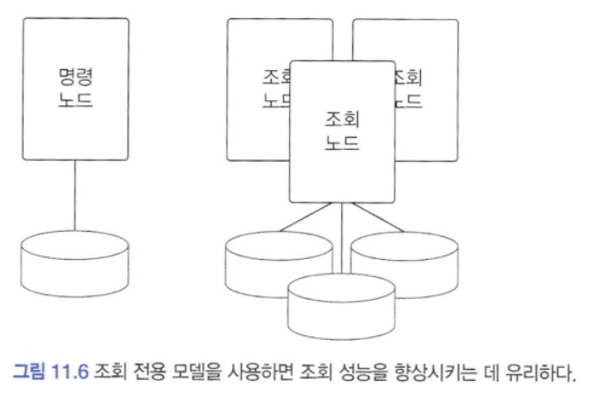

## 단일 모델의 단점

주문 내역 조회 기능을 구현하려면 여러 애그리거트에서 데이터를 가져와야 합니다.

조회 화면 특성상 조회 속도가 빠를수록 좋은데 여러 애그리거트의 데이터가 필요하면 구현 방법을 고민해야 합니다. 3장에서 언급한 식별자를 이용해서 애그리거트를 참조하는 방식을 사용하면 즉시 로딩 방식과 같은 JPA의 쿼리 관련 최적화 기능을 사용할 수 없습니다.

애그리거트 간 연관을 식별자가 아니라 직접 참조하는 방식으로 연결해도 고민거리가 생깁니다. 조회 화면 특성에 따라 같은 연관도 즉시 로딩이나 지연 로딩으로 처리해야 하기 때문입니다.

이런 고민이 발생하는 이유는 시스템 상태를 변경할 때와 조회할 때 단일 도메인 모델을 사용하기 때문입니다. 객체 지향으로 도메인 모델을 구현할 때 주로 사용하는 ORM 기법은 도메인 상태 변경 기능을 구현하는 데는 적합하지만, 주문 조회 화면처럼 여러 애그리거트에서 데이터를 가져와 출력하는 기능을 구현하기에는 고려할 게 많아서 구현을 복잡하게 만드는 원인이 됩니다.

이런 구현 복잡도를 낮추는 간단한 방법이 있는데 그것은 바로 상태 변경을 위한 모델과 조회를 위한 모델을 분리하는 것입니다.

아래 영상을 참고하면 좋을것 같습니다.

[CQRS 최범균](https://www.youtube.com/watch?v=xf0kXMTFJm8)

---

## CQRS

시스템이 제공하는 기능은 크게 두 가지로 나눌 수 있습니다. 하나는 상태를 변경하는 기능입니다. 또 다른 하나는 사용자 입장에서 상태 정보를 조회하는 기능입니다.

도메인 모델 관점에서 상태 변경 기능은 주로 한 애그리거트의 상태를 변경합니다. 상태를 변경하는 범위와 상태를 조회하는 범위가 정확하게 일치하지 않기 때문에 단일 모델로 두 종류의 기능을 구현하면 모델이 불필요하게 복잡해집니다. 단일 모델을 사용할 때 발생하는 복잡도를 해결하기 위해 사요하는 방법이 있는데 바로 CQRS 입니다.

CQRS 는 Command Query Responsibility Segregation의 약자로 상태를 변경하는 명령을 위한 모델과 상태를 제공하는 조회를 위한 모델을 분리하는 패턴입니다.

CQRS는 복잡한 도메인에 적합합니다. 도메인이 복잡할수록 명령 기능과 조회 기능이 다루는 데이터 범위에 차이가 납니다. 이런 도메인에 CQRS를 적용하면 통계를 위한 조회 모델을 별도로 만들기 때문에 조회 기능 때문에 도메인 모델이복잡해지는 것을 막을 수 있습니다.

CQRS를 사용하면 각 모델에 맞는 구현 기술을 선택할 수 있습니다. 명령 모델은 JPA를 사용해서 구현하고, 조회 모델은 마이바티스를 사용해서 구현하면 됩니다.

상태 변경을 위한 명령 모델은 객체를 기반으로 한 도메인 모델을 이용해서 구현합니다. 반면에 조회 모델은 주문 요약 목록을 제공할 때 필요한 정보를 담고 있는 데이터 타입을 이용합니다.

명령 모델은 상태를 변경하는 도메인 로직을 수행하는 데 초점을 맞춰 설계했고, 조회 모델은 화면에 보여줄 데이터를 조회하는 데 초점을 맞춰 설게합니다.

명령 모델과 조회 모델이 같은 구현 기술을 사용할 수도 있습니다. 하이버네이트의 @Subselect를 이용하는 방법을 적용할 수 있습니다.

명령 모델과 조회 모델이 서로 다른 데이터 저장소를 사용할 수도 있습니다. 명령 모델은 트랜잭션을 지원하는 RDBMS를 사용하고, 조회 모델은 조회 성능이 좋은 메모리 기반 NoSQL 을 사용할 수 있습니다.

두 데이터 저장소 간 데이터 동기화는 앞에서 배운 이벤트를 활용해서 처리합니다. 명령 모델에서 상태를 변경하면 이에 해당하는 이벤트가 발생하고, 그 이벤트를 조회 모델에 전달해서 변경 내역을 반영하면 됩니다.

명령 모델과 조회 모델이 서로 다른 데이터 저장소를 사용할 경우 데이터 동기화 시점에 따라 구현 방식이 달라질 수 있습니다. 명령 모델에서 데이터가 바뀌자마자 변경 내역을 바로 조회 모델에 반영해야 한다면 동기 이벤트와 글로벌 트랜잭션을 사용해서 실시간으로 동기화할 수 있습니다. 하지만 이는 성능이 떨어지는 단점이 있습니다.

서로 다른 저장소의 데이터를 특정 시간 안에만 동기화해도 된다면 비동기로 데이터를 전송하면 됩니다.

#### 1) 웹과 CQRS

일반적인 웹 서비스는 상태를 변경하는 요청보다 상태를 조회하는 요청이 많습니다. 포털이나 대형 온라인 쇼핑몰과 같이 조회 기능 요청 비율이 월등히 높은 서비스를 만드는 개발팀은 조회 성능을 높이기 위해 다양한 기법을 사용합니다. 기본적으로 쿼리를 최적화해서 쿼리 실행 속도 자체를 높이고, 메모리에 조회 데이터를 캐싱 해서 응답 속도를 높이기도 합니다. 조회 전용 저장소를 따로 사용하기도 합니다.

이렇게 조회 성능을 높이기 위해 다양한 기법을 사용하는 것은 결과적으로 CQRS를 적용하는 것과 같은 효과를 만듭니다. 메모리에 캐싱 하는 데이터는 DB에 보관된 데이터를 그대로 저장하기보다는 화면에 맞는 모양으로 변환한 데이터를 캐싱 할 때 더 유리합니다. 즉, 조회 전용 모델을 캐시 하는 것입니다. 비슷하게 조회 속도를 높이기 위해 쿼리를 최적화한다는 것은 조회 화면에 보여줄 데이터를 빠르게 읽어올 수 있도록 쿼리를 작성하는 것입니다.

대규모 트래픽이 발생하는 웹 서비스는 알게 모르게 CQRS를 적용하게 됩니다. 단지 명시적으로 명령 모델과 조회 모델을 구분하지 않을 뿐입니다. 조회 속돌르 높이기 위해 별도 처리를 하고 있다면 명시적으로 명령 모델과 조회 모델을 구분하는게 좋습니다.

#### 2) CQRS 장단점

CQRS 패턴을 적용할 때 얻을 수 있는 장점은 명령 모델을 구현할 때 도메인 자체에 집중할 수 있다는 점입니다. 또 다른 장점은 조회 성능을 향상시키는 데 유리하다는 점입니다. 조회 단위로 캐시 기술을 적용할 수 있고, 조회에 특화된 쿼리를 마음대로 사용할 수도 있습니다.

물론 단점도 있습니다. 첫 번째 단점은 구현해야 할 코드가 더 많다는 점입니다. 단일 모델을 사용할 때 발생하는 복잡함 때문에 발생하는 구현 비용과 조회 전용 모델을 만들 때 발생하는 구현 비용을 따져봐야 합니다. 도메인이 복잡하거나 대규모 트래픽이 발생하는 서비스라면 조회 전용 모델을 만드는 것이 향후 유지 보수에 유리합니다. 반면에 도메인이 단순하거나 트래픽이 많지 않은 서비스라면 조회 전용 모델을 따로 만들 때 얻을 이점이 있는지 따져봐야 합니다.

두 번째 단점은 더 많은 구현 기술이 필요하다는 것입니다. 명령 모델과 조회 모델을 다른 구현 기술을 사용해서 구현하기도 하고 경우에 따라 다른 저장소를 사용하기도 합니다. 또한 데이터 동기화를 위해 메시징 시스템을 도입해야 할 수도 있습니다.

이러한 장단점을 고려해서 CQRS 패턴을 도입할지 여부를 결정해야 합니다. 도메인이 복잡하지 않은데 CQRS를 도입하면 두 모델을 유지하는 비용만 높아지고 얻을 수 있는 이점은 없습니다. 반면에 트래픽이 높은 서비스인데 단일 모델을 고집하면 유지 보수 비용이 오히려 높아질 수 있으므로 CQRS 도입을 고려해야 합니다.
