## 네 개의 영역

'표현', 응용', 도메인', '인프라스트럭처'는 아키텍처를 설계할 때 출현하는 전형적인 네 가지 영역입니다. 

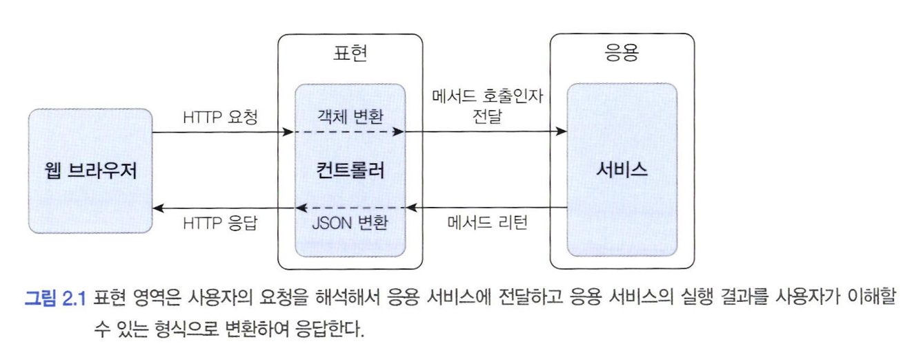

웹 애플리케이션의 표현 영역은 HTTP 요청을 응용 영역이 필요로 하는 형식으로 변환해서 응용 영역에 전달하고 응용 영역의 응답을 HTTP  응답으로 변환하여 전송합니다.

표현 영역을 통해 사용자의 요청을 전달받은 응용 영역은 시스템이 사용자에게 제공해야 할 기능을 구현하는데 '주문 등록', '주문 취소', '상품 상세 조회'와 같은 기능 구현을 예로 들 수 있다.
응용 서비스는 로직을 직접 수행하기보다는 도메인 모델에 로직 수행을 위임합니다. 아래 코드도 주문 취소 로직을 직접 구현하지 않고 Order 객체에 취소 처리를 위임하고 있습니다.

```java
public class CancelOrderService {

	@Transactional
	public void cancelOrder(String orderId) {
		Order order = findOrderById(orderId);
		if (order == null) {
			throw new OrderNotFoundException(orderId);
		}
		order.cancel();
	}
}
```


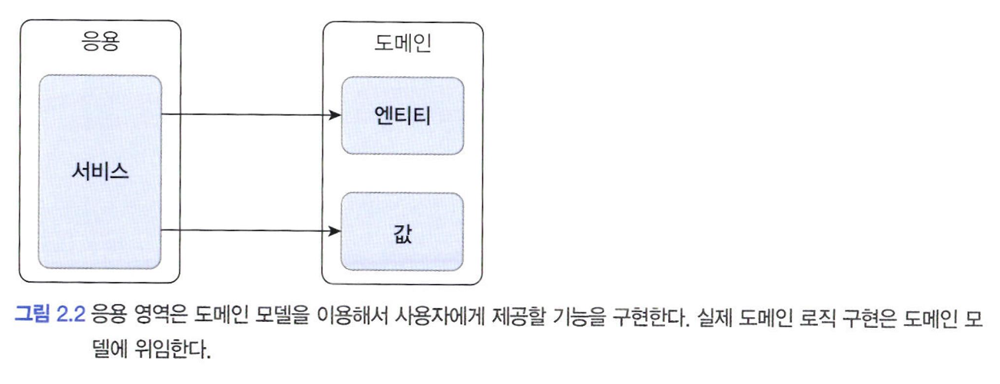

도메인 영역은 도메인 모델을 구현합니다. 도메인 모델은 도메인의 핵심 로직을 구현합니다.

인프라스트럭처 영역은 구현 기술에 대한 것을 다룹니다. 즉, 인프라스트럭처 영역은 논리적인 개념을 표현하기 보다는 실제 구현을 다룹니다.

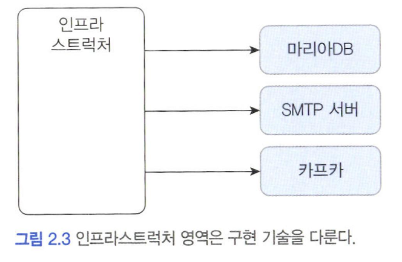


도메인 영역, 응용 영역, 표현 영역은 구현 기술을 사용한 코드를 직접 만들지 않습니다. 대신 인프라스트럭처 영역에서 제공하는 기술을 사용해서 필요한 기능을 개발합니다. 예를 들어 응용 영역에서 DB에 보관된 데이터가 필요하면 인프라스트럭처 영역의 DB 모듈을 사용하여 데이터를 읽어옵니다. 비슷하게 외부에 메일을 발송해야 한다면 인프라스트럭처가 제공하는 SMTP 연동 모듈을 이용해서 메일을 발송합니다.


---

## 계층 구조 아키텍처

표현 영역과 응용 영역은 도메인 영역을 사용하고, 도메인 영역은 인프라스트럭처 영역을 사용하므로 계층 구조를 적용하기에 적당해 보입니다. 도메인의 복잡도에 따라 응용과 도메인을 분리하기도 하고 한 계층으로 합치기도 합니다. 그럼에도 전체적인 아키텍처는 계층 구조를 따릅니다.

계층 구조는 그 특성상 상위 계층에서 하위 계층으로의 의존만 존재하고 하위 계층은 상위 계층에 의존하지 않습니다. 계층 구조를 엄격하게 적용한다면 상위 계층은 바로 아래의 계층에만 의존을 가져야 하지만 구현의 편리함을 위해 계층 구조를 유연하게 적용하기도 합니다.

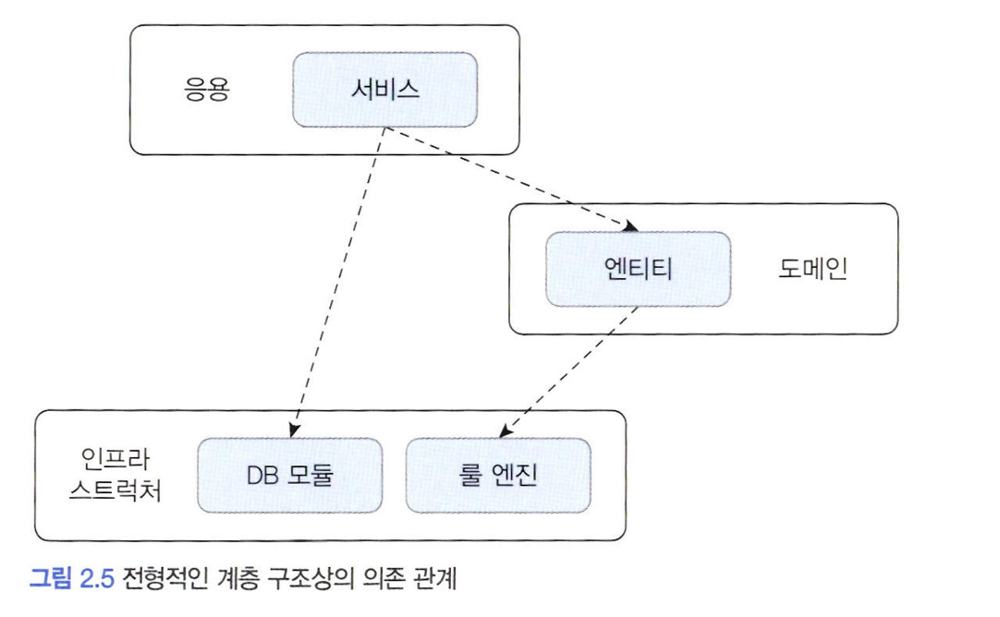


응용 영역과 도메인 영역은 DB나 외부 시스템 연동을 위해 인프라스트럭처의 기능을 사용하므로 이런 계층 구조를 사용하는 것은 직관적으로 이해하기 쉽습니다. 하지만 짚고 넘어가야 할 것이 있습니다. <span style="color:#ff0000">바로 표현, 응용, 도메인 계층이 상세한 구현 기술을 다루는 인프라스트럭처 계층에 종속된다는 것입니다.</span>

이렇게 직접적으로 응용계층이 인프라스트럭처 계층에 종속되게 된다면 2가지 문제가 있습니다. 아래 예시 코드를 통해 살펴보겠습니다.

```java
public class CalculateDiscountService {
	private DroolsRuleEngine ruleEngine;

	public CalculateDiscountService() {
		ruleEngine = new DroolsRuleEngine;
	}

	public Money calculatteDiscount(List<OrderList> orderLines, String customerId) {
		Customer customer = findCustomer(customerId);

		MutableMoney moeny = new MutableMoney(0);
		List<?> facts = Arrays.asList(customer, money);
		facts.addAll(orderLines);
		ruleEngine.evaluate("discountCalculation", facts);
		return money.toImutableMoney();
	}
}
```


위 코드는 첫 번째로 CalculateDiscountService만 테스트하기 어렵다는 문제가 있습니다. 해당 클래스를 테스트하려면 RuleEngine이 완벽하게 동작해야 합니다.

두 번째 문제는 구현 방식을 변경하기 어렵다는 점입니다. discountCalculation 문자열은 Drools의 세션 이름을 의미합니다. MutableMoney는 Drools 룰 적용을 위한 타입입니다. 즉, 다른 룰엔진을 사용한다면 필요 없는 타입입니다.

이처럼 CaluclateDiscountService가 겉으로는 인프라스트럭처의 기술에 직접적인 의존을 하지 않는 것처럼 보여도 실제로는 Drools 라는 인프라스트럭처 영역의 기술에 완전하게 의존하고 있습니다. 이런 상황에서 Drools가 아닌 다른 구현 기술을 사용하려면 코드의 많은 부분을 고쳐야 합니다.

> 인프라스트럭처에 의존하면 '테스트 어려움'과 '기능 확장의 어려움'이라는 두 가지 문제가 발생하는 것을 알 수 있습니다. 이러한 문제를 해결하는 방법이 DIP 입니다.


---

## DIP

가격 할이 계산을 하려면 아래 그림과 같이 고객 정보를 구해야 하고, 구한 고객 정보와 주문 정보를 이용해서 룰을 실행해야 합니다.

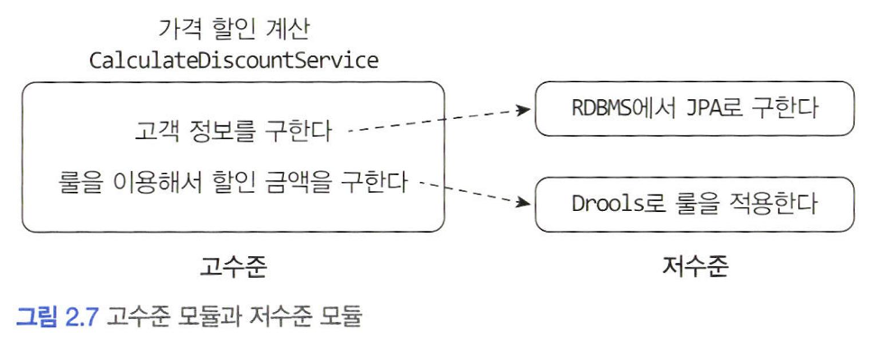


여기서 CalculateDiscountService는 고수준 모듈입니다. <span style="color:#ff0000">고수준 모듈</span>은 의미 있는 단일 기능을 제공하는 모듈로 CalculateDiscountService 는 가격 할인 계산이라는 기능을 구현합니다. 

고수준 모듈의 기능을 구현하려면 여러 하위 기능이 필요합니다. 가격 할인 계산 기능을 구현하려면 고객 정보를 구해야 하고 룰을 실행해야 하는데 이 두 기능이 하위 기능입니다. <span style="color:#ff0000">저수준 모듈</span>은 하위 기능을 실제로 구현한 것입니다.

고수준 모듈이 제대로 동작하려면 저수준 모듈을 사용해야 합니다. 그런데 고수준 모듈이 저수준 모듈을 사용하려면 앞서 계층 구조 아키텍처에서 언급했던 두 가지 문제, 즉 구현 변경과 테스트가 어렵다는 문제가 발생합니다.


<span style="color:#ff0000">DIP</span>는 이 문제를 해결하기 위해 저수준 모듈이 고수준 모듈에 의존하도록 바꿉니다. 고수준 모듈을 구현하려면 저수준 모듈을 사용해야 하는데, 반대로 저수준 모듈이 고수준 모듈에 의존하도록 하려면 어떻게 할까요? 비밀은 <span style="color:#ff0000">추상화한 인터페이스</span>에 있습니다.

CalculateDiscountService 입장에서 봤을 때 룰 적용을 Drools로 구현했는지 자바로 구현했는지는 중요하지 않습니다. 고객 정보와 구매 정보에 룰을 적용해서 할인 금액을 구한다라는 점만 중요할 뿐입니다.

이를 추상화한 인터페이스는 다음과 같습니다.

```java
public interface RuleDiscounter {
	Money applyRules(Customer customer, List<OrderLine> orderLines);
}
```

위 인터페이스를 사용하게 되면 CalculateDiscountService에는 Drools에 의존하는 코드가 없습니다. 단지 RuleDiscount가 룰을 적용한다는 사실만 알뿐입니다.

룰 적용을 구현한 클래스는 Rulediscounter 인터페이스를 상속받아 구현합니다. 이를 통해 아키텍처 구조가 바뀐것을 알 수 있습니다.

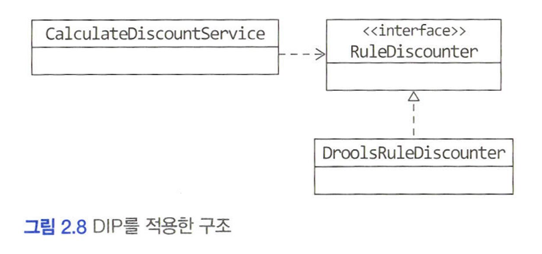

'룰을 이용한 할인 금액 계산'을 추상화한 RuleDiscounter 인터페이스에 의존할 뿐입니다. '룰을 이용한 할인 금액 계산'은 고수준 모듈의 개념이므로 RuleDiscounter 인터페이스는 고수준 모듈에 속합니다. DroolsRuleDiscounter는 고수준의 하위 기능인 RuleDiscounter를 구현한 것이므로 저수준 모듈에 속합니다.


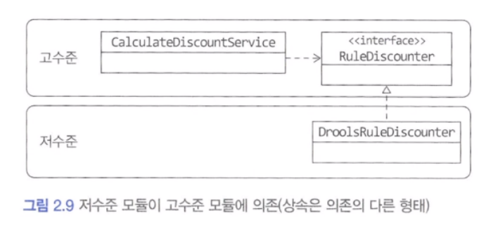

DIP를 적용하면 위 그림과 같이 저수준 모듈이 고수준 모듈에 의존하게 됩니다. 고수준 모듈이 저수준 모듈을 사용하려면 고수준 모듈이 저수준 모듈에 의존해야 하는데, 반대로 저수준 모듈이 고수준 모듈에 의존한다고 해서 이를 <span style="color:#ff0000">DIP(Dependency Inversion Principle) 의존 역전 원칙</span>이라고 부릅니다.

DIP를 적용하면 앞의 다른 영역이 인프라스트럭처 영역에 의존할 때 발생했던 두 가지 문제인 구현 교체가 어렵다는 것과 테스트가 어려운 문제를 해소할 수 있습니다.

먼저 구현 기술의 문제는 실제 사용할 저수준 구현 객체를 의존 주입을 이용해서 전달받도록 할 수 있습니다. 이때 스프링과 같은 의존 주입을 지원하는 프레임워크를 사용하면 설정 코드를 수정해서 쉽게 구현체를 변경할 수 있습니다.

테스트의 경우에도 RuleDiscounter 라는 인터페이스의 대역 객체를 사용해서 테스트를 진행할 수 있습니다.

#### 1) DIP 주의 사항

DIP를 잘못 생각하면 단순히 인터페이스와 구현 클래스를 분리하는 정도로 받아들일 수 있습니다. DIP의 핵심은 고수준 모듈이 저수준 모듈에 의존하지 않도록 하기 위함인데, DIP를 적용한 결과 구조만 보고 아래 그림처럼 저수준 모듈에서 인터페이스를 추출하는 경우가 있을 수 있습니다.

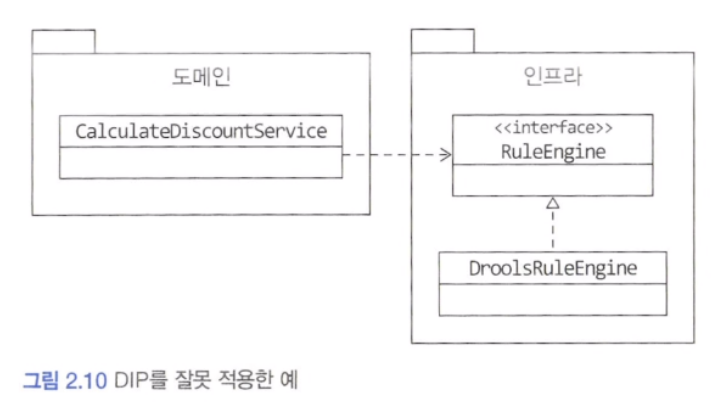


위 구조에서 도메인 영역은 구현 기술을 다루는 인프라스트럭처 영역에 의존하고 있습니다. 여전히 고수준 모듈이 저수준 모듈에 의존하고 있는 것입니다. RuleEngine 인터페이스는 고수준 모듈이 도메인 관점이 아니라 룰 엔진이라는 저수준 모듈 관점에서 도출한 것입니다.

> DIP를 적용할 때 하위 기능을 추상화한 인터페이스는 고수준 모듈 관점에서 도출해야 합니다. 즉, 할인 금액 계산을 추상화한 인터페이스는 저수준 모듈이 아닌 고수준 모듈에 위치합니다.


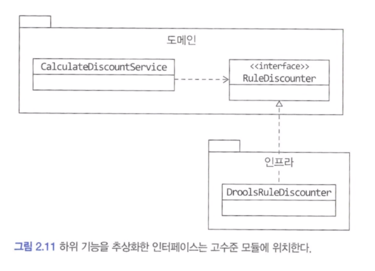


#### 2) DIP와 아키텍처

인프라스트럭처 영역은 구현 기술을 다루는 저수준 모듈이고 응용 영역과 도메인 영역은 고수준 모듈입니다. 인프라스트럭처 계층이 가장 하단에 위치하는 계층형 구조와 달리 아키텍처에 DIP를 적용하면 아래 그림과 같이 인프라스트퍽처 영역이 응용 영역과 도메인 영역에 의존하는 구조가 됩니다.

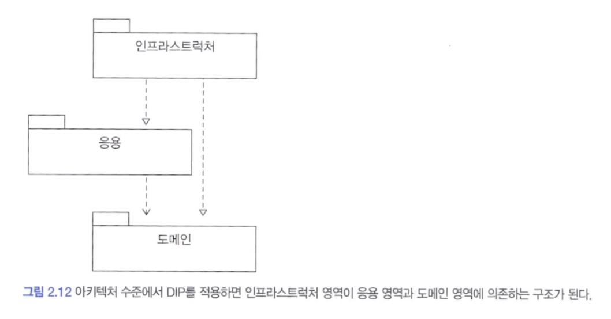


인프라스트럭처에 위치한 클래스가 도메인이나 응용 영역에 정의한 인터페이스를 상속받아 구현하는 구조가 되므로 도메인과 응용 영역에 대한 영향을 주지 않거나 최소화하면서 구현 기술을 변경하는 것이 가능합니다.

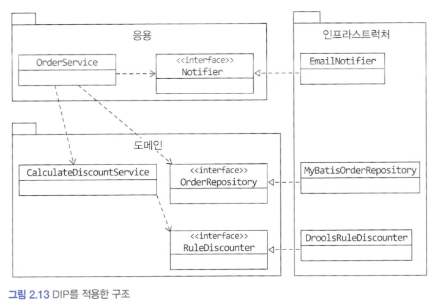


위 그림에서 주문 시 통지 방식에 SMS를 추가해야 한다는 요구사항이 들어온 경우 OrderService는 변경할 필요가 없다. 단지 두 통지 방식을 함께 제공하는 Notifier 구현 클래스를 인프라스트럭처 영역에 추가하면 됩니다.

>DIP를 항상 적용할 필요는 없습니다. 사용하는 구현 기술에 따라 완벽한 DIP를 적용하기보다는 구현 기술에 의존적인 코드를 도메인에 일부 포함하는 게 효과적일 때도 있습니다. 또는 추상화 대상이 잘 떠오르지 않을 때도 있습니다. 이럴 대는 무조건 DIP를 적용하려고 시도하지 말고 DIP의 이점을 얻는 수준에서 적용 범위를 검토해 봅시다.


---

## 도메인 영역의 주요 구성요소

앞에서 네 영역에 대해 설명하면서 도메인 영역은 도메인의 핵심 모델을 구현한다고 설명했습니다. 도메인 영역의 모델은 도메인의 주요 개념을 표현하며 핵심 로직을 구현합니다. 엔티티와 밸류 타입은 도메인 영역의 주요 구성요소입니다.

| 요소                            | 설명                                                                                                                                          |
| ------------------------- | ------------------------------------------------------------------------------------------------------------------------------------------- |
| 엔티티<br>Entity                | 고유의 식별자를 갖는 객체로 자신의 라이프 사이클을 갖습니다. 주문, 회원, 상품과 같이 도메인의 고유한 개념을 표현합니다. 도메인 모델의 데이터를 포함하며 해당 데이터와 관련된  기능을 함께 제공합니다.                          |
| 벨류<br>Value                   | 고유의 식별자를 갖지 않는 객체로 주로 개념적으로 하나인 값을 표현할 때 사용됩니다. 엔티티의 속성으로 사용할 뿐만 아니라 다른 밸류 타입의 속성으로도 사용할 수 있습니다.                                            |
| 애그리거트<br>Aggregate         | 애그리거트는 연관된 엔티티와 밸류 객체를 개념적으로 하나로 묶은 것입니다. 예를 들어 주문과 관련된 Order 엔티티, OrderLine 밸류, Orderer 밸류 객체를 '주문' 애그리거트로 묶을 수 있습니다.                      |
| 리포지터리<br>Repository        | 도메인 모델의 영속성을 처리합니다. 예를 들어 DBMS 테이블에서 엔티티 객체를 로딩하거나 저장하는 기능을 제공합니다.                                                                          |
| 도메인 서비스<br>Domain Service | 특정 엔티티에 속하지 않은 도메인 로직을 제공합니다. '할인 금액 계산'은 상품, 쿠폰, 회원 등급, 구매 금액 등 다양한 조건을 이용해서 구현하게 되는데, 이렇게 도메인 로직이 여러 엔티티와 밸류를 필요로 하면 도메인 서비스에서 로직을 구현합니다. |
#### 1) 엔티티와 밸류

필자는 개발 초년 시절 도메인 모델을 만들 때 DB 테이블의 엔티티와 도메인 모델의 엔티티를 구분하지 못해 동일하게 만들곤 했습니다. 경험이 쌓일수록 도메인 모델에 대한 이해도 높아지면서 실제 도메인 모델의 엔티티와 DB 관계형 모델의 엔티티는 같은 것이 아님을 알게 되었습니다.

이 두 모델의 가장 큰 차이점은 도메인 모델의 엔티티는 데이터와 함께 도메인 기능을 함께 제공한다는 점입니다.

도메인 모델의 엔티티는 단순히 데이터를 담고 있는 데이터 구조라기보다는 데이터와 함께 기능을 제공하는 객체입니다. 도메인 관점에서 기능을 구현하고 기능 구현을 캡슐화해서 데이터가 임의로 변경되는 것을 막습니다.

또 다른 차이점은 도메인 모델의 엔티티는 두 개 이상의 데이터가 개념적으로 하나인 경우 밸류 타입을 이용해서 표현할 수 있다는 것입니다.

밸류는 불변으로 구현할 것을 권장하며, 이는 엔티티의 밸류 타입 데이터를 변경할 때는 객체 자체를 완전히 교체한다는 것을 의미합니다.

#### 2) 애그리거트

도메인이 커질수록 개발할 도메인 모델도 커지면서 많은 엔티티와 밸류가 출현합니다. 엔티티와 밸류 개수가 많아질수록 모델은 점점 더 복잡해집니다.

도메인 모델이 복잡해지면 개발자가 전체 구조가 아닌 한 개 엔티티와 밸류에만 집중하는 상황이 발생합니다. 이때 상위 수준에서 모델을 관리하지 않고 개별 요소에만 초점을 맞추다 보면, 큰 수준에서 모델을 이해하지 못해 큰 틀에서 모델을 관리할 수 없는 상황에 빠질 수 있습니다.

도메인 모델은 개별 객체뿐만 아니라 상위 수준에서 모델을 볼 수 있어야 전체 모델의 관계와 개별 모델을 이해하는 데 도움이 됩니다. 도메인 모델에서 전체 구조를 이해하는 데 도움이 되는 것이 바로 <span style="color:#ff0000">애그리거트</span> 입니다.

애그리거트는 관련 객체를 하나로 묶은 군집입니다. 애그리거트의 대표적인 예가 주문입니다. 주문이라는 도메인 개념은 주문, 배송지 정보, 주문자, 주문 목록, 총 결제 금액의 하위 모델로 구성됩니다. 이 하위 개념을 표현한 모델을 하나로 묶어서 주문이라는 상위 개념으로 표현할 수 있습니다.

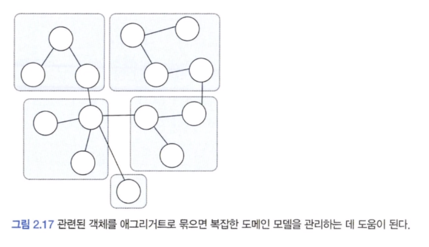

애그리거트를 사용하면 개별 객체가 아닌 관련 객체를 묶어서 객체 군집 단위로 모델을 바라볼 수 있게 됩니다. 개별 객체 간의 관계가 아닌 애그리거트 간의 관계로 도메인 모델을 이해하고 구현하게 되며, 이를 통해 큰 틀에서 도메인 모델을 관리할 수 있습니다.

애그리거트는 군집에 속한 객체를 관리하는 <span style="color:#ff0000">루트 엔티티</span>를 갖습니다. 루트 엔티티는 애그리거트에 속해 있는 엔티티와 밸류 객체를 이용해서 애그리거트가 구현해야 할 기능을 제공합니다. 애그리거트를 사용하는 코드는 애그리거트 루트가 제공하는 기능을 실행하고 애그리거트 루트를 통해서 간접적으로 애그리거트 내의 다른 엔티티나 밸류 객체에 접근합니다. 이것은 애그리거트의 내부 구현을 숨겨서 애그리거트 단위로 구현을 캡슐화할 수 있도록 돕습니다.

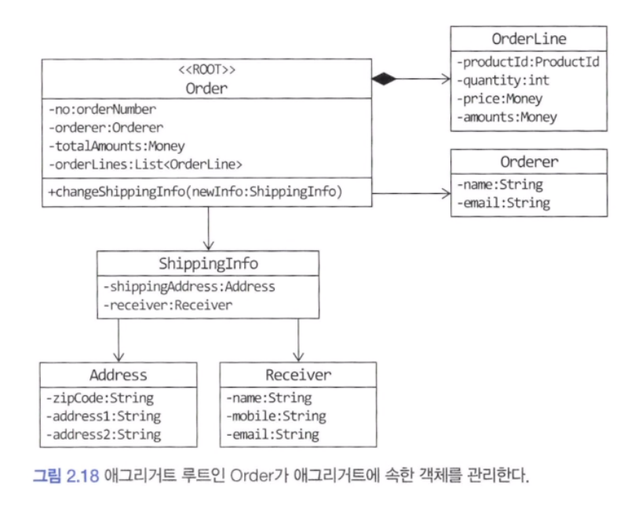

위 그림에서 애그리거트 루트인 Order는 주문 도메인 로직에 맞게 애그리거트의 상태를 관리합니다. 주문 애그리거트는 Order를 통하지 않고 ShippingInfo를 변경할 수 있는 방법을 제공하지 않습니다. 즉, 배송지를 변경하려면 루트 엔티티인 Order를 사용해야 하므로 배송지 정보를 변경할 때에는 Order가 구현한 도메인 로직을 항상 따르게 됩니다.

애그리거트를 구현할 때는 고려할 것이 많습니다. 애그리거트를 어떻게 구성했느냐에 따라 구현이 복잡해지기도 하고, 트랜잭션 범위가 달라지기도 합니다. 또한 선택한 구현 기술에 따라 애그리거트 구현에 제약이 생기기도 합니다.

#### 3) 리포지터리

도메인 객체를 지속적으로 사용하려면 RDBMS, NoSQL, 로컬 파일과 같은 물리적인 저장소에 도메인 객체를 보관해야 합니다. 이를 위한 도메인 모델이 리포지터리입니다. 엔티티나 밸류가 요구사항에서 도출되는 도메인 모델이라면 리포지터리는 구현을 위한 도메인 모델입니다.

리포지터리는 애그리거트 단위로 도메인 객체를 저장하고 조회하는 기능을 정의합니다. 예를 들어 주문 애그리거트를 위한 리포지터리는 다음과 같이 정의할 수 있습니다.

```java
public interface OrderRepository {
	Order findByNumber(OrderNumber number);
	void save(Order order);
	void delete(Order order);
}
```

OrderRepository 의 메서드를 보면 대상을 찾고 저장하는 단위가 애그리거트 루트인 Order인 것을 알 수 있습니다. Order는 애그리거트에 속한 모든 객체를 포함하고 잇으므로 결과적으로 애그리거트 단위로 저장하고 조회합니다.

도메인 모델을 사용해야 하는 코드는 리포지터리를 통해서 도메인 객체를 구한 뒤에 도메인 객체의 기능을 실행합니다.

```java
public class CancelOrderService {
	private OrderRepository orderRepository;

	public void cancel(OrderNumber number) {
		Order order = orderRepository.findByNumber(number);
		if (order == null) {
			throw new NoOrderException(number);
		}
		order.cancel();
	}
}
```

> 도메인 모델 관점에서 OrderRepository는 도메인 객체를 영속화하는 데 필요한 기능을 추상화한 것으로 고수준 모듈에 속합니다.


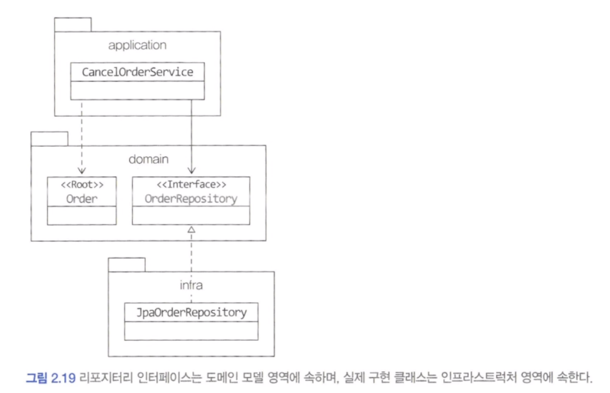


응용 서비스는 의존 주입과 같은 방식을 사용해서 실제 리포지터리 구현 객체에 접근합니다. 응용 서비스와 리포지터리는 밀접한 연관이 있습니다.

- 응용 서비스는 필요한 도메인 객체를 구하거나 저장할 때 리포지터리를 사용합니다.
- 응용 서비스는 트랜잭션을 관리하는데, 트랜잭션 처리는 리포지터리 구현 기술의 영향을 받습니다.

리포지터리를 사용하는 주체가 응용 서비스이기 때문에 리포지터리는 응용 서비스가 필요로 하는 메서드를 제공합니다. 다음 두 메서드가 기본이 됩니다.

- 애그리거트를 저장하는 메서드
- 애그리거트 루트 식별자로 애그리거트를 조회하는 메서드

> 이 외에 필요에 따라 delete(id)나 counts() 등의 메서드를 제공하기도 합니다.


---

## 요청 처리 흐름

사용자 입장에서 봤을 때 웹 애플리케이션이나 데스크톱 애플리케이션과 같은 소프트웨어는 기능을 제공합니다. 사용자가 애플리케이션에 기능 실행을 요청하면 그 요청을 처음 받는 영역은 표현 영역입니다.

표현 영역은 사용자가 전송한 데이터 형식이 올바른지 검사하고 문제가 없다면 데이터를 이용해서 응용 서비스에 기능 실행을 위임합니다. 이때 표현 영역은 사용자가 전송한 데이터를 응용 서비스가 요구하는 형식으로 변환해서 전달합니다.

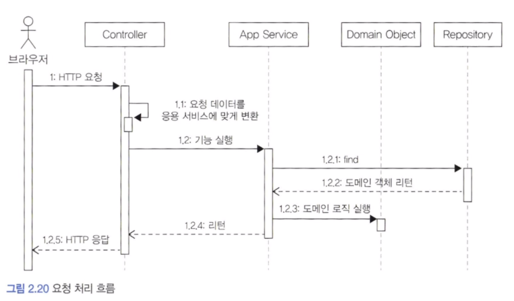

응용 서비스는 도메인 모델을 이용해서 기능을 구현합니다. 기능 구현에 필요한 도메인 객체를 리포지터리에서 가져와 실행하거나 신규 도메인 객체를 생성해서 리포지터리에 저장합니다. 두 개 이상의 도메인 객체를 사용해서 구현하기도 합니다.

예매하기나 예매 취소와 같은 기능을 제공하는 응용 서비스는 도메인의 상태를 변경하므로 변경 상태가 물리 저장소에 올바르게 반영되도록 트랜잭션을 관리해야 합니다.


---

## 인프라스트럭처 개요

인프라스트럭처는 표현 영역, 응용 영역, 도메인 영역을 지원합니다. DIP에서 언급한 것처럼 도메인 영역과 응용 영역에서 인프라스트럭처의 기능을 직접 사용하는 것보다 이 두 영역에 정의한 인터페이스를 인프라스트럭처 영역에서 구현하는 것이 시스템을 더 유연하고 테스트하기 쉽게 만들어줍니다.

> 하지만 무조건 인프라스트럭처에 대한 의존을 없앨 필요는 없습니다.

예를 들어 스프링을 사용할 경우 응용 서비스는 트랜잭션 처리를 위해 스프링이 제공하는 @Transactional 을 사용하는 것이 편리합니다.

구현의 편리함은 DIP가 주는 다른 장점(변경의 유연함, 테스트가 쉬움)만큼 중요하기 때문에 DIP의 장점을 해치지 않는 범위에서 응용 영역과 도메인 영역에서 구현 기술에 대한 의존을 가져가는 것이 나쁘지 않다고 생각합니다. 응용 영역과 도메인 영역이 인프라스트럭처에 대한 의존을 완전히 갖지 않도록 시도하는 것은 자칫 구현을 더 복잡하고 어렵게 만들 수 있습니다.

표현 영역은 항상 인프라스트럭처 영역과 쌍을 이룹니다.


---

## 모듈 구성

아키텍처의 각 영역은 별도 패키지에 위치합니다. 패키지 구성 규칙에 정답이 존재하는 것은 아니지만 아래 그림과 같이 영역별로 모듈이 위치할 패키지를 구성할 수 있을 것입니다.

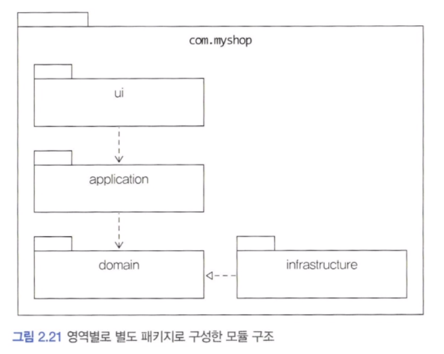


도메인이 크다면 아래 그림과 같이 하위 도메인으로 나누고 각 하위 도메인마다 별도 패키지를 구성합니다.

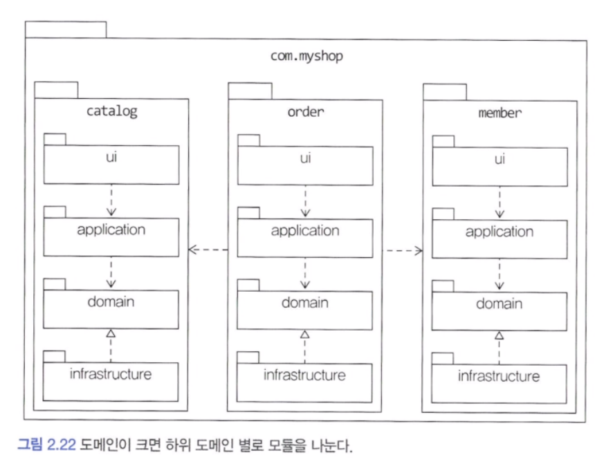


도메인 모듈은 도메인에 속한 애그리거트를 기준으로 다시 패키지를 구성합니다. 예를 들어 카탈로그 하위 도메인이 상품 애그리거트와 카테고리 애그리거트로 구성될 경우 아래 그림과 같이 도메인을 두 개의 하위 패키지로 구성할 수 있습니다.

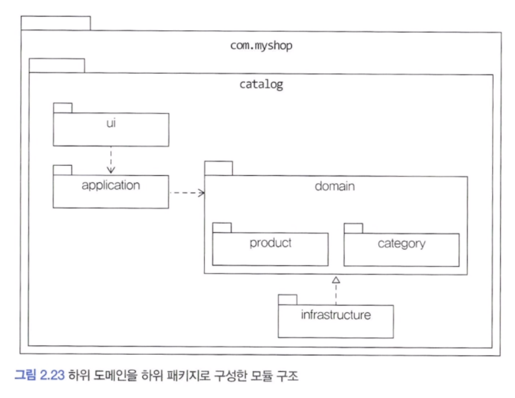


애그리거트, 모델, 리포지터리는 같은 패키지에 위치시킵니다. 예를 들어 주문과 관련된 Order, OrderLIne, Orderer, OrderRepository 등은 com.myshop.order.domain 패키지에 위치시킵니다.

도메인이 복잡하면 도메인 모델과 도메인 서비스를 다음과 같이 별도 패키지에 위치시킬 수도 있습니다.

- com.myshop.order.domain.order : 애그리거트 위치
- com.myshop.order.domain.service : 도메인 서비스 위치

응용 서비스도 다음과 같이 도메인 별로 패키지를 구분할 수 있습니다.

- com.myshop.catalog.application.product
- com.myshop.catalog.application.category

모듈 구조를 얼마나 세분화해야 하는지에 대해 정해진 규칙은 없습니다. 한 패키지에 너무 많은 타입이 몰려서 코드를 찾을 때 불편한 정도만 아니면 됩니다. 

> 저자의 견해는 한 패키지에 가능하면 10 ~ 15개 미만으로 타입 개수를 유지하려고 노력합니다. 이 개수가 넘어가면 패키지를 분리하는 시도를 합니다.


