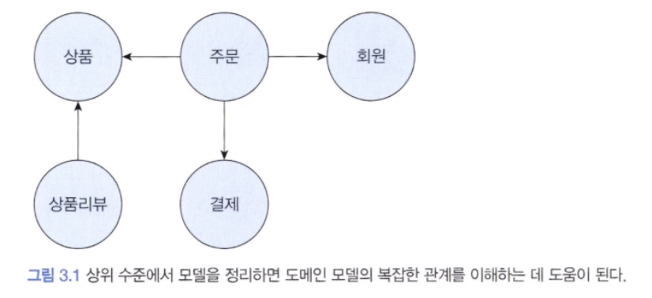
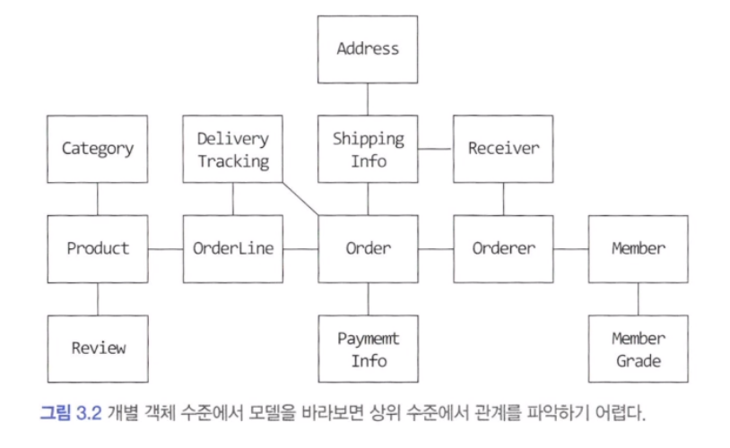
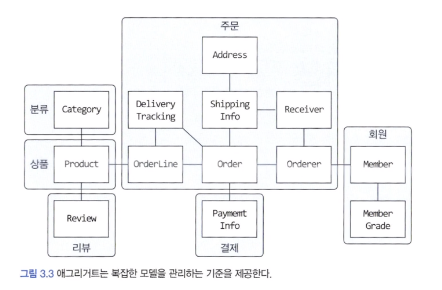
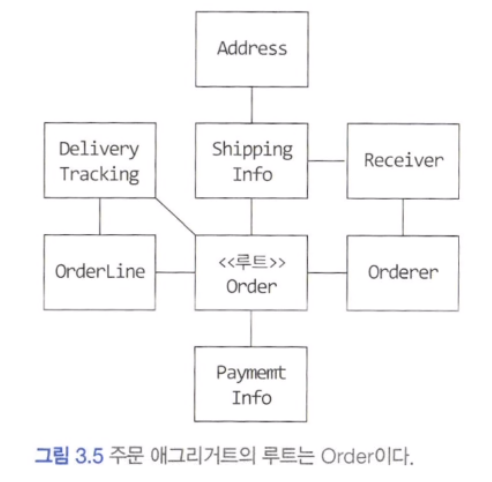

## 애그리거트

온라인 쇼핑몰 시스템을 개발할 때 아래 그림과 같이 상위 수준 개념을 이용해서 전체 모델을 정리하면 전반적인 관계를 이해하는 데 도움이 됩니다. 그림을 보면 주문은 회원, 상품, 결제와 관련이 있다는 것을 쉽게 파악할 수 있습니다.



위 그림을 개별 객체 단위로 그려보면 아래 그림과 같습니다. 상위 모델에 대한 이해 없이 개별 객체만 본다면 시간이 더 오래 걸리게 됩니다. 많은 코드를 보고 도메인 전문가와 더 많은 대화를 나눠야 비로소 상위 수준에서 모델 간의 관계가 이해되기 시작합니다.




도메인 객체 모델이 복잡해지면 개별 구성요소 위주로 모델을 이해하게 되고 전반적인 구조나 큰 수준에서 도메인 간의 관계를 파악하기 어려워집니다.

주요 도메인 요소 간의 관계를 파악하기 어렵다는 것은 코드를 변경하고 확장하는 것이 어려워진다는 것을 의미합니다. 복잡한 도메인을 이해하고 관리하기 쉬운 단위로 만들려면 상위 수준에서 모델을 조망할 수 있는 방법이 필요한데, 그 방법이 바로 <span style="color:#ff0000">애그리거트</span>입니다. 수많은 객체를 애그리거트로 묶어서 바라보면 상위 수준에서 도메인 모델 간의 관계를 파악할 수 있습니다.


아래 그림은 위 그림의 모델을 애그리거트 단위로 묶어서 다시 표현한 것입니다.



애그리거트는 모델을 이해하는 데 도움을 줄 뿐만 아니라 일관성을 관리하는 기준도 됩니다. 모델을 보다 잘 이해할 수 있고 애그리거트 단위로 일관성을 관리하기 때문에, 애그리거트는 복잡한 도메인을 단순한 구조로 만들어줍니다. 복잡도가 낮아지는 만큼 도메인 기능을 확장하고 변경하는 데 필요한 노력(개발 시간)도 줄어듭니다.

애그리거트는 관련된 모델을 하나로 모았기 때문에 한 애그리거트에 속한 객체는 유사하거나 동일한 라이프 사이클을 갖습니다. 위 그림을 통해 볼 수 있듯이 애그리거트는 경계를 갖습니다. 한 애그리거트에 속한 객체는 다른 애그리거트에 속하지 않습니다. 애그리거트는 독립된 객체 군이며 각 애그리거트는 자기 자신을 관리할 뿐 다른 애그리거트를 관리하지 않습니다.

경계를 설정할 때 기본이 되는 것은 도메인 규칙과 요구사항입니다. 도메인 규칙에 따라 함께 생성되는 구성요소는 한 애그리거트에 속할 가능성이 높습니다.

흔히 A가 B를 갖는다로 설계할 수 있는 요구사항이 있다면 A와 B를 한 애그리거트로 묶어서 생각하기 쉽습니다. 하지만 'A가 B를 갖는다'로 해석할 수 있는 요구사항이 있다고 하더라도 이것이 반드시 A와 B가 한 애그리거트에 속한다는 것을 의미하는 것은 아닙니다.

좋은 예가 상품과 리뷰입니다. 상품 상세 페이지에 리뷰 내용을 보여줘야 한다는 요구사항이 있지만 Product와 Review는 함께 생성되지 않고, 함께 변경되지도 않습니다.

Review 의 변경이 Product에 영향을 주지 않고 반대로 Product의 변경이 Review 에 영향을 주지 않기 때문에 이 둘은 한 애그리거트에 속하기 보다는 서로 다른 애그리거트에 속합니다.

처음 도메인 모델을 만들기 시작하면 큰 애그리거트로 보이는 것들이 많지만, 도메인에 대한 경험이 생기고 도메인 규칙을 제대로 이해할수록 애그리거트의 실제 크기는 줄어듭니다.

> 저자의 경험에 비추어 보면, 다수의 애그리거트가 한 개의 엔티티 객체만 갖는 경우가 많았으며 두 개 이상의 엔티티로 구성되는 애그리거트는 드물었습니다.


---

## 애그리거트 루트

애그리거트는 여러 객체로 구성되기 때문에 한 객체만 상태가 정상이면 안 됩니다. 도메인 규칙을 지키려면 애그리거트에 속한 모든 객체가 정상 상태를 가져야 합니다.

애그리거트에 속한 모든 객체가 일관된 상태를 유지하려면 애그리거트 전체를 관리할 주체가 필요한데, 이 책임을 지는 것이 바로 애그리거트의 <span style="color:#ff0000">루트 엔티티</span>입니다. 애그리거트 루트 엔티티는 애그리거트의 대표 엔티티다. 애그리거트에 속한 객체는 애그리거트 루트 엔티티에 직접 또는 간접적으로 속하게 됩니다.



#### 1) 도메인 규칙과 일관성

애그리거트 루트가 단순히 애그리거트에 속한 객체를 포함하는 것으로 끝나는 것은 아닙니다. 애그리거트 루트의 핵심 역할은 애그리거트의 일관성이 깨지지 않도록 하는 것입니다. 이를 위해 애그리거트 루트는 애그리거트가 제공해야 할 도메인 기능을 구현합니다.

애그리거트 루트가 제공하는 메서드는 도메인 규칙에 따라 애그리거트에 속한 객체의 일관성이 깨지지 않도록 구현해야 합니다. 

```java
public class Order {

	// 애그리거트 루트는 도메인 규칙을 구현한 기능을 제공합니다.
	public void changeShippingInfo(ShippingInfo newShippingInfo) {
		verifyNotYetShipped();
		setShippingInfo(newShippingInfo);
	}

	private void verifyNotYetShipped() {
		if (state != OrderState.PAYMENT_WAITING) {
			throw new IllegalStateException("already shipped!");	
		}
	}
}
```

애그리거트 외부에서 애그리거트에 속한 객체를 직접 변경하면 안 됩니다. 이것은 애그리거트 루트가 강제하는 규칙을 적용할 수 없어 모델의 일관성을 깨는 원인이 됩니다.

참고로 일관성을 지키기 위해 상태 확인 로직을 응용 서비스에 구현할 수도 있습니다. 하지만 이렇게 되면 동일한 검사 로직을 여러 응용 서비스에서 중복으로 구현할 가능성이 높아져 유지 보수에 도움이 되지 않습니다.

불필요한 중복을 피하고 애그리거트 루트를 통해서만 도메인 로직을 구현하게 만들려면 도메인 모델에 대해 다음의 두 가지를 습관적으로 적용해야 합니다.

- 단순히 필드를 변경하는 set 메서드를 public 범위로 만들지 않기
- 밸류 타입은 불변으로 구현한다.

공개 set 메서드는 도메인의 의미나 의도를 표현하지 못하고 도메인 로직을 도메인 객체가 아닌 응용 영역이나 표현 영역으로 분산시킵니다. 도메인 모델의 엔티티나 밸류에 공개 set 메서드만 넣지 않아도 일관성이 깨질 가능성이 줄어듭니다. 

공개 set 메서드를 만들지 않는 것의 연장으로 밸류는 불변 타입으로 구현합니다. 애그리거트 외부에서 내부 상태를 함부로 바꾸지 못하므로 애그리거트의 일관성이 깨질 가능성이 줄어듭니다.

> 애그리거트 루트가 도메인 규칙을 올바르게만 구현하면 애그리거트 전체의 일관성을 올바르게 유지할 수 있습니다.

#### 2) 애그리거트 루트의 기능 구현

애그리거트 루트가 구성요소의 상태만 참조하는 것은 아닙니다. 기능 실행을 위임하기도 합니다.

```java
public class Order {
	private OrderLines orderLines;

	public void changeOrderLines(List<OrderLine> newLines) {
		orderLines.changeOrderLines(newLines);
		this.totalAmounts = orderLines.getTotalAmounts();
	}
}
```

보통 한 애그리거트에 속하는 모델은 한 패키지에 속하기 때문에 패키지나 protected 범위를 사용하면 애그리거트 외부에서 상태 변경 기능을 실행하는 것을 방지할 수 있습니다.

#### 3) 트랜잭션 범위

트랜잭션 범위는 작을수록 좋습니다. 잠금 대상이 많아진다는 것은 그만큼 동시에 처리할 수 있는 트랜잭션 개수가 줄어든다는 것을 의미하고 이것은 전체적인 성능(처리량)을 떨어뜨립니다.

동일하게 한 트랜잭션에서는 한 개의 애그리거트만 수정해야 합니다. 한 트랜잭션에서 두 개 이상의 애그리거트를 수정하면 트랜잭션 충돌이 발생할 가능성이 더 높아지기 때문에 한 번에 수정하는 애그리거트 개수가 많아질수록 전체 처리량이 떨어지게 됩니다.

> 한 트랜잭션에서 한 애그리거트만 수정한다는 것은 애그리거트에서 다른 애그리거트를 변경하지 않는다는 것을 의미합니다.

예를 들어 배송지 정보를 변경하면서 동시에 배송지 정보를 회원의 주소로 설정하는 기능이 있다고 해봅시다. 이때 주문 애그리거트는 다음과 같이 회원 애그리거트의 정보를 변경하면 안 됩니다.

```java
// 잘못된 코드
public class Order {
	private Orderer orderer;

	public void shipTo(ShippingInfo newShippingInfo, boolean useNewShippingAddrAsMemberAddr) {
		veryfyNotYetShipped();
		setShippingInfo(newShippingInfo);
		if (useNewShippingAddrAsMemberAddr) {
			// 다른 애그리거트의 상태를 변경하면 안 됨!
			order.getMember().changeAddress(newShippingInfo.getAddress());
		}
	}
}
```

이것은 애그리거트가 자신의 책임 범위를 넘어 다른 애그리거트의 상태까지 관리하는 꼴이 됩니다. 애그리거트는 최대한 서로 독립적이어야 하는데 한 애그리거트가 다른 애그리거트의 기능에 의존하기 시작하면 애그리거트 간 결합도가 높아집니다. 결합도가 높아지면 높아질수록 향후 수정 비용이 증가하므로 애그리거트에서 다른 애그리거트의 상태를 변경하지 말아야 합니다.

> 만약 부득이하게 한 트랜잭션으로 두 개 이상의 애그리거트를 수정해야 한다면 애그리거트에서 다른 애그리거트를 직접 수정하지 말고 응용 서비스에서 두 애그리거트를 수정하도록 구현합니다.

도메인 이벤트를 사용하면 한 트랜잭션에서 한 개의 애그리거트를 수정하면서도 동기나 비동기로 다른 애그리거트의 상태를 변경하는 코드를 작성할 수 있습니다.


---

## 리포지터리와 애그리거트

애그리거트는 개념상 완전한 한 개의 도메인 모델을 표현하므로 객체의 영속성을 처리하는 리포지터리는 애그리거트 단위로 존재합니다. Order와 OrderLine을 물리적으로 각각 별도의 DB 테이블에 저장한다고 해서 Order와 OrderLine을 위한 리포지터리를 각각 만들지 않습니다. 즉, Order 도메인이 루트이므로 Order를 위한 리포지터리만 존재합니다.

리포지터리는 보통 다음 두 메서드를 기본으로 제공합니다. 이 두 메서드 외에 필요에 따라 다양한 조건으로 애그리거트를 검색하는 메서드나 애그리거트를 삭제하는 메서드를 추가할 수 있습니다.

- save : 애그리거트 저장
- findById : ID로 애그리거트를 구함

애그리거트는 개념적으로 하나이므로 리포지터리는 애그리거트 전체를 저장소에 영속화해야합니다. 예를 들어 Order 애그리거트와 관련된 테이블이 세 개라면 Order 애그리거트를 저장할 때 애그리거트 루트와 매핑되는 테이블뿐만 아니라 애그리거트에 속한 모든 구성요소에 매핑된 테이블에 데이터를 저장해야 합니다.

동일하게 애그리거트를 구하는 리포지터리 메서드는 완전한 애그리거트를 제공해야 합니다. 즉, findById 를 통해 Order 애그리거트는 OrderLine, Orderer 등 모든 구성 요소를 포함하고 있어야 합니다.

RDBMS를 이용해서 리포지터리를 구현하면 트랜잭션을 이용해서 애그리거트의 변경이 저장소에 반영되는 것을 보장할 수 있습니다. 몽고DB를 사용하려면 한 개 애그리거트를 한 개 문서에 저장함으로써 한 애그리거트의 변경을 손실 없이 저장소에 반영할 수 있습니다.


---

## ID를 이용한 애그리거트 참조

한 객체가 다른 객체를 참조하는 것처럼 애그리거트도 다른 애그리거트를 참조합니다. 애그리거트 관리 주체는 애그리거트 루트이므로 애그리거트에서 다른 애그리거트를 참조한다는 것은 다른 애그리거트의 루트를 참조한다는 것과 같습니다.

애그리거트 간의 참조는 필드를 통해 쉽게 구현할 수 있습니다. 아래 예를 통해 확인할 수 있습니다.

```java
public class Order {
	private Orderer orderer;
	...
}

public class Orderer {
	private Member member;
	private String name;
}

public class Member {
	...
}
```

필드를 이용해서 다른 애그리거트를 직접 참조하는 것은 개발자에게 구현의 편리함을 제공합니다. 하지만 필드를 이용한 애그리거트 참조는 다음 문제를 야기할 수 있습니다.

- 편한 탐색 오용
- 성능에 대한 고민
- 확장 어려움

애그리거트를 직접 참조할 때 발생할 수 있는 가장 큰 문제는 편리함을 오용할 수 있다는 것입니다. 한 애그리거트 내부에서 다른 애그리거트 객체에 접근할 수 있으면 다른 애그리거트의 상태를 쉽게 변경할 수 있게 됩니다.

> 앞에서 얘기한 것처럼 한 애그리거트에서 다른 애그리거트의 상태를 변경하는 것은 애그리거트 간의 의존 결합도를 높여서 결과적으로 애그리거트의 변경을 어렵게 만듭니다.

두 번째 문제는 애그리거트를 직접 참조하면 성능과 관련된 여러 가지 고민을 해야 한다는 것입니다. JPA를 사용하면 지연 로딩과 즉시 로딩의 두 가지 방법으로 로딩할 수 있습니다. 이러한 전략에 대한 고민을 해야합니다.

세 번째 문제는 확장입니다. 초기에는 단일 서버에 단일 DBMS로 서비스를 제공하는 것이 가능하지만 사용자가 몰리기 시작하면 문제가 발생합니다. 도메인 별로 시스템을 분리할 수 있기 때문에 이때 서로 다른 DBMS를 사용하게 되면 문제가 발생합니다. 즉 JPA와 같은 기술을 사용할 수 없게 됩니다.

이런 세 가지 문제를 완화할 때 사용할 수 있는 것이 ID를 이용해서 다른 애그리거트를 참조하는 것입니다. DB 테이블에서 외래키로 참조하는 것과 비슷하게 ID를 이용한 참조는 다른 애그리거트를 참조할 때 ID를 사용합니다.

```java
public class Order {
	private Orderer orderer;
	...
}

public class Orderer {
	private MemeberId memberId;
	private String name;
}

public class Member {
	private MemberId id;
}
```

ID 참조를 사용하면 모든 객체가 참조로 연결되지 않고 한 애그리거트에 속한 객체들만 참조로 연결됩니다. 이는 애그리거트의 경계를 명확히 하고 애그리거트 간 물리적인 연결을 제거하기 때문에 모델의 복잡도를 낮춥니다. 또한 애그리거트 간의 의존을 제거하므로 응집도를 높여주는 효과도 있습니다.

구현 복잡도도 낮아지는데, 다른 애그리거트를 직접 참조하지 않으므로 애그리거트 간 참조를 지연 로딩으로 할지 즉시 로딩으로 할지 고민하지 않아도 됩니다.

ID를 이용한 참조 방식을 사용하면 복잡도를 낮추는 것과 함께 한 애그리거트에서 다른 애그리거트를 수정하는 문제를 근원적으로 방지할 수 있습니다.

또한 애그리거트별로 다른 구현 기술을 사용하는 것도 가능해집니다.

#### 1) ID를 이용한 참조와 조회 성능

다른 애그리거트를 ID로 참조하면 참조하는 여러 애그리거트를 읽을 때 조회 속도가 문제 될 수 있습니다. 조회 대상이 N개일 때 N개를 읽어오는 한 번의 쿼리와 연관된 데이터를 읽어오는 쿼리를 N번 실행합니다. 이를 N+1 문제라고 부릅니다. ID를 이용한 애그리거트 참조는 지연 로딩과 같은 효과를 만드는 데 지연 로딩과 관련된 대표적인 문제가 N+1 조회 문제입니다.

ID 참조 방식을 사용하면서 N+1 조회와 같은 문제가 발생하지 않도록 하려면 조회 전용 쿼리를 사용하면 됩니다. 예를 들어 데이터 조회를 위한 별도 DAO를 만들고 DAO의 조회 메서드에서 조인을 이용해 한 번의 쿼리로 필요한 데이터를 로딩하면 됩니다.

즉시 로딩이나 지연 로딩과 같은 로딩 전략을 고민할 필요 없이 조회 화면에서 필요한 애그리거트 데이터를 한 번의 쿼리로 로딩할 수 있습니다. 쿼리가 복잡하거나 SQL에 특화된 기능을 사용해야 한다면 조회를 위한 부분만 마이바티스와 같은 기술을 이용해서 구현할 수도 있습니다.

애그리거트마다 서로 다른 저장소를 사용하면 한 번의 쿼리로 관련 애그리거트를 조회할 수 없습니다. 이때는 조회 성능을 높이기 위해 캐시를 적용하거나 조회 전용 저장소를 따로 구성합니다. 이 방법은 코드가 복잡해지는 단점이 있지만 시스템의 처리량을 높일 수 있다는 장점이 있습니다.


---

## 애그리거트 간 집합 연관

이 절에서는 애그리거트 간 1-N과 M-N 연관에 대해 살펴봅니다. 이 두 연관은 컬렉션을 이용한 연관입니다. 애그리거트 간 1-N 관계는 Set과 같은 컬렉션을 이용해서 표현할 수 있습니다.

```java
public class Category {
	private Set<Product> products; // 다른 애그리거트에 대한 1-N 연관
}
```

그런데 개념적으로 존재하는 애그리거트 간의 1-N 연관을 실제 구현에 반영하는 것이 요구사항을 충족하는 것과는 상관없을 때가 있습니다.

카테고리에 속한 상품을 구할 필요가 있다면 상품 입장에서 자신이 속한 카테고리를 N-1로 연관 지어 구하면 됩니다. 이를 구현 모델에 반영하면 Product에 다음과 같이 Category로의 연관을 추가하고 그 연관을 이용해서 특정 Category에 속한 Product 목록을 구하면 됩니다.

```java
public class Product {
	private CategoryId categoryId;
}
```

M-N 연관은 개념적으로 양쪽 애그리거트에 컬렉션으로 연관을 만듭니다. 상품이 여러 카테고리에 속할 수 있다고 가정하면 카테고리와 상품은 M-N 연관을 맺습니다. 앞서 1-N 연관처럼 M-N 연관도 실제 요구사항을 고려하여 M-N 연관을 구현에 포함시킬지를 결정해야 합니다.

보통 특정 카테고리에 속한 상품 목록을 보여줄 때 목록 화면에서 각 상품이 속한 모든 카테고리를 상품 정보에 표시하지는 않습니다. 제품이 속한 모든 카테고리가 필요한 화면은 상품 상세 화면입니다. 이러한 요구사항을 고려할 때 카테고리에서 상품으로의 집합 연관은 필요하지 않습니다. 다음과 같이 상품에서 카테고리로의 집합 연관만 존재하면 됩니다. 즉, 개념적으로는 상품과 카테고리의 양방향 M-N 연관이 존재하지만 실제 구현에서는 상품에서 카테고리로의 단방향 M-N 연관만 적용하면 되는 것입니다.

```java
public class Product {
	private Set<CategoryId> categoryIds;
}
```

> 위 얘기는 결국 연관관계에 주인을 잘 정하자 라는 의미라고 생각할 수 있을것 같다.


---

## 애그리거트를 팩토리로 사용하기

고객이 특정 상점을 여러 차례 신고해서 해당 상점이 더 이상 물건을 등록하지 못하도록 차단한 상태라고 해보자. 상품 등록 기능을 구현한 응용 서비스는 다음과 같이 상점 계정이 차단 상태가 아닌 경우에만 상품을 생성하도록 구현할 수 있을 것입니다.

```java
public class RegisterProductService {

	public ProductId registerNewProduct(NewProductRequest req) {
		Store store = storeRepository.findById(req.getStoreId());
		checkNull(store);
		if (store.isBlocked()) {
			throw new StoreBlockedException();
		}
		ProductId id = productRepository.nextId();
		Product product = new Product(id, store.getId(), ...생략.);
		productRepository.save(product);
		return id;
	}
}
```

이 코드는 Product를 생성 가능한지 판단하는 코드와 Product를 생성하는 코드가 분리되어 있습니다. 코드가 나빠 보이지는 않지만 중요한 도메인 로직 처리가 응용 서비스에 노출되었습니다.

즉, Store가 Product를 생성할 수 있는지 판단하고 Product를 생성하는 것은 논리적으로 하나의 도메인 기능인데 이 도메인 기능을 응용 서비스에서 구현하고 있는 것입니다.

이 도메인 기능을 넣기 위한 별도의 도메인 서비스나 팩토리 클래스를 만들 수도 있지만 이 기능을 Store 애그리거트에 구현할 수도 있습니다.

```java
public class Store {
	public Product createProduct(ProductId newProductId, ...생략) {
		if (isBlocked()) throw new StoreBlockedException();
		return new Product(newProductId, getId(), ...생략);
	}
}
```

Store 애그리거트의 createProduct()는 Product 애그리거트를 생성하는 팩토리 역할을 합니다. 팩토리 역할을 하면서도 중요한 도메인 로직을 구현하고 있습니다.

```java
public class RegisterProductService {
	public ProductId registerNewProduct(NewProductRequest req) {
		Store store = storeRepository.findById(req.getStoreId());
		checkNull(store);
		ProductId id = productRepository.nextId();
		Product product = store.createProduct(id, ...생략);
		productRepository.save(product);
		return id;
	}
}
```

앞선 코드와 차이점이라면 응용 서비스에서 더 이상 store의 상태를 확인하지 않는다는 것입니다. Store가 Product를 생성할 수 있는지를 확인하는 도메인 로직은 Store에서 구현하고 있습니다. 이제 Product 생성 가능 여부를 확인하는 도메인 로직을 변경해도 도메인 영역의 Store만 변경하면 되고 응용 서비스는 영향을 받지 않습니다. 도메인 응집도는 높아졌습니다. 이것이 바로 애그리거트를 팩토리로 사용할 때 얻을 수 있는 장점입니다.

> 애그리거트가 갖고 있는 데이터를 이용해서 다른 애그리거트를 생성해야 한다면 애그리거트에 팩토리 메서드를 구현하는 것을 고려해봅시다.

Product의 경우 제품을 생성한 Store의 식별자를 필요로 합니다. 즉, Store의 데이터를 이용해서 Product를 생성합니다. 게다가 Product를 생성할 수 있는 조건을 판단할 때 Store의 상태를 이용합니다. 따라서 Store에 Product를 생성하는 팩토리 메서드를 추가하면 Product를 생성할 때 필요한 데이터의 일부를 직접 제공하면서 동시에 중요한 도메인 로직을 함께 구현할 수 있게 됩니다.

Store 애그리거트가 Product 애그리거트를 생성할 때 많은 정보를 알아야 한다면 Store 애그리거트에서 Product 애그리거트를 직접 생성하지 않고 다른 팩토리에 위임하는 방법도 있습니다.

```java
public class Store {

	public Product createProduct(ProductId newProductId, ProductInfo pi) {
		if (isBlocked()) throw new StoreBlockedException();
		return ProductFactory.create(newProductId, getId(), pi);
	}
}
```

다른 팩토리에 위임하더라도 차단 상태의 상점은 상품을 만들 수 없다는 도메인 로직은 한곳에 계속 위치합니다.


