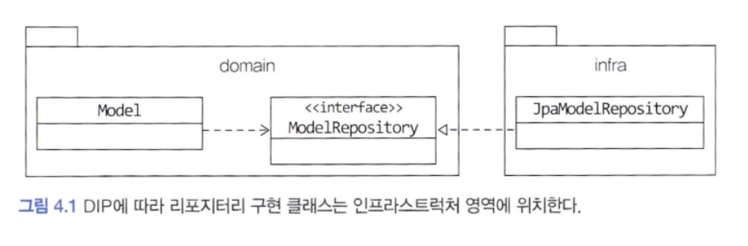
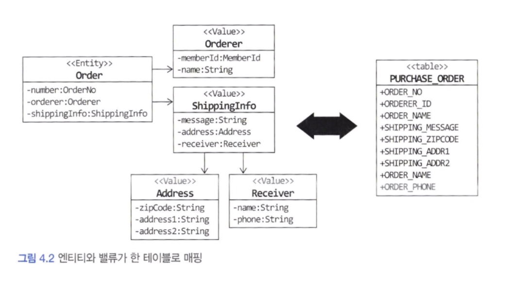
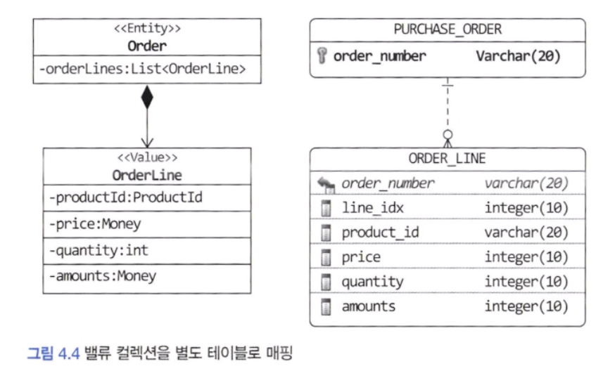
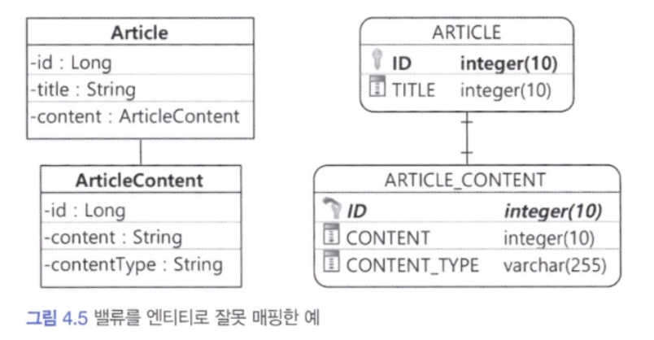
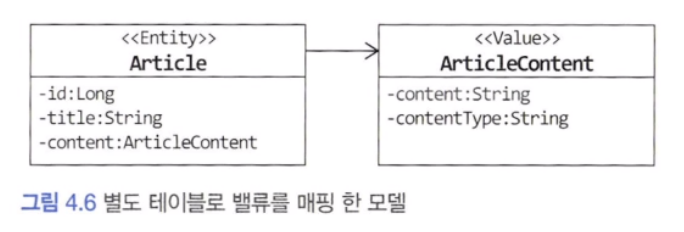
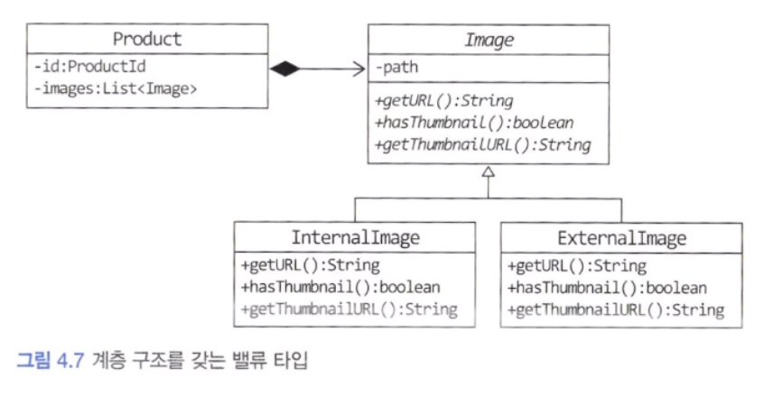
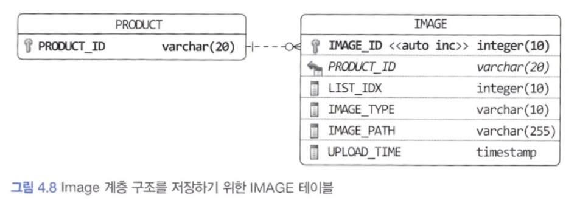
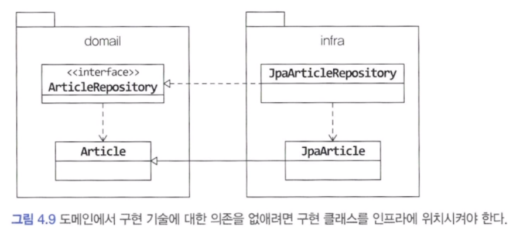

## JPA를 이용한 리포지터리 구현

이 장의 주제는 리포지터리 구현입니다. 애그리거트를 어떤 저장소에 저장하느냐에 따라 리포지터리를 구현하는 방법이 다르기 때문에 모든 구현 기술에 대해 알아볼 수는 없습니다. 도메인 모델과 리포지터리를 구현할 때 선호하는 기술을 꼽자면 JPA를 들 수 있습니다. 데이터 보관소로 RDBMS를 사용할 때, 객체 기반의 도메인 모델과 관계형 데이터 모델 간의 매핑을 처리하는 기술로 ORM 만한 것이 없습니다.

#### 1) 모듈 위치

리포지터리 인터페이스는 애그리거트와 같이 도메인 영역에 속하고, 리포지터리를 구현한 클래스는 인프라스트럭처 영역에 속합니다.



팀 표준에 따라 리포지터리 구현 클래스를 domain.impl과 같은 패키지에 위치시킬 수도 있는데 이것은 리포지터리 인터페이스와 구현체를 분리하기 위한 타협안 같은 것이지 좋은 설계 원칙을 따르는 것은 아닙니다

> 가능하면 리포지터리 구현 클래스를 인프라스트럭처 영역에 위치시켜서 인프라스트럭처에 대한 의존을 낮춰야합니다.

#### 2) 리포지터리 기본 기능 구현

리포지터리가 제공하는 기본 기능은 다음 두 가지 입니다.

- ID로 애그리커트 조회하기
- 애그리거트 저장하기

```java
public interface OrderRepository {
	Order findById(OrderNo no);
	void save(Order order);
}
```

인터페이스는 애그리거트 루트를 기준으로 작성합니다.

애그리거트를 수정한 결과를 저장소에 반영하는 메서드를 추가할 필요는 없습니다. JPA를 사용하면 트랜잭션 범위에서 변경한 데이터를 자동으로 DB에 반영하기 때문입니다.


---

## 스프링 데이터 JPA를 이용한 리포지터리 구현

스프링과 JPA를 함께 적용할 때는 스프링 데이터 JPA를 사용합니다. 


---

## 매핑 구현

#### 1) 엔티티와 밸류 기본 매핑 구현

애그리거트와 JPA 매핑을 위한 기본 규칙은 다음과 같습니다.

- 애그리거트 루트는 엔티티이므로 @Entity로 매핑 설정합니다.

한 테이블에 엔티티와 밸류 데이터가 같이 있다면

- 밸류는 @Embeddable 로 매핑 설정합니다.
- 밸류 타입 프로퍼티는 @Embedded로 매핑 설정합니다.

주문 애그리거트를 예로 들어보겠습니다. 주문 애그리거트의 루트 엔티티는 Order 이고 이 애그리거트에 속한 Order와 ShippingInfo는 밸류입니다. 이 세 객체와 ShippingInfo 에 포함된 Address 객체, Receiver 객체는 아리 그림처럼 한 테이블에 매핑할 수 있습니다.



주문 애그리거트에서 루트 엔티티인 Order 는 JPA 의 @Entity로 매핑합니다. Order에 속하는 Orderer는 밸류이므로 @Embeddable로 매핑합니다.

```java
@Entity
@Table(name = "purchase_order")
public class Order {

	// MemberId에 정의된 칼럼 이름을 변경하기 위해
	// @AtuributeOverride 애너테이션 이용
	@Embedded
	@AttributeOverrides(
		@AttributeOverride(name = "id", column = @Column(name = "orderer_id"))
	)
	private MemberId memberid;

	@Column(name = "orderer_name")
	private String name;
}

@Embeddable
public class MemberId implements Serializable {
	@Column(name = "member_id")
	private String id;
}
```


@Embeddable 타입에서 설정한 칼럼 이름과 실제 칼럼 이름이 다르므로 @AttributeOverrides 애너테이션을 이용해서 Order의 MemberId 프로퍼티와 매핑할 칼럼 이름을 변경했습니다.

Orderer와 마찬가지로 ShippingInfo 밸류도 또 다른 밸류인 Address와 Receiver를 포함합니다. Address의 매핑 설정과 다른 칼럼 이름을 사용하기 위해 @AttributeOverride 애너테이션을 사용합니다.

```java
@Embeddable
public class ShippingInfo {
	@Embedded
	@AttributeOverrides({
		@AttributeOverride(name = "zipCode", column = @Column(name = "Shipping_zipcode")),
		@AttributeOverride(name = "address1", column = @Column(name = "Shipping_addr1")),
		@AttributeOverride(name = "address2", column = @Column(name = "Shipping_addr2"))
	})
	private Address address;

	@Column(name = "shippine_message")
	private String message;

	@Embedded
	private Reciver receiver;
}
```

루트 엔티티인 Order 클래스는 @Embedded 를 이용해서 밸류 타입 프로퍼티를 설정합니다.

```java
@Entity
public class Order {
	...

	@Embedded
	private Orderer orderer;

	@Embedded
	private ShippingInfo shippingInfo;
}
```

#### 2) 기본 생성자

엔티티와 밸류의 생성자는 객체를 생성할 때 필요한 것을 전달받습니다. 하지만 JPA에서 @Entity와 @Embeddable로 클래스를 매핑하려면 기본 생성자를 제공해야 합니다. 기본 생성자는 JPA 프로바이더가 객체를 생성할 때만 사용합니다. 기본 생성자를 다른 코드에서 사용하면 값이 없는 온전하지 못한 객체를 만들게 됩니다. 이런 이유로 다른 코드에서 기본 생성자를 사용하지 못하도록 protected로 선언합니다.

#### 3) 필드 접근 방식 사용

엔티티가 객체로서 제 역할을 하려면 외부에 set 메서드 대신 의도가 잘 드러나는 기능을 제공해야 합니다. 상태 변경을 위한 setState() 메서드보다 주문 취소를 위한 cancel() 메서드가 도메인을 더 잘 표현하고, setShippingInfo() 메서드보다 배송지를 변경한다는 의미를 갖는 changeShippingInfo() 가 도메인을 더 잘 표현합니다.

#### 4) AttributeConverter를 이용한 밸류 매핑 처리

int, long, String, LocalDate 와 같은 타입은 DB 테이블의 한 개 칼럼에 매핑됩니다. 이와 비슷하게 밸류 타입의 프로퍼티를 한 개 칼럼에 매핑해야 할 때도 있습니다.

두 개 이상의 프로퍼티를 가진 밸류 타입을 한 개 칼럼에 매핑하려면 @Embeddable 애너테이션으로는 처리할 수 없습니다. 이럴 때 사용할 수 있는 것이 AttributeConverter입니다. AttributeConverter는 다음과 같이 밸류 타입과 칼럼 데이터 간의 변환을 처리하기 위한 기능을 정의하고 있습니다.

```java
publci interface AttributeConverter<X, Y> {
	public Y convertToDatabaseColumn(X attribute);
	public X convertToEntityAttribute(Y dbData);
}
```

이 책에서 사용하는 MOney 밸류 타입을 위한 AttributeConverter는 아래와 같이 구현할 수 있습니다.

```java
@Converter(autoApply = true)
public class MoneyConverter implements AttributeConverter<Money, Integer> {
	@Override
	public Integer convertToDatabaseColum(Money moeny) {
		return money == null ? null : monet.getValue();
	}

	@Override
	public Money convertToEntityAttribute(Integer value) {
		return value == null ? null : new Money(value);
	}
}
```

AttributeConverter 인터페이스를 구현한 클래스는 @Converter 애너테이션을 적용합니다. @Converter 애너테이션의 autoApply 속성값이 true이면 모델에 출현하는 모든 Money 타입의 프로퍼티에 대해 MoneyConverter를 자동으로 적용합니다. 이 설정을 false로 지정하면(기본값이 false입니다) 프로퍼티 값을 변환할 때 사용할 컨버터를 직접 지정해야 합니다.

```java
public class Order {

	@Column(name = "total_amounts")
	@Convert(converter = MoneyConverter.class)
	private Money totalAmmounts;
}
```

#### 5) 밸류 컬렉션: 별도 테이블 매핑

Order 엔티티는 한 개 이상의 OrderLine을 가질 수 있습니다. OrderLine에 순서가 있다면 다음과 같이 List 타입을 이용해서 컬렉션을 프로퍼티로 지정할 수 있습니다.

```java
public class Order {
	private List<OrderLine> orderLines;
}
```




밸류 컬렉션을 저장하는 ORDER_LINE 테이블은 외부키를 이용해서 엔티티에 해당하는 PURCHASE_ORDER 테이블을 참조합니다. 이 외부키는 컬렉션이 속할 엔티티를 의미합니다.

밸류 컬렉션을 별도 테이블로 매핑할 때는 @ElementCollection과 CollectionTable을 함께 사용합니다. 관련 매핑 코드는 아래와 같습니다.

```java
@Entity
@Table(name = "purchase_order")
public class Order {
	@EmbeddedId
	private OrderNo number;
	...
	@ElementCollection(fetch = FetchType.EAGER)
	@CollectionTable(name = "order_line", joinColumns = @JoinColumn(name = "order_number"))
	@OrderColumn(name = "line_idx")
	private List<OrderLine> orderLines;
	...
}

@Embeddable
public class OrderLine {
	@Embedded
	private ProductId productId;

	@Column(name = "price")
	private Money price;

	@Column(name = "quantity")
	private int quantity;

	@Column(name = "amounts")
	private Money amounts;
}
```


OrderLine의 매핑을 함께 표시했는데 OrderLine 에는 List의 인덱스 값을 저장하기 위한 프로퍼티가 존재하지 않습니다. 그 이유는 List 타입 자체가 인덱스를 갖고 있기 때문입니다. JPA는 @OrderColumn 애너테이션을 이용해서 지정한 칼럼에 리스트의 인덱스 값을 저장합니다.

@CollectionTable은 밸류를 저장할 테이블을 지정합니다. name 속성은 테이블 이름을 지정하고 joinColumns 속성은 외부키로 사용할 칼럼을 지정합니다. 예제 코드에서는 외부키가 한 개인데, 두 개 이상인 경우 @JoinColumn의 배열을 이용해서 외부키 목록을 지정합니다.

#### 6) 밸류 컬렉션: 한 개 칼럼 매핑

밸류 컬렉션을 별도 테이블이 아닌 한 개 칼럼에 저장해야 할 때가 있습니다. 예를 들어 도메인 모델에는 이메일 주소 목록을 Set 으로 보관하고 DB에는 한 개 칼럼에 콤마로 구분해서 저장해야 할 때가 있습니다. 이때 AttributeConverter를 사용하면 밸류 컬렉션을 한 개 칼럼에 쉽게 매핑할 수 있습니다.

단, AttributeConverter를 사용하려면 밸류 컬렉션을 표현하는 새로운 밸류 타입을 추가해야 합니다. 이메일의 경우 아래 코드처럼 이메일 집합을 위한 밸류 타입을 추가로 작성해야 합니다.

```java
public class EmailSet {
	private Set<Email> emails = new HashSet();

	public EmailSet(Set<Email> emails) {
		this.emails.addAll(emails);
	}

	public Set<Email> getEmails() {
		return Collections.unmodifiableSet(emails);
	}
}
```

밸류 컬렉션을 위한 타입을 추가했다면 AttributeConverter를 구현합니다.

```java
public class EmailSetConverter implements AttributeConverter<EmailSet, String> {
	@Override
	public String convertToDatabaseColumn(EmailSet attribute) {
		if (attribute == null) return null;
		return attribute.getEmails().stream()
				.map(email -> email.getAddress)
				.collect(Collectors.joining(","));
	}

	@Override
	public EmailSet convertToEntityAttribute(String dbData) {
		if (dbData == null) return null;
		String[] emails = dbData.split(",");
		Set<Email> emailSet = Arrays.stream(emails)
				.map(value -> new Email(value))
				.collect(toSet());
		return new EmailSet(emailSet);
	}
}

// EmailSet 프로퍼티가 위에서 설정한 converter를 사용하도록 설정
@Column(name = "emails")
@Convert(converter = EmailSetConverter.class)
private EmailSet emailSet;
```

#### 7) 밸류를 이용한 ID 매핑

식별자라는 의미를 부각시키기 위해 식별자 자체를 밸류 타입으로 만들 수도 있습니다. 지금까지 살펴본 예제에서 OrderNo, MemberId 등이 식별자를 표한하기 위해 사용한 밸류 타입입니다. 밸류 타입을 식별자로 매핑하면 @Id 대신 @EmbeddedId 애너테이션을 사용합니다.

```java
@Entity
@Table(name = "purchase_order")
public class Order {
	@EmbeddedId
	private OrderNo number;
	...
}

@Embeddable
public class OrderNo implements Serializable {
	@Column(name = "order_number")
	private String number;
	...
}
```

JPA 에서 식별자 타입은 Serializable 타입이어야 하므로 식별자로 사용할 밸류 타입은 Serializable 인터페이스를 상속받아야 합니다.

밸류 타입으로 식별자를 구현할 때 얻을 수 있는 장점은 식별자에 기능을 추가할 수 있다는 점입니다. 예를 들어 1세대 시스템의 주문번호와 2세대 시스템의 주문번호를 구분할 때 주문번호의 첫 글자를 이용할 경우, 아래와 같이 OrderNo 클래스에 기능을 구현할 수 있습니다.

```java
@Embeddable
public class OrderNo implements Serializable {
	@Column(name = "order_number")
	private String number;

	public boolean is2ndGeneration() {
		return number.startsWith("N");
	}
}
```

> JPA는 내부적으로 엔티티를 비교할 목적으로 equals() 메서드와 hashcode() 값을 사용하므로 식별자로 사용할 밸류 타입은 이 두 메서드를 알맞게 구현해야 합니다.

#### 8) 별도 테이블에 저장하는 밸류 매핑

애그리거트에서 루트 엔티티를 뺀 나머지 구성요소는 대부분 밸류입니다. 루트 엔티티 외에 또 다른 엔티티가 있다면 진짜 엔티티인지 의심해 봐야 합니다. 단지 별도 테이블에 데이터를 저장한다고 해서 엔티티인 것은 아닙니다. 주문 애그리거트도 OrderLine을 별도 테이블에 저장하지만 OrderLine 자체는 엔티티가 아니라 밸류입니다.

밸류가 아니라 엔티티가 확실하다면 해당 엔티티가 다른 애그리거트는 아닌지 확인해야 합니다. 특히 자신만의 독자적인 라이프 사이클을 갖는다면 구분되는 애그리거트일 가능성이 높습니다.

애그리거트에 속한 객체가 밸류인지 엔티티인지 구분하는 방법은 고유 식별자를 갖는지를 확인하는 것입니다. 하지만 식별자를 찾을 때 매핑되는 테이블의 식별자를 애그리거트 구성요소의 식별자와 동일한 것으로 착각하면 안 됩니다. 별도 테이블로 저장하고 테이블에 PK가 있다고 해서 테이블과 매핑되는 애그리거트 구성요소가 항상 고유 식별자를 갖는 것은 아니기 때문입니다.

예를 들어 게시글 데이터를 ARTICLE 테이블과 ARTICLE_CONTENT 테이블로 나눠서 저장한다고 생각해봅시다.




ArticleContent를 엔티티로 생각할 수 있지만, ArticleContent는 Article의 내용을 담고 있는 밸류로 생각하는 것이 맞습니다. ARTICLE_CONTENT의 ID는 식별자이긴 하지만 이 식별자를 사용하는 이유는 ARTICLE 테이블의 데이터와 연결하기 위함이지 ARTICLE_CONTENT를 위한 별도 식별자가 필요하기 때문은 아닙니다. 즉, 이것은 게시글의 특정 프로퍼티를 별도 테이블에 보관한 것으로 접근해야 합니다. ArticleContent를 밸류로 보고 접근하면 모델은 아래와 같이 바뀝니다.



ArticleContent는 밸류이므로 @Embeddable 로 매핑합니다. ArticleContent와 매핑되는 테이블은 Article과 매핑되는 테이블과 다릅니다. 이때 밸류를 매핑 한 테이블을 지정하기 위해 @SecondaryTable과 @AttributeOverride를 사용합니다.

```java
@Entity
@Table(name = "aritcle")
@SecondaryTable(
	name = "article_content",
	pkJoinColumns = @PrimaryKeyJoinColumn(name = "id")
)
public class Article {
	@Id
	@GeneratedValue(strategy = GenerationType.IDENTITY)
	private Long id;

	private String title;

	@AttributeOverrids({
		@AttributeOverride(
			name = "content",
			column = @Column(table = "article_content", name = "content")),
		@AttributeOverride(
			name = "contentType",
			column = @Column(table = "article_content", name = "content_type"))
	})
	@Embedded
	private ArticleContent content;
}
```

@SecondaryTable의 name 속성은 밸류로 저장할 테이블을 지정합니다. pkJoinColumns 속성은 밸류 테이블에서 엔티티 테이블로 조인할 때 사용할 칼럼을 지정합니다. content 필드에 @AttributeOverride 를 적용했는데 이 애너테이션을 사용해서 해당 밸류 데이터가 저장된 테이블 이름을 지정합니다.

@SecondaryTable을 이용하면 아래 코드를 실행할 때 두 테이블을 조인해서 데이터를 조회합니다.

```java
// @SecondaryTable로 매핑된 article_content 테이블을 조인
Article article = entityManager.find(Article.class, 1L);
```

게시글 목록을 보여주는 화면은 article 테이블의 데이터만 필요하지 article_content 테이블의 데이터는 필요하지 않습니다. 그런데 @SecondaryTable을 사용하면 목록 화면에 보여줄 Article을 조회할 때 article_content 테이블까지 조인해서 데이터를 읽어오는데 이것은 원하는 결과가 아닙니다.

이 문제를 해소하고자 ArticleContent를 엔티티로 매핑하고 Article에서 ArticleContent로의 로딩을 지연 로딩 방식으로 설정할 수도 있습니다. 하지만, 이 방식은 밸류인 모델을 엔티티로 만드는 것이므로 좋은 방법은 아닙니다. 대신 조회 전용 기능을 구현하는 방법을 사용하는 것이 좋습니다. 이는 5장에서 살펴보겠습니다.

#### 9) 밸류 컬렉션을 @Entity로 매핑하기

개념적으로 밸류인데 구현 기술의 한계나 팀 표준 때문에 @Entity를 사용해야 할 때도 있습니다. 예를 들어 제품의 이미지 업로드 방식에 따라 이미지 경로와 섬네일 이미지 제공 여부가 달라진다고 해봅시다. 이를 위해 Image를 아래 그림처럼 계층 구조로 설계할 수 있습니다.



JPA는 @Embeddable 타입의 클래스 상속 매핑을 지원하지 않습니다. 상속 구조를 갖는 밸류 타입을 사용하려면 @Embeddable 대신 @Entity를 이용해서 상속 매핑으로 처리해야 합니다.

밸류 타입을 @Entity로 매핑하므로 식별자 매핑을 위한 필드도 추가해야 합니다. 또한 구현 클래스를 구분하기 위한 타입 식별(discriminator) 칼럼을 추가해야 합니다. 이를 위한 테이블 설계는 아래 그림과 같습니다.



한 테이블에 Imge와 그 하위 클래스를 매핑하므로 Image 클래스에 다음 설정을 사용합니다.

- @Inheritance 애너테이션 적용
- strategy 값으로 SINGLE_TABLE 사용
- @DiscriminatorColumn 애너테이션을 이용하여 타입 구분용으로 사용할 칼럼 지정

```java
@Entity
@Inheritance(strategy = IngeritanceType.SINGLE_TABLE)
@DiscriminatorColumn(name = "image_type")
@Table(name = "image")
public abstract class Image {
	@Id
	@GeneratedValue(strategy = GenerationType.IDENTITY)
	@Column(name = "image_id")
	private Long id;
	@Column(name = "image_path")
	private String path;

	@Temporal(TemporalType.TIMESTAMP)
	@Column(name = "upload_time")
	private Date uploadTime;

	protected Image() {}
	public Image(String path) {
		this.path = path;
		this.uploadTime = new Date();
	}

	protected String getPath() {
		return path;
	}

	public Date getUploadTime() {
		return uploadTime;
	}

	public abstract String getURL();
	public abstract boolean hasThumbnail();
	public abstract String getThumbnailURL();
}
```

Image를 상속받은 클래스는 @Entity 와 @Discriminator를 사용해서 매핑을 설정합니다.

```java
@Entity
@DiscriminatorValue("II")
public class InternalImage extends Image {
	...
}

@Entity
@DiscriminatorValue("EI")
public class ExternalImage extends Image {
	...
}
```


Image가 @Entity 이므로 담고 있는 Product는 @OneToMany를 이용해서 매핑을 처리합니다. Image는 밸류이므로 독자적인 라이프 사이클을 갖지 않고 Product에 완전히 의존합니다. 따라서 Product를 지정할 때 함께 지정되고 Product를 삭제할 때 함께 삭제되도록 cascade 속성을 지정합니다. 리스트에서 Image 객체를 제거하면 DB에서도 함께 삭제되도록 orphanRemoval도 true 로 설정합니다.

```java
@Entity
@Table(name = "product")
public class Product {
	@EmbeddedId
	private Productid id;
	private String name;

	@Convert(converter = MoneyConverter.class)
	private Money price;
	private String detail;

	@OneToyMany(
		cascade = {CascadeType.PERSIST, CascadeType.REMOVE},
		orphanRemoval = true
	)
	@JoinColumn(name = "product_id")
	@OrderColumn(name = "list_idx")
	private List<Image> images = new ArrayList<>();
	...
	public void changeImages(List<Image> newImages) {
		images.clear();
		images.addAll(newImages);
	}
}
```

> 참고로 @Entity 에 대한 @OneToMany 매핑에서 컬렉션의 clear() 메서드는 삭제 과정이 효율적이지 않습니다.
> 이는 select 쿼리로 대상 엔티티를 로딩하고 각 개별 엔티티에 대해 delete 쿼리를 실행하기 때문입니다.

하이버네이트는 @Embeddable 타입에 대한 컬렉션의 clear() 메서드를 호출하면 컬렉션에 속한 객체를 로딩하지 않고 한 번의 delete 쿼리로 삭제 처리를 수행할 수 있습니다.

```java
@Embeddable
public class Image {
	@Column(name = "image_type")
	private String imageType;
	@Column(name = "image_path")
	private String path;

	@Temporal(TemporalType.TIMESTAMP)
	@Column(name = "upload_time")
	private Date uploadTime;
	...

	public boolean hasThumbnail() {
		// 성능을 위해 다형을 포기하고 if-else 로 구현
		if (imageType.equals("II")) {
			return true;
		} else {
			return false;
		}
	}
}
```

> 즉, 코드 유지 보수와 성능의 두 가지 측면을 고려해서 구현 방식을 선택해야 합니다.

#### 10) ID 참조와 조인 테이블을 이요한 단방향 M-N 매핑

3장에서 애그리거트 간 집합 연관은 성능 상의 이유로 피해야 한다고 했습니다. 그럼에도 불구하고 요구사항을 구현하는 데 집합 연관을 사용하는 것이 유리하다면 ID 참조를 이용한 단방향 집합 연관을 적용해 볼 수 있습니다.

```java
@Entity
@Table(name = "product")
public class Product {
	@EmbeddedId
	private ProductId id;

	@ElementCollection
	@CollectionTable(name = "product_category"
		joinColumns = @JoinColumn(name = "product_id"))
	private Set<CategoryId> categoryIds;
}
```

위 코드는 Product에서 Category로의 단방향 M-N 연관을 ID 참조 방식으로 구현한 것입니다. ID 참조를 이용한 애그리거트 간 단방향 M-N 연관은 밸류 컬렉션 매핑과 동일한 방식으로 설정한 것을 알 수 있습니다. 차이점이 있다면 집합의 값에 밸류 대신 연관을 맺는 식별자가 온다는 점입니다.

@ElementCollection을 이용하기 때문에 Product를 삭제할 때 매핑에 사용한 조인 테이블의 데이터도 함께 삭제됩니다. 애그리거트를 직접 참조하는 방식을 사용했다면 영속성 전파나 로딩 전략을 고민해야 하는 데 ID 참조 방식을 사용함으로써 이런 고민을 없앨 수 있습니다.


---

## 애그리거트 로딩 전략

JPA 매핑을 설정할 때 항상 기억해야 할 점은 애그리거트에 속한 객체가 모두 모여야 완전한 하나가 된다는 것입니다. 즉, 다음과 같이 애그리거트 루트를 로딩하면 루트에 속한 모든 객체가 완전한 상태여야 함을 의미합니다.

```java
// product는 완전한 하나여야 합니다.
Product product = productRepository.findById(id);
```

조회 시점에서 애그리거트를 완전한 상태가 되도록 하려면 애그리거트 루트에서 연관 매핑의 조회 방식을 즉시 로딩(FetchType.EAGER)으로 설정하면 됩니다. 아래와 같이 설정하면 find 메서드로 애그리거트 루트를 구할 때 연관된 구성요소를 DB에서 함께 읽어옵니다.

```java
// @Entity 컬렉션에 대한 즉시 로딩 설정
@OneToMany(cascade = {CascadeType.PERSIST, CascadeType.REMOVE},
		  orphanREmoval = true, fetch = FetchType.EAGER)
@JoinColumn(name = "product_id")
@OrderColumn(name = "list_idx")
private List<Image> images = new ArrayList<>();

// @Embeddable 컬렉션에 대한 즉시 로딩 설정
@ElementCollection(fetch = FetchType.EAGER)
@CollectionTable(name = "order_line",
				joinColumns = @JoinColumn(name = "order_number"))
@OrderColumn(name = "line_idx")
private List<OrderLine> orderLines;
```

즉시 로딩이 항상 좋은 것은 아닙니다. 특히 컬렉션에 대해 즉시 로딩 방식은 문제가 될 수 있습니다.
보통 조회 성능 문제 때문에 즉시 로딩 방식을 사용하지만, 이렇게 조회되는 데이터 개수가 많아지면 즉시 로딩 방식을 사용할 때 성능(실행 빈도, 트래픽, 지연 로딩 시 실행 속도 등)을 검토해 봐야 합니다.

애그리거트는 개념적으로 하나여야 합니다. 하지만 루트 엔티티를 로딩하는 시점에 애그리거트에 속한 객체를 모두 로딩해야 하는것은 아닙니다. 애그리거트가 완전해야 하는 이유는 두 가지 정도로 생각해 볼 수 있습니다.

첫 번째 이유는 상태를 변경하는 기능을 실행할 때 애그리거트 상태가 완전해야 하기 때문이고, 두 번째 이유는 표현 영역에서 애그리거트의 상태 정보를 보여줄 때 필요하기 때문입니다.

이 중 두 번째는 별도의 조회 전용 기능과 모델을 구현하는 방식을 사용하는 것이 더 유리하기 때문에 애그리거트의 완전한 로딩과 관련된 문제는 상태 변경과 더 관련이 있습니다. 이는 실제로 상태를 변경하는 시점에 필요한 구성요소만 로딩해도 문제가 되지 않습니다.

게다가 일반적인 애플리케이션은 상태 변경 기능을 실행하는 빈도보다 조회 기능을 실행하는 빈도가 훨씬 높습니다. 그러므로 상태 변경을 위해 지연 로딩을 사용할 대 발생하는 추가 쿼리로 인한 실행 속도 저하는 보통 문제가 되지 않습니다.

지연 로딩은 즉시 로딩보다 쿼리 실행 횟수가 많아질 가능성이 더 높습니다. 따라서 무조건 즉시 로딩이나 지연 로딩으로만 설정하기보다는 애그리거트에 맞게 즉시 로딩과 지연 로딩을 선택해야 합니다.


---

## 애그리거트의 영속성 전파

애그리거트가 완전한 상태여야 한다는 것은 애그리거트 루트를 조회할 때뿐만 아니라 저장하고 삭제할 대도 하나로 처리해야 함을 의미합니다.

- 저장 메서드는 애그리거트 루트만 저장하면 안 되고 애그리거트에 속한 모든 객체를 저장해야 합니다.
- 삭제 메서드는 애그리거트 루트뿐만 아니라 애그리거트에 속한 모든 객체를 삭제해야 합니다.

@Embeddable 매핑 타입은 함께 저장되고 삭제되므로 cascade 속성을 추가로 설정하지 않아도 됩니다. 반면에 애그리거트에 속한 @Entity 타입에 대한 매핑은 cascade 속성을 사용해서 저장과 삭제 시에 함께 처리되도록 설정해야 합니다.


---

## 식별자 생성 기능

식별자는 크게 세 가지 방식 중 하나로 생성합니다.

- 사용자가 직접 생성
- 도메인 로직으로 생성
- DB를 이용한 일련번호 사용

이메일 주소처럼 사용자가 직접 식별자를 입력하는 경우는 식별자 생성 주체가 사용자이기 때문에 도메인 영역에 식별자 생성 기능을 구현할 필요가 없습니다.

식별자 생성 규칙이 있다면 엔티티를 생성할 때 식별자를 엔티티가 별도 서비스로 식별자 생성 기능을 분리해야 합니다. 식별자 생성 규칙은 도메인 규칙이므로 도메인 영역에 식별자 생성 기능을 위치시켜야 합니다. 예를 들어 다음과 같은 도메인 서비스를 도메인 영역에 위치시킬 수 있습니다.

```java
public class ProductIdService {
	public ProductId nextId() {
		... // 정해진 규칙으로 식별자 생성
	}
}
```

응용 서비스는 이 도메인 서비스를 이용해서 식별자를 구하고 엔티티를 생성합니다.

```java
public class CreateProductService {
	@Autowired
	private ProductIdService idService;
	@Autowired
	private ProductRepository productRepository;

	@Transactional
	public ProductId createProduct(ProductCreationCommand cmd) {
		// 응용 서비스는 도메인 서비스를 이용해서 식별자를 생성합니다.
		ProductId id = productIdService.nextId();
		Product product = new Product(id, cmd.getDetail(), cmd.getPrice(), ...);
		productRepository.save(product);
		return id;
	}
}
```

특정 값의 조합으로 식별자가 생성되는 것 역시 규칙이므로 도메인 서비스를 이용해서 식별자를 생성할 수 있습니다.

식별자 생성 규칙을 구현하기에 적합한 또 다른 장소는 리포지터리입니다. 다음과 같이 리포지터리 인터페이스에 식별자를 생성하는 메서드를 추가하고 리포지터리 구현 클래스에서 알맞게 구현하면 됩니다.

```java
public interface ProductRepository {
	... // save() 등 다른 메서드

	// 식별자를 생성하는 메서드
	ProductId nextId();
}
```


DB 자동 증가 칼럼을 식별자로 사용하면 식별자 매핑에서 @GeneratedValue를 사용하면 됩니다.

자동 증가 칼럼은 DB의 insert 쿼리를 실행해야 식별자가 생성되므로 도메인 객체를 리포지터리에 저장할 때 식별자가 생성됩니다. 이 말은 도메인 객체를 생성하는 시점에는 식별자를 알 수 없고 도메인 객체를 저장한 뒤에 식별자를 구할 수 있음을 의미합니다.


---

## 도메인 구현과 DIP

2장에서 DIP에 대해 알아봤는데, 이 장에서 구현한 리포지터리는 DIP 원칙을 어기고 있습니다. 먼저 엔티티는 JPA 기술을 사용하고 있습니다.

DIP에 따르면 도메인 모델은 구현 기술인 JPA에 의존하지 말아야 하는데 이 코드는 도메인 모델인 Article이 영속성 구현 기술인 JPA에 의존하고 있습니다.

리포지터리 인터페이스도 마찬가지입니다. JPA의 Repository 인터페이스를 상속하고 있기 때문에 도메인이 인프라에 의존하고 있습니다.

구현 기술에 대한 의존 없이 도메인을 순수하게 유지하려면 스프링 데이터 JPA의 Repository 인터페이스를 상속받지 않도록 수정하고 아래 그림과 같이 ArticleRepository 인터페이스를 구현한 클래스를 인프라에 위치시켜야 합니다. 또한 Article 클래스에서 @Entity나 @Table과 같이 JPA 특화된 애너테이션을 모두 지우고 JPA를 연동하기 위한 클래스를 추가해야 합니다.



특정 기술에 의존하지 않는 순수한 도메인 모델을 추구하는 개발자는 위와 같은 구조로 구현합니다. 이 구조를 가지면 구현 기술을 변경하더라도 도메인이 받는 영향을 최소화할 수 있습니다.

DIP를 적용하는 주된 이유는 저수준 구현이 변경되더라도 고수준이 영향을 받지 않도록 하기 위함입니다. 하지만 리포지터리와 도메인 모델의 구현 기술은 거의 바뀌지 않습니다. 저자는 JPA로 구현한 리포지터리 구현 기술을 마이바티스나 다른 기술로 변경한 적이 없고 RDBMS를 사용하다 몽고 DB로 변경한 적도 없습니다. 이렇게 변경이 거의 없는 상황에서 변경을 미리 대비하는 것은 과하다고 생각합니다. 그래서 저자은 애그리거트, 리포지터리 등 도메인 모델을 구현할 때 타협을 했습니다.

DIP를 완벽하게 지키면 좋겠지만 개발 편의성과 실용성을 가져가면서 구조적인 유연함은 어느 정도 유지했습니다. 복잡도를 높이지 않으면서 기술에 따른 구현 제약이 낮다면 합리적인 선택이라고 생각합니다.


