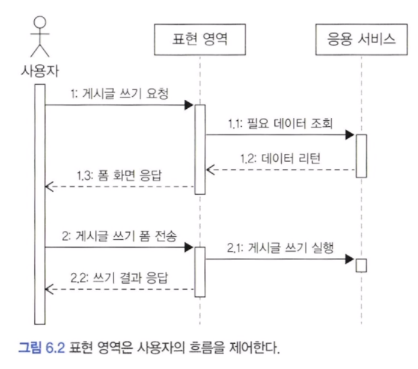
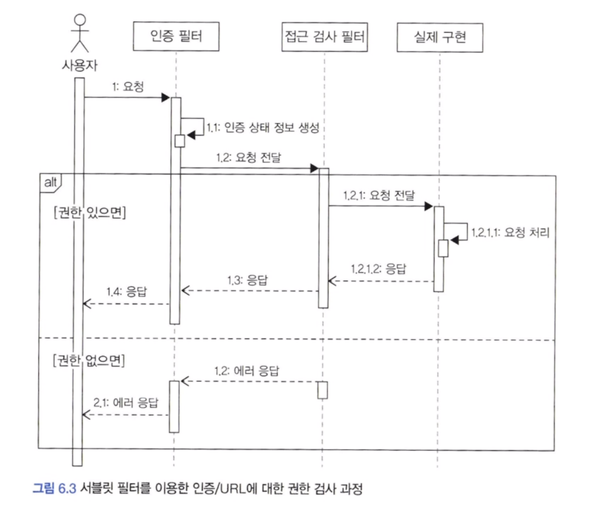
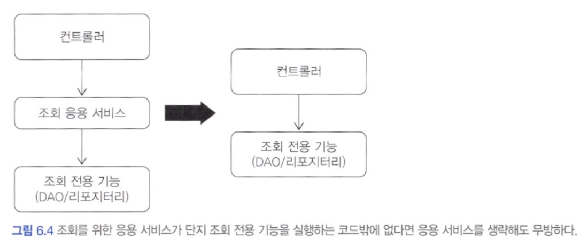

## 표현 영역과 응용 영역

도메인 영역을 잘 구현하지 않으면 사용자의 요구를 충족하는 제대로 된 소프트웨어를 만들지 못합니다. 하지만 도메인 영역만 잘 만든다고 끝나는 것은 아닙니다. 도메인이 제 기능을 하려면 사용자와 도메인을 연결해 주는 매개체가 필요합니다. 2장 아키텍처에서 설명한 응용 영역과 표현 영역이 사용자와 도메인을 연결해 주는 매개체 역할을 합니다.


표현 영역은 사용자의 요청을 해석합니다. 사용자가 웹 브라우저에서 폼에 ID와 암호를 입력한 뒤에 전송 버튼을 클릭하면 요청 파라미터를 포함한 HTTP 요청을 표현 영역에 전달합니다. 요청을 받은 표현 영역은 URL, 요청 파라미터, 쿠키, 헤더 등을 이용해서 사용자가 실행하고 싶은 기능을 판별하고 그 기능을 제공하는 응용 서비스를 실행합니다.

실제 사용자가 원하는 기능을 제공하는 것은 응용 영역에 위치한 서비스입니다. 사용자가 회원 가입을 요청했다면 실제 그 요청을 위한 기능을 제공하는 주체는 응용 서비스에 위치합니다. 응용 서비스는 기능을 실행하는 데 필요한 입력 값을 메서드 인자로 받고 실행 결과를 리턴합니다.

응용 서비스의 메서드가 요구하는 파라미터와 표현 영역이 사용자로부터 전달받은 데이터는 형식이 일치하지 않기 때문에 표현 영역은 응용 서비스가 요구하는 형식으로 사용자 요청을 변환합니다.

응용 서비스를 실행한 뒤에 표현 영역은 실행 결과를 사용자에 알맞는 형식으로 응답합니다. 사용자와 상호작용은 표현 영역이 처리하기 때문에, 응용 서비스는 표현 영역에 의존하지 않습니다.

> 응용 영역은 사용자가 웹 브라우저를 사용하는지 REST API를 호출하는지, TCP 소켓을 사용하는지를 알 필요가 없습니다. 단지 기능 실행에 필요한 입력 값을 받고 실행 결과만 리턴하면 될 뿐입니다.


---

## 응용 서비스의 역할

응용 서비스는 사용자(클라이언트)가 요청한 기능을 실행합니다. 응용 서비스는 사용자의 요청을 처리하기 위해 리포지터리에서 도메인 객체를 가져와 사용합니다.

응용 서비스의 주요 역할은 도메인 객체를 사용해서 사용자의 요청을 처리하는 것이므로 표현(사용자) 영역 입장에서 보았을 때 응용 서비스는 도메인 영역과 표현 영역을 연결해 주는 창구 역할을 합니다.

> 응용 서비스는 주로 도메인 객체 간의 흐름을 제어하기 때문에 단순한 형태를 갖습니다.

응용 서비스가 복잡하다면 응용 서비스에서 도메인 로직의 일부를 구현하고 있을 가능성이 높습니다. 응용 서비스가 도메인 로직을 일부 구현하면 코드 중복, 로직 분산 등 코드 품질에 안 좋은 영향을 줄 수 있습니다.

응용 서비스는 트랜잭션 처리도 담당합니다. 트랜잭션 외에 서비스의 주요 역할로 접근 제어와 이벤트 처리가 있습니다.

#### 1) 도메인 로직 넣지 않기

도메인 로직은 도메인 영역에 위치하고 응용 서비스는 도메인 로직을 구현하지 않습니다. 예를 들어 암호 변경 로직에서 기존 암호를 올바르게 입력했는지를 확인하는 것은 도메인의 핵심 로직이기 때문에 응용 서비스에서 이 로직을 구현하면 안 됩니다.

도메인 로직을 도메인 영역과 응용 서비스에 분산해서 구현하면 코드 품질에 문제가 발생합니다.

- 첫 번재 문제는 코드의 응집성이 떨어집니다.
- 두 번째 문제는 여러 응용 서비스에 동일한 도메인 로직을 구현할 가능성이 높아집니다.

이러한 문제는 결과적으로 코드 변경을 어렵게 만듭니다. 소프트웨어가 가져야 할 중요한 경쟁 요소 중 하나는 변경 용이성인데, 변경이 어렵다는 것은 그만큼 소프트웨어의 가치가 떨어진다는 것을 의미합니다.

> 소프트웨어의 가치를 높이려면 도메인 로직을 도메인 영역에 모아서 코드 중복을 줄이고 응집도를 높여야 합니다.


---

## 응용 서비스의 구현

응용 서비스는 표현 영역과 도메인 영역을 연결하는 매개체 역할을 하는데, 이는 디자인 패턴에서 파사드와 같은 역할을 합니다.

#### 1) 응용 서비스의 크기

응용 서비스 자체의 구현은 어렵지 않지만 몇 가지 생각할 거리가 있습니다. 그중 하나가 응용 서비스의 크기입니다. 회원 도메인을 생각해 보겠습니다. 응용 서비스는 회원 가입, 회원 탈퇴, 회원 암호 변경, 비밀번호 초기화 같은 기능을 구현하기 위해 도메인 모델을 사용하게 됩니다. 이때 다음 두 가지 방식 중 한 가지 방식으로 구현하게 됩니다.

- 한 응용 서비스 클래스에 회원 도메인의 모든 기능 구현하기
- 구분되는 기능별로 응용 서비스 클래스를 따로 구현하기

한 응용 서비스 클래스에 모든 기능을 구현하면 한 도메인과 관련된 기능을 구현한 코드가 한 클래스에 위치하므로 각 기능에서 동일 로직에 대한 코드 중복을 제거할 수 있다는 장점이 있습니다. 예를 들어 동일 로직을 private 메서드로 구현하고 호출하는 방법으로 중복 로직을 쉽게 제거할 수 있습니다.

각 기능에서 동일한 로직을 위한 코드 중복을 제거하기 쉽다는 것이 장점이라면 한 서비스 클래스의 크기가 커진다는 것은 이 방식의 단점입니다. 코드 크기가 커지면 연관성이 적은 코드가 한 클래스에 함께 위치할 가능성이 높아지게 되는데 결과적으로 관련 없는 코드가 뒤섞여 코드를 이해하는 데 방해가 됩니다.

게다가 한 클래스에 코드가 모이기 시작하면 엄연히 분리하는 것이 좋은 상황임에도 습관적으로 기존에 존재하는 클래스에 억지로 끼워 넣게 됩니다. 이것은 코드를 점점 얽히게 만들어 코드 품질을 낮추는 결과를 초래합니다.

구분되는 기능별로 서비스 클래스를 구현하는 방식은 한 응용 서비스 클래스에서 한 개 내지 2 ~ 3개의 기능을 구현합니다.

이 방식을 사용하면 클래스 개수는 많아지지만 한 클래스에 관련 기능을 모두 구현하는 것과 비교해서 코드 품질을 일정 수준으로 유지하는 데 도움이 됩니다. 또한 각 클래스별로 필요한 의존 객체만 포함하므로 다른 기능을 구현한 코드에 영향을 받지 않습니다.

각 기능마다 동일한 로직을 구현할 경우 여러 클래스에 중복해서 동일한 코드를 구현할 가능성이 있습니다. 이 경우 별도 클래스에 로직을 구현해서 코드가 중복되는 것을 방지할 수 있습니다.

> 필자는 한 클래스가 여러 역할을 갖는 것보다 각 클래스마다 구분되는 역할을 갖는 것을 선호합니다. 한 도메인과 관련된 기능을 하나의 응용 서비스 클래스에서 모두 구현하는 방식보다 구분되는 기능을 별도의 서비스 클래스로 구현하는 방식을 사용합니다.


#### 2) 응용 서비스의 인터페이스와 클래스

응용 서비스를 구현할 때 논쟁이 될 만한 것이 인터페이스가 필요한 지입니다. 인터페이스가 필요한 몇 가지 상황이 있는데 그중 하나는 구현 클래스가 여러 개인 경우입니다. 구현 클래스가 다수 존재하거나 런타임에 구현 객체를 교체해야 할 때 인터페이스를 유용하게 사용할 수 있습니다. 그런데 응용 서비스는 런타임에 교체하는 경우가 거의 없고 한 응용 서비스의 구현 클래스가 두 개인 경우도 드뭅니다.

따라서 인터페이스가 명확하게 필요하기 전까지는 응용 서비스에 대한 인터페이스를 작성하는 것이 좋은 선택이라고 볼 수는 없습니다.


#### 3) 메서드 파라미터와 값 리턴

응용 서비스가 제공하는 메서드는 도메인을 이용해서 사용자가 요구한 기능을 실행하는 데 필요한 값을 파라미터로 전달받아야 합니다.

필요한 파라미터는 각각 전달 받을 수 있고 혹은 값 전달을 위해 별도 데이터 클래스를 만들어 전달받을 수도 있습니다. 응용 서비스는 파라미터로 전달받은 데이터를 사용해서 필요한 기능을 구현하면 됩니다.

응용 서비스에 데이터로 전달할 요청 파라미터가 두 개 이상 존재하면 데이터 전달을 위한 별도 클래스를 사용하는 것이 편리합니다.

응용 서비스의 결과를 표현 영역에서 사용해야 하면 응용 서비스 메서드의 결과로 필요한 데이터를 리턴합니다.

응용 서비스에서 애그리거트 객체를 그대로 리턴할 수도 있을 것입니다. 응용 서비스에서 애그리거트 자체를 리턴하면 코딩은 편할 수 있지만 도메인의 로직 실행을 응용 서비스와 표현 영역 두 곳에서 할 수 있게 됩니다. 이것은 기능 실행 로직을 응용 서비스와 표현 영역에 분산시켜 코드의 응집도를 낮추는 원인이 됩니다.


#### 4) 표현 영역에 의존하지 않기

응용 서비스의 파라미터 타입을 결정할 때 주의할 점은 표현 영역과 관련된 타입을 사용하면 안 된다는 점입니다. 예를 들어 HttpServletRequest 같은 표현 영역에서 사용하는 객체를 응용 서비스에 전달하면 안됩니다.

응용 서비스에서 표현 영역에 대한 의존이 발생하면 응용 서비스만 단독으로 테스트하기가 어려워집니다. 게다가 표현 영역의 구현이 변경되면 응용 서비스의 구현도 함께 변경해야 하는 문제도 발생합니다.

이 두 문제보다 더 심각한 것은 응용 서비스가 표현 영역의 역할까지 대신하는 상황이 벌어질 수도 있다는 것입니다.

> 서비스 메서드의 파라미터와 리턴 타입으로 표현 영역의 구현 기술을 사용하지 않아야 합니다.


#### 5) 트랜잭션 처리

트랜잭션을 관리하는 것은 응용 서비스의 중요한 역할입니다. 프레임워크가 제공하는 트랜잭션 기능을 적극 사용하는 것이 좋습니다.


---

## 표현 영역

표현 영역의 책임은 크게 다음과 같습니다.

- 사용자가 시스템을 사용할 수 있는 흐름(화면)을 제공하고 제어합니다.
- 사용자의 요청을 알맞은 응용 서비스에 전달하고 결과를 사용자에게 제공합니다.
- 사용자의 세션을 관리합니다.

표현 영역의 첫 번째 책임은 사용자가 시스템을 사용할 수 있도록 알맞은 흐름을 제공하는 것입니다.




표현 영역의 두 번째 책임은 사용자의 요청에 맞게 응용 서비스에 기능 실행을 요청하는 것입니다. 표현 영역은 사용자의 요청 데이터를 응용 서비스가 요구하는 형식으로 변환하고 응용 서비스의 결과를 사용자에게 응답할 수 있는 형식으로 변환합니다.

응용 서비스의 실행 결과를 사용자에게 알맞은 형식으로 제공하는 것도 표현 영역의 몫입니다. 

표현 영역의 다른 주된 역할을 사용자의 연결 상태인 세션을 관리하는 것입니다. 웹은 쿠키나 세션을 이용해서 사용자의 연결 상태를 관리합니다. 세션 관리는 권한 검사와도 연결됩니다.


---

## 값 검증

값 검증은 표현 영역과 응용 서비스 두 곳에서 모두 수행할 수 있습니다. 원칙적으로 모든 값에 대한 검증은 응용 서비스에서 처리합니다. 예를 들어 회원 가입을 처리하는 응용 서비스는 파라미터로 전달받은 값이 올바른지 검사해야 합니다.

표현 영역은 잘못된 값이 존재하면 이를 사용자에게 알려주고 값을 다시 입력받아야 합니다. 스프링 MVC는 폼에 입력한 값이 잘못된 경우 에러 메시지를 보여주기 위한 용도로 Errors 나 BindingResult를 사용하는데, 컨트롤러에서 위와 같은 응용 서비스를 사용하면 폼에 에러 메시지를 보여주기 위해 다음과 같이 다소 번잡한 코드를 작성해야 합니다.

```java
@Controller
public class Controller {
	@PostMapping("/member/join")
	public String join(JoinRequest joinRequest, Errors errors) {
		try {
			joinService.join(joinRequest);
			return successView;
		} catch(EmptyPropertyException ex) {
			// 표현 영역은 잘못 입력한 값이 존재하면 이를 사용자에게 알려주고
			// 폼을 다시 입력할 수 있도록 하기 위해 관련 기능 사용
			errors.rejectValue(ex.getPropertyName(), "empty");
			return formView;
		} catch(InvalidPropertyException ex) {
			error.rejectValue(ex.getPropertyName(), "invalid");
			return formView;	
		}
	}
}
```


응용 서비스에서 각 값이 유효한지 확인할 목적으로 익셉션을 사용할 때의 문제점은 사용자에게 좋지 않은 경험을 제공한다는 것입니다. 사용자는 폼에 값을 입력하고 전송했는데 입력한 값이 잘못되어 다시 폼에 입력해야 할 때 한 개 항목이 아닌 입력한 모든 항목에 대해 잘못된 값이 존재하는지 알고 싶을 것입니다. 그래야 한 번에 잘못된 값을 제대로 입력할 수 있기 때문입니다.

그런데 응용 서비스에서 값을 검사하는 시점에 첫 번째 값이 올바르지 않아 익셉션을 발생시키면 나머지 항목에 대해서는 값을 검사하지 않게 됩니다. 이러면 사용자는 첫 번째 값에 대한 에러 메시지만 보게 되고 나머지 항목에 대해서는 값이 올바른지 알 수 없게 됩니다. 이는 사용자가 같은 폼에 여러 번 입력하게 만듭니다.

이런 사용자 불편을 해소하기 위해 응용 서비스에서 에러 코드를 모아 하나의 익셉션으로 발생시키는 방법도 있습니다. 아래 코드는 잘못된 값이 존재하면 잘못된 값을 표현하는 ValidationError를 생성해서 errors 목록에 추가합니다.

```java
@Transactional
public OrderNo placeOrder(OrderRequest orderRequest) {
	List<ValidationErorr> errors = new ArrayList();
	if (orderRequest == null) {
		error.add(ValidationError.of("empty"));
	} else {
		if (orderRequest.getOrdererMemberId() == null) {
			error.add(ValidationError.of("ordererMemberId", "empty"));
		}
		if (orderRequest.getOrderProducts() == null) {
			error.add(ValidationError.of("orderProducts", "empty"));
		}
	}
	// 응용 서비스가 입력 오류를 하나의 익셉션으로 모아서 발생
	if (!errors.isEmpty()) throw new ValidationErrorException(errors);
}
```

표현 영역은 응용 서비스가 ValidatoinErrorException을 발생시키면 익셉션에서 에러 목록을 가져와 표현 영역에서 사용할 형태로 변환 처리하면 됩니다.

다음으로는 표현 영역에서 필수 값을 검증하는 방법도 있습니다. 스프링과 같은 프레임워크는 값 검증을 위한 Validator 인터페이스를 별도로 제공하므로 이 인터페이스를 구현한 검증기를 따로 구현하면 간결하게 줄일 수 있습니다.

이렇게 표현 영역에서 필수 값과 값의 형식을 검사하면 실질적으로 응용 서비스는 ID 중복 여부와 같은 논리적 오류만 검사하면 됩니다. 즉, 표현 영역과 응용 서비스가 값 검사를 나눠서 수행하는 것입니다. 응용 서비스를 사용하는 표현 영역 코드가 한 곳이면 구현의 편리함을 위해 다음과 같이 역할을 나누어 검증을 수행할 수도 있습니다.

- 표현 영역 : 필수 값, 값의 형식, 범위 등을 검증합니다.
- 응용 서비스 : 데이터의 존재 유무와 같은 논리적 오류를 검증합니다.

응용 서비스에서 필요한 값 검증을 모두 처리하면 프레임워크가 제공하는 기능을 사용할 때보다 작성할 코드가 늘어나는 불편함이 있지만 반대로 응용 서비스의 완성도가 높아지는 이점이 있습니다. 필자는 이런 이점이 더 크게 느껴져 응용 서비스에서 값 오류를 검증하는 편입니다.


---

## 권한 검사

새로운 프로젝트를 할 때마다 항상 고민하는 것이 있는데 그중 하나가 권한 검사입니다. 스프링 시큐리티 같은 프레임워크는 유연하고 확장 가능한 구조를 갖고 있습니다. 이는 유연한 만큼 복잡하다는 것을 의미하기도 합니다.

보안 프레임워크의 복잡도를 떠나 보통 다음 세 곳에서 권한 검사를 수행할 수 있습니다.

- 표현 영역
- 응용 서비스
- 도메인

표현 영역에서 할 수 있는 기본적인 검사는 인증된 사용자인지 아닌지 검사하는 것입니다. 이런 접근 제어를 하기에 좋은 위치가 서블릿 필터입니다.





인증 여부뿐만 아니라 권한에 대해서 동일한 방식으로 필터를 사용해서 URL별 권한 검사를 할 수 있습니다. 스프링 시큐리티는 이와 유사한 방식으로 필터를 이용해서 인증 정보를 생성하고 웹 접근을 제어합니다.

개별 도메인 객체 단위로 권한 검사를 해야 하는 경우는 구현이 복잡해집니다. 예를 들어 게시글 삭제는 본인 또는 관리자 역할을 가진 사용자만 할 수 있다고 해보겠습니다. 이 경우 게시글 작성자가 본인인지 확ㅇ니하려면 게시글 애그리거트를 먼저 로딩해야 합니다. 즉, 응용 서비스의 메서드 수준에서 권한 검사를 할 수 없기 때문에 다음과 같이 직접 권한 검사 로직을 구현해야 합니다.

```java
public class DeleteArticleService {

	public void delete(String userId, Long articleId) {
		Article article = articleRepository.findById(articleId);
		checkArticleexistence(article);
		permissionservice.checkDeletePermission(userId, article);
		article.markDeleted();
	}
}
```


스프링 시큐리티와 같은 보안 프레임워크를 확장해서 개별 도메인 객체 수준의 권한 검사 기능을 프레임워크에 통합할 수도 있습니다. 도메인 객체 수준의 권한 검사 로직은 도메인별로 다르므로 도메인에 맞게 보안 프레임워크를 확장하려면 프레임워크에 대한 높은 이해가 필요합니다. 이해도가 높지 않아 프레임워크 확장을 원하는 수준으로 할 수 없다면 프레임워크를 사용하는 대신 도메인에 맞는 권한 검사 기능을 직접 구현하는 것이 코드 유지 보수에 유리합니다.


---

## 조회 전용 기능과 응용 서비스

앞 5장에서 조회 화면을 위한 조회 전용 모델과 DAO를 만드는 내용을 확인했습니다. 서비스에서 이들 조회 전용 기능을 사용하면 서비스 코드가 다음과 같이 단순히 조회 전용 기능을 호출하는 형태로 끝날 수 있습니다.

```java
public class OrderListService {
	public List<OrderView> getOrderList(String orderId) {
		return orderViewDao.selectByOrderer(OrderId);
	}
}
```


서비스에서 수행하는 추가적인 로직이 없을뿐더러 단일 쿼리만 실행하는 조회 전용 기능이어서 트랜잭션이 필요하지도 않습니다. 이 경우라면 굳이 서비스를 만들 필요 없이 표현 영역에서 바로 조회 전용 기능을 사용해도 문제가 없습니다.




