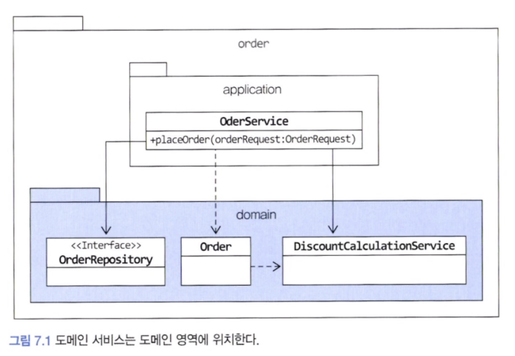
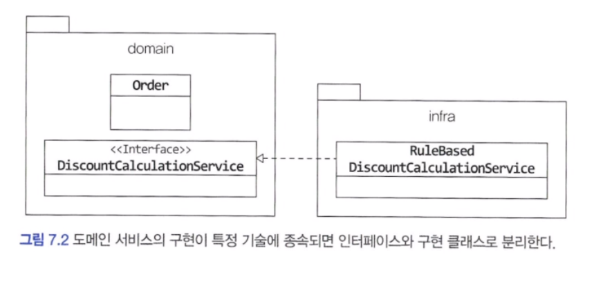

## 여러 애그리거트가 필요한 기능

도메인 영역의 코드를 작성하다 보면, 한 애그리거트로 기능을 구현할 수 없을 때가 있습니다. 대표적인 예가 결제 금액 계산 로직입니다.

- 상품 애그리거트 : 구매하는 상품의 가격이 필요합니다. 또한 상품에 따라 배송비가 추가되기도 합니다.
- 주문 애그리거트 : 상품별로 구매 개수가 필요합니다.
- 할인 쿠폰 애그리거트 : 쿠폰별로 지정한 할인 금액이나 비율에 따라 주문 총 금액을 할인한다. 할인 쿠폰을 조건에 따라 중복 사용할 수 있다거나 지정한 카테고리의 상품에만 적용할 수 있다는 제약 조건이 있다면 할인 계산이 복잡해진다.
- 회원 애그리거트 : 회원 등급에 따라 추가 할인이 가능하다.

이 상황에서 실제 결제 금액을 계산해야 하는 주체는 어떤 애그리거트일까
생각해 볼 수 있는 방법은 주문 애그리거트가 필요한 데이터를 모두 가지도록 한 뒤 할인 금액 계산 책임을 주문 애그리거트에 할당하는 것이다.

```java
public class Order {
	...
	private Orderer orderer;
	private List<OrderLine> orderLines;
	private List<Coupon> usedCoupons;

	private Money calculatePayAmounts() {
		// 쿠폰별로 할인 금액을 구한다.
		...
		// 회원에 따른 추가 할인을 구한다.
		...
		// 실제 계산 금액 계산
	}

	private Money calculateDiscount(Coupon coupon) {
		// orderLines의 각 상품에 대해 쿠폰을 적용해서 할인 금액 계산하는 로직
		// 쿠폰의 적용 조건 등을 확인하는 코드
		// 정책에 따라 복잡한 if-else 계산 코드
		...
	}

	private Money calculateDiscount(MemberGrade grade) {
		// 등급에 따라 할인 금액 계산
	}
}
```


여기서 결제 금액 계산 로직이 주문 애그리거트의 책임이 맞을까??

이렇게 한 애그리거트의 넣기 애매한 도메인 기능을 억지로 특정 애그리거트에 구현하면 안 됩니다. 억지로 구현하면 애그리거트는 자신의 책임 범위를 넘어서는 기능을 구현하기 때문에 코드가 길어지고 외부에 대한 의존이 높아지게 되며 코드를 복잡하게 만들어 수정을 어렵게 만드는 요인이 됩니다. 게다가 애그리거트의 범위를 넘어서는 도메인 개념이 애그리거트에 숨어들어 명시적으로 들어나지 않게 됩니다.

이런 문제를 해소하는 가장 쉬운 방법이 하나 있는데 그것이 바로 도메인 기능을 별도 서비스로 구현하는 것입니다.


---

## 도메인 서비스

도메인 서비스는 도메인 영역에 위치한 도메인 로직을 표현할 때 사용합니다. 주로 다음 상황에서 도메인 서비스를 사용합니다.

- 계산 로직 : 여러 애그리거트가 필요한 계산 로직이나, 한 애그리거트에 넣기에는 다소 복잡한 계산 로직
- 외부 시스템 연동이 필요한 도메인 로직 : 구현하기 위해 타 시스템을 사용해야 하는 도메인 로직

#### 1) 계산 로직과 도메인 서비스

할인 금액 규칙 계산처럼 한 애그리거트에 넣기 애매한 도메인 개념을 구현하려면 애그리거트에 억지로 넣기보다는 도메인 서비스를 이용해서 도메인 개념을 명시적으로 드러내면 됩니다. 응용 영역의 서비스가 응용 로직을 다룬다면 도메인 서비스는 도메인 로직을 다룹니다.

도메인 영역의 애그리거트나 밸류와 같은 구성요소와 도메인 서비스를 비교할 때 다른 점은 도메인 서비스는 상태 없이 로직만 구현한다는 점입니다. 도메인 서비스를 구현하는 데 필요한 상태는 다른 방법으로 전달받습니다.

할인 금액 계산 로직을 위한 도메인 서비스는 다음과 같이 도메인의 의미가 드러나는 용어를 타입과 메서드 이름으로 갖습니다.

```java
public class DiscountCalculationService {

	public Money calculateDiscountAmounts(
		List<OrderLine> orderLines,
		List<Coupon> coupons,
		MemberGrade grade) {...}

}
```


할인 계산 서비스를 사용하는 주체는 애그리거트가 될 수도 있고 응용 서비스가 될 수도 있습니다. DiscountCalculationService를 다음과 같이 애그리거트의 결제 금액 계산 기능에 전달하면 사용 주체는 애그리거트가 됩니다.

```java
public class Order {

	public void calculateAmounts(
		DiscountCalculationService disCalSvc, MemberGrade grade) {
		Money totalAmounts = getTotalAmounts();
		discountAmounts = disCalSvc.calculateDiscountAmounts(this.orderLines, 
			this.coupons, grade);
		this.paymentsAmounts = totalAmounts.minus(discountAmounts);
	}
}
```

애그리거트 객체에 도메인 서비스를 전달하는 것은 응용 서비스 책임입니다.

```java
public class OrderService {
	private DiscountCalculationService discountCalculationService;

	@Transactional
	public OrderNo placeOrder(OrderRequest orderRequest) {
		OrderNo orderNo = orderRepository.nextId();
		Order order = createOrder(orderNo, orderRequest);
		orderRepository.save(order);
		// 응용 서비스 실행 후 표현 영역에서 필요한 값 리턴
		return orderNo;
	}

	private Order createOrder(OrderNo orderNo, OrderRequest orderReq) {
		Member member = findMember(orerReq.getOrderId());
		Order order = new Order(orderNo, orderReq.getOrderLines(),
				orderReq.getCoupons(), createOrderer(member),
				orderReq.getShipppingInfo());
		order.calculateAmounts(this.discountCalculationService, member.getGrade());
		return order;
	}
}
```


##### <span style="color:#ff0000">도메인 서비스 객체를 애그리거트에 주입하지 않기</span>

애그리거트의 메서드를 실행할 때 도메인 서비스 객체를 파라미터로 전달한다는 것은 애그리거트가 도메인 서비스에 의존한다는 것을 의미합니다. 이때 DI 를 통해 주입받고 싶을 수 있는데

도메인 객체는 필드(프로퍼티)로 구성된 데이터와 메서드를 이용해서 개념적으로 하나인 도메인 모델을 표현합니다. 모델의 데이터를 담는 필드는 모델에서 중요한 구성요소입니다. 그런데 discoutCalculationService 필드는 데이터 자체와는 관련이 없습니다.

또 Order가 제공하는 모든 기능에서 discountCalculationService를 필요로 하는것도 아닙니다.

애그리거트 메서드를 실행할 때 도메인 서비스를 인자로 전달하지 않고 반대로 도메인 서비스의 기능을 실행할 때 애그리거트를 전달하기도 합니다. 이런 식으로 동작하는 것 중 하나가 계좌 이체 기능입니다.

```java
public class TransferService {
	public void transfer(Account fromAcc, Account toAcc, Money amounts) {
		fromAcc.withdraw(amounts);
		toAcc.credit(amounts);
	}
}
```


응용 서비스는 두 Account 애그리거트를 구한 뒤에 해당 도메인 영역의 TransferService를 이용해서 계좌 이체 도메인 기능을 실행할 것입니다.

도메인 서비스는 도메인 로직을 수행하지 응용 로직을 수행하진 않습니다. 트랜잭션 처리와 같은 로직은 응용 로직이므로 도메인 서비스가 아닌 응용 서비스에서 처리해야 합니다.

> 특정 기능이 응용 서비스인지 도메인 서비스인지 감을 잡기 어려울 때는 해당 로직이 애그리거트의 상태를 변경하거나 애그리거트의 상태 값을 계산하는지 검사해 보면 됩니다.
> 애그리거트를 변경하고 애그리거트의 값을 계산하는 도메인 로직이면서 한 애그리거트에 넣기에 적합하지 않으면 도메인 서비스로 구현하면 됩니다.

#### 2) 외부 시스템 연동과 도메인 서비스

외부 시스템이나 타 도메인과의 연동 기능도 도메인 서비스가 될 수 있습니다. 시스템 간 연동은 HTTP API 호출로 이루어질 수 있지만, 설문 조사 도메인 입장에서는 사용자가 설문 조사 생성 권한을 가졌는지 확인하는 도메인 로직으로 볼 수 있습니다. 이 도메인 로직은 다음과 같은 도메인 서비스로 표현할 수 있습니다. 여기서 중요한 점은 도메인 로직 관점에서 인터페이스를 작성했다는 것입니다. 역할 관리 시스템과 연동한다는 관점으로 인터페이스를 작성하지 않았습니다.

```java
public interface SurveyPermissionChecker {
	boolean hasUserCreationPermission(String userId);
}
```

응용 서비스는 이 도메인 서비스를 이용해서 생성 권한을 검사합니다.
SurveyPermissionChecker 인터페이스를 구현한 클래스는 인프라스트럭처 영역에 위치해 연동을 포함한 권한 검사 기능을 구현합니다.

#### 3) 도메인 서비스의 패키지 위치

도메인 서비스는 도메인 로직을 표현하므로 도메인 서비스의 위치는 다른 도메인 구성요소와 동일한 패키지에 위치합니다.




도메인 서비스의 개수가 많거나 엔티티나 밸류와 같은 다른 구성요소와 명시적으로 구분하고 싶다면 domain 패키지 밑에 domain.model, domain.service, domain.repository와 같이 하위 패키지를 구분하여 위치시켜도 됩니다.

#### 4) 도메인 서비스의 인터페이스와 클래스

도메인 서비스의 로직이 고정되어 있지 않은 경우 도메인 서비스 자체를 인터페이스로 구현하고 이를 구현한 클래스를 둘 수도 있습니다. 특히 도메인 로직을 외부 시스템이나 별도 엔진을 이용해서 구현할 때 인터페이스와 클래스를 분리하게 됩니다.




위 그림과 같이 도메인 서비스의 구현이 특정 구현 기술에 의존하거나 외부 시스템의 API를 실행한다면 도메인 영역의 도메인 서비스는 인터페이스로 추상화해야 합니다. 이를 통해 도메인 영역이 특정 구현에 종속되는 것을 방지할 수 있고 도메인 영역에 대한 테스트가 쉬워집니다.