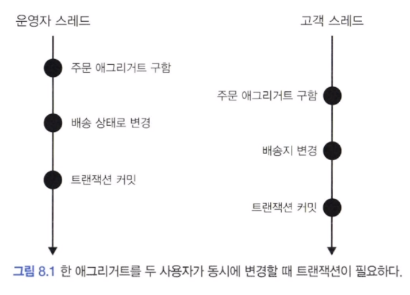
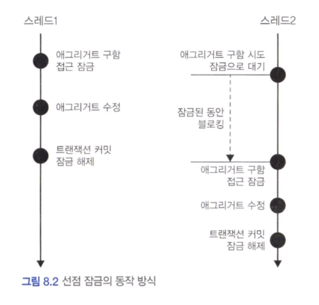
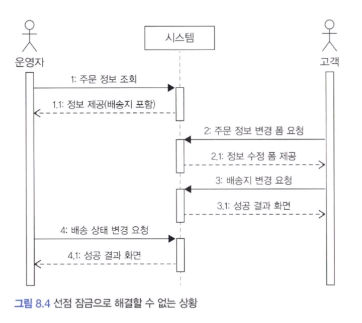
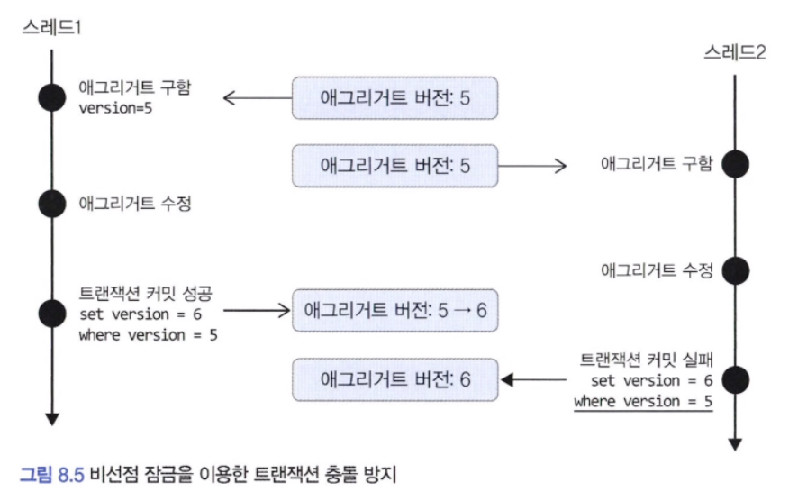
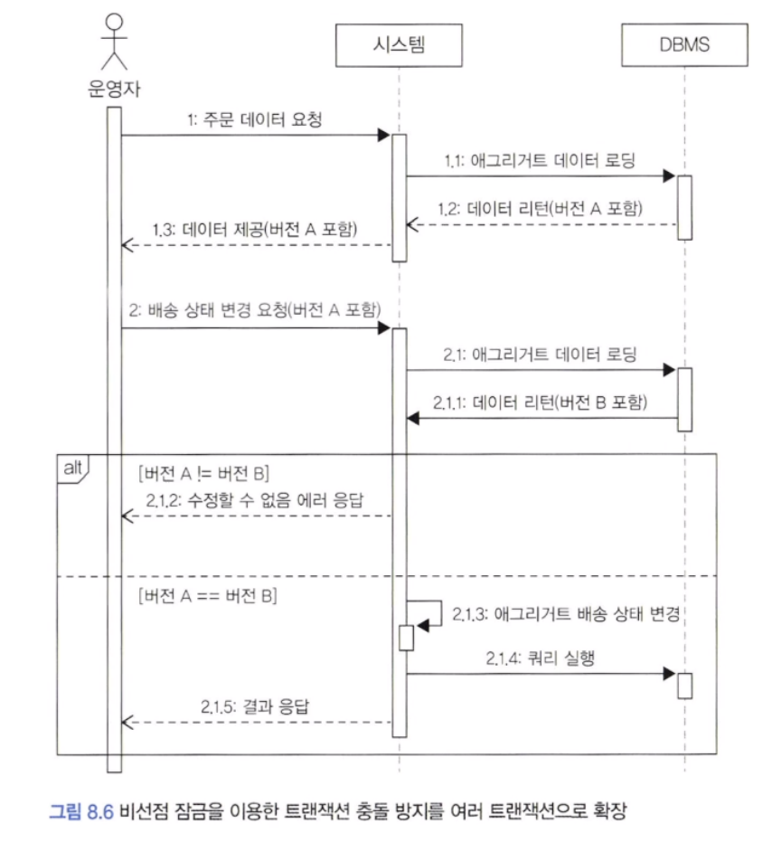

## 애그리거트와 트랜잭션



트랜잭션마다 리포티저리는 새로운 애그리거트 객체를 생성하므로 운영자 스레드와 고객 스레드는 같은 주문 애그리거트를 나타내는 다른 객체를 구하게 됩니다.

운영자 스레드와 고객 스레드는 개념적으로 동일한 애그리거트지만 물리적으로 서로 다른 애그리거트 객체를 사용합니다. 때문에 운영자 스레드가 주문 애그리거트 객체를 배송 상태로 변경 하더라도 고객 스레드가 사용하는 주문 애그리거트 객체에는 영향을 주지 않습니다. 고객 스레드 입장에서 주문 애그리거트 객체는 아직 배송 상태 전이므로 배송지 정보를 변경할 수 있습니다.

이 상황에서 두 스레드는 각각 트랜잭션을 커밋할 때 수정 내용을 DB에 반영합니다. 이 시점에 배송 상태로 바뀌고 배송지 정보도 바뀌게 됩니다. 이 순서의 문제점은 운영자는 기존 배송지 정보를 이용해서 배송 상태로 변경했는데 그 사이 고객은 배송지 정보를 변경했다는 점입니다. 즉, 애그리거트의 일관성이 깨지는 것입니다.

일관성이 깨지는 문제가 발생하지 않도록 하려면 다음 두 가지 중 하나를 해야 합니다.

- 운영자가 배송지 정보를 조회하고 상태를 변경하는 동안, 고객이 애그리거트를 수정하지 못하게 막는다.
- 운영자가 배송지 정보를 조회한 이후에 고객이 정보를 변경하면, 운영자가 애그리거트를 다시 조회한 뒤 수정하도록 한다.

DBMS가 지원하는 트랜잭션과 함께 애그리거트를 위한 추가적인 트랜잭션 처리 기법이 필요합니다. 애그리거트에 대해 사용할 수 있는 대표적인 트랜잭션 처리 방식에는 선점 잠금과 비선점 잠금의 두 가지 방식이 있습니다.


---

## 선점 잠금(Pessimistic Lock)

선점 점감은 먼저 애그리거트를 구한 스레드가 애그리거트 사용이 끝날 때까지 다른 스레드가 해당 애그리거트를 수정하지 못하게 막는 방식입니다.



위 그림과 같이 스레드 1이 선점 잠금 방식으로 애르기러트를 구한 뒤 이어서 스레드 2가 같은 애그리거트를 구하고 있습니다. 이때 스레드2는 스레드 1이 애그리거트에 대한 잠금을 해제할 때까지 블로킹 됩니다.

스레드1이 트랜잭션을 커밋한 뒤에 스레드2가 애그리거트를 구하게 되므로 스레드2는 스레드1이 수정한 애그리거트의 내용을 보게 됩니다.

한 스레드가 애그리거트를 구하고 수정하는 동안 다른 스레드가 수정할 수 없으므로 동시에 애그리거트를 수정할 때 발생하는 데이터 충돌 문제를 해소할 수 있습니다.

> 선점 잠금은 보통 DBMS가 제공하는 행단위 잠금을 사용해서 구현합니다. 오라클을 비롯한 다수의 DBMS가 for update와 같은 쿼리를 사용해서 특정 레코드에 한 커넥션만 접근할 수 있는 잠금장치를 제공합니다.

#### 1) 선점 잠금과 교착 상태

선점 잠금 기능을 사용할 때는 잠금 순서에 따른 교착 상태(dead lock)가 발생하지 않도록 주의해야 합니다.

선점 잠금에 따른 교착 상태는 상대적으로 사용자 수가 많을 때 발생할 가능성이 높고, 사용자 수가 많아지면 교착 상태에 빠지는 스레드는 더 빠르게 증가합니다. 더 많은 스레드가 교착 상태에 빠질수록 시스템은 아무것도 할 수 없는 상태가 됩니다.

이런 문제가 발생하지 않도록 하려면 잠금을 구할 때 최대 대기 시간을 지정해야 합니다. Spring data jpa 에서는 @QueryHints 애너테이션을 사용해서 쿼리 힌트를 지정할 수 있습니다.

> DBMS에 따라 교착 상태에 빠진 커넥션을 처리하는 방식이 다릅니다. 쿼리별로 대기 시간을 지정할 수 있는 DBMS가 있고, 커넥션 단위로만 대기 시간을 지정할 수 있는 DBMS도 있습니다. 따라서 선점 잠금을 사용하려면 사용하는 DBMS에 대해 JPA가 어떤 식으로 대기 시간을 처리하는지 반드시 확인해야 합니다.


---

## 비선점 잠금(Optimistic Lock)

선점 잠금이 강력해 보이긴 하지만 선점 잠금으로 모든 트랜잭션 충돌 문제가 해결되는 것은 아닙니다.




위 그림의 실행 순서는 다음과 같습니다.

1. 운영자는 배송을 위해 주문 정보를 조회한다. 시스템은 정보를 제공한다.
2. 고객이 배송지 변경을 위해 변경 폼을 요청한다. 시스템은 변경 폼을 제공한다.
3. 고객이 새로운 배송지를 입력하고 폼을 전송하여 배송지를 변경한다.
4. 운영자가 1번에서 조회한 주문 정보를 기준으로 배송지를 정하고 배송 상태 변경을 요청한다.

여기에서 문제는 운영자가 배송지 정보를 조회하고 배송 상태로 변경하는 사이에 고객이 배송지를 변경한다는 것입니다. 운영자는 고객이 변경하기 전 배송지 정보를 이용하여 배송 준비를 한 뒤에 배송 상태로 변경하게 됩니다. 즉, 배송 상태 변경 전에 배송지를 한 번 더 확인하지 않으면 운영자는 다른 배송지로 물건을 발송하게 되고, 고객은 배송지를 변경했음에도 불구하고 엉뚱한 곳으로 주문한 물건을 받는 상황이 발생합니다.

이 문제는 선점 잠금 방식으로 해결할 수 없습니다. 이때 필요한 것이 비선점 잠금입니다. 비선점 잠금은 동시에 점근하는 것을 막는 대신 변경한 데이터를 실제 DBMS에 반영하는 시점에 변경 가능 여부를 확인하는 방식입니다.

비선점 잠금을 구하려면 애그리거트에 버전으로 사용할 숫자 타입 프로퍼티를 추가해야 합니다.

```sql
UPDATE aggtable SET version = version + 1, colx = ?, coly = ?
WHERE aggid = ? and version = 현재버전
```

이 쿼리는 수정할 애그리거트와 매핑되는 테이블의 버전 값이 현재 애그리거트의 버전과 동일한 경우에만 데이터를 수정합니다.




JPA는 버전을 이용한 비선점 잠금 기능을 지원합니다. 버전으로 사용할 필드에 @Version 애너테이션을 붙이고 매핑되는 테이블에 버전을 저장할 칼럼을 추가하면 됩니다.

응용 서비스는 버전에 대해 알 필요가 없습니다. 리포지터리에서 필요한 애그리거트를 구하고 알맞은 기능만 실행하면 됩니다. 기능 실행 과정에서 애그리거트 데이터가 변경되면 JPA는 트랜잭션 종료 시점에 비선점 잠금을 위한 쿼리를 실행합니다.

비선점 잠금을 위한 쿼리를 실행할 때 쿼리 실행 결과로 수정된 행의 개수가 0이면 이미 누군가 앞서 데이터를 수정한 것입니다. 이는 트랜잭션이 충돌할 것이므로 트랜잭션 종료 시점에 예외가 발생합니다. Spring 에서는 JPA에서는 OptimisticLockingFailureException 이 발생합니다.




위 그림의 과정 2에서 운영자는 배송 상태 변경을 요청할 때 앞서 과정 1을 통해 받은 애그리거트 버전 값을 함께 전송합니다. 시스템은 애그리거트를 조회할 때 버전 값도 함께 읽어옵니다. 만약 과정 1에서 받은 버전 A와 과정 2.1을 통해 읽은 애그리거트의 버전 B가 다르면 과정 1과 과정 2 사이에 다른 사용자가 해당 애그리거트를 수정한 것입니다. 이 경우 시스템은 운영자가 이전 데이터를 기준으로 작업을 요청한 것으로 간주하여 2.1.2와 같이 수정할 수 없다는 에러를 응답합니다.

만약 버전 A와 버전 B가 같다면 과정 1과 과정2 사이에 애그리거트를 수정하지 않은 것입니다. 이 경우 시스템은 과정 2.1.3과 같이 애그리거트를 수정하고, 과정 2.1.4를 이용해서 변경 내용을 DBMS에 반영합니다. 과정 2.1.1과 과정 2.1.4 사이에 아무도 애그리거트를 수정하지 않았다면 커밋에 성공하므로 성공 결과를 응답합니다.

#### 1) 강제 버전 증가

애그리거트에 애그리거트 루트 외에 다른 엔티티가 존재하는데 기능 실행 도중 루트가 아닌 다른 엔티티의 값만 변경된다고 하자. 이 경우 JPA는 루트 엔티티의 버전 값을 증가시키지 않습니다. 연관된 엔티티의 값이 변경된다고 해도 루트 엔티티 자체의 값은 바뀌는 것이 없으므로 루트 엔티티의 버전 값은 갱신하지 않는 것입니다.

JPA는 이런 문제를 처리할 수 있도록 EntityManager#find() 메서드로 엔티티를 구할 때 강제로 버전 값을 증가시키는 잠금 모드를 지원합니다.

LockModeType.OPTIMISTIC_FORCE_INCREMENT 를 사용하면 해당 엔티티의 상태가 변경되었는지에 상관없이 트랜잭션 종료 시점에 버전 값 증가 처리를 합니다. 이 잠금 모드를 사용하면 애그리거트 루트 엔티티가 아닌 다른 엔티티나 밸류가 변경되더라도 버전 값을 증가시킬 수 있으므로 비선점 잠금 기능을 안전하게 적용할 수 있습니다.

> 스프링 데이터 JPA를 사용하면 @Lock 애너테이션을 이용해서 지정하면 됩니다.


---

## 오프라인 선점 잠금

컨플루언스는 문서를 편집할 때 누군가 먼저 편집을 하는 중이면 다른 사용자가 문서를 수정하고 있다는 안내 문구를 보여줍니다. 이런 안내를 통해 여러 사용자가 동시에 한 문서를 수정할 때 발생하는 충돌을 사전에 방지할 수 있게 해줍니다.

컨플루언스는 사전에 충돌 여부를 알려주지만 동시에 수정하는 것을 막지는 않습니다. 더 엄격하게 데이터 충돌을 막고 싶다면 누군가 수정 화면을 보고 있을 때 수정 화면 자체를 실행하지 못하도록 해야 합니다. 한 트랜잭션 범위에서만 적용되는 선점 잠금 방식이나 나중에 버전 충돌을 확인하는 비선점 잠금 방식으로는 이를 구현할 수 없습니다. 이때 필요한 것이 오프라인 선점 잠금 방식(Offline Pessimistic Lock)입니다.

단일 트랜잭션에서 동시 변경을 막는 선점 잠금 방식과 달리 오프라인 선점 잠금은 여러 트랜잭션에 걸쳐 동시 변경을 막습니다. 첫 번째 트랜잭션을 시작할 때 오프라인 잠금을 선점하고, 마지막 트랜잭션에서 잠금을 해제합니다. 잠금을 해제하기 전까지 다른 사용자는 잠금을 구할 수 없습니다.

![[Pasted image 20240713033328.png]]


위 그림에서 사용자 A가 과정 3의 수정 요청을 수행하지 않고 프로그램을 종료하면 어떻게 될까?? 이 경우 잠금을 해제하지 않으므로 다른 사용자는 영원히 잠금을 구할 수 없는 상황이 발생합니다. 이런 사태를 방지하기 위해 오프라인 선점 방식은 잠금 유효 시간을 가져야 합니다. 유효 시간이 지나면 자동으로 잠금을 해제해서 다른 사용자가 잠금을 일정 시간 후에 다시 구할 수 있도록 해야 합니다.

사용자 A가 잠금 유효 시간이 지난 후 1초 뒤에 3번 과정을 수행했다고 가정합니다. 잠금이 해제되어 사용자 A는 수정이 실패하게 됩니다. 이런 상황을 만들지 않으려면 일정 주기로 유효 시간을 증가시키는 방식이 필요합니다. 예를 들어 수정 폼에서 1분 단위로 Ajax 호출을 해서 잠금 유효 시간을 1분씩 증가시키는 방법이 있습니다.

#### 1) 오프라인 선점 잠금을 위한 LockManager 인터페이스와 관련 클래스

오프라인 선점 잠금은 크게 잠금 선점 시도, 잠금 확인, 잠금 해제, 잠금 유효시간 연장의 네 가지 기능이 필요합니다. 이 기능을 위한 LockManager 인터페이스는 아래와 같습니다.

```java
public interface LockManager {
	LockId tryLock(String type, String id) throws LockException;

	void checkLock(LockId lockId) throws LockException;

	void releaseLock(LockId lockId) throws LockException;

	void extendLockExpiration(LockId lockId, long inc) throws LockException;
}
```

이 책의 예제에서는 각 잠금마다 고유 식별자를 갖도록 구현했습니다.

```java
public class LockId {
	private String value;

	public LockId(String value) {
		this.value = value;
	}

	public String getValue() {
		return value;
	}
}
```

오프라이 선점 잠금이 필요한 코드는 LockManager#tryLock()을 이용해서 잠금을 시도합니다. 

```java
// 서비스 : 서비스는 잠금 ID를 리턴합니다.
public DataAndLockId getDataWithLock(Long id) {
	// 1. 오프라인 선점 잠금 시도
	LockId lockId = lockManager.tryLock("data", id);
	// 2. 기능 실행
	Data data = someDao.select(id);
	return new DataAndLockId(data, lockId);
}
```

이후 컨트롤러에서는 서비스가 리턴한 잠금 ID를 모델로 뷰에 전달합니다.

잠금을 선점하는 데 실패하면 LockException이 발생합니다. 이때는 다른 사용자가 데이터를 수정 중이니 나중에 다시 시도하라는 안내 화면을 보여주면 됩니다.

잠금을 해제하는 코드는 전달받은 LockId를 이용합니다.

```java
// 서비스 : 잠금을 해제한다.
public void edit(EditRequest editReq, LockId lockId) {
	// 1. 잠금 선점 확인
	lockManager.checkLock(lockId);
	// 2. 기능 실행
	...
	// 3. 잠금 해제
	lockmanager.releaseLock(lockId);
}
```

서비스 코드를 보면 LockManager#checkLock() 메서드를 가장 먼저 실행하는데, 잠금을 선점한 이후에 실행하는 기능은 다음과 같은 상황을 고려하여 반드시 주어진 LockId를 갖는 잠금이 유효한지 확인해야 합니다.

- 잠금 유효 시간이 지났으면 이미 다른 사용자가 잠금을 선점합니다.
- 잠금을 선점하지 않은 사용자가 기능을 실행했다면 기능 실행을 막아야 합니다.

#### 2) DB를 이용한 LockManager 구현

DB를 이용한 LockManager를 구현해 보겠습니다. 잠금 정보를 저장할 테이블과 인덱스를 아래와 같이 생성합니다.

```sql
create table locks (
	'type' varchar(255),
	id varchar(255),
	lockid varchar(255),
	expiration_time datetime,
	primary key('type', id)
) character set utf8;

create unique index locks_idx on locks(lockid)
```

Order 타입의 1번 식별자를 갖는 애그리거트에 대한 잠금을 구하고 싶다면 다음의 insert 쿼리를 이용해서 locks 테이블에 데이터를 삽입하면 됩니다.

```sql
insert into locks value ('Order', '1', '생성한 lockid', '2016-03-28 09:10:00');
```

type과 id 칼럼을 주요키로 지정해서 동시에 두 사용자가 특정 타입 데이터에 대한 잠금을 구하는 것을 방지했습니다.
각 잠금마다 새로운 lockId를 사용하므로 lockid 필드를 유니크 인덱스로 설정했습니다. 잠금 유효 시간을 보관하기 위해 expiration_time 칼럼을 사용합니다.

locks 테이블의 데이터를 담을 LockData 클래스르 아래와 같이 작성했습니다.

```java
public class lockData {
	private String type;
	private String id;
	private String lockId;
	private long expirationTime;

	// 생성자
	// getter
	public boolean isExpired() {
		return expirationTime < System.currentTimeMillis();
	}
}
```


아래 코드는 LockManager를 구현한 코드입니다. 그중 가장 긴 tryLock() 부분을 나타낸 코드입니다.

```java
@Component
public class SpringLockManager implements LockManager {
	private int lockTimeout = 5 * 60 * 1000;
	private JdbcTemplate jdbcTemplate;

	private RowMapper<LockData> lockDataRowMapper = (rs, rowNum) -> new LockData(...);

	@Transactional(propagation = Propagation.REQUIRES_NEW)
	@Override
	public LockId tryLock(String type, String id) throws LockException {
		checkAlreadyLocked(type, id);
		LockId lockId = new LockId(UUID.randomUUID().toString());
		locking(type, id, lockId);
		return lockId;
	}

	private void checkAlreadyLocked(String type, String id) {
		List<LockData> locks = jdbcTemplate.query(
			"select * from locks where type = ? and id = ?",
			lockDataRowMapper, type, id);
		Optional<lockData> lockData = handleExpiration(locks);
		if (lockData.isPresent()) throw new AlreadyLockedException();
	}

	private Optional<LockData> handleExpiration(List<LockData> locks) {
		if (locks.isEmpty()) return Optional.empty();
		LockData lockData = locks.get(0);
		if (lockData.isExpired()) {
			jdbcTemplate.update(
				"delete from locks where type =? and id = ?",
				lockData.getType(), lockData.getId());
			return Optional.empty();
		} else {
			return Optional.of(lockData);
		}
	}

	private void locking(String type, String id, lockId lockId) {
		try {
			int updateCount = jdbcTemplate.update(
				"insert into locks values (?, ?, ?, ?)",
				type, id, lockId.getValue(), new Timestamp(getExpirationTime()));
			if (updateCount == 0) throw new LockingFailException();
		} catch (DuplicateKeyException e) {
			throw new LockingFailException(e);
		}
	}

	private long getExpirationTime() {
		return System.currentTimeMillis() + lockTimeout;
	}
}
```


tryLock() 메서드를 기준으로 전체 흐름을 살펴보면 checkAlreadyLocked() 메서드를 이용해서 이미 잠금이 선점됐는지 확인하고, locking() 메서드로 잠금을 선점합니다.

SpringLockManager의 나머지 구현 코드는 아래와 같습니다.

```java
@Component
public class SpringLockManager implements LockManager {
	private int lockTimeout = 5 * 60 * 1000;
	private JdbcTemplate jdbcTemplate;

	private RowMapper<LockData> lockDataRowMapper = (rs, rowNum) -> new LockData(...);

	@Transactional(propagation = Propagation.REQUIRES_NEW)
	@Override
	public void checkLock(LockId lockId) throws LockException {
		Optional<LockData> lockData = getLockData(lockId);
		if (!lockData.isPresent()) throw new NoLockException();
	}

	private Optional<LockData> getLockData(Lockid lockId) {
		List<LockData> locks = jdbcTemplate.query(
			"select * from locks where lockid = ?",
			lockDataRowMapper, lockId.getValue());
		return handleExpiration(locks);
	}

	@Transactional(propagation = Propagation.REQUIRES_NEW)
	@Override
	public void extendLockExpiration(Lockid lockId, long inc) {
		Optional<LockData> lockDataOpt = getLockData(lockId);
		LockData lockData = 
			lockDataOpt.orElseThrow(() -> new NoLockException());
		jdbcTemplate.update(
			"update locks set expiration_time = ? where type = ? AND id = ?",
			new Timestamp(lockData.getTimestamp() + ind),
			lockData.getType(), lockData.getId());
	}

	@Transactional(propagation = Propagation.REQUIRES_NEW)
	@Override
	public void releaseLock(LockId lockId) throws LockException {
		jdbcTemplate.update(
			"delete from locks where lockid = ?", lockId.getValue);
	}
}
```

