## 도메인 모델과 경계

처음 도메인 모델을 만들 때 빠지기 쉬운 함정이 도메인을 완벽하게 표현하는 단일 모델을 만드는 시도를 하는 것입니다. 한 도메인은 다시 여러 하위 도메인으로 구분되기 때문에 한 개의 모델로 여러 하위 도메인을 모두 표현하려고 시도하면 오히려 모든 하위 도메인에 맞지 않는 모델을 만들게 됩니다.

논리적으로 같은 존재처럼 보이지만 하위 도메인에 따라 다른 용어를 사용하는 경우도 있습니다. 카탈로그 도메인에서의 상품이 검색 도메인에서는 문서로 불리기도 합니다. 비슷하게 시스템을 사용하는 사람을 회원 도메인에서는 회원이라고 부르지만, 주문 도메인에서는 주문자라고 부르고, 배송 도메인에서는 보내는 사람이라고 부르기도 합니다.

이렇게 하위 도메인마다 같은 용어라도 의미가 다르고 같은 대상이라도 지칭하는 용어가 다를 수 있기 때문에 한 개의 모델로 모든 하위 도메인을 표현하려는 시도는 올바른 방법이 아니며 표현할 수도 없습니다.

올바른 도메인 모델을 개발하려면 하위 도메인마다 모델을 만들어야 합니다. 각 모델은 명시적으로 구분되는 경계를 가져서 섞이지 않도록 해야 합니다. 여러 하위 도메인의 모델이 섞이기 시작하면 모델의 의미가 약해질 뿐만 아니라 여러 도메인의 모델이 서로 얽히기 때문에 각 하위 도메인별로 다르게 발전하는 요구사항을 모델에 반영하기 어려워집니다.

<span style="color:#ff0000">모델은 특정한 컨텍스트(문맥) 하에서 완전한 의미를 갖습니다.</span> 같은 제품이라도 카탈로그 컨텍스트와 재고 컨텍스트에서 의미가 서로 다릅니다. 이렇게 구분되는 경계를 갖는 컨텍스트를 DDD에서는 <span style="color:#ff0000">바운디드 컨텍스트</span>라고 부릅니다.


---

## 바운디드 컨텍스트

바운디드 컨텍스트는 모델의 경계를 결정하며 한 개의 바운디드 컨텍스트는 논리적으로 한 개의 모델을 갖습니다. 

- 바운디드 컨텍스트는 용어를 기준으로 구분합니다. 카탈로그 먼텍스트와 재고 컨텍스트는 서로 다른 용어를 사용하므로 이 용어를 기준으로 컨텍스트를 분리할 수 있습니다.
- 또한 바운디드 컨텍스트는 실제로 사용자에게 기능을 제공하는 물리적 시스템으로 도메인 모델은 이 바운디드 컨텍스트 안에서 도메인을 구현합니다.

이상적으로 하위 도메인과 바운디드 컨텍스트가 일대일 관계를 가지면 좋겠지만 현실은 그렇지 않을 때가 많습니다. 

- 바운디드 컨텍스트는 기업의 팀 조직 구조에 따라 결정되기도 합니다.
- 용어를 명확하게 구분하지 못해 두 하위 도메인을 하나의 바운디드 컨텍스트에서 구현하기도 합니다.

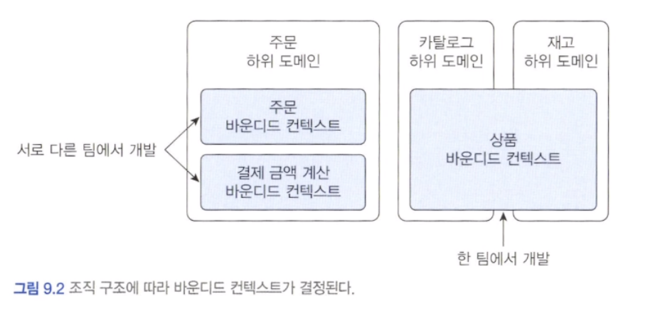


규모가 작은 기업은 전체 시스템을 한 개 팀에서 구현할 때도 있습니다. 즉, 여러 하위 도메인을 한 개의 바운디드 컨텍스트에서 구현합니다.

여러 하위 도메인을 하나의 바운디드 컨텍스트에서 개발할 때 주의할 점은 하위 도메인의 모델이 섞이지 않도록 하는 것입니다. 한 프로젝트에 각 하위 도메인의 모델이 위치하면 아무래도 전체 하위 도메인을 위한 단일 모델을 만들고 싶은 유혹에 빠지기 쉽습니다. 비록 한 개의 바운디드 컨텍스트가 여러 하위 도메인을 포함하더라도 하위 도메인마다 구분되는 패키지를 갖도록 구현해야 하며, 이렇게 함으로써 하위 도메인을 위한 모델이 서로 뒤섞이지 않고 하위 도메인마다 바운디드 컨텍스트를 갖는 효과를 낼 수 있습니다.

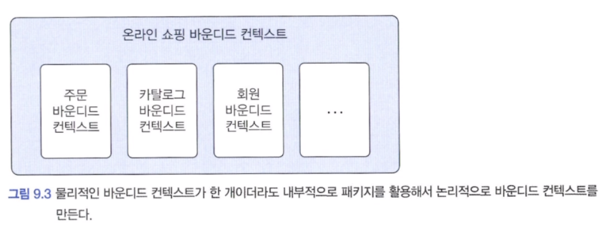


바운디드 컨텍스트는 도메인 모델을 구분하는 경계가 되기 때문에 바운디드 컨텍스트는 구현하는 하위 도메인에 알맞은 모델을 포함합니다.

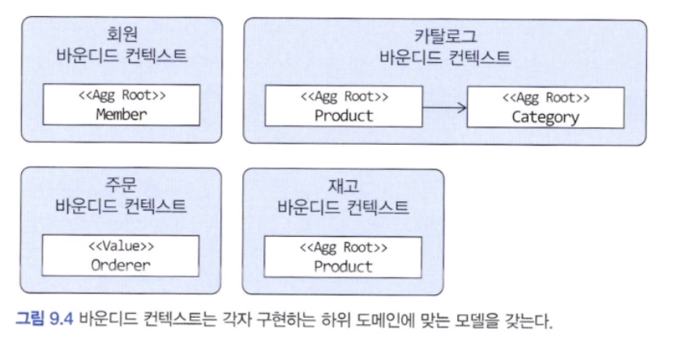


---

## 바운디드 컨텍스트 구현

바운디드 컨텍스트가 도메인 모델만 포함하는 것은 아닙니다. 바운디드 컨텍스트는 도메인 기능을 사용자에게 제공하는 데 필요한 표현 영역, 응용 서비스, 인프라스트럭처 영역을 모두 포함합니다. 도메인 모델의 데이터 구조가 바뀌면 DB 테이블 스키마도 함께 변경해야 하므로 테이블도 바운디드 컨텍스트에 포함됩니다.

표현 영역은 인간 사용자를 위해 HTML 페이지를 생성할 수도 있고, 다른 바운디드 컨텍스트를 위해 REST API를 제공할 수도 있습니다.

모든 바운디드 컨텍스트를 반드시 도메인 주도로 개발할 필요는 없습니다. 즉, 복작하지 않은 로직은 CRUD 방식으로 구현해도 됩니다. 서비스 - DAO 구조를 사용하면 도메인 기능이 서비스에 흩어지게 되지만 도메인 기능 자체가 단순하면 서비스 - DAO로 구성된 CRUD 방식을 사용해도 코드를 유지 보수하는 데 문제 되지 않는다고 저자는 생각합니다.

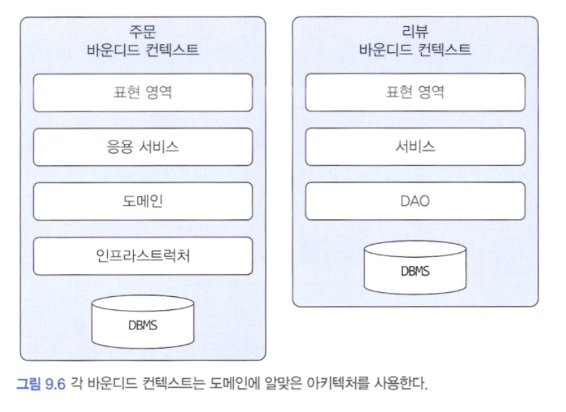


한 바운디드 컨텍스트에서 두 방식을 혼합해서 사용할 수도 있습니다. 대표적인 예가 CQRS 패턴입니다. 상태 변경과 관련된 기능은 도메인 모델 기반으로 구현하고 조회 기능은 서비스 - DAO 를 이용해서 구현할 수 있습니다.

각 바운디드 컨텍스트는 서로 다른 구현 기술을 사용할 수도 있습니다.

마지막으로 바운디드 컨텍스트가 반드시 사용자에게 보여지는 UI를 가지고 있어야 하는 것은 아닙니다.

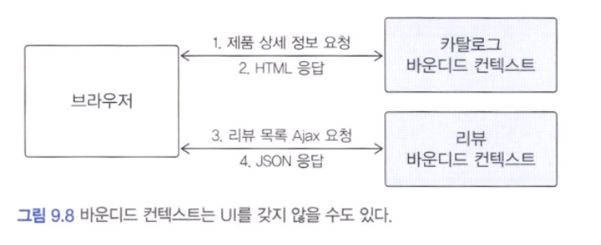


UI를 처리하는 서버를 두고 UI 서버에서 바운디드 컨텍스트와 통신해서 사용자 요청을 처리하는 방법도 있습니다. 이 구조에서 UI 서버는 각 바운디드 컨텍스트를 위한 파사드 역할을 수행합니다. 브라우저가 UI 서버에 요청을 보내면 UI 서버는 카탈로그와 리뷰 바운디드 컨텍스트로부터 필요한 정보를 읽어와 조합한 뒤 브라우저에 응답을 제공합니다.

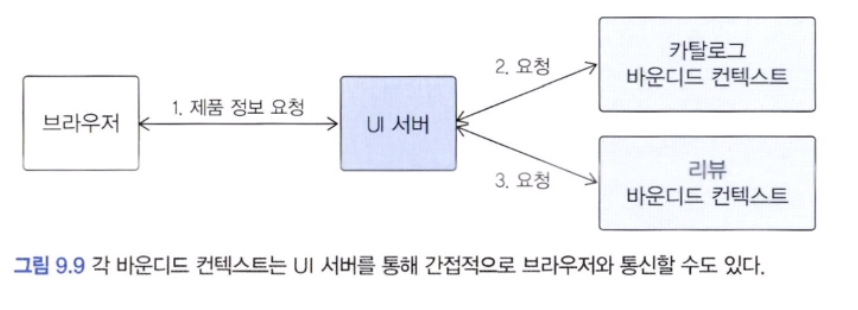


---

## 바운디드 컨텍스트 간 통합

온라인 쇼핑 사이트에서 매출 증대를 위해 카탈로그 하위 도메인에 개인화 추천 기능을 도입하기로 했다고 가정합니다. 기존 카탈로그 시스템을 개발하던 팀과 별도로 추천 시스템을 담당하는 팀이 새로 생겨서 이 팀에서 주도적으로 추천 시스템을 만들기로 했습니다. 이렇게 되면 카탈로그 하위 도메인에는 기존 카탈로그를 위한 바운디드 컨텍스트와 추천 기능을 위한 바운디드 컨텍스트가 생깁니다.

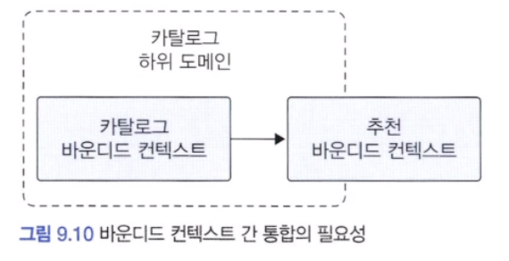


두 팀이 관련된 바운디드 컨텍스트를 개발하면 자연스럽게 두 바운디드 컨텍스트 간 통합이 발생합니다. 예를 들어 사용자가 제품 상세 페이지를 볼 때, 보고 잇는 상품과 유사한 상품 목록을 하단에 보여준다 등이 있습니다.

사용자가 카탈로그 바운디드 컨텍스트에 추천 제품 목록을 요청하면 카탈로그 바운디드 컨텍스트는 추천 바운디드 컨텍스트로부터 추천 정보를 읽어와 추천 제품 목록을 제공합니다. 이때 카탈로그 컨텍스트와 추천 컨텍스트의 도메인 모델은 서로 다릅니다. 이때 카탈로그와 추천 도메인이 다를 수 있습니다.

카탈로그 시스템은 추천 시스템으로부터 추천 데이터를 받아오지만, 카탈로그 시스템에서는 추천의 도메인 모델을 사용하기보다는 카탈로그 도메인 모델을 사용해서 추천 상품을 표현해야 합니다. 즉, 다음과 같이 카탈로그의 모델을 기반으로 하는 도메인 서비스를 이용해서 상품 추천 기능을 표현해야 합니다.

```java
// 상품 추천 기능을 표현하는 도메인 서비스
public interface ProductRecommendationService {
	List<Product> getRecommendationOf(ProductId id);
}
```

도메인 서비스를 구현한 클래스는 인프라스트럭처 영역에 위치합니다. 이 클래스는 외부 시스템과의 연동을 처리하고 외부 시스템의 모델과 현재 도메인 모델 간의 변환을 책임집니다.

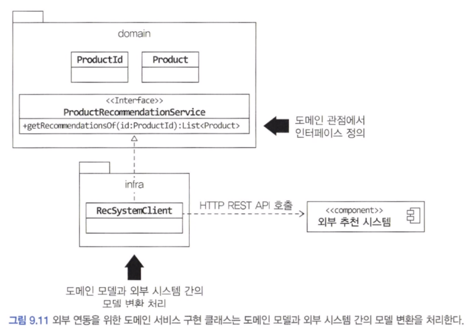


위 그림에서 RecSystemClient 는 외부 추천 시스템이 제공하는 REST API를 이용해서 특정 상품을 위한 추천 상품 목록을 로딩합니다. 또한 데이터를 읽어와 카탈로그 도메인에 맞는 상품 모델로 변환해줍니다.

만약 두 모델 간의 변환 과정이 복잡하다면 아래 그림과 같이 변환 처리를 위한 별도 클래스를 만들고 이 클래스에서 변환을 처리해도 됩니다.

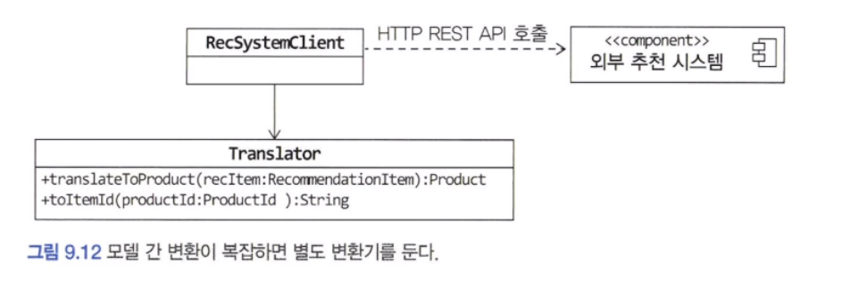


REST API를 호출하는 것은 두 바운디드 컨텍스트를 직접 통합하는 방법입니다. 직접 통합하는 대신 간접적으로 통합하는 방법도 있습니다. 대표적이 간접 통합 방식이 메시지 큐를 사용하는 것입니다.


카탈로그 바운디드 컨텍스트는 추천 시스템이 필요로 하는 사용자 활동 이력을 메시지 큐에 추가합니다. 추천 바운디드 컨텍스트는 큐에서 이력 메시지를 읽어와 추천을 계산하는 데 사용할 것입니다. 이것은 두 바운디드 컨텍스트가 사용할 메시지의 데이터 구조를 맞춰야 함을 의미합니다. 각각의 바운디드 컨텍스트를 담당하는 팀은 서로 만나서 주고받을 데이터 형식에 대해 협의해야 합니다.

> 두 바운디드 컨텍스트를 개발하는 팀은 메시징 큐에 담을 데이터의 구조를 협의하게 되는데 그 큐를 누가 제공하느냐에 따라 데이터 구조가 결정됩니다.

#### 마이크로서비스와 바운디드 컨텍스트

마이크로서비스는 애플리케이션을 작은 서비스로 나누어 개발하는 아키텍처 스타일입니다. 개별 서비스를 독립된 프로세스로 실행하고 각 서비스가 REST API나 메시징을 이용해서 통신하는 구조를 갖습니다.

이런 마이크로서비스의 특징은 바운디드 컨텍스트와 잘 어울립니다. 각 바운디드 컨텍스트는 모델의 경계를 형성하는데 바운디드 컨텍스트를 마이크로서비스로 구현하면 자연스럽게 컨텍스트별로 모델이 분리됩니다. 코드로 생각하면 마이크로서비스마다 프로젝트를 생성하므로 바운디드 컨텍스트마다 프로젝트를 만들게 됩니다.

별도 프로세스로 개발한 바운디드 컨텍스트는 독립적으로 배포하고 모니터링하며 확장되는데 이 역시 마이크로서비스가 갖는 특징입니다.


---

## 바운디드 컨텍스트 간 관계

바운디드 컨텍스트는 어떤 식으로든 연결되기 때문에 두 바운디드 컨텍스트는 다양한 방식으로 관계를 맺습니다. 두 바운디드 컨텍스트 간 관계 중 가장 흔한 관계는 한쪽에서 API를 제공하고 다른 한쪽에서 그 API를 호출하는 관계입니다. 이 관계에서 API를 사용하는 바운디드 컨텍스트는 API를 제공하는 바운디드 컨텍스트에 의존하게 됩니다.

> 따라서 각 팀은 반드시 개발 계획을 서로 공유하고 일정을 협의해야 합니다.

상류 컴포넌트는 보통 하류 컴포넌트가 사용할 수 있는 통신 프로토콜을 정의하고 이를 공개합니다. 이런 서비스를 공개 호스트 서비스라고 합니다.

공개 호스트 서비스의 대표적인 예가 검색입니다. 블로그, 카페, 게시판과 같은 서비스를 제공하는 포털은 각 서비스별로 검색 기능을 구현하기 보다는 검색을 위한 전용 시스템을 구축하고 검색 시스템과 각 서비스를 통합합니다.

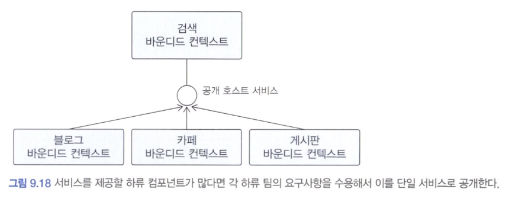


상류 컴포넌트의 서비스는 상류 바운디드 컨텍스트의 도메인 모델을 따릅니다. 따라서 하류 컴포넌트는 상류 서비스의 모델이 자신의 도메인 모델에 영향을 주지 않도록 보호해 주는 완충 지대를 만들어야 합니다.


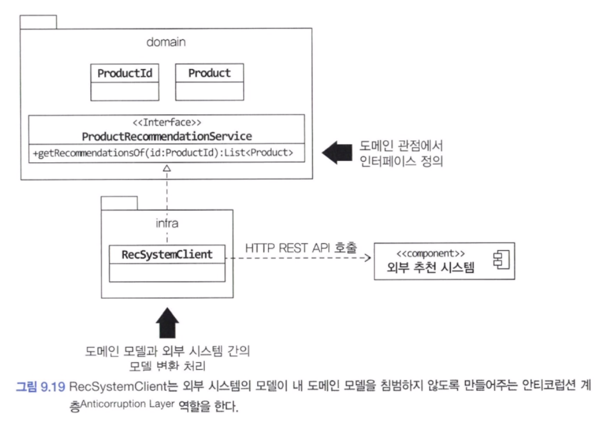


위 그림에서 RecSystemClient 는 외부 시스템과의 연동을 처리하는데 외부 시스템의 도메인 모델이 내 도메인 모델을 침범하지 않도록 막아주는 역할을 합니다. 즉, 내 모델이 깨지는 것을 막아주는 안티코럽션 계층이 됩니다. 이 계층에서 두 바운디드 컨텍스트 간의 모델 변환을 처리해 주기 때문에 다른 바운디드 컨텍스트의 모델에 영향을 받지 않고 내 도메인 모델을 유지할 수 있습니다.

두 바운디드 컨텍스트가 같은 모델을 공유하는 경우도 있습니다. 예를 들어 운영자를 위한 주문 관리 도구를 개발하는 팀과 고객을 위한 주문 서비스를 개발하는 팀이 다르다고 가정하자, 두 팀은 주문을 표현하는 모델을 공유함으로써 주문과 관련된 중복 설계를 막을 수 있습니다. 이렇게 두 팀이 공유하는 모델을 공유 커널이라고 부릅니다.

공유 커널의 장점은 중복을 줄여준다는 것입니다. 하지만 두 팀이 한 모델을 공유해야 하기 때문에 한 팀에서 임의로 모델을 변경하면 안 되며 두 팀이 밀접한 관계를 유지해야 합니다. 두 팀이 밀접한 관계를 형성할 수 없다면 공유 커널을 상요할 때의 장점보다 공유 커널로 인해 개발이 지연되고 정체되는 문제가 더 커지게 됩니다.

마지막으로 살펴볼 관계는 독립 방식입니다. 독립 방식 관계는 간단합니다. 그냥 서로 통합하지 않는 방식입니다. 두 바운디드 컨텍스트 간에 통합하지 않으므로 서로 독립적으로 모델을 발전시킵니다. 독립 방식에서 두 바운디드 컨텍스트 간의 통합은 수동으로 이루어집니다.

수동으로 통합하는 방식이 나쁜 것은 아니지만 규모가 커질수록 수동 통합에는 한계가 있으므로 규모가 커지기 시작하면 두 바운디드 컨텍스트를 통합해야 합니다. 이때 외부에서 구매한 솔루션과 ERP를 완전히 대체할 수 없다면 두 바운디드 컨텍스트를 통합해 주는 별도의 시스템을 만들어야 할 수도 있습니다.


---

## 컨텍스트 맵

개별 바운디드 컨텍스트에 매몰되면 전체를 보지 못할 때가 있습니다. 나무만 보고 숲을 보지 못하는 상황을 방지하려면 전체 비즈니스를 조망할 수 있는 지도가 필요한데 그것이 바로 <span style="color:#ff0000">컨텍스트 맵</span>입니다.

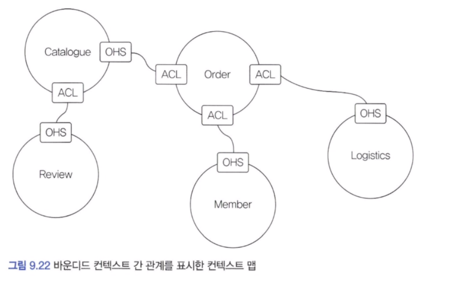


그림만 봐도 한눈에 각 바운디드 컨텍스트의 경계가 명확하게 드러나고 서로 어떤 관계를 맺고 있는지 알 수 있습니다. 바운디드 컨텍스트 영역에 주요 애그리거트를 함께 표시하면 모델에 대한 관계가 더 명확히 드러납니다. 오픈 호스트 서비스(OHS)와 안티코럽션 계층(ACL)만 표시했는데 하위 도메인이나 조직 구조를 함께 표시하면 도메인을 포함한 전체 관계를 이해하는 데 도움이 됩니다.

컨텍스트 맵은 시스템의 전체 구조를 보여줍니다. 이는 하위 도메인과 일치하지 않는 바운디드 컨텍스트를 찾아 도메인에 맞게 바운디드 컨텍스트를 조절하고 사업의 핵심 도메인을 위해 조직 역량을 어떤 바운디드 컨텍스트에 집중할지 파악하는 데 도움을 줍니다.

컨텍스트 맵을 그리는 규칙은 따로 없습니다. 위 그림과 같이 간단한 도형과 선을 이용해서 각 컨텍스트의 관계를 이해할 수 있는 수준에서 그리면 됩니다. 컨텍스트 맵은 단순하기 때문에 화이트보드나 파워포인트와 같은 도구를 이용해서 쉽게 그릴 수 있습니다.