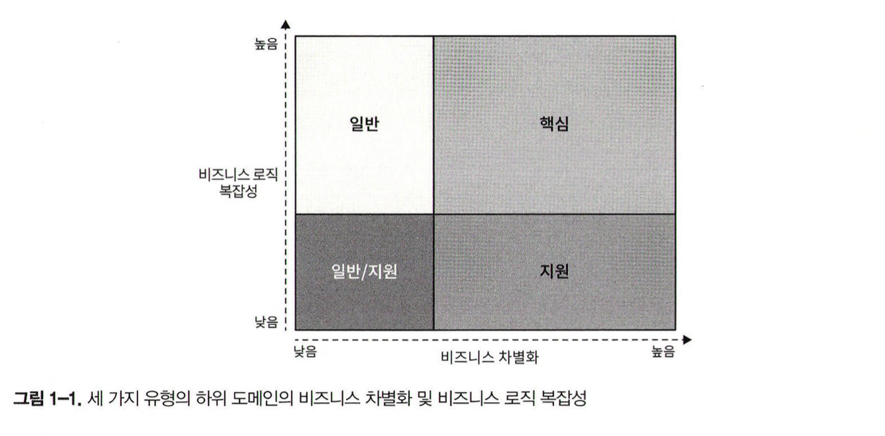

이번 장에서는 기업이 어떻게 돌아가는지 배울 것입니다. 기업이 존재하는 이유와 추구하는 목표가 무엇이며, 그 목표를 달성하기 위한 전략을 논의할 것입니다.

효과적인 솔루션을 설계하고 구축하기 위해서는 그것의 바탕이 되는 문제를 이해해야 합니다. 여기서 문제란 우리가 구축해야 하는 소프트웨어 시스템을 말합니다. 해결하고자 하는 문제를 이해하려면 그것이 존재하는 맥락을 이해해야 합니다.

> 즉, 그 조직의 비즈니스 전략과 소프트웨어를 만들면서 얻고자 하는 가치를 이해해야 합니다.

이번 장에서는 기업의 비즈니스 도메인과 구조, 즉 핵심 하위 도메인과 지원 하위 도메인, 일반 하위 도메인을 분석하기 위한 도구로서 도메인 주도 설계를 배우게 될 것입니다.

## 비즈니스 도메인이란?

비즈니스 도메인은 기업의 주요 활동 영역을 정의합니다. 일반적으로 말하자면 회사가 고객에게 제공하는 서비스를 말합니다. 기업은 여러 비즈니스 도메인을 운영할 수 있습니다. 예를 들어 AWS에서는 소매와 클라우드 서비스를 모두 제공합니다.

회사가 비즈니스 도메인을 자주 변경할 수 있다는 점도 주목해야 합니다. 대표적으로 노키아는 수년에 걸쳐 목재 가공, 고무 제조, 통신, 모바일 등 다양한 분야의 비즈니스 도메인을 운영했습니다.

---

## 하위 도메인이란?

비즈니스 도메인의 목표를 달성하기 위해 기업은 여러 가지 하위 도메인을 운영해야 합니다. 하위 도메인은 비즈니스 활동의 세분화된 영역입니다. 모든 회사의 하위 도메인은 고객에게 제공하는 서비스 단위로 비즈니스 도메인을 만듭니다. 하나의 하위 도메인을 만드는 것만으로는 회사가 성공하기 어렵습니다. 하위 도메인은 전체 시스템에서 하나의 구성요소일 뿐입니다. 각각의 하위 도메인은 회사의 비즈니스 도메인에서 목표를 달성하기 위해 서로 상호작용해야 합니다.

> 회사가 비즈니스 도메인에서 경쟁하려면 모든 하위 도메인이 함게 필요합니다.

#### 하위 도메인의 유형

하위 도메인은 서로 다른 전략적 비즈니스 가치를 가집니다. 도메인 주도 설계에서 하위 도메인은 핵심, 일반, 지원의 세 가지 유형으로 구분합니다.

#### 1. 핵심 하위 도메인

핵심 하위 도메인은 회사가 경쟁업체와 다르게 수행하고 있는 것을 말합니다. 가령 새로운 제품이나 서비스를 발명하거나 기존 프로세스를 최적화하여 비용을 줄이는 것이 그렇습니다.

예를 들어 우버의 핵심 하위 도메인은 수익에 영향을 미칩니다. 우버는 이렇게 경쟁사로부터 차별화합니다. 고객에게 더 좋은 서비스를 제공하고 수익성을 극대화하는 전략입니다. 경쟁력을 유지하기 위한 핵심 하위 도메인에는 발명이나 스마트 최적화, 비즈니스 노하우, 또는 다른 지적 재산이 포함됩니다.

\[복잡성]
구현하기 쉬운 핵심 하위 도메인은 일시적인 경쟁 우위만을 제공할 수 있습니다. 따라서 핵심 하위 도메인은 자연스럽게 복잡해집니다. 회사의 핵심 비즈니스는 높은 진입장벽이 있어야 합니다. 경쟁사가 회사의 솔루션을 모방하거나 복제하기 어려워야 합니다.

\[경쟁 우위의 원천]
핵심 하위 도메인에 반드시 기술이 들어가야 하는 것은 아님을 알아야 합니다. 모든 비즈니스 문제가 알고리즘이나 기술 솔루션으로 해결되지는 않습니다. 회사의 경쟁 우위는 다양한 원천에서 나올 수 있습니다.

> 참고로 핵심 하위 도메인은 핵심 도메인이라고도 부릅니다.

#### 2. 일반 하위 도메인

일반 하위 도메인은 모든 회사가 같은 방식으로 수행하는 비즈니스 활동을 말합니다. 핵심 하위 도메인과 마찬가지로 일반 하위 도메인은 일반적으로 복잡하고 구현하기 어렵습니다. 하지만 일반 하위 도메인은 회사에 경쟁력을 제공하지 않습니다.

예를 들어, 대부분의 시스템은 사용자를 인증하고 권한을 부여해야 합니다. 이때 전용 인증 메커니즘을 발명하는 대신에 기존에 만들어진 솔루션을 사용하는 것이 더 합리적입니다.

#### 3. 지원 하위 도메인

이름에서 알 수 있듯이 지원 하위 도메인은 회사의 비즈니스를 지원하는 활동을 말합니다. 그러나 핵심 하위 도메인과 달리 지원 하위 도메인은 어떠한 경쟁 우위도 제공하지 않습니다.

지원 하위 도메인의 차별되는 특징은 솔루션의 비즈니스 로직의 복합성입니다. 지원 하위 도메인은 간단합니다. 지원 하위 도메인의 비즈니스 로직은 대부분 데이터 입력 화면과 ETL 작업과 유사합니다. 이는 소위 말하는 CRUD 인터페이스를 말합니다. 이러한 활동 영역은 회사에 어떤한 경쟁 우위도 제공하지 않으므로 높은 진입장벽이 필요하지 않습니다.

---

## 하위 도메인 비교

#### 1. 경쟁 우위

핵심 하위 도메인만이 회사에 경쟁 우위를 제공합니다. 핵심 하위 도메인은 경쟁사와 차별화하기 위한 회사의 전략입니다. 정의에 따르면 일반 하위 도메인은 경쟁 우위의 원천이 될 수 없습니다. 일반 하위 도메인은 일반적인 솔루션을 의미하며, 우리 회사와 경쟁업체가 동일한 솔루션을 사용하기 때문에 경쟁 우위를 제공할 수 없습니다.

지원 하위 도메인은 진입장벽이 낮고 경쟁 우위도 제공할 수 없습니다. 일반적으로 경쟁사가 지원 하위 도메인을 복제해도 크게 신경 쓰지 않습니다. 업계 경쟁력에 영향을 주지 않기 때문입니다. 반대로 회사는 전략적으로 지원 하위 도메인으로 이미 만들어져 있는 일반적인 솔루션을 사용하는 것을 선호합니다.

#### 2. 복잡성

견고한 소프트웨어 솔루션을 설계하기 위해 하위 도메인을 식별하는 것은 반드시 필요합니다.

지원 하위 도메인의 비즈니스 로직은 간단합니다. 이것은 기본적인 ETL 작업과 CRUD 인터페이스이며, 비즈니스 로직이 명확합니다. 입력의 유효성을 검증하거나 다른 구조의 데이터로 변환하는 것 이상의 로직에서 벗어나지 않습니다.

일반 하위 도메인은 훨씬 더 복잡합니다. 다른 사람들이 이미 이러한 문제를 해결하는 데 시간과 노력을 투자한 데는 그럴 만한 이유가 있습니다. 이러한 솔루션은 간단하지만, 사소하지도 않습니다. 예를 들어, 암호화 알고리즘이나 인증 메커니즘을 생각할 수 있습니다.

핵심 하위 도메인은 복잡합니다. 회사의 수익성이 좌우되기 때문에 경쟁업체가 최대한 모방하기 어려워야 합니다. 그래서 회사는 전략적으로 핵심 하위 도메인으로 복잡한 문제를 해결하려고 합니다.

때때로 핵심 하위 도메인과 지원 하위 도메인을 구별하는 것이 어려울 수 있습니다. 이때 복잡성은 도메인을 구별하는 유용한 지침이 됩니다. 좀 더 기술적인 관전에서 소프트웨어 설계에 영향을 미치는 복잡한 핵심 하위 도메인을 식별하는 것이 중요합니다.

일반적인 솔루션이 존재하는 경우 그 기능을 자체 구현하기보다 일반적인 솔루션을 연동하는 편이 더 간단하거나 저렴하다면 일반 하위 도메인이 됩니다. 반대로 자체 구현이 더 간단하고 저렴하다면 지원 하위 도메인이 됩니다.

#### 3. 변동성

핵심 하위 도메인은 자주 변경될 수 있습니다. 결과적으로 핵심 하위 도메인에 대한 솔루션을 찾을 수는 있습니다. 다만, 다양한 구현 방법을 시도하고 개선하고 최적화해야 가능합니다. 또한 핵심 하위 도메인에 대한 개선 작업은 끝이 없습니다. 기업은 지속적으로 혁신하고 발전합니다. 경쟁사보다 앞서기 위해서 핵심 하위 도메인의 지속적인 진화는 필수적입니다.

핵심 하위 도메인과 달리 지원 하위 도메인은 자주 변경되지 않습니다. 지원 하위 도메인은 기업에 어떠한 경쟁 우위도 제공하지 않기 때문에 지원 하위 도메인의 개선은 핵심 하위 도메인에 투자한 동일한 노력에 비해 아주 작은 비즈니스 가치를 제공합니다.

기존 솔루션이 있음에도 불구하고 일반 하위 도메인은 시간이 지남에 따라 변경될 수 있습니다. 보안 패치, 버그 수정 또는 일반적인 문제에 대한 완전히 새로운 솔루션으로 변경될 수 있습니다.

#### 솔루션 전략

핵심 하위 도메인은 업계에서 기업이 다른 경쟁사와 경쟁할 수 있는 능력을 제공합니다. 핵심 하위 도메인은 비즈니스에 중요합니다. 물론 지원 하위 도메인과 일반 하위 도메인도 중요하다. 기업이 해당 비즈니스 도메인에서 일하려면 하위 도메인 모두가 필요하다. 하위 도메인은 기본적인 구성요소이므로 하나를 제거하면 전체 구조가 무너질 수 있습니다.

> 하위 도메인 각각의 고유한 속성을 활용하면 서로 다른 유형의 하위 도메인을 구현하기 위한 가장 효율적인 전략을 선택할 수 있습니다. 즉, 하위 도메인을 나누는 이유는 고유한 속성 파악을 통한 최적의 솔루션 도출 때문입니다.

핵심 하위 도메인은 사내에서 구현되어야 합니다. 또한 핵심 하위 도메인 구현을 하청하는 것도 현명하지 않습니다. 핵심 하위 도메인의 요구사항은 자주 그리고 지속적으로 변경될 것으로 예상되므로 솔루션은 유지보수가 가능하고 쉽게 개선될 수 있어야 합니다. 따라서 핵심 하위 도메인은 가장 진보된 엔지니어링 기술로 구현해야 합니다.

일반 하위 도메인은 어렵지만 이미 문제가 해결되었기 때문에 일반 하위 도메인을 사내에서 구현하는 데 시간과 노력을 투자하는 것보다 이미 만들어진 제품을 구입하거나 오픈소스 솔루션을 채택하는 것이 비용 면에서 더 효율적입니다.

경쟁 우위가 없기 때문에 사내에서 지원 하위 도메인을 구현하지 않는 것이 합리적입니다. 하지만 일반 하위 도메인과 달리 지원 하위 도메인은 기존에 만들어진 솔루션이 없는 경우가 있습니다. 이런 경우 기업에서 지원 하위 도메인을 자체 구현할 수밖에 없습니다.

인력 관점에서도 지원 하위 도메인은 고도로 숙련된 기술이 필요하지 않기 때문에 새로운 인재를 양성할 수 있는 좋은 연습 기회를 제공합니다.

#### 하위 도메인 경계 식별

하위 도메인과 해당 유형을 식별하면 소프트웨어 솔루션을 구축할 때 설계와 관련된 의사결정에 상당한 도움이 됩니다. 실제로 하위 도메인과 해당 경계를 식별하는 방법은 무엇일까??

대다수의 소프트웨어 프로젝트에서 하위 도메인은 어떤 식으로든 이미 존재합니다. 그렇다고 해서 경계를 식별하는 것이 항상 쉽고 간단하다는 의미는 아닙니다. 그래서 하위 도메인을 식별하고 분류하려면 도메인 분석을 직접 수행해야 합니다. 회사의 부서와 기타 조직 단위는 좋은 출발점입니다.

#### 하위 도메인 정제

크게 나눈 하위 도메인은 좋은 출발점이지만, 문제는 세부 사항에 있습니다. 비즈니스 기능이 복잡한 내용에 숨겨진 중요한 정보를 놓치지 않아야 합니다. 즉 특정 하위 도메인으로 나눈 이후 세부 사항을 분석하여 다시 도메인으로 나누면 여러 또 다른 하위 도메인이 도출되게 됩니다.

#### 응딥된 유스케이스를 하위 도메인으로

기술적인 관점에서 하위 도메인은 상호 연관되고 응집된 유스케이스의 집합과 유사합니다. 이러한 유스케이스 집합에서는 보통 동일한 행위자, 비즈니스 엔티티를 포함하고 모두 밀접하게 관련된 데이터의 집합을 다룹니다.

세분화된 하위 도메인을 찾는 것을 중단하는 시점을 결정하기 위한 지침으로 '응집된 유스케이스의 집합인 하위 도메인'이라는 정의를 사용할 수 있습니다. 이것은 하위 도메인의 가장 정확한 경계가 됩니다.

하위 도메인의 경계를 식별하기 위해 온 신경을 곤두세워 노력해야 할까? 핵심 하위 도메인에는 이러한 노력이 반드시 필요합니다. 핵심 하위 도메인은 가장 중요하고, 변동성이 있고, 복잡합니다. 따라서 가능한 한 많이 정제하는 것이 중요합니다.

하지만 지원 및 일반 하위 도메인의 경우에는 이러한 정제 작업을 다소 완화할 수 있습니다. 더 자세히 살펴봐도 소프트웨어 설계와 관련된 의사결정을 내리는 데 도움이 될 수 있는 새로운 통찰이 나오지 않으면 중단하는 것이 좋습니다.

하위 도메인을 식별할 때 고려해야 할 또 다른 중요한 질문은 하위 도메인이 모두 필요한지 여부입니다.

#### 핵심에 집중

하위 도메인은 소프트웨어 설계 의사결정을 내리는 프로세스의 어려움을 쉽게 해결하도록 돕는 도구입니다. 모든 조직에는 경쟁 우위를 제공하지만 소프트웨어와는 아무 관련이 없는 비즈니스 기능이 꽤나 많습니다.

하위 도메인을 찾을 때 소프트웨어와 관련되지 않은 비즈니스 기능을 식별하고, 그 자체로 인정하며, 작업 중인 소프트웨어 시스템과 관련된 비즈니스에 집중하는 것이 중요합니다.

---

## 도메인 분석 예제

Gigmaster 의 비즈니스 도메인은 티켓 판매이며, 이것이 고객에게 제공하는 서비스입니다.

핵심 하위 도메인 예시는 아래와 같습니다.
- 추천 엔진
- 데이터 익명화
- 모바일 앱

일반 하위 도메인은 아래와 같습니다.
- 암호화 - 모든 데이터 암호화
- 회계 - 회사가 영업을 하고 있기 때문
- 정산 - 고객에게 청구
- 인증 및 권한 부여 - 사용자 식별

지원 하위 도메인은 비즈니스 로직이 간단하며, ETL 프로세스 또는 CRUD 인터페이스와 유사합니다.
- 음악 스트리밍 서비스와 연동
- 소셜 네트워크와 연동
- 참석 공연 모듈

---

## 도메인 전문가는 어떤 사람인가

도메인 전문가는 우리가 모델링하고 코드로 구현할 비즈니스의 모든 복잡성을 알고 있는 주제 전문가입니다. 즉, 도메인 전문가는 소프트웨어의 비즈니스 도메인에 대한 권위자입니다.

도메인 전문가는 요구사항을 수집하는 분석가도 시스템을 설계하는 엔지니어도 아닙니다. 도메인 전문가는 비즈니스를 대표합니다.

일반적으로 도메인 전문가는 요구사항을 제시하는 사람 또는 소프트웨어의 최종 사용자입니다. 소프트웨어는 그들의 문제를 해결해야 합니다.

도메인 전문가의 전문성 범위는 다양합니다. 어떤 주제 전문가는 전체 비즈니스 도메인이 어떻게 작동하는지 상세히 이해하는 반면 어떤 전문가는 특정 하위 도메인을 전문으로 하기도 합니다.

---

## 결론

이번 장에서는 기업의 비즈니스 활동을 이해하기 위한 도메인 주도 설계 도구를 다루었습니다. 비즈니스 도메인에서 성공하고 기업이 경쟁업체와 차별화하는 데 필요한 다양한 구성요소에 대해서도 배웠습니다.

- 핵심 하위 도메인
	- 흥미로운 문제들, 기업이 경쟁자로부터 차별화하고 경쟁 우위를 얻는 활동

- 일반 하위 도메인
	- 해결된 문제들, 이것은 모둔 회사가 같은 방식으로 하고 있는 일이다.
	- 여기에는 혁신이 필요하지 않습니다. 사내 솔루션을 개발하는 것보다 기존 솔루션을 사용하는 것이 더 비용 효과적이다.

- 지원 하위 도메인
	- 분명한 해결책이 있는 문제들
	- 사내에서 구현해야 할 활동이지만 경쟁 우위를 제공하지는 않습니다.

마지막으로 도메인 전문가가 비즈니스의 주제 전문가라는 것을 알 수 있었습니다. 그들은 회사의 비즈니스 도메인 또는 하나 이상의 하위 도메인에 대한 심층적인 지식을 가지고 있으며 프로젝트 성공에 매우 중요한 역할을 합니다.