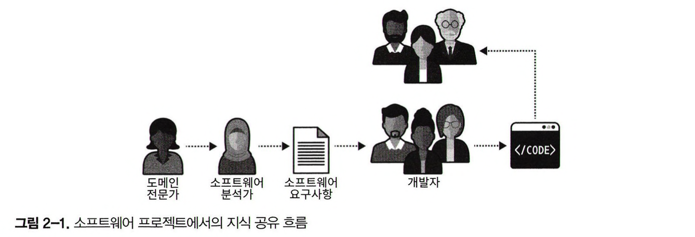
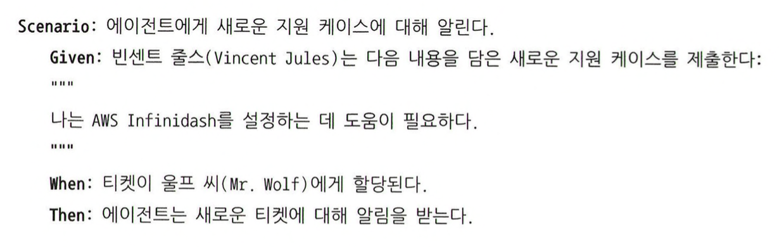

"운영환경에 배포되는 것은 도메인 전문가의 지식이 아니라 개발자의 이해 혹은 오해다."

이번 장에서는 비즈니스 도메인 분석 주제를 계속해서 다루지만 좀 더 깊이 있게 하위 도메인 내부에서 일어나는 일, 즉 비즈니스 기능과 로직에 초점을 맞추고자 합니다.

## 비즈니스 문제

우리가 개발하는 소프트웨어 시스템은 비즈니스 문제를 해결하는 솔루션입니다. 비즈니스 도메인의 컨텍스트에서 문제의 의미는 광범위합니다. 비즈니스 문제는 워크플로우와 프로세스 최적화, 수작업 최소화, 자원 관리, 의사결정 지원, 데이터 관리 등과 관련한 과제일 수 있습니다.

비즈니스 문제는 비즈니스 도메인과 하위 도메인의 모든 수준에서 발생할 수 있습니다. 하위 도메인은 세분화된 문제 도메인으로 특정 비즈니스 기능에 대한 솔루션을 제공하는 것이 목적입니다.

---

## 도메인 지식 찾아내기

효과적인 소프트웨어 솔루션을 설계하려면 적어도 기본적인 비즈니스 도메인 지식이 있어야 합니다. 이런 지식은 도메인 전문가의 몫입니다. 결국 도메인 전문가를 이해하고 그들이 쓰는 동일한 비즈니스 용어를 사용하는 것이 중요합니다.

효과적인 소프트웨어는 도메인 전문가가 문제를 생각하는 방식, 즉 멘탈 모델을 모방해야 합니다. 소프트웨어 프로젝트의 성공은 도메인 전문가와 소프트웨어 엔지니어 간의 효과적인 지식공유에 달렸습니다. 문제를 해결하려면 문제를 이해해야 합니다.

결국 도메인 전문가와 소프트웨어 엔지니어 간의 효과적인 지식 공유에는 효과적인 커뮤니케이션이 필요합니다.

---

## 커뮤니케이션

다른 협력 작업과 마찬가지로 결과는 모든 참여자가 얼마나 잘 협력할 수 있느냐에 달려있습니다. 소프트웨어 프로젝트가 실패하는 이유에 대한 연구에서 효과적인 커뮤니케이션이 지식 공유와 프로젝트 성공에 필수라는 것을 밝혀냈습니다.

전형적인 소프트웨어 개발 생애주기에서 도메인 지식은 분석 모델로 알려진 엔지니어 친화적인 형태로 변환됩니다. 분석 모델은 도메인 지식 이면에 존재하는 비즈니스 도메인에 기반하기보다는 시스템 요구사항을 설명한 것에 지나지 않습니다.

이런 소프트웨어 개발 과정은 아이들의 전화 게임과 비슷한 면이 있습니다. 전화 게임에서의 메시지와 마찬가지로 도메인 지식은 종종 왜곡된 상태로 전달됩니다. 이런 정보는 소프트웨어 엔지니어가 잘못된 솔루션을 구현하게 하거나 솔루션이 올바르다 해도 해결하려는 문제가 잘못된 경우로 이어집니다. 어떤 경우든 소프트웨어 프로젝트는 실패합니다

이 같은 문제를 해결하기 위해 도메인 주도 설계는 도메인 전문가가 소프트웨어 엔지니어에게 지식을 전달하기 위한 더 나은 방법을 제안하는데, 유비쿼터스 언어가 바로 그것입니다.

---

## 유비쿼터스 언어란 무엇인가

유비쿼터스 언어를 사용하는 것은 도메인 주도 설계의 초석입니다. 아이디어는 간단하다. 참가자들이 효과적으로 소통하기 위해 변환에 의존하지 말고 같은 언어를 사용하는 것입니다.

전통적인 소프트웨어 개발 생애주기에서 변환이 어떻게 일어나는지 정리해보면 다음과 같습니다.

- 도메인 지식이 분석 모델로
- 분석 모델이 요구사항으로
- 요구사항은 시스템 설계로
- 시스템 설계는 소스코드로

반면에 도메인 주도 설계에서는 이같이 도메인 지식을 계속해서 변환하는 대신, 비즈니스 도메인을 설명하기 위한 단일화된 언어 체계를 세우고자 하는데, 이것이 바로 유비쿼터스 언어입니다.

소프트웨어 프로젝트와 관련된 모든 이해관계자는 비즈니스 도메인을 설명할 때 유비쿼터스 언어를 사용해야 합니다. 가장 중요한 것은 도메인 전문가가 유비쿼터스 언어를 사용해 비즈니스 도메인을 추론하는 데 편안함을 느껴야 한다는 점입니다.

모든 프로젝트 참가자의 공통된 이해는 오직 유비쿼터스 언어와 그 용어의 지속적인 사용을 통해서만 함양될 수 있습니다.

---

## 비즈니스 언어

유비쿼터스 언어는 비즈니스 언어라는 점을 강조하고 싶습니다. 그렇기 때문에 기술 용어는 빼고 비즈니스 도메인에 관련된 용어로만 구성해야 합니다. 유비쿼터스 언어는 도메인 전문가의 이해와 비즈니스 도메인에 대한 멘탈 모델을 쉽게 이해할 수 있는 관점으로 표현하는 것을 목표로 합니다.

- 광고 캠페인은 다양한 창의적인 자료를 전시할 수 있다.
- 캠페인은 최소한 하나의 광고 할당이 활성화되어야 게시된다.
- 판매 커미션은 거래가 승인된 후에 회계 처리된다.

모든 문장은 비즈니스 언어로 작성됐다. 즉, 문장은 비즈니스 도메인을 바라보는 도메인 전문가의 시각을 반영합니다. 반면 다음 문장은 철저하게 기술적이어서 유비쿼터스 언어의 개념에 맞지 않습니다.

- 광고의 아이프레임은 HTML 파일을 표시한다.
- 캠페인은 활성 - 할당 테이블에 하나의 연관 레코드가 있어야 게시된다.
- 판매 커미션은 거래 테이블과 판매 - 승인 테이블의 연관 레코드에 근거하여 처리된다.

#### 일관성

유비쿼터스 언어는 반드시 정확하고 일관성이 있어야 합니다. 가정할 필요가 없어야 하고 비즈니스 도메인의 로직을 명료하게 표현해야 합니다.

모호성이 커뮤니케이션을 방해하기 때문에 유비쿼터스 언어의 용어는 오직 하나의 의미를 가져야 합니다.

#### 모호한 용어

어떤 비즈니스 도메인에서는 정책이라는 용어가 규제 규칙 또는 보험 계약과 같은 여러 의미를 가집니다. 정책의 경우 '규제 규칙'과 '보험 계약' 의 두 용어를 사용하여 명확한 모델을 만들어야 합니다.

#### 동의어

특정 컨텍스트 안에서 각각의 용어를 사용하는 것이 바람직합니다. 용어의 차이점을 이해해야 간단하고 명확한 모델을 구축하고 비즈니스 도메인 객체의 구현이 가능합니다.

---

## 비즈니스 도메인 모델

모델은 실세계의 복제가 아니라 우리가 실제 시스템을 이해하는 데 도움을 주는 인간의 창조물입니다.
지도 예시를 보면 여러 종류에 지도가 나오는데, 모든 지도가 행성의 세부적인 모든 것을 나타내지 않습니다. 대신, 각 지도는 특정 목적을 지원하는 데 충분한 자료만 담고 있습니다.

#### 효과적인 모델링

모든 모델에는 목적이 있고 효과적인 모델은 그 목적을 달성하는 데 필요한 세부사항만 포함합니다. 유용한 모델은 실세계의 복사본이 아니라 문제를 해결하려는 의도가 있으며, 그 목적에 필요한 정보만 제공해야 합니다.

> 모든 모델은 문제가 있지만, 일부는 유용합니다.

모델은 본질적으로 추상화의 결과입니다. 추상화 개념은 불필요한 상세 정보를 생략하여 복잡한 문제를 다룰 수 있게 하고 당면한 문제를 푸는 데 필요한 정보만 남게 합니다. 반면 비효과적인 추상화는 필요한 정보를 제거하거나 필요 없는 정보를 포함해 잡음을 유발합니다.

추상화의 목적은 모호함이 아니라 절대적으로 정확할 수 있는 새로운 의미론적 수준을 만드는 것이라고 합니다.

#### 비즈니스 도메인 모델링

유비쿼터스 언어를 발전시키는 것은 사실상 비즈니스 도메인 모델을 구축하는 셈입니다. 모델은 비즈니스가 기능을 어떻게 구현하느냐에 대한 도메인 전문가의 사고 프로세스인 멘탈 모델을 포착해야 합니다. 모델은 관련된 비즈니스 엔티티와 그것의 행동, 인과 관계, 불변성 등을 반영해야 합니다.

유비쿼터스 언어는 도메인의 모든 가능한 상세 정보를 포함하는 게 아닙니다. 이는 마치 모든 이해관계자를 도메인 전문가로 만드려는 것과 같습니다. 대신, 모델은 필요한 시스템을 구현하는 데 즉 소프트웨어가 해결하고자 하는 특정 문제를 해결하는 데 필요한 만큼의 비즈니스 도메인 관점을 포함해야 합니다.

엔지니어링 팀과 도메인 전문가의 효과적인 커뮤니케이션은 필수입니다. 비즈니스 도메인의 이해를 확인할 신뢰성 있는 유일한 방법은 도메인 전문가가 이해할 수 있는 비즈니스 언어로 대화하는 것입니다.

#### 지속적인 노력

유비쿼터스 언어를 정형화하려면 언어의 소유자인 도메인 전문가와 상호작용이 필요합니다. 오직 실제 도메인 전문가와의 상호작용만이 비즈니스 도메인에 대한 부정확함이나 잘못된 가정, 또는 전체적인 이해 오류를 발견할 수 있습니다.

모든 이해관계자는 모든 프로젝트와 관련된 커뮤니케이션에 유비쿼터스 언어를 지속적으로 사용해서 지식 공유를 확산하고 비즈니스 도메인에 대한 공유된 이해를 강화해야 합니다.

가장 중요한 점은 유비쿼터스 언어를 발전시키는 것은 진행형이라는 것입니다. 지속해서 검증하고 발전시켜야 합니다.

#### 도구

위키는 유비쿼터스 언어를 수집하고 관리하는 용어집으로 사용될 수 있습니다. 또한 다 함께 용어집을 유지보수하는 것이 중요합니다. 프로젝트 용어집을 유지보수하는 것의 장점이 명백함에도 불구하고, 여기에는 본질적 한계가 있습니다. 용어집은 엔티티의 이름, 과정, 역할 등의 명사에만 효과적입니다.

명사가 중요하긴 하지만 행동을 포착하는 것이 중요합니다. 행동은 단순히 명사와 관련된 동사의 목록이 아니라 규칙, 가정, 그리고 불변성을 가진 실제 비즈니스 로직입니다. 이런 개념은 용어집으로 문서화하기 훨씬 어렵습니다. 그러므로 용어집은 유스케이스 또는 거킨 테스트처럼 행동을 포착하는 데 적합한 다른 도구와 함께 사용하는 것이 가장 좋습니다.

거킨 언어로 작성된 자동화 테스트는 유비쿼터스 언어를 포착하기에 좋은 언어일 뿐 아니라 도메인 전문가와 소프트웨어 엔지니어의 간극을 메우는 보조 도구로서의 역할을 할 수 있습니다.

마지막으로 유비쿼터스 언어의 용어의 사용을 검증할 수 있는 정적 코드 분석 도구도 있습니다. 이런 도구 중 주목할 만한 예는 NDepend 입니다.

> 이러한 도구들도 중요하지만 가장 중요한 것은 프로세스나 도구보다 개인과 상호작용이 우선입니다.

#### 도전과제

이론상으로 유비쿼터스 언어를 발전시키는 것이 간단한 과정 같지만 실제로는 그렇지 않습니다. 도메인 지식을 수집하는 신뢰할 만한 유일한 방법은 도메인 전문가와 대화를 하는 것입니다. 여기에 접근하는 유일한 방법은 질문하는 것입니다.

이 기법에 경험이 쌓이면 이 과정이 단순히 존재하는 지식을 발견하는 것뿐만 아니라 도메인 전문가와 협력해서 모델을 함께 만들어가는 것이 자주 포함된다는 사실을 알게 됩니다.

마지막으로 컨퍼런스에서 유비쿼터스 언어에 대해 자주 받는 질문은 회사에서 영어를 사용하지 않는 나라에서 어떤 언어를 사용해야 하느냐는 것인데, 저자의 대답은 적어도 비즈니스 도메인 엔티티의 이름은 영어 명사로 하라는 것입니다. 그러면 코드에서도 쉽게 동일한 용어를 사용하게 될 것입니다.

---

## 결론

효과적인 커뮤니케이션과 지식 공유는 성공적인 소프트웨어 프로젝트에 필수입니다. 소프트웨어 엔지니어가 소프트웨어 솔루션을 설계하고 개발하기 위해서는 반드시 비즈니스 도메인을 이해해야 합니다.

효과적인 커뮤니케이션을 위해서는 유비쿼터스 언어에서 반드시 모호성과 암묵적 가정을 제거해야 합니다. 언어의 모든 용어는 일관성이 있어야 하며 모호하지 않고 동의어가 없어야 합니다.

마지막으로 유비쿼터스 언어를 모든 프로젝트 관련 커뮤니케이션에서 일관되게 사용해야 합니다.