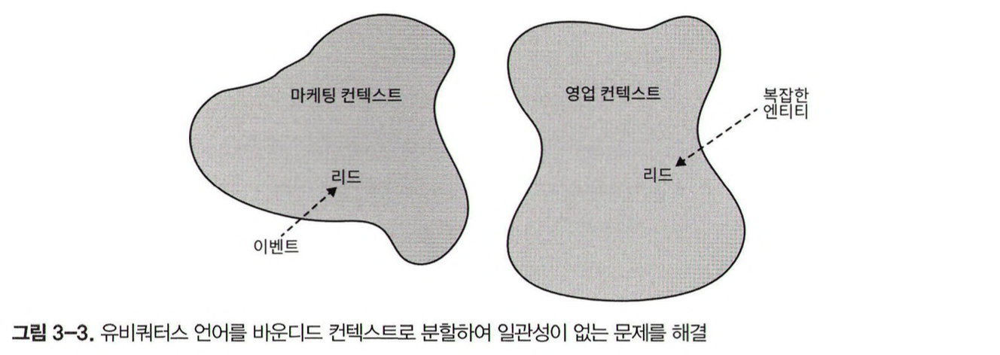

이전 장에서 보았듯이 프로젝트의 성공을 보장하려면 소프트웨어 엔지니어부터 도메인 전문가에 이르기까지 모든 이해관계자가 의사소통에 사용할 수 있는 유비쿼터스 언어를 개발하는 것이 중요합니다. 언어는 비즈니스 도메인의 내부 동작과 기본 원칙에 대한 도메인 전문가의 멘탈 모델을 반영해야 합니다. 그러나 조직 규모에 따라 도메인 전문가의 멘탈 모델은 일관성이 없을 수 있습니다. 같은 비즈니스 도메인에서도 도메인 전문가마다 서로 다른 모델을 사용할 수 있습니다.

---

## 일관성 없는 모델

도메인 전문가의 언어를 살펴보면 리드 라는 용어가 마케팅과 영업 부서에서 서로 다른 의미로 사용할 수 있습니다. 이러한 다양한 비즈니스 도메인 모델을 소프트웨어로 표현하는 것은 매우 어렵습니다. 영업 부서의 복잡한 모델을 마케팅 부서에 적용하면 필요하지 않은 곳에서 복잡성을 키우게 될 것입니다.

---

## 바운디드 컨텍스트란 무엇인가

도메인 주도 설계에서 솔루션은 간단합니다. 유비쿼터스 언어를 여러 개의 작은 언어로 나눈 다음 각 언어를 적용할 수 있는 명시적인 바운디드 컨텍스트에 할당하면 됩니다. 앞에 예에서 마케팅과 영업이라는 두 가지 바운디드 컨텍스트를 식별할 수 있습니다. 각 바운디드 컨텍스트에서 단일 의미를 갖는 한, 세분화된 유비쿼터스 언어 각각은 일관성을 띠며 도메인 전문가의 멘탈모델을 따를 수 있습니다.

바운디드 컨텍스트 패턴을 사용하면 컨텍스트를 명시적이고 중요한 비즈니스 도메인의 요소로 모델링할 수 있습니다.

#### 모델 경계

모델은 실제 세계의 복사본이 아니라 복잡한 시스템을 이해하는 데 도움을 주기 위해 구조화한 것입니다. 우리가 해결하려는 문제는 모델 본연의 목저입니다. 모델은 경계 없이 존재할 수 없습니다. 경계가 없다면 현실 세계의 복제본처럼 확장될 것입니다. 따라서 모델의 경계(바운디드 컨텍스트)를 정의하는 것은 모델링 프로세스의 본질적인 부분입니다.

하나의 바운디드 컨텍스트의 유비쿼터스 언어는 다른 바운디드 컨텍스트의 범위에는 완전히 관련이 없습니다. 바운디드 컨텍스트는 유비쿼터스 언어와 해당 언어가 나타내는 모델의 적용 가능성을 규정합니다. 서로 다른 문제 도메인에 따라 고유한 모델을 정의할 수 있습니다.

> 바운디드 컨텍스트는 유비쿼터스 언어의 일관성이 유지되는 경계입니다. 유비쿼터스 언어의 용어, 원칙, 비즈니스 규칙은 해당 바운디드 컨텍스트 내에서만 일관성이 있습니다.

#### 정제된 유비쿼터스 언어

유비쿼터스 언어는 만능이 아닙니다. 대신 유비쿼터스 언어는 바운디드 컨텍스트 경계 안에서만 보편적으로 적용됩니다. 유비쿼터스 언어는 바운디드 컨텍스트에 포함된 모델을 설명하는 데만 집중합니다. 모델은 우리가 해결해야 하는 문제 없이는 존재할 수 없기 때문에 유비쿼터스 언어는 명시적으로 적용 가능한 컨텍스트 없이 정의하거나 사용할 수 없습니다.

#### 바운디드 컨텍스트의 범위

유비쿼터스 언어의 범위(바운디드 컨텍스트)를 정의하는 것은 전략적인 설계 의사결정입니다. 경계는 비즈니스 도메인의 고유한 컨텍스트에 따라 넓힐 수 있고, 비즈니스 도메인을 더 작은 문제 도메인으로 세분화하여 좁힐 수도 있습니다.

> 바운디드 컨텍스트의 크기 자체는 의사결정 요소가 아닙니다. 모델의 크기에 정답은 없습니다. 다만 모델 자체로 유용해야 합니다.

따라서 바운디드 컨텍스트의 크기에 대한 결정은 문제 도메인이 무엇이냐에 따라 달라집니다. 때로는 넓은 경계를 사용하는 것이 더 명확하고, 어떤 경우에는 분해하는 것이 더 합리적입니다.

> 모델을 유용하게 유지하고 바운디드 컨텍스트의 크기를 비즈니스 요구사항과 조직의 제약사항에 맞춰야 합니다.
> 같은 데이터에서 작동하는 응집된 유스케이스의 집합을 식별하되, 그것을 여러 개의 바운디드 컨텍스트로 분해하지 말아야 합니다.

---

## 바운디드 컨텍스트 대 하위 도메인

비즈니스 도메인은 여러 하위 도메인 혹은 바운디드 컨텍스트의 집합으로 분해할 수 있습니다. 처음에는 두 가지 방법이 중복으로 보일 수 있지만 두 경계가 모두 필요한 이유를 살펴보겠습니다.

#### 하위 도메인

하위 도메인은 상호 관련된 유스케이스 집합과 유사합니다. 유스케이스는 비즈니스 도메인과 시스템 요구사항에 따라 정의됩니다. 소프트웨어 엔지니어로서 우리는 요구사항을 정의하지 않습니다. 그것은 비즈니스가 담당합니다. 대신 소프트웨어 엔지니어는 하위 도메인을 식별하기 위해 비즈니스 도메인을 분석합니다.

#### 바운디드 컨텍스트

반면에 바운디드 컨텍스트는 소프트웨어 엔지니어에 의해 설계됩니다. 모델의 경계를 선택하는 것은 전략적 설계의 의사결정입니다. 우리는 비즈니스 도메인을 더 작고 관리 가능한 문제 도메인으로 어떻게 나눌지 정합니다.

#### 하위 도메인과 바운디드 컨텍스트 사이의 상호작용

중요한 것은 하위 도메인은 발견하고 바운디드 컨텍스트는 설계한다는 점입니다. 하위 도메인은 비즈니스 전략에 의해 정의됩니다. 그러나 소프트웨어 엔지니어는 특정 프로젝트의 컨텍스트와 제약 조건을 해결하기 위해 소프트웨어 솔루션과 바운디드 컨텍스트를 설계할 수 있습니다.

> 개인적으로 이해하기로는 하위 도메인의 경우 비즈니스를 의미하기 때문에 발견한다고 얘기하는 것 같다...
> 예를 들어 핵심 하위 도메인이 있을텐데 이를 반드시 바운디드 컨텍스트라고 이해할 수 없는 것처럼 핵심 하위 도메인은 비즈니스 적인 관점이고 바운디드 컨텍스트는 하위 도메인과 관계없이 엔지니어가 설계하는 것을 나타내는 것 같다.

---

## 경계

바운디드 컨텍스트 패턴은 물리적 경계와 소유권 경계를 규정하기 위한 도메인 주도 설계 도구입니다.

#### 물리적 경계

바운디드 컨텍스트는 모델 경계뿐만 아니라 이를 구현하는 시스템의 물리적 경계 역할도 합니다. 각 바운디드 컨텍스트는 개별 서비스/프로젝트로 구현돼야 합니다. 즉, 구현, 진화, 버전 관리를 각각의 다른 바운디드 컨텍스트와 독립적으로 해야 합니다.

바운디드 컨텍스트 간의 명확한 물리적 경계를 통해 각 바운디드 컨텍스트를 요구사항에 가장 적합한 기술 스택으로 구현할 수 있습니다.

바운디드 컨텍스트는 여러 하위 도메인을 포함할 수 있습니다. 이러한 경우 바운디드 컨텍스트는 물리적 경계고 하위 도메인은 논리적 경계입니다. 논리적 경계는 프로그래밍 언어의 종류에 따라 네임스페이스나 모듈, 패키지 같은 다른 이름을 갖습니다.

#### 소유권 경계

소프트웨어 프로젝트에서도 팀 간의 평화로운 공존을 위해 모델 경계(바운디드 컨텍스트)를 활용할 수 있습니다. 팀 간의 작업 분배는 바운디드 컨텍스트 패턴을 사용하여 내릴 수 있는 또 다른 전략적 의사결정입니다.

바운디드 컨텍스트는 한 팀에서만 구현, 발전, 유지 관리해야 합니다. 두 팀이 같은 바운디드 컨텍스트에서 작업할 수 없습니다. 대신 팀은 서로 다른 바운디드 컨텍스트로 분리된 모델과 시스템을 명시적으로 연동하기 위한 통신 프로토콜을 정의해야 합니다. 바운디드 컨텍스트는 단일 팀이 여러 바운디드 컨텍스트를 소유할 수도 있습니다.

---

## 결론

도메인 전문가의 멘탈 모델에 내재된 충돌을 발견할 때마다 유비쿼터스 언어를 여러 개 바운디드 컨텍스트로 분해해야 합니다. 유비쿼터스 언어는 바운디드 컨텍스트의 범위 내에서 일관성이 있어야 합니다. 그러나 서로 다른 바운디드 컨텍스트에서는 동일한 용어라도 다른 의미를 가질 수 있습니다.

하위 도메인이 발견되면 바운디드 컨텍스트도 설계합니다. 도메인을 바운디드 컨텍스트로 나누는 것은 전략적 설계의 의사결정입니다.

바운디드 컨텍스트는 시스템을 서비스, 하위 시스템 등의 물리적 구성요소로 분해합니다. 각 바운디드 컨텍스트의 수명주기는 서로 독립적입니다.