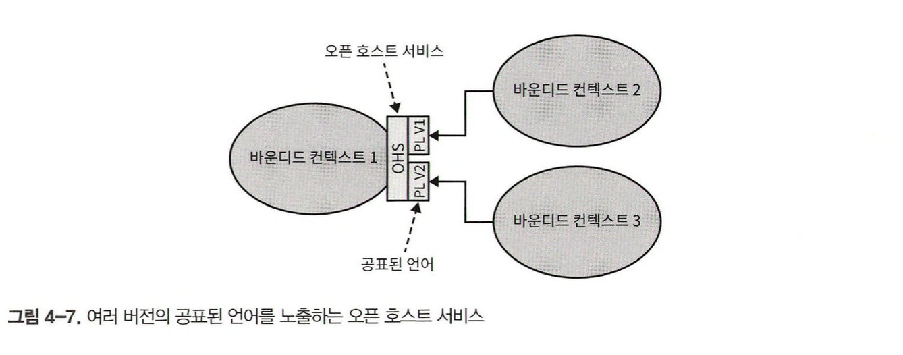

바운디드 컨텍스트 패턴은 유비쿼터스 언어의 일관성을 유지할 뿐만 아니라 모델링도 가능하게 합니다. 모델의 목적, 즉 경계를 명시하지 않고는 모델을 구축할 수 없습니다. 경계가 언어의 책임을 구분 짓습니다. 다른 바운디드 컨텍스트가 동일한 비즈니스 엔티티를 대표할 수 있지만, 이는 다른 문제를 해결하는 비즈니스 도메인을 모델링합니다.

한편 다른 바운디드 컨텍스트의 모델은 서로 독립적으로 발전하고 구현될 수 있습니다. 그러나 바운디드 컨텍스트 자체는 독립적이지 않습니다. 시스템의 요소가 전체의 목적을 이루기 위해 상호작용해야 하듯이, 바운디드 컨텍스트의 구현도 마찬가지입니다. 서로 독립적으로 발전할 수 있지만, 상호작용해야 합니다. 결국 바운디드 컨텍스트 사이에는 항상 접점이 있는데 이것을 컨트랙트라고 부릅니다.

이번 장에서는 바운디드 컨텍스트 간의 관계와 연동을 정의하는 도메인 주도 설계 패턴에 대해 배웁니다. 이런 패턴을 협력, 사용자-제공자, 그리고 분리형 노선의 세 그룹으로 나누어 살펴봅니다.

---

## 협력형 패턴 그룹

협력형(cooperation) 그룹의 패턴은 소통이 잘 되는 팀에서 구현된 바운디드 컨텍스트와 관련이 있습니다. 가장 간단한 예시는 단일 팀에 의해 구현된 바운디드 컨텍스트입니다. 또한 한 팀의 성공이 다른 팀의 성공에 달려있고, 그 반대도 마찬가지인 의존적 목표가 있는 팀에 해당합니다.

> 다시 말해, 이 패턴이 적합한 요건은 팀의 커뮤니케이션과 협업의 수준에 있습니다.

협력형 패턴에는 파트너십 패턴과 공유 커널 패턴이 있습니다.

#### 파트너십 패턴

파트너십 모델에서 바운디드 컨텍스트 간의 연동은 애드혹 방식으로 조정합니다. 한 팀은 다른 팀에게 API의 변경을 알리고 다른 팀은 충돌 없이 이를 받아들입니다.

여기서 연동의 조정은 양방향입니다. 성공적인 연동을 위해서는 잘 구축된 협업 실무, 높은 수준의 헌신, 그리고 팀 간의 잦은 동기화가 필수입니다. 이런 패턴은 동기화와 커뮤니케이션의 어려움 때문에 지리적으로 떨어져 있는 팀에게는 적합하지 않을 수 있습니다.

#### 공유 커널 패턴

바운디드 컨텍스트가 모델의 경계임에도 불구하고, 여전히 하위 도메인의 동일 모델 혹은 그 일부가 여러 다른 바운디드 컨텍스트에서 구현되는 경우가 있습니다. 공유 커널과 같은 공유 모델은 모든 바운디드 컨텍스트의 필요에 따라 설계된다는 점을 강조하고 싶습니다.

각 바운디드 컨텍스트는 권한 모델을 수정할 수 있고 이 변경은 이 모델을 사용하는 다른 모든 바운디드 컨텍스트에 영향을 줍니다.

#### 공유 범위

겹치는 형태의 모델은 해당하는 바운디드 컨텍스트의 수명주기도 서로 엮이게 합니다. 그러므로 변경의 연쇄 영향을 최소화하려면 양쪽이 겹치는 모델을 제한해서 바운디드 컨텍스트에서 공통으로 구현돼야 하는 모델의 일부분만 노출하도록 해야 합니다.

#### 구현

만약 조직에서 단일 저장소를 사용한다면, 여러 바운디드 컨텍스트는 동일한 소스 파일을 참조할 수 있습니다. 이것이 불가능하다면 공유 커널을 각 바운디드 컨텍스트의 전용 프로젝트로 떼어내면 연결 라이브러리처럼 바운디드 컨텍스트에서 참조할 수 있습니다.

#### 공유 커널을 사용해야 하는 경우

공유 커널 패턴의 적용 여부를 결정하는 가장 중요한 기준은 중복 비용과 조율 비용의 비율입니다. 이 패턴을 적용한 바운디드 컨텍스트 간에 강한 의존관계를 만들기 때문에 중복 비용이 조율 비용보다 클 경우에만 적용해야 합니다.

> 다시 말해, 두 바운디드 컨텍스트가 공유하는 코드베이스에 대한 변경을 조율하려는 노력보다 공유하는 모델에 대한 변경을 통합할 때 드는 노력이 더 클 경우에 적용합니다.

공유 커널 패턴은 앞 장에서 소개한 바운디드 컨텍스트의 원칙에 위배된다. 같은 팀이 공유 커널을 구현하지 않는다면 이는 단일 팀 원칙을 위반하는 것입니다. 겹치는 형태의 모델인 공유 커널은 사실상 여러 팀이 함께 개발합니다.

공유 커널 패턴을 적용하는 또 다른 일반적인 적용 사례는 일시적이기는 하지만, 레거시 시스템을 점진적으로 현대화할 경우입니다. 이런 상황에서는 시스템을 서서히 바운디드 컨텍스트로 분해해서 공유 코드베이스로 만드는 것이 실용적인 중간 솔루션이 될 수 있습니다.

---

## 사용자-제공자 패턴 그룹

제공자는 사용자에게 서비스를 제공합니다. 서비스 제공자는 '업스트림'이고 고객 또는 사용자는 '다운스트림'입니다.

협력 그룹의 경우와는 다르게 양 팀은 서로 독립적으로 성공할 수 있습니다. 그러나 대부분의 경우 업스트림 또는 다운스트림의 팀이 연동 컨트랙트를 주도하는 권력의 불균형이 존재합니다. 힘의 차이를 보여주는 세 가지 패턴, 즉 순응주의자, 충돌 방지 계층, 오픈 호스트 서비스 패턴을 살펴보겠습니다.

#### 순응주의자 패턴

힘의 균형이 서비스를 제공하는 업스트림 팀에 있는 경우가 있습니다. 사용자의 요구를 지원할 동기가 없는 경우가 그렇습니다. 다운스트림 팀이 업스트림 팀의 모델을 받아들이는 바운디드 컨텍스트의 관계를 순응주의자 패턴이라고 부릅니다.

#### 충돌 방지 계층 패턴

순응주의자 패턴에서 힘의 균형은 업스트림 서비스에 치우쳐 있습니다. 그러나 다운스트림 바운디드 컨텍스트가 이에 순응하지 않는 경우 충돌 방지 계층을 통해 업스트림 바운디드 컨텍스트의 모델을 스스로의 필요에 맞게 가공할 수 있습니다.

충돌 방지 계층(ACL : anticorruption layer) 패턴은 다음 사례와 같이 제공자의 모델을 따르는 것을 원치 않거나 순응에 필요한 노력이 가치가 없을 경우에 다룹니다.

- 다운스트림 바운디드 컨텍스트가 핵심 하위 도메인을 포함할 경우
- 업스트림 모델이 사용자의 요건에 비효율적이거나 불편한 경우
- 제공자가 컨트랙트를 자주 변경하는 경우

모델링 관점에서 볼 때 다운스트림 사용자가 제공자의 모델을 변환하면 자신의 바운디드 컨텍스트와 상관없는 외부의 개념으로부터 다운스트림 사용자를 안전하게 보호할 수 있습니다.

#### 오픈 호스트 서비스 패턴

이 패턴은 힘이 사용자 측에 있을 경우를 처리합니다. 제공자는 사용자를 보호하고 가능한 최고의 서비스를 제공하는 데 관심이 있습니다.

구현 모델의 변경으로부터 사용자를 보호하기 위해 업스트림 제공자는 퍼블릭 인터페이스와 구현 모델을 분리합니다.

위 그림에서 제공자의 퍼블릭 인터페이스는 자신의 유비쿼터스 언어를 따르는 대신, 연동 지향 언어를 통해 사용자에게 더 편리한 프로토콜을 노출하려 합니다. 이런 퍼블릭 프로토콜을 공표된 언어(published language)라고 합니다.

한편, 오픈 호스트 서비스(OHS: open-host service) 패턴은 충돌 방지 계층 패턴의 반대입니다. 즉, 사용자 대신 제공자가 내부 모델 번역을 구현합니다.

바운디드 컨텍스트의 구현 모델과 연동 모델을 분리하면 업스트림 바운디드 컨텍스트는 다운스트림 컨텍스트에 영향을 주지 않으면서 자신의 구현을 자유롭게 발전시킬 수 있습니다.

또한 연동 모델을 분리하면 업스트림 바운디드 컨텍스트는 이미 공표된 언어의 여러 버전을 동시에 노출할 수 있어서 사용자가 점진적으로 새로운 버전으로 이관할 수 있게 합니다.

---

## 분리형 노선

마지막으로 살펴볼 협업 옵션은 전혀 협력하지 않는 것입니다. 분리형 노선(separated ways) 패턴에는 팀에 협업 의지가 없거나 협업할 수 없는 경우와 같이 다양한 이유가 있습니다.

- 커뮤니케이션 이슈
	- 팀이 협업과 합의에 어려움을 겪고 있다면 여러 바운디드 컨텍스트 내에서 기능을 중복해서 가져가고 각자의 길을 가는 것이 더 비용 효과적입니다.
- 일반 하위 도메인
	- 일반 하위 도메인이 일반 솔루션과 연동하는 것이 쉽다면 각 바운디드 컨텍스트 내에서 각자 연동하는 것이 더욱 비용 효과적일 수 있습니다.
- 모델의 차이
	- 모델이 너무 달라서 순응주의자 관계가 불가능하고 충돌 방지 계층을 구현하는 것도 기능 중복보다 비용이 더 클 수 있습니다.

> 핵심 하위 도메인을 연동할 경우에는 협업 없는 분리형 노선은 피해야 합니다. 하위 도메인의 중복 구현은 회사의 전략을 효과적이고 효율적으로 구현하는 것을 어렵게 합니다.

---

## 컨텍스트 맵

컨텍스트 맵은 시스템의 바운디드 컨텍스트와의 연동을 시각적으로 표현합니다. 시각적 표기법은 다양한 수준에서 중요한 전략적 통찰력을 제공합니다.

#### 유지보수

컨텍스트 맵은 프로젝트 초기부터 도입해서 새로운 바운디드 컨텍스트와 기존 요소에 대한 수정을 반영하는 것이 이상적입니다. 컨텍스트 맵은 여러 팀이 작업한 정보를 담기 때문에 다 함께 유지보수하는 것이 제일 좋습니다.

#### 한계

컨텍스트 맵을 작성하는 것은 어려운 작업입니다. 여러 하위 도메인에 걸친 시스템의 바운디드 컨텍스트에는 작동하는 여러 연동 패턴이 있을 수 있습니다.

게다가 바운디드 컨텍스트가 단일 하위 도메인에 국한되더라도, 예를 들어, 하위 도메인의 모듈이 다른 통합 전략을 필요로 하는 경우 여전히 여러 통합 패턴이 있을 수 있습니다.

---

## 결론

바운디드 컨텍스트는 서로 독립적이지 않습니다. 서로 상호작용해야 합니다.

- 파트너십
	- 바운디드 컨텍스트는 애드훅 방식으로 연동됩니다.

- 공유 커널
	- 두 개 이상의 바운디드 컨텍스트가 참여하는 모든 바운디드 컨텍스트가 공유하는 제한적으로 겹치는 모델을 공유해서 연동합니다.

- 순응주의자
	- 사용자는 서비스 제공자의 모델에 순응합니다.

- 충돌 방지 계층
	- 사용자는 서비스 제공자의 모델을 사용자의 요건에 맞게 번역합니다.

- 오픈 호스트 서비스
	- 서비스 제공자는 사용자의 요건에 최적화된 모델인 공표된 언어를 구현합니다.

- 분리형 노선
	- 협력과 연동보다 특정 기능을 중복으로 두는 것이 더 저렴한 경우입니다.

바운디드 컨텍스트 간의 연동은 컨텍스트 맵으로 표현됩니다. 이를 통해 시스템의 거시적 설계 관점, 커뮤니케이션 패턴, 그리고 조직 문제에 대한 통찰력을 얻을 수 있습니다.