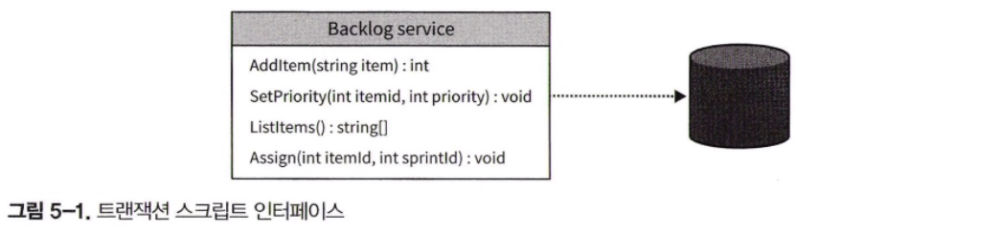
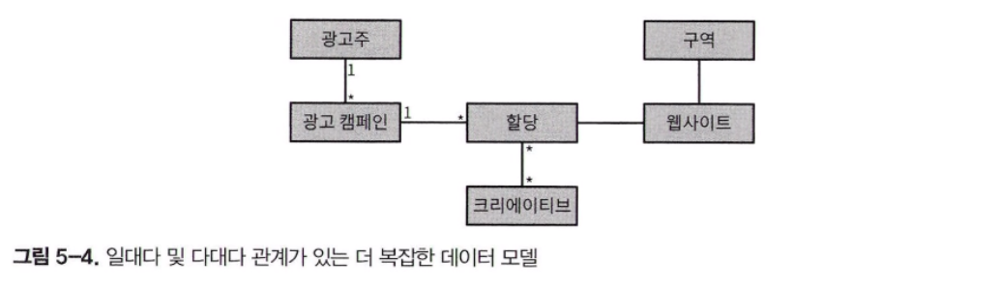

비즈니스 로직은 소프트웨어에서 가장 중요한 부분이며 애초에 소프트웨어를 구현하는 이유이기도 합니다. 이번 장에서는 비즈니스 로직 코드를 모델링하고 구현하는 다양한 방법에 대해 검토할 것입니다.

다소 단순한 비즈니스 로직에 적합한 두 가지 패턴이 트랜잭션 스크립트와 액티브 레코드입니다.

## 트랜잭션 스크립트

시스템의 퍼블릭 인터페이스는 아래 그림과 같이 사용자가 실행할 수 있는 비즈니스 트랜잭션의 모음입니다. 트랜잭션 스크립트 패턴은 프로시저를 기반으로 시스템의 비즈니스 로직을 구성하며, 각 프로시저는 퍼블릭 인터페이스를 통해 시스템 사용자가 실행하는 작업을 구현합니다.

#### 구현

각 프로시저는 간단하고 쉬운 절차지향 스크립트로 구현합니다. 이 프로시저가 구현해야 하는 유일한 요구사항은 트랜잭션 동작입니다. 각 작업은 성공하거나 실패할 수 있지만, 유효하지 않은 상태를 만들면 안 됩니다.

트랜잭션 스크립트 패턴은 다음 장에서 배우게 될 고급 비즈니스 로직 구현 패턴의 기반입니다.

모든 데이터 변경을 포함하는 트랜잭션을 사용해야 합니다.
다중 레코드 트랜잭션을 지원하지 않는 데이터베이스에서 다중 업데이트를 하거나 분산 트랜잭션을 통합할 수 없는 여러 개의 저장 장치로 작업하는 경우에는 상황이 더 복잡해집니다.

#### 분산 트랜잭션

최신 분산 시스템에서는 데이터베이스의 데이터를 변경한 다음 메시지 버스에 메시지를 발행하여 시스템의 다른 컴포넌트에 변경사항을 알리는 것이 일반적입니다. 앞선 예시처럼 다중 레코드 트랜잭션 처럼 간단하게 분산 시스템에서 트랜잭션을 유지할 수 있는 방법은 없습니다. 모두 비즈니스 도메인과 해당 요구사항에 따라 달라집니다.

한 가지 방법으로는 작업을 멱등성으로 만드는 것입니다. 즉, 같은 요청을 여러 번 반복하더라도 그 결과는 매번 동일하게 만드는 것입니다.

#### 트랜잭션 스크립트를 사용하는 경우

트랜잭션 스크립트 패턴은 비즈니스 로직이 단순한 절차적 작업처럼 매우 간단한 문제 도메인에 효과적입니다. 예를 들어 ETL 작업에서 각 작업은 원천 시스템에서 데이터를 추출하고 변환 로직을 적용하여 데이터를 다른 형식으로 변환하고 결과를 목적 시스템에 적재합니다.

트랜잭션 스크립트 패턴은 정의상 비즈니스 로직이 단순한 지원 하위 도메인에 적합합니다. 또한 일반 하위 도메인과 같은 외부 시스템과 연동하기 위한 어댑터로 사용하거나 충돌 방지 계층의 일부로 사용할 수 있습니다.

트랜잭션 스크립트 패턴의 주요 장점은 단순함입니다. 결과적으로 핵심 하위 도메인에는 트랜잭션 스크립트를 사용하면 안 됩니다. 핵심 하위 도메인의 비즈니스 로직이 복잡할 경우 트랜잭션 스크립트 패턴이 대처할 수 없다는 문제점이 발생할 수 있습니다.

> 이러한 단순함으로 인해 트랜잭션 스크립트는 항상 좋다고 할 수 없으며, 때로는 안티 패턴으로 취급되기도 합니다.

---

## 액티브 레코드

트랜잭션 스크립트 패턴과 마찬가지로 액티브 레코드는 비즈니스 로직이 단순한 경우 사용합니다. 그러나, 액티브 레코드는 좀 더 복잡한 자료구조에서도 비즈니스 로직이 작동할 수 있습니다.

#### 구현

결과적으로 이 패턴은 액티브 레코드라고 하는 전용 객체를 사용하여 복잡한 자료구조를 표현합니다. 액티브 레코드 객체는 객체 관계 매핑(ORM) 또는 다른 데이터 접근 프레임워크와도 관련이 있습니다. 각 자료구조가 액티브 하다는 점에서 패턴의 이름이 만들어졌습니다. 즉, 액티브 레코드는 데이터 접근 로직을 구현합니다.

트랜잭션 스크립트 패턴과의 차이점은 액티브 레코드의 경우 데이터베이스에 직접 접근하는 대신 트랜잭션 스크립트가 액티브 레코드를 조작한다는 것입니다. 작업이 완료되면 트랜잭션의 원자성으로 인해 작업이 성공하거나 실패합니다.

> 이 패턴의 목적은 메모리 상의 객체를 데이터베이스 스키마에 매핑하는 복잡성을 숨기는 것입니다. 

영속성을 담당하는 것 외에도 액티브 레코드 객체에는 비즈니스 로직이 포함될 수 있습니다.

즉, 액티브 레코드 객체의 고유한 기능은 자료구조와 동작의 분리입니다. 일반적으로 액티브 레코드의 필드에는 외부 프로시저가 상태를 수정할 수 있게 하는 퍼블릭 게터와 세터가 있습니다.

#### 액티브 레코드를 사용하는 경우

액티브 레코드는 본질적으로 데이터베이스에 대한 접근을 최적화하는 트랜잭션 스크립트이기 때문에 이 패턴은 기껏해야 사용자 입력의 유효성을 검사하는 CRUD 작업과 같은 비교적 간단한 비즈니스 로직만 지원할 수 있습니다.

따라서 트랜잭션 스크립트 패턴과 마찬가지로 액티브 레코드 패턴은 지원 하위 도메인, 일반 하위 도메인과 외부 솔루션의 연동, 모델 변환 작업에 적합합니다.

> 두 패턴의 차이점은 액티브 레코드의 경우 복잡한 자료구조를 데이터베이스 스키마에 매핑하는 복잡성을 해소한다는 것입니다.

액티브 레코드 패턴은 빈약한 도메인 모델 안티패턴이라고도 하며, 다시 말하면 부적절하게 설계된 도메인 모델입니다.

---

## 실용적인 접근 방식

비록 비즈니스 데이터가 중요하고 설계 및 개발되는 코드의 무결성도 보호해야 하지만 실용적인 접근 방식이 더 바람직한 몇 가지 경우가 있습니다. 특히 대규모로 데이털르 다루는 시스템에서는 데이터의 일관성 보장이 덜 엄격할 수 있습니다.

---

## 결론

트랜잭션 스크립트
- 이 패턴은 시스템 작업을 간단하고 쉬운 절차지향 스크립트로 구성합니다.
- 이 절차는 작업에 트랜잭션을 적용해서 작업이 성공하거나 실패하도록 보장합니다.
- 트랜잭션 스크립트 패턴은 ETL 처럼 단순한 비즈니스 로직을 가진 지원 하위 도메인에 적합합니다.

액티브 레코드
- 비즈니스 로직이 단순하지만 복잡한 자료구조에서 작동하는 경우 해당 자료구조를 액티브 레코드로 구현할 수 있습니다.
- 액티브 레코드 객체는 간단한 CRUD 데이터 접근 방법을 제공하는 자료구조입니다.

> 이번 장에서 논의한 두 가지 패턴은 다소 단순한 비즈니스 로직의 경우입니다.

