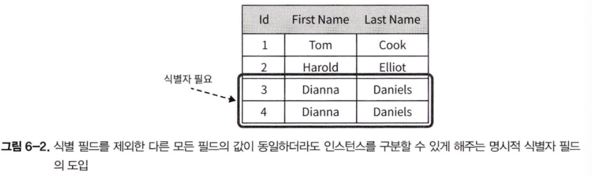
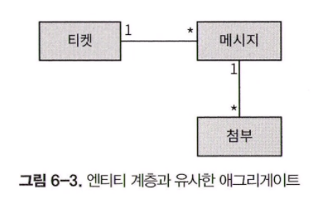
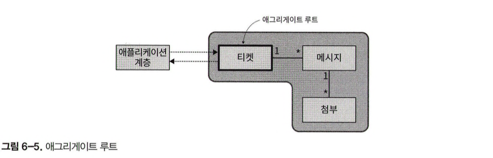

이번 장에서는 복잡한 비즈니스 로직에 사용되는 도메인 모델 패턴을 소개합니다.

## 배경

에릭 에반스는 자신의 책에서 비즈니스 도메인의 하위 모델과 코드를 긴밀하게 연결 짓는 데 쓰이는 애그리게이트, 밸류 오브젝트, 리포지토리 등과 같은 패턴을 제시합니다. 에반스가 소개한 패턴은 종종 전술적 도메인 주도 설계로 불립니다.


---

## 도메인 모델

#### 구현

도메인 모델은 행동과 데이터 모두룰 포함하는 도메인 객체 모델입니다. DDD의 전술 패턴인 애그리게이트, 밸류 오브젝트, 도메인 이벤트, 도메인 서비스는 모두 객체 모델의 구성요소입니다. 이 같은 모든 패턴은 비즈니스 로직을 최우선으로 둔다는 공통 관심사가 있습니다.

#### 복잡성

모델에는 데이터베이스 또는 외부 시스템 구성요소의 호출 구현 같은 인프라 또는 기술적인 관심사를 피해야 합니다. 이 같은 제약을 따르면 모델의 객체는 플레인 올드 오브젝트가 됩니다. 플레인 올드 오브젝트는 인프라 구성 요소 또는 프레임워크에 의지하지 않고 직접 협업하지 않으면서 비즈니스 로직을 구현하는 객체입니다.

#### 유비쿼터스 언어

도메인 모델의 객체가 기술적 관심사가 아닌 비즈니스 로직에 집중하게 하면 바운디드 컨텍스트에서 사용하는 유비쿼터스 언어의 용어를 따르기 쉬워집니다. 다시 말해, 이 패턴은 코드에서 유비쿼터스 언어를 사용하게 하고 도메인 전문가의 멘탈 모델을 따르게 합니다.


---

## 구성요소

밸류 오브젝트, 애그리게이트, 도메인 서비스와 같은 DDD에서 제공하는 도메인 모델의 구성요소와 전술적 패턴을 살펴보겠습니다.

#### 밸류 오브젝트

밸류 오브젝트는 식별 필드가 필요 없습니다. 언어의 표준 라이브러리에 포함된 문자열, 정수, 딕셔너리 같은 원시 데이터 타입에 전적으로 의존해서 비즈니스 도메인의 개념을 표현하는 것은 원시 집착 코드 징후로 알려져 있습니다.

```java
public class Person {
	private int _id;
	private String firstName;
	private String lastName;
	...
}
```

위와 같은 클래스는 클래스가 모든 입력 필드를 검사해야 합니다. 이 같은 방식에는 몇 가지 설계 위험이 있습니다.

- 우선 유효성 검사 로직이 중복되기 쉽습니다.
- 둘때, 값이 사용되기 전에 유효성 검사 로직을 호출하게 하기 어렵습니다.
- 다른 엔지니어가 코드베이스를 개선하는 것과 같은 미래를 대비한 유지보수가 더 어렵습니다.

```java
public class Person {
	private PersonId _id;
	private Name name;
	private PhoneNumber mobile;
	...
}
```


- 우선 명료성이 향상된 것을 알 수 있습니다. 이처럼 밸류 오브젝트를 사용하면 짧은 변수 이름을 사용하더라도 의도를 명확하게 전달합니다.
- 둘째, 유효성 검사 로직이 밸류 오브젝트 자체에 들어갈 수 있기 때문에 값을 할당하기 전에 유효성 검사를 할 필요가 없습니다.
- 밸류 오브젝트는 값을 조작하는 비즈니스 로직을 한곳에 모을 때 더욱 진가를 발휘합니다. 이렇게 응집된 로직은 한곳에서 구현되고 쉽게 테스트할 수 있기 때문입니다.

> 가장 중요한 점은 밸류 오브젝트를 사용하면 코드에서 유비쿼터스 언어를 사용하게 하므로 코드에서 비즈니스 도메인의 개념을 표현하게 된다는 것입니다.

#### 구현

밸류 오브젝트는 불변의 객체로 구현되므로 밸류 오브젝트에 있는 필드가 하나라도 바뀌면 다른 값이 생성됩니다 .다시 말해, 밸류 오브젝트의 필드 중 하나가 바뀌면 개념적으로 밸류 오브젝트의 다른 인스턴스가 생성됩니다.

밸류 오브젝트의 동일성은 id 필드나 참조 대신 값을 기반으로 하므로 동일성 검사 함수를 오버라이드해서 적절히 구현하는 것이 중요합니다.

#### 밸류 오브젝트를 사용하는 경우

간단히 말해 밸류 오브젝트는 가능한 모든 경우에 사용하는 것이 좋습니다. 밸류 오브젝트는 코드의 표현력을 높여주고 분산되기 쉬운 비즈니스 로직을 한데 묶어줄 뿐만 아니라 코드를 더욱 안전하게 해줍니다. 밸류 오브젝트는 불변이기 때문에 내포된 동작은 부작용과 동시성 문제가 없습니다.

저자의 경험상 비즈니스 도메인 관점에서 유용한 법칙은 다른 객체의 속성을 표현하는 도메인의 요소에 밸류 오브젝트를 사용하는 것입니다.


---

## 엔티티

엔티티는 밸류 오브젝트와 정반대입니다. 엔티티는 다른 엔티티 인스턴스와 구별하기 위해 명시적인 식별 필드가 필요합니다.
식별 필드의 핵심 요구사항은 각 엔티티의 인스턴스마다 고유해야 한다는 것입니다. 엔티티의 식별 필드와 값은 엔티티의 생애 주기 내내 불변이어야 합니다. 이것이 밸류 오브젝트와 엔티티의 두 번째 개념 차이입니다.



밸류 오브젝트와는 반대로, 엔티티는 불변이 아니고 변할 것으로 예상됩니다. 엔티티와 밸류 오브젝트의 또 다른 차이점은 밸류 오브젝트는 엔티티의 속성을 설명한다는 것입니다. 엔티티는 모든 비즈니스 도메인의 필수 구성요소입니다.

> 엔티티는 단독으로 구현하지 않고 애그리게이트 패턴의 컨텍스트에서만 엔티티를 구현합니다.


---

## 애그리게이트

애그리게이트는 엔티티입니다. 즉, 명시적인 식별 필드가 필요하고 인스턴스의 생애주기 동안 상태가 변할 것으로 예상됩니다. 하지만 애그리게이트는 단순한 엔티티가 아닌 그 이상입니다. 이 패턴의 목적은 데이터의 일관성을 보호하는 데 있습니다.

> 애그리게이트의 데이터는 변할 수 있기 때무넹 이 패턴에는 데이터의 일관성을 유지하기 위해 해결해야 할 과제가 있다는 의미도 포함돼 있습니다.

#### 일관성 강화

데이터의 일관성을 강화하려면 애그리게이트 패턴에서는 애그리게이트 주변에 명확한 경계를 설정해야 합니다. 즉, 애그리게이트는 일관성을 강화하는 경계입니다. 애그리게이트의 로직은 모든 들어오는 변경 요청을 검사해서 그 변경이 애그리게이트의 비즈니스 규칙에 위배되지 않게 해야 합니다.

구현 관점에서 보면 데이터의 일관성은 애그리게이트의 비즈니스 로직을 통해서만 애그리게이트의 상태를 변경하게 해야  강화됩니다. 애그리게이트의 퍼블릭 인터페이스로 노출된 상태 변경 메서드는 어떤 것을 지시하는 명령을 뜻하는 의미에서 커맨드라고 부릅니다. 커맨드는 두 가지 방식으로 구현할 수 있습니다.

- 애그리게이트 객체에 평범한 퍼블릭 메서드로 구현합니다.
- 커맨드의 실행에 필요한 모든 입력값을 포함하는 파라미터 객체로 표현하는 것입니다.

```java
// 1. 평범한 퍼블릭 메서드로 구현합니다.
public void addMesage(UserId from, String body) {
	// 비즈니스 로직
}

// 2. 파라미터 객체로 표현하여 구현합니다.
public void execute(AddMessage cmd) {
	// 비즈니스 로직
}
```

> 저자의 경우 명시적으로 커맨드 구조를 정의해서 다형적으로 관련 execute 메서드에 전달하는 것을 선호합니다.


애그리게이터의 퍼블릭 인터페이스는 입력값의 유효성을 검사하고 관련된 모든 비즈니스 규칙과 불변성을 강화하는 것을 담당합니다. 또한 이와 같은 엄격한 경계는 애그리게이트와 관련된 모든 비즈니스 로직이 한곳, 즉 애그리게이트 자체에 구현되게 합니다.

애그리게이트 상태의 일관성을 유지하는 것이 중요합니다. 그러므로 애그리게이트를 저장하는 데이터베이스에서 동시성 관리를 지원해야 합니다. 가장 간단한 형태는 매번 갱신할 때마다 증가하는 버전 필드를 애그리게이트에서 관리하는 것입니다.

물론, 동시성 관리는 관계형 데이터베이스 이외에 다른 곳에서도 구현할 수 있습니다. 또한 도큐먼트 데이터베이스는 애그리게이트를 다루는 데 많은 도움을 줍니다. 즉, 애그리게이트 데이터를 저장하는 데 쓰이는 데이터베이스가 동시성 관리를 지원하는 것이 중요합니다.

#### 트랜잭션 경계

애그리게이트의 상태는 자신의 비즈니스 로직을 통해서만 수정될 수 있기 때문에 애그리게이트가 트랜잭션 경계의 역할을 합니다. 모든 애그리게이트 상태 변경은 원자적인 단일 오퍼레이션으로 트랜잭션 처리돼야 합니다. 애그리게이트의 상태가 수정되면 모든 변경이 커밋되거나 모두 원래 상태로 돌아가야 합니다.

또한 다중 애그리게이트 트랜잭션을 지원하는 시스템 오퍼레이션은 없다고 가정합니다. 애그리게이트의 상태 변경은 데이터베이스 트랜잭션 하나당 한 개의 애그리게이트로, 개별적으로만 커밋될 수 있습니다.

트랜잭션 별로 하나의 애그리게이트 인스턴스만 갖게 제한하면 애그리게이트의 경계가 비즈니스 도메인의 불변성과 규칙을 따르도록 신중히 설계해야 합니다. 여러 애그리게이트에서 변경을 커밋해야 한다면 이는 잘못된 트랜잭션 경계의 신호이고 잘못된 애그리게이트의 경게입니다.

이는 마치 모델링에 강제적 제한을 두는 것처럼 보입니다. 동일한 트랜잭션에서 여러 객체를 수정해야 한다면 어떻게 할까??

#### 엔티티 계층

엔티티는 독립적 패턴이 아닌 애그리게이트의 일부로서만 사용됩니다. 이제 엔티티와 애그리게이트의 근본적인 차이점을 살펴보고 왜 엔티티가 중요한 도메인 모델의 구성요소가 아닌 애그리게이트의 구성요소가 되는지 알아보겠습니다.



위 계층은 엔티티와 밸류 오브젝트를 모두 담고 있습니다. 이 요소들이 도메인의 비즈니스 로직 경계 내에 있으면 동일한 애그리게이트에 속하게 됩니다.

이 패턴은 동일한 트랜잭션 경계에 속한 비즈니스 엔티티와 밸류 오브젝트를 한데 묶기 때문에 애그리게이트로 명명됐습니다. 애그리게이트는 일관된 데이터에 대해 모든 조건을 엄격하게 검사하도록 확인합니다. 그리고 애그리게이트 데이터의 모든 변경이 원자적인 단일 트랜잭션으로 수행되도록 보장하여 점검이 완료된 후 수정되지 못하게 합니다.

#### 다른 애그리게이트 참조하기

애그리게이트 내의 모든 객체는 같은 트랜잭션 경계를 공유하기 때문에 애그리게이트가 너무 커지면 성능과 확장 문제가 생길 수 있습니다. 데이터의 일관성은 애그리게이트의 경계를 설명하는 데 편리한 가이드 원칙입니다. 애그리게이트의 비즈니스 로직에 따라 강력한 일관성이 필요한 정보만 애그리게이트에 포함돼야 합니다.

그 밖에 궁극적으로 일관돼도 좋은 모든 정보는 아래 그림처럼 애그리게이트 경계 밖에 다른 애그리게이트의 일부로 둬야 합니다.


저자의 경험상 애그리게이트를 가능한 한 작게 유지하고 애그리게이트의 비즈니스 로직에 따라 강력하게 일관적으로 상태를 유지할 필요가 있는 객체만 포함합니다.

```java
public class Ticket {
	private UserId customer;
	private List<ProductId> products;
	private UserId assignedAgent;
	private List<Message> messages;
}
```

티켓 애그리게이트는 경계 내에 속한 메시지의 모음을 참조합니다. 반면에 티켓과 관련된 고객과 제품의 모음, 그리고 할당된 에이전트는 애그리게이트에 속하지 않아 ID로 참조됩니다.

#### 애그리게이트 루트

앞에서 얘기했듯이, 애그리게이트의 상태는 커맨드 중 하나를 실행해서만 수정할 수 있습니다. 아래 그림처럼 애그리게이트가 엔티티의 계층 구조를 대표하기 때문에 그중 하나만 애그리게이트의 퍼블릭 인터페이스, 즉 애그리게이트 루트로 지정돼야 합니다.



> 지금까지를 간단하게 정리하면 애그리게이트는 여러 엔티티로 이루어져있다.
> 애그리게이트에 속한 여러 엔티티 중 하나의 엔티티를 통해 다른 엔티티들의 상태를 변경할 수 있다.
> 그 하나의 엔티티가 바로 애그리게이트 루트이다.


```java
public class Ticke {
	...

	public void execute(AcknowledgeMessage cmd) {
		message.wasRead = true;
		...
		// 비즈니스 로직 진행
	}
}
```

위 코드처럼 애그리게이트는 특정 메시지의 읽음 상태를 수정할 수 있는 커맨드를 노출합니다. 비록 이 오퍼레이션은 Message 엔티티의 인스턴스를 수정하지만, 애그리게이트 루트인 Ticket을 통해서만 접근할 수 있습니다.

애그리게이트 루트의 퍼블릭 인터페이스 외에도 외부에서 애그리게이트와 커뮤니케이션할 수 있는 다른 메커니즘이 있는데, 바로 도메인 이벤트입니다.

#### 도메인 이벤트

도메인 이벤트는 비즈니스 도메인에서 일어나는 중요한 이벤트를 설명하는 메시지입니다. 예를 들면 아래와 같습니다.

- 티켓이 할당됨
- 티켓이 상부에 보고됨
- 메시지가 수신됨

도메인 이벤트는 이미 발생된 것이기 때문에 과거형으로 명명합니다.

> 도메인 이벤트의 목적은 비즈니스 도메인에서 일어난 일을 설명하고 이벤트와 관련된 모든 필요한 데이터를 제공하는 것입니다.

도메인 이벤트의 이름이 비즈니스 도메인에서 일어난 일을 간결하고 정확하게 반영해야 합니다. 도메인 이벤트는 애그리게이트의 퍼블릭 인터페이스의 일부입니다. 애그리게이트는 자신의 도메인 이벤트를 발행합니다. 아래 그림처럼 다른 프로세스, 애그리게이트, 심지어 외부 시스템도 이 도메인 이벤트를 구독할 수 있고 도메인 이벤트에 반응하는 자신만의 로직을 실행할 수도 있습니다.

#### 유비쿼터스 언어

애그리게이트는 유비쿼터스 언어를 사용해야 합니다. 애그리게이트의 이름, 데이터 멤버, 동작 그리고 도메인 이벤트에 사용된 모든 용어는 모두 바운디드 컨텍스트의 유비쿼터스 언어로 명명돼야 합니다. 코드는 개발자가 다른 개발자 또는 도메인 전문가와 소통할 때 사용하는 것과 동일한 언어를 기반으로 해야 합니다. 이는 특히 복잡한 비즈니스 로직을 구현하는 경우에 더욱 중요합니다.

#### 도메인 서비스

언젠가는 애그리게이트에도 밸류 오브젝트에소 속하지 않거나 복수의 애그리게이트에 관련된 비즈니스 로직을 다루게 될 것입니다. 이 경우 도메인 주도 설계에서는 도메인 서비스로 로직을 구현할 것을 제안합니다.

도메인 서비스는 비즈니스 로직을 구현한 상태가 없는 객체입니다. 대부분의 경우 이런 로직은 어떤 계산이나 분석을 수행하기 위한 다양한 시스템 구성요소의 호출을 조율합니다.

도메인 서비스는 여러 애그리게이트의 작업을 쉽게 조율할 수 있습니다. 그러나 한 개의 데이터베이스 트랜잭션에서 한 개의 애그리게이트 인스턴스만 수정할 수 있다고 했던 애그리게이트 패턴의 한계를 명심해야 합니다.
도메인 서비스가 이런 한계를 극복하게 해주지는 않습니다. 한 개의 트랜잭션이 한 개의 인스턴스를 갖는 규칙은 여전히 유효하게 작용합니다. 대신 도메인 서비스는 여러 애그리게이트의 데이터를 읽는 것이 필요한 계산 로직을 구현하는 것을 도와줍니다.

또한 도메인 서비스는 마이크로서비스, 서비스 지향 아키텍처 또는 소프트웨어 엔지니어링에서 '서비스' 용어를 사용하는 대부분의 것과 아무런 상관이 없다는 점도 중요합니다. 도메인 서비스는 비즈니스 로직에서 사용되는 상태가 없는 객체일 뿐입니다.

> 개인적으로 내부에 따로 객체 필드 등의 상태가 없이 메서드만 존재한다는 의미가 아닐까 싶다


---

## 복잡성 관리

애그리게이트와 밸류 오브젝트 패턴은 비즈니스 로직 구현의 복잡성을 다루는 수단으로 도입되었습니다. 시스템의 복잡성을 논의할 때 우리는 제어와 동작 예측의 어려움을 평가하는데 관심이 있습니다. 이 두 가지 관점은 시스템의 자유도를 반영합니다.

시스템의 자유도는 시스템의 상태를 설명하는 데 필요한 데이터 요소의 개수로 측정됩니다. 아래 예시를 보자

```java
public class ClassA {
	public int A;
	public int B;
	public int C;
	public int D;

	// getter, setter
}

public class ClassB {
	private int a, b;
	private int c, d;

	// getter, setter
	
	public int C() {
		c = a / 3;
		return c;
	}

	public int D() {
		d = a * 2;
		return d;
	}
}
```

얼핏 보면, ClassB 가 ClassA 보다 복잡해 보일 수 있습니다. 이때 자유도 관점에서 두 클래스를 분석한다면 ClassA 의 경우 4개의 변수가 있으므로 ClassA의 자유도는 4입니다.

ClassB 의 경우 마찬가지로 4개의 변수가 있지만, a, b 변수를 통해 c, d 값을 예측할 수 있습니다. 즉, a,b 만 알고 있으면 나머지 변수는 추론이 가능합니다. 따라서 ClassB 의 경우 자유도는 2입니다.

제어와 행동 예측의 관점에서 어떤 클래스가 더 어려운가? 정답은 더 많은 자유도를 가진 ClassA가 됩니다. ClassB에 도입된 불변성이 복잡성을 낮춘 것입니다. 이것이 바로 애그리게이트와 밸류 오브젝트 패턴이 하는 것입니다. 복잡한 것을 불변성으로 감싸서 복잡성을 낮추는 것입니다. 밸류 오브젝트의 상태와 관련된 모든 비즈니스 로직은 자신의 경계 안에 있습니다. 애그리게이트도 마찬가지입니다. 애그리게이트는 자신의 메서드를 통해서만 수정됩니다.

> 비즈니스 로직은 비즈니스 불변성을 감싸고 보호해서 결국 자유도를 줄입니다.

도메인 모델 패턴은 복잡한 비즈니스 로직을 갖는 하위 도메인에만 적용되므로 이를 소프트웨어의 중심인 핵심 하위 도메인으로 가정해도 좋습니다.


---

## 결론

도메인 모델 패턴은 복잡한 비즈니스 로직을 다루는 데 목적이 있습니다. 여기에는 세 개의 구성요소가 있습니다.

#### 밸류 오브젝트

이것은 값만으로 식별되는 비즈니스 도메인의 개념이기 때문에 명시적인 ID 필드가 필요 없습니다. 필드 중 하나가 변경되면 의미상 새로운 값을 생성하므로 밸류 오브젝트는 불변입니다. 

밸류 오브젝트는 데이터뿐만 아니라 행동도 모델링합니다. 즉, 메서드는 값을 조작하고 새로운 밸류 오브젝트를 초기화합니다.

#### 애그리게이트

트랜잭션 경계를 공유하는 엔티티 계층입니다. 애그리게이트의 경계에 속하는 모든 데이터는 비즈니스 로직의 구현을 통해 강력한 일관성을 유지해야 합니다.

애그리게이트의 상태와 내부 객체는 애그리게이트의 커맨드를 실행하여 퍼블릭 인터페이스를 통해서만 수정될 수 있습니다. 애그리게이트와 관련된 모든 비즈니스 로직이 경계 내에 존재하도록 외부 컴포넌트는 애그리게이트 내의 데이터 필드를 읽을 수만 있게 합니다.

애그리게이트는 트랜잭션의 경계 역할을 합니다. 내부 객체를 포함한 모든 데이터는 원자적인 단일 트랜잭션으로 데이터베이스에 커밋되어야 합니다.

애그리게이트는 도메인 이벤트를 게시하여 외부 엔티티와 커뮤니케이션할 수 있습니다. 도메인 이벤트는 애그리게이트의 수명주기에서 중요한 비즈니스 이벤트를 설명하는 메시지입니다. 다른 컴포넌트는 이벤트를 구독하고 비즈니스 로직의 실행을 촉발하는 데 사용할 수 있습니다.

#### 도메인 서비스

도메인 서비스란 도메인 모델에서 애그리게이트 또는 밸류 오브젝트에 속하지 않는 비즈니스 로직을 담는 상태가 없는 객체입니다.

> 이러한 도메인 모델 구성요소들은 경계 내의 밸류 오브젝트와 애그리게이트를 감싸서 비즈니스 로직의 복잡성을 다룹니다.
