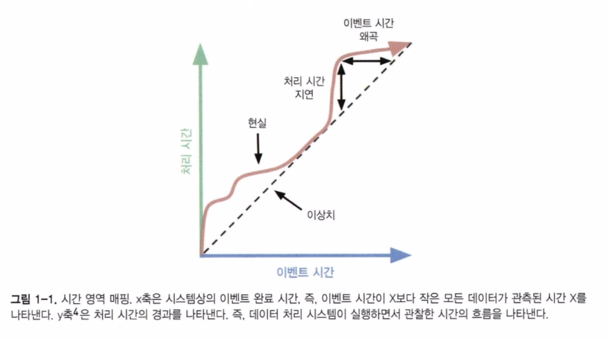
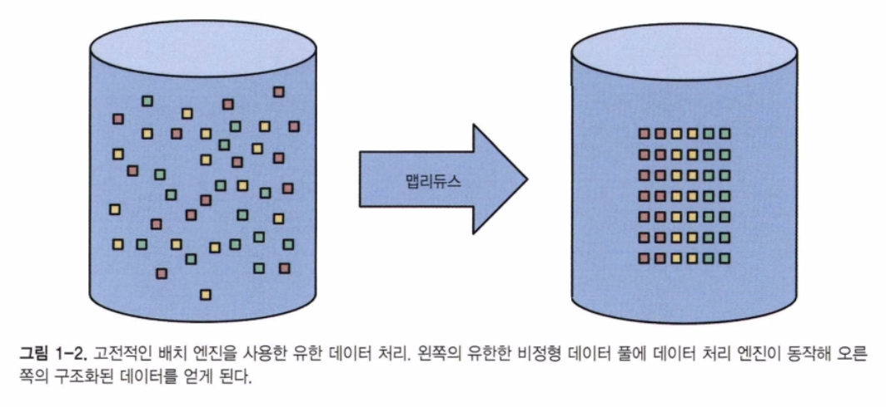
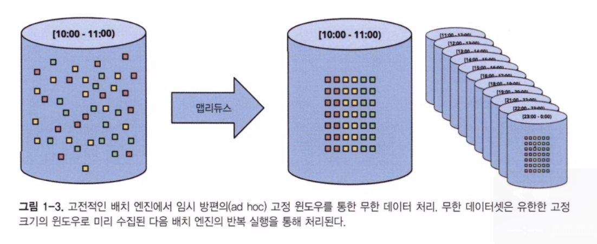
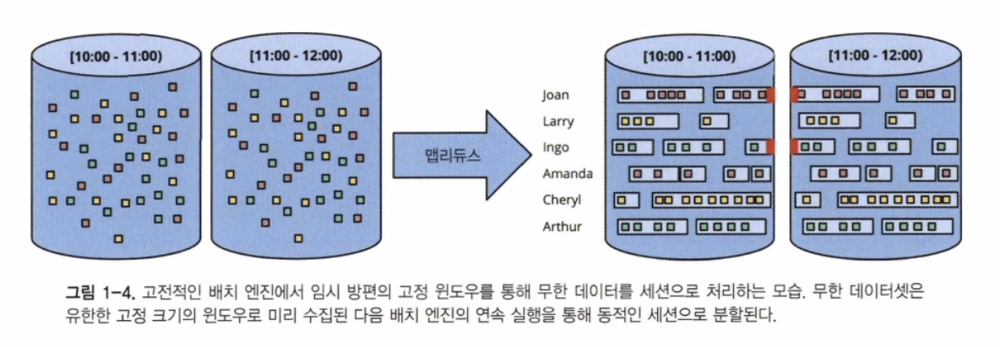
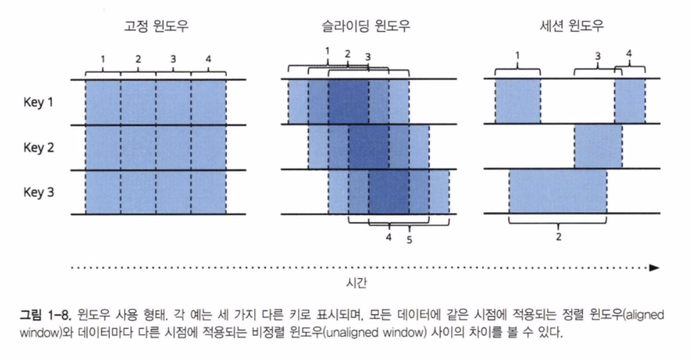
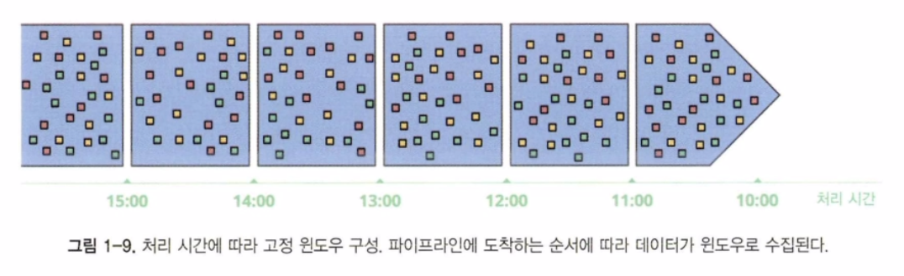
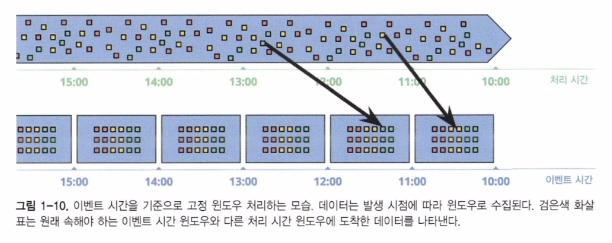
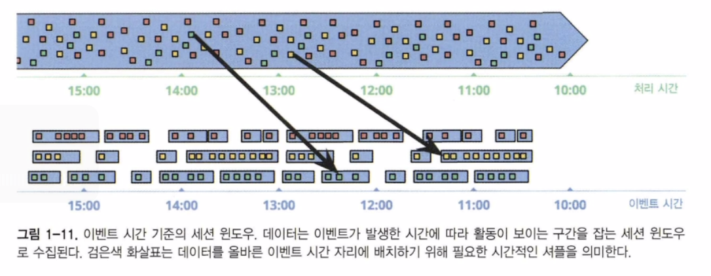

## 용어: 스트리밍이란?

스트리밍 시스템이란 무한 데이터셋을 염두에 두고 설계된 데이터 처리 엔진의 유형

낮은 대기 시간, 근사치 또는 예측 결과에 대해 이야기하고 싶다면 부정확하게 스트리밍이라고 부르지 않고 해당 언어를 사용할 필요가 있다.

데이터셋의 모양을 정의하는 두 가지 중요한 차원이 있다. 바로 기수(cardinality)와 구성(constitution)이며, 이 두 속성은 직교적(orthogonal)이다.
데이터셋의 기수는 데이터셋의 크기를 뜻하며, 기수의 가장 두드러진 측면은 지정된 데이터 집합이 유한인지 무한인지를 결정하는 것이다. 데이터셋에서 기수를 설명할 때 사용하는 두 용어는 다음과 같다.
- 유한 데이터(bounded data)
	- 크기가 유한한 데이터셋 유형
- 무한 데이터(unbounded data)
	- 크기가 무한한 데이터셋 유형

반면 데이터셋의 구성은 데이터의 물리적 표현을 나타내며, 결국 해당 데이터셋과 상호 작용할 수 있는 방법을 정의해준다. 간략히 살펴보면 크게 두 가지 형태의 구성이 있다.
- 테이블(table)
	- 특정 시점의 데이터셋에 대한 전체적인 뷰를 의미하며, SQL 시스템은 전통적으로 테이블을 바탕으로 동작해왔다.
- 스트림(stream)
	- 시간에 따라 변화하는 데이터셋의 요소 단위 뷰. 맵리듀스 계통의 데이터 처리 시스템은 전통적으로 스트림을 바탕으로 동작해왔다.

#### 심하게 과장된 스트리밍의 한계
역사적으로 볼 때 스트리밍 시스템은 종국에는 올바른 결과를 내는 배치 시스템과 함께 동작하며 낮은 지연 시간으로 부정확한 예측 결과를 제공하는 틈새 시장으로 밀려나 있었다. 이를 람다 아키텍처라고 한다.

람다 아키텍처는 동일한 계산을 수행하는 배치 시스템과 스트리밍 시스템을 함께 운영하는 것이다. 스트리밍 시스템은 낮은 지연 시간으로 부정확한 결과를 제공하며, 얼마 후 배치 시스템이 최종적으로 정확한 결과를 보여주는 식이다.

> 하지만 안타깝게도 독립된 두 버전의 파이프라인을 구축하고 유지해야 하며 최종엔 두 파이프라인에서 나온 결과를 병합해야 했기 때문에 람다 시스템을 유지하는 것은 번거로울 수밖에 없다.

이후 주어진 작업을 위해 잘 설계된 단일 파이프라인을 적절히 구축해 실행하는 카파 아키텍처를 제안했다.

저자가 주장하는 바는 거기서 한걸음 더 나아가는 것이다. 배치 시스템은 기능상 잘 설계된 스트리밍 시스템의 엄격한 부분집합에 불과하다고 생각한다. 효율성 면에서 발생하는 차이를 제외하면 오늘날 배치 시스템은 더 이상 쓸 이유가 없다.

결론을 이야기하면, 무한 데이터 처리를 위해 강력한 프레임워크와 결합된 스트리밍 시스템이 광범위하게 성숙해 감에 따라. 람다 아키텍처는 빅데이터 역사에서 유물로 전락해갈 것이다. 스트리밍 시스템이 배치 시스템을 이기기 위해 다음의 두 가지가 필요하다고 본다.

- 정확성(correctness)
	- 정확성은 스트리밍 시스템이 배치와 동등해지기 위해 필요한 조건이며, 핵심은 일관성을 제공할 수 있는 스토리지로 귀결된다.
	- 강한 일관성은 '정확히 한 번 처리'방식을 지원하기 위해서 반드시 필요하며, 정확성을 제공하기 위해선 '정확히 한 번' 방식이 필요하고, 정확성은 최소한 배치 시스템의 능력 이상을 가지고자 하는 시스템이 갖추어야 하는 필수 요소이다.
- 시간 판단 도구(tools for reasoning about time)
	- 시간 판단 도구는 스트리밍 시스템이 배치의 능력을 뛰어넘을 수 있게 해주는 부분이다.
	- 시간에 대한 판단을 도와주는 훌륭한 도구는 다양한 이벤트 시간 왜곡이 발생하는 상황에서 무한 비순서 데이터를 처리할 때 반드시 필요하다.

#### 이벤트 시간 대 처리 시간
모든 데이터 처리 시스템에는 일반적으로 다음 두 형태의 시간 영역이 있다.
- 이벤트 시간(event time)
	- 이벤트가 실제 발생한 시간
- 처리 시간(processing time)
	- 이벤트가 처리 시스템에서 관측된 시간

> 시간에 따른 사용자 행동의 특성을 분석하거나 결제 관련 서비스나 이상 징후 감지 등과 같은 대부분의 경우에 이벤트 시간은 중요하다.

현실에서는 두 시간 사이의 시간 왜곡은 0이 아닐 뿐만 아니라, 입력 소스, 실행 엔진, 하드웨어 등 다양한 요소를 반영한 매우 가변적인 함수 형태가 된다. 이런 시간 차이에 영향을 줄 수 있는 요소로는 다음과 같은 것들이 있다.
- 공유된 리소스로 인한 제약 - 네트워크 혼잡 정도, 네트워크 파티션, 공유 환경에서 쓰이는 CPU
- 분산 시스템의 로직, 경쟁 상황 같은 소프트웨어 상의 원인
- 데이터 자체의 특성들 - 키 분산, 전달되는 데이터의 양이나 순서의 변화(비행기 승객의 일시적으로 비행기 모드를 해제하는 상황)

따라서 실제 시스템에서 이벤트 시간과 처리 시간이 변화하는 모습을 그림으로 표현하면 아래 선과 같은 형태가 된다.

처리 시간
- 이상적인 선과 붉은 선 사이의 수직 거리는 처리 시간 영역에서의 지연을 의미한다.

이벤트 시간
- 이상적인 선과 붉은 선 사이의 수평 거리는 해당 시점의 파이프라인에서 이벤트 시간의 왜곡을 보여준다.
- 다시 말해 이벤트 시간 관점에서 현재 파이프라인이 이상적인 라인으로부터 얼마나 늦어지고 있는지 알려준다.

무한 데이터셋의 무한함이라는 특성을 다루기 위해 이런 시스템은 일반적으로 인입되는 데이터를 윈도우라는 단위로 잘라 다룰 수 있는 개념을 제공한다. 본질적으로는 일정 시간 경계에서 데이터셋을 유한한 크기의 조각으로 자르는 것이라 생각하면 된다.

무한 데이터의 순서가 보장되지 않고 가변적인 왜곡이 발생할 수 있다는 사실은 이벤트 시간 윈도우의 완결 시점을 결정할 수 없다는 이야기가 된다.

## 데이터 처리 패턴

지금부터는 유한/무한 두 처리 유형을 살펴보고자 한다.

#### 유한 데이터
데이터셋을 맵리듀스 같은 데이터 처리 엔진을 통해 처리하고, 그 결과로 얻은 더 큰 가치를 지닌 새로운 구조화된 데이터셋을 나타낸다.

유한 데이터보다 더 흥미로운 것은 무한 데이터셋을 처리하는 부분이다. 전통적인 배치 엔진을 사용하는 방식에서 시작해 대부분의 스트리밍 혹은 마이크로배치 엔진처럼 무한 데이터를 고려해 설계된 시스템이 사용하는 방법을 살펴볼 것이다.

#### 무한 데이터 : 배치
무한 데이터를 배치 처리에 적합한 유한 데이터셋의 집합으로 분할하는 것이 중요하다.

고정 윈도우
배치 엔진을 반복 실행해 무한 데이터셋을 처리하는 가장 일반적인 방법은 아래 그림처럼 입력 데이터를 고정된 크기의 윈도우로 나눈 후 각 윈도우를 분리된 유한 데이터 소스인 것처럼 처리하는 것이다.

그러나 현실적으로 대부분의 시스템에는 여전히 해결해야 하는 데이터 입력이 완결됐음을 알리는 완결성의 문제가 남아 있다. 결국 모든 이벤트 수집을 확인할 때까지 처리를 지연하거나, 데이터가 늦게 도착하면 소속될 윈도우에 대해 전체 배치를 재실행하는 등의 방법으로 이런 문제의 영향을 완화할 필요가 생긴다.

세션
세션은 보통 세션의 활동 기간(예를 들면 특정 사용자의 활동 기간)으로 정의되며, 일정 크기의 세션의 비활동 간격이 따라오면 끝나는 것으로 볼 수 있다. 일반적인 배치 엔진을 사용해 세션을 계산하면 아래 그림의 빨간색으로 표시된 것처럼 여러 배치로 나뉘어진 세션이 나타날 수 있다.

배치 크기를 늘리면 이렇게 분할되는 세션의 수를 줄일 수 있지만 처리까지의 지연 시간이 늘어나게 된다. 또 다른 방법은 이전 배치에 나온 세션을 묶어주기 위한 로직을 추가하는 것이지만 이는 복잡도가 증가한다.

어느 쪽이든, 고전적인 배치 엔진을 사용해 세션을 계산하는 것은 바람직하지 않다. 더 좋은 방법은 스트리밍 방식으로 세션을 구축하는 것인데 이는 나중에 살펴볼 것이다.

#### 무한 데이터 : 스트리밍
무한 데이터 처리에 쓰이는 대부분의 배치 방식이 임시방편적인 특성을 갖는 것과는 다르게, 스트리밍 시스템은 무한 데이터 처리를 위해 제작됐다. 스트리밍 시스템이 다루는 데이터는 무한 데이터일 뿐만 아니라 다음과 같은 특성도 갖는다.
- 이벤트 시간 기준으로 심하게 뒤섞여 이벤트 시간을 기준으로 처리하려면 파이프라인에서 시간 기반의 셔플을 수행해야 하는데이터
- 다양한 형태의 이벤트 타임 왜곡이 발생해 상수 시간 범위 안에 주어진 이벤트 시간 X의 대부분의 데이터를 봤다고 확신할 수 없는 데이터

이와 같은 특성의 데이터를 다룰 때 취할 수 있는 몇 가지 접근법이 있다. 이를 보통 시간 무시(time-agnostic), 근사(approximation), 처리 시간 윈도우(processing time window), 이벤트 시간 윈도우(event time window) 의 네 가지로 분류한다.

시간 무시
시간 무시 처리는 시간이 본질적으로 무고나한 경우, 즉 데이터 처리의 모든 결정을 데이터만 보면서 할 수 있을 때 사용한다.
이 경우 모든 결정은 데이터가 도착하면서 이뤄지기 때문에, 스트리밍 엔진은 기본적인 데이터 전달 목적으로만 사용된다. 아래 몇 가지 구체적인 예시가 있다.
- 필터링(filtering)
	- 시간 무시 처리의 가장 기본적인 형태는 필터링이다.
	- 데이터의 단일 요소에만 의존하기 때문에 데이터 소스가 무한하고 정렬돼 있지 않으며 가변적인 이벤트 시간 왜곡이 있다는 사실과는 무관해진다.
- 내부 조인(inner join)
	- 2개의 무한 데이터 소스를 조인할 때 조인의 결과만 중요하다면 시간적인 요소를 고려할 필요가 없다.
	- 처리 방법을 내부 조인에서 외부 조인으로 전환하면 데이터의 완결성 문제가 발생하기 시작한다. 결국 데이터의 완결을 결정 내리기 위한 타임아웃을 도입해야 하고, 이는 곧 시간적인 개념을 포함한다는 의미가 된다.

근사 알고리즘
근사 알고리즘은 무한 데이터를 입력으로 받아 우리가 얻고자 하는 결과와 비슷한 결과를 생성한다. 근사 알고리즘의 장점은 설계상 낮은 오버헤드를 갖고 무한 데이터를 고려해 설계됐다는 것이다. 근사적인 특성으로 인해 유용성이 떨어질 수 있다

이런 알고리즘은 보통 설계 자체에 시간적인 요소를 포함한다는 점에 주목할 필요가 있다. 그리고 도착하는 순서대로 데이터를 처리하기 때문에 이때의 시간적인 요소는 보통 처리 시간을 기준으로 이루어진다.

윈도우
무한 데이터 처리를 위한 나머지 두 가지 접근 방식은 모두 윈도우를 사용하는 방식이다. 윈도우는 간단히 유한 또는 무한 데이터 소스를 가져와 처리를 위해 시간 경계를 따라 유한한 크기의 조각으로 자르는 개념이다.

1. 고정 윈도우(fixed window), 일명 텀블링 윈도우(tumbling window)
	고정 윈도우는 시간을 고정된 크기의 길이로 자른다. 일반적으로 고정 윈도우로 자르는 과정은 전체 데이터셋에 균일하게 적용돼 정렬 윈도우의 형태를 갖는다.

2. 슬라이딩 윈도우(sliding window), 일명 호핑 윈도우(hopping window)
	슬라이딩 윈도우는 고정 윈도우의 일반화된 형태로, 일정한 길이와 일정한 주기로 정의된다. 이때 주기가 길이보다 작으면 윈도우 간에 겹치는 부분이 발생한다.
	고정 윈도우에서처럼 슬라이딩 윈도우도 성능을 위해 비정렬 형태로 만들 수도 있으나 보통 정렬 윈도우 형태를 갖는다.

3. 세션(session)
	동적 윈도우의 한 예로 볼 수 있는 세션은 일정 타임아웃 시간보다 긴 길이를 갖는 비활성화 간격으로 구분해 일련의 연속된 이벤트들을 묶어서 윈도우를 구성한다.
	세션은 보통 시간적으로 관련돼 있는 이벤트를 묶어서 시간에 따른 사용자의 행동을 분석하기 위해 사용한다.
	데이터의 서로 다른 부분에 동일한 윈도우를 적용할 수 없기 때문에 비정렬 윈도우의 전형적인 예이기도 하다.

처리 시간 윈도우
처리 시간으로 윈도우를 구성할 때 시스템은 어느 정도의 처리 시간이 지날 때까지 들어오는 데이터를 버퍼링한다. 예를 들어 5분 길이의 고정 윈도우의 경우 시스템은 5분 동안의 입력 데이터를 버퍼링하며, 그 후 5분 동안 관촬된 모든 데이터를 윈도우로 묶어 다음 처리를 위해 보낸다.

처리 시간 윈도우에는 몇 가지 바람직한 특성이 있다.
- 우선 단순하다. 데이터가 도착하면 버퍼링했다가 윈도우가 마무리될 때마다 전달하면 된다.
- 윈도우가 완료되는 시점을 판단하기 쉽다. 즉, '지연된' 데이터를 다룰 필요가 없음을 의미한다.
- 데이터 소스가 관측되는 시점을 기준으로 정보를 추론하고자 하는 경우, 처리 시간 윈도우가 적합하다.

이벤트 시간 윈도우
이벤트 시간 윈도우는 이벤트가 실제 발생한 시간을 반영해 유한한 크기의 조각으로 데이터 소스를 관찰하고자 할 때 사용한다. 이는 윈도우의 표준 방식으로 생각할 수 있다.

위 그림의 검은색 화살펴는 흥미로운 모습을 나타낸다. 이들은 자신이 속한 이벤트 시간 윈도우와 맞지 않는 처리 시간 윈도우로 도착한다. 이벤트 시간이 중요한 경우 결과가 부정확했을 것이다. 예상한 대로 이벤트 시간에 대한 정확성 제공은 이벤트 시간 윈도우를 사용할 때 좋은 점 중 하나다.

이벤트 시간 윈도우를 적용할 때의 또 다른 장점은 세션 같은 동적인 크기를 갖는 윈도우를 만들 수 있어 고정 윈도우에 걸쳐 있는 세션을 임의로 분할해야 하는 상황을 피할 수 있다는 점이다.

이벤트 시간 윈도우는 실제 윈도우 자체의 길이보다 이를 수집해 구성하는 시간이 길어지는 경우가 많기 때문에 다음과 같은 단점 두 가지를 갖는다.

- 버퍼링(buffering)
	- 윈도우의 수명이 길어짐에 따라 더 많은 데이터를 버퍼링할 필요가 생긴다.
	- 다행히 영구적인 스토리지는 대부분의 데이터 처리 시스템이 의존하는 리소스 유형 중 가장 저렴한 편에 속한다.
	- 또한 데이터를 집계하는 방식 중 다수는 입력 데이터 모두를 버퍼링할 필요가 없으며 훨씬 작은 크기의 중간 데이터를 영구적인 상태로 유지해 점진적으로 결과를 낼 수 있다.
- 완결성(completeness)
	- 주어진 윈도우에 대한 모든 데이터를 언제 다 볼 수 있는지 미리 알 수 없다면 윈도우의 결과가 언제 구체화 될지 어떻게 알 수 있을까
	- 사실 알 방법이 없다. 이는 워터마크를 통해 결정 가능하다.
	- 하지만 결제처럼 정확한 완결성이 필수적인 경우, 사용 가능한 유일한 방법은 파이프라인 생성자가 윈도우 결과를 언제 구체화할지, 그 결과가 시간에 따라 어떻게 정제될지 표현할 수 있는 방법을 제공하는 것뿐이다.

