스트리밍 시스템이 배치 방식을 뛰어넘기 위해 필요한 두 가지가 정확성과 시간 결정 도구임을 1장에서 설명했다. 이번 장에서는 데이터 처리 패턴에 대해 좀 더 자세히 구체적인 예를 가지고 살펴본다.

#### 로드맵
이벤트 시간과 처리 중 관측된 시간인 처리 시간을 구분하는 것이 중요하다. 만약 분석 겨로가의 정확성과 이벤트가 발생한 문맥이 중요한 경우라면, 처리 시간이 아닌 이벤트 시간을 바탕으로 데이터를 분석해야 한다. 
또한 시간 경계를 기준으로 데이터를 나누는 윈도우에 대해 알고있다. 윈도우의 형태로는 고정 윈도우, 슬라이딩 윈도우, 세션 윈도우가 존재한다. 위 두 개념 외에 나머지 3개를 더 살펴본다.

1. 트리거(trigger)
	어떤 외부 신호로 윈도우가 출력되는 시점을 선언하는 방법이다. 사용자는 트리거를 통해 유연하게 결과가 생성되는 시점을 결정할 수 있다. 트리거는 윈도우가 변해 가면서 윈도우의 결과를 여러 번에 걸쳐 확인할 수 있게 해준다. 동시에 시간이 흐르면서 결과가 점차 정제될 수 있도록 해주며, 이를 통해 예측 결과를 낼 수 있게 해주는 것은 물론 시간에 따른 업스트림 데이터의 변화나 지연돼 도착하는 데이터를 다룰 수 있게 해준다.

2. 워터마크(watermark)
	이벤트 시간을 기준으로 입력이 완료됐음을 표시하는 방법이다. 시간 X의 워터마크는 X보다 작은 이벤트 시간을 갖는 모든 입력 데이터가 관칠됐음을 의미한다. 따라서 워터마크는 무한 데이터를 관찰할 때 진행 정도의 지표로 생각할 수 있다.

3. 누적(accumulation)
	같은 윈도우 내에서 관찰되는 여러 결과 사이의 관계를 명시해준다. 이 결과들은 완전히 독립적일 수도 있고, 겹치는 부분이 있을 수도 있다.

위 개념들 간의 관계를 이해하기 쉽도록 네 가지 질문에 답하는 구조 안에서 개념들을 살펴보고자 한다. 이 네 가지 질문은 모든 형태의 무한 데이터 처리에서 핵심적인 역할을 한다.

- 무슨 결과가 계산되어야 하는가?
	- 이 질문은 파이프라인에서 쓰는 변형(transformation)의 종류로 답할 수 있다.
	- 합을 계산하거나 히스토그램을 만들거나 등의 작업을 말한다.
	- 이는 고전적인 배치 처리에서도 답할 수 있는 질문이다.
- 이벤트 시간의 어디에서 결과가 계산돼야 하는가?
	- 이 질문의 답은 파이프라인에서 이벤트 시간 윈도우의 사용으로 결정된다.
- 처리 시간의 언제 결과가 구체화되는가?
	- 이 질문은 트리거와 워터마크로 답이 주어진다.
	- 가장 일반적인 패턴은 반복해서 업데이트를 하거나, 입력이 완료됐다고 믿을 수 있는 시점 이후 윈도우당 하나의 출력을 내는 워터마크를 사용하거나, 이 둘을 혼합된 형태 등이 가능하다.
- 결과 사이의 관계가 어떻게 되는가?
	- 이 질문의 답은 사용되는 누적 형태가 결정한다.
	- 가능한 형태로는, 모든 결과가 독립적이며 구분되는 무시 모드
	- 이후 결과가 이전 결과 위에 놓이는 누적 모드
	- 누적 값과 이전에 트리거된 값에 대한 철회가 함께 출력되는 누적 및 철회 모드가 있다.

## 배치 처리의 기본 : 무엇과 어디서

#### 무엇: 변환
고전적인 배치 처리에 적용되는 변환은 "무슨 결과가 계산되는가?" 라는 질문에 답을 준다. 예시를 통해 이야기를 해보겠다.
아래 그림은 입력 데이터를 이벤트 시간과 처리 시간에 맞춰 그려본 그래프이다.

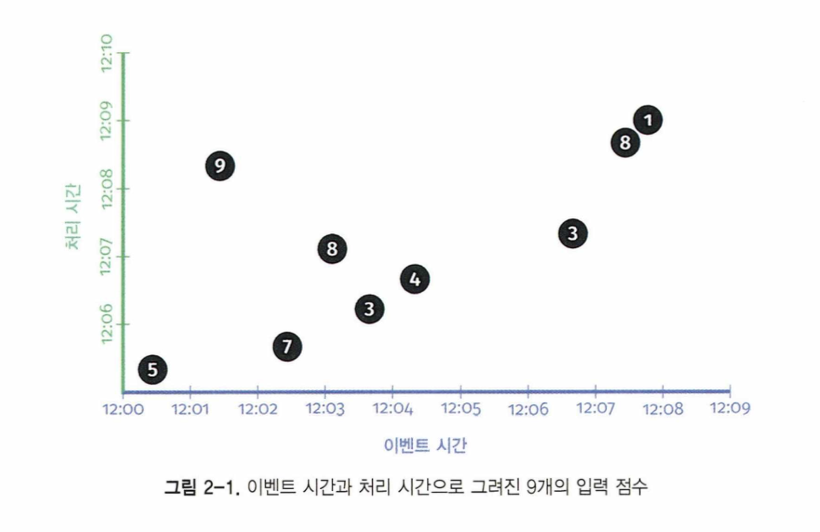

다음으로는 스트림 처리 파이프라인이 입력 값을 관찰하면 중간 과정에서 누적하며, 마지막엔 집계된 결과를 구체화해 출력한다.

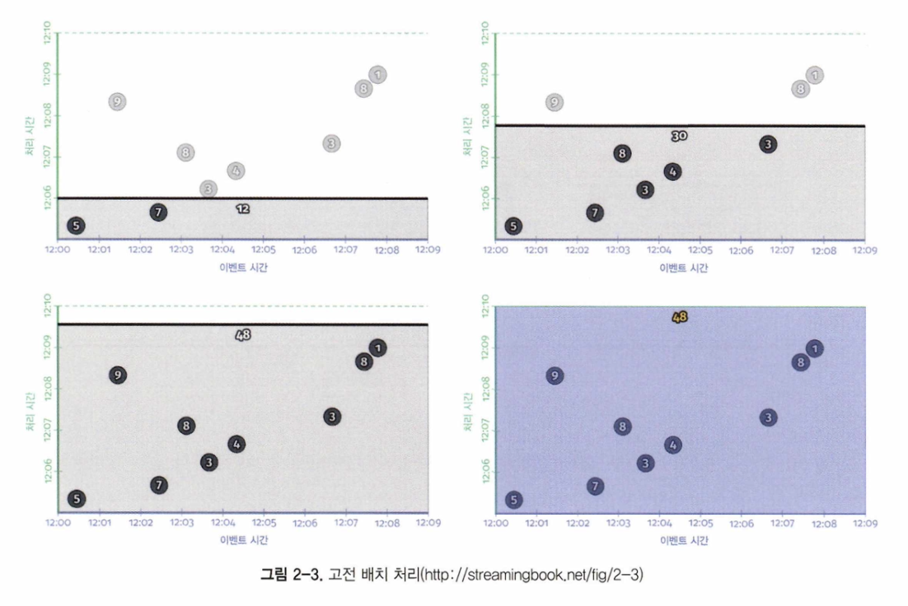

이는 배치 파이프라인이기 때문에, (위 그림 상단의 녹색 점선으로 표시된 부분인) 입력을 모두 다 볼 때까지 중간 상태를 누적하고, 그 후에 단일 결과인 48을 출력한다. 하지만 무한 데이터를 처리하는 것이 목적이라면 이런 식의 고전 배치 처리로는 충분하지 않다.
입력을 모두 볼 때까지 기다려야 하는데 입력이 영원히 끝나지 않기 때문이다. 이때 필요한 개념 중 하나가 1장에서 소개했던 윈도우다. 이제 두 번째 질문인 '이벤트 시간의 어디서 결과가 계산되는가?' 에 대한 답을 찾기 위해 윈도우를 살펴보자

#### 어디서: 윈도우
위에서 사용한 예시인 점수 합계 파이프라이에 2분 단위 고정 윈도우를 적용해보자. 일단 배치 시스템에서 이 예를 실행시키면 아래 그림 결과를 보여준다.

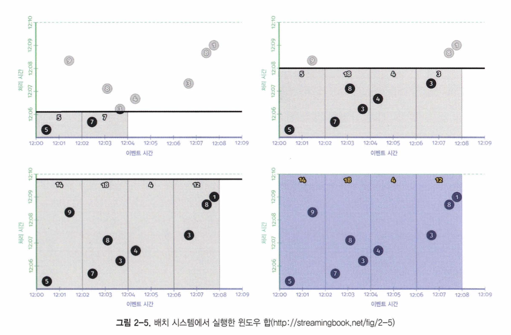

이전과 마찬가지로 입력은 전체가 다 소비될 때까지 중간 상태에 놓이며 입력이 모두 소비된 후에 결과가 생성된다. 이 예에서는 1개의 결과 대신 2분 단위 이벤트 시간 윈도우와 연결된 4개의 결과를 얻게 된다.

#### 스트리밍으로 전환: 언제와 어떻게
지금까지 배치 시스템에서 윈도우 파이프라인이 실행되는 모습을 살펴봤다. 우리가 원하는 이상적인 모습은 결과가 출력될 때까지 지연은 짧되 무한 데이터 입력을 다룰 수 있는 방법이다. 이를 위해 스트리밍 시스템으로 전환하는 것이 올바른 방향이긴 하지만 더 이상 결과 출력 전 입력을 모두 소비할 때까지 기다리는 전략을 쓸 수 없다. 이제 트리거와 워터마크가 나올 차례다.

###### 언제: 트리거가 좋은 이유는 트리거가 좋기 때문이다!
트리거는 "처리 시간의 언제 결과가 구체화되는가?" 라는 질문에 답을 준다. 트리거는 처리 시간에서 언제 윈도우의 결과가 생성돼야 하는지를 선언해준다. 윈도우별로 생성되는 각 출력을 윈도우의 패널이라고 부른다.

개념적으로 보통 두 종류의 트리거가 유용하며, 실제 상황에서는 거의 항상 이 둘 중 하나나 둘이 조합된 형태가 쓰인다.
- 반복 업데이트 트리거(repeated update trigger)
	- 이 트리거는 값이 변함에 따라 주기적으로 윈도우를 위해 업데이트된 패널을 생성한다.
	- 이 업데이트는 새로운 데이터가 들어올 때마다, 혹은 1분에 한 번처럼 일정 시간 이후에 발생할 수 있다.
- 완료 트리거(completeness trigger)
	- 이 트리거는 윈도우 내 입력이 일정 기준 완료됐다고 믿는 시점 이후에 윈도우를 위한 패널을 생성한다.
	- 이 형태의 트리거는 입력이 완료되면 결과를 생성한다는 점에서 배치 처리에서 봤던 것과 유사하다.
	- 트리거 기반으로 처리할 때 차이점은 입력 완료의 개념이 전체 입력 완료가 아닌 단일 윈도우 문맥으로 제한된다는 점이다.

반복 업데이트 트리거는 스트리밍 시스템에서 가장 빈번하게 만날 수 있는 트리거다. 구현이 간단하고 이해가 쉬우며 데이터베이스에서 구체화 뷰(materialized view)와 유사한 형태로 구체화된 데이터셋에 반복된 업데이트를 적용하는 경우에 유용하다.

완료 트리거는 반복 업데이트 트리거보단 덜 쓰이지만, 고전 배치 처리에 더욱 가까운 형태로 스트리밍 처리를 가능하게 해준다. 또한 누락되거나 지연된 데이터에 대한 고려가 가능하도록 해준다는 장점이 있다. 이와 관련해서는 완료 트리거를 구동하는 장치인 워터마크를 공부하면서 살펴보도록 하겠다.

아래 그림은 반복 트리거로 처리한 예시이다.
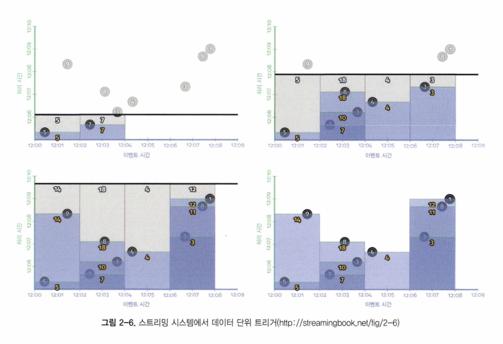

이제 매 입력마다 결과가 생성되기에 윈도우 하나에 여러 출력 결과가 나옴을 확인할 수 있다. 이런 형태의 트리거는 결과가 일정한 테이블에 쓰이고 주기적으로 테이블을 폴링해 결과를 확인하고자 할 때 적합하다. 테이블을 확인할 때마다 주어진 윈도우의 가장 최근 업데이트된 결과가 담겨 있고, 이 값들은 시간이 지남에 따라 원하는 최종 결과에 수렴한다.

> 데이터 단위 트리거의 단점이 있다면 너무 자주 결과가 생성된다는 점이다.

트리거에 처리 시간 지연을 도입하는 방법에는 두 가지가 있다. 하나는 정렬 지연(aligned delay) 이고, 다른 하나는 비정렬 지연(unaligned delay) 이다.

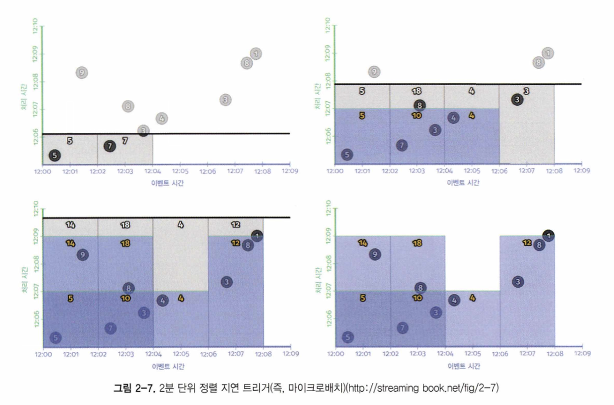

위 예시는 정렬 지연 트리거로 수정이 필요한 모든 윈도우에서 동시에 정기적으로 업데이트가 발생한다. 물론 이는 단점이기도 하다. 모든 업데이트가 한 번에 일어나기 때문에 적절한 부하 처리를 위해 더 큰 최대치를 다룰 수 있도록 프로비저닝이 필요하다.

이 문제에 대한 대안은 비정렬 지연을 쓰는 것이다.

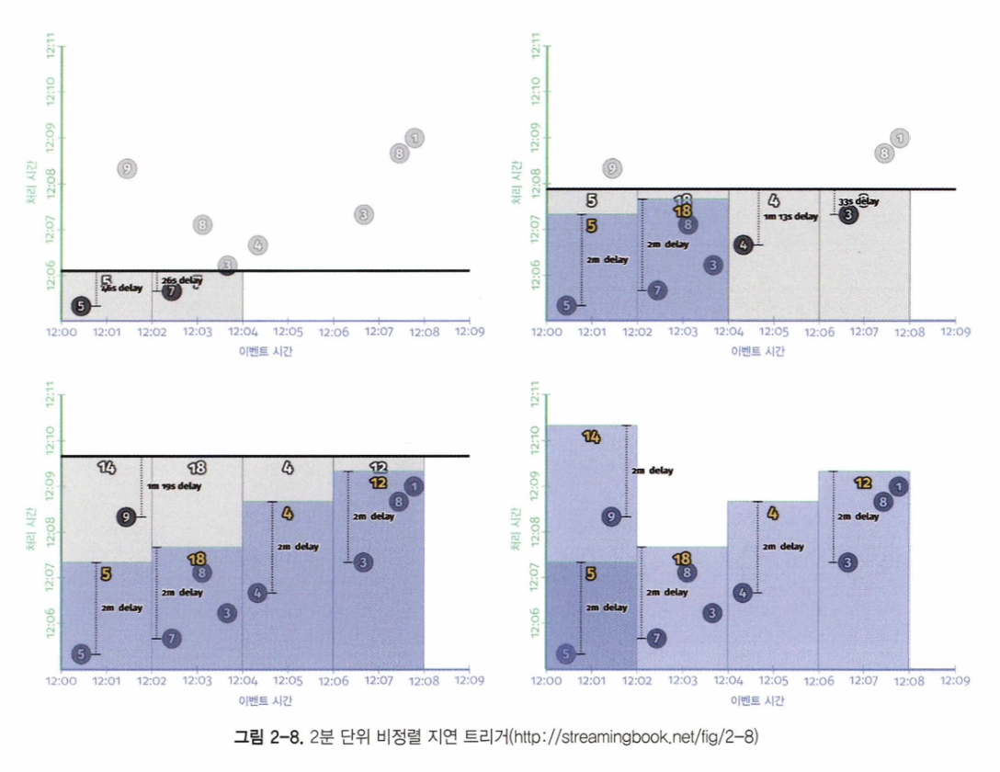

위 그림에 보인 비정렬 지연은 시스템 부하를 고르게 분산시킨다는 점에서 대규모 처리를 위해 더 좋은 선택이라고 볼 수 있다.

반복 업데이트 트리거는 언제 결과의 정확성이 달성되는지에 대한 기준 없이 정확한 쪽으로 수렴한다는 사실만으로 충분하고 결과가 주기적으로 업데이트 되기를 원할 때 매우 유용하다.
하지만, 분산 시스템에서는 다양한 이유로 이벤트가 발생한 시간과 시스템에 관촬되는 시간 사이에 편차가 발생한다. 결국 결과가 입력 데이터에 대해 정확하고 온전한 관점을 언제부터 제시하기 시작하는지 추정하기 어렵다는 뜻이 된다. 입력 완결성이 중요하다면 막연한 추정보다는 완결성에 대해 추론할 수 있는 방법이 필요하다. 이 부분이 워터마크의 역할이다.

###### 언제: 워터마크
워터마크는 "처리 시간의 언제 결과가 구체화되는가?" 라는 질문에 대한 답을 보조하는 역할을 한다. 워터마크는 이벤트 시간 영역에서 입력 완결성을 표현하는 시간적 개념이다. 다르게 말하면 이벤트 스트림에서 처리 중인 데이터의 진행 정도와 완결 여부를 이벤트 시간과 관련해 결정하는 방법이다.

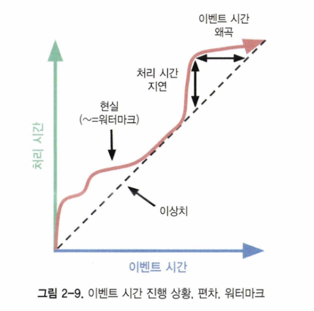

실제 라고 표시된 구불구불한 빨간 선이 워터마크에 해당한다.
워터마크의 종류 즉 완벽한 워터마크인지 휴리스틱 워터마크인지에 따라 그런 추정이 엄격한 보장이 되기도 하고 혹은 쓸 만한 추측이 되기도 한다.
- 완벽한 워터마크(perfect watermark)
	- 입력 데이터를 완벽하게 이해하고 있다면 완벽한 워터마크 구축이 가능해진다.
	- 이 경우 모든 데이터는 정시에 도착하고 당연히 지연 데이터는 존재하지 않는다.
- 휴리스틱 워터마크(heuristic watermark)
	- 여러 곳에서 분산돼 들어오는 입력의 경우에는 입력 데이터를 완벽히 이해하는 것이 현실적으로 불가능하다.
	- 따라서 이 경우 최선의 선택은 휴리스틱 워터마크가 된다.
	- 휴리스틱 워터마크는 입력에 대해 모든 가능한 정보를 고려해 최대한 정확한 진행 상황을 추정하는 것이다. 다수의 경우에 이 추정은 제법 정확하다.

워터마크는 입력에 대한 완결성을 결정하기 때문에, 이전에 소개한 트리거의 두 번째 형태인 완결성 트리거의 밑바탕이 된다.

아래 그림을 통해 두 워터마크의 차이를 확인할 수 있다.
완벽한 워터마크는 시간이 흐르면서 파이프라인의 이벤트 시간 완결성을 제대로 잡아낸다. 반면 휴리스틱 워터마크에 사용된 알고리즘은 입력값 9를 놓치게 되고, 결과적으로 출력 지연이 발생하고 결과의 정확성이 떨어지면서 구체화된 출력의 모양이 크게 바뀌게 된다.

> 워터마크와 반복 업데이트 트리거의 큰 차이점은 워터마크 트리거가 입력의 완결 여부에 대해 판단할 수 있는 방법을 제공한다는 점이다.

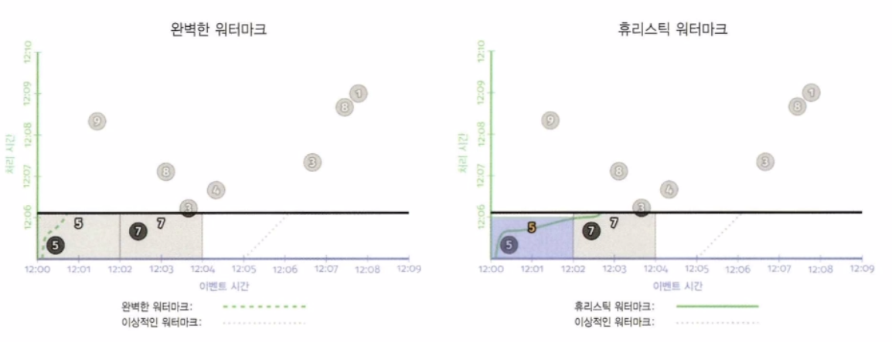
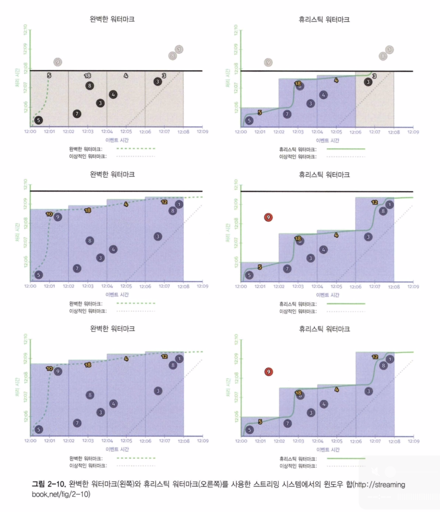

데이터 손실 판단이 중요한 사례 중 하나는 외부 조인이다. 워터마크 같은 완결성 개념 없이는 언제까지 조인이 완결되기를 기다렸다가 포기하고 부분 조인을 출력할지 결정할 방법이 없다. 이벤트 시간 워터마크는 외부 조인, 이상 탐지 처럼 입력의 결피에 대한 결정을 내려야 하는 다수의 스트리밍 사례에 필수적인 요소다.

너무 느림
	워터마크가 (네트워크 대역폭 제한으로 입력 로그가 느리게 증가하는 등의 이유로) 알려진 미처리된 데이터를 기다리느라 정상적으로 지연되는 경우, 결과를 내는 기준이 워터마크의 진행 정도에만 의존하고 있다면 출력에 직접적으로 지연이 발생한다.
	위 그림의 왼쪽 그림에서 알 수 있듯이 늦게 도착한 9로 인해 다른 윈도우는 미리 완료됐음에도 뒤이은 모든 윈도우가 대기하게 된다.
	즉, 워터마크가 완결성에 대한 매우 유용한 개념을 제공하는 것은 맞지만, 결과 생성을 위해 완결성에 의존하는 것이 항상 이상적이지는 않다.

너무 성급함
	휴리스틱 워터마크가 오판으로 실제 기다려야 하는 것보다 먼저 진행된다면, 워터마크 이전의 이벤트 시간을 갖는 데이터가 뒤늦게 도착할 수도 있다.
	위 그림의 오른쪽 그림에서 볼 수 있듯이 12:00 ~ 12:02 윈도우에 대한 값이 14 대신 5를 결과로 내게 된다.
	이 단점은 휴리스틱 워터마크에만 존재하는 문제다. 휴리스틱은 언제든지 틀릴 수 있음을 뜻하고, 결국 출력을 구체화하는 결정에 휴리스틱을 사용하면 정확성을 고려했을 때 충분하지 않은 결과가 나올 수 있다.

완결성에만 의존하는 시스템에서는 낮은 지연과 정확성을 동시에 갖추는 것은 불가능하다. 이제 양쪽에서 최선을 취하는 방법은 무엇일까? 즉, 반복 업데이트 트리거가 낮은 지연을 보이지만 완결성에 대한 지원이 결핍돼 있고, 워터마크가 완결성을 지원하지만 지연 문제가 발생할 수 있다면 그 둘의 장점을 결합해보면 어떨까

###### 언제: 조기/정시/지연 트리거
지금까지 두 가지 주요한 트리거인 반복 업데이트 트리거와 완결성/워터마크 트리거를 살펴봤다. 많은 경우, 둘 중 하나만으로는 충분한 결과를 가져오지 못하지만 둘을 결합한다면 이야기가 달라진다.
이러한 트리거를 조기/정시/지연 트리거(early/on-time/late trigger) 라고 부른다.

- 생략 가능한 조기 패널
	- 워터마크가 윈도우 끝을 지나기 전에 주기적으로 작동하는 반복 업데이트 트리거의 결과물이다.
	- 이는 워터마크가 너무 느려질 수 있는 단점을 보완해준다.
- 단일 정시 패널
	- 완결성/워터마크 트리거가 윈도우 끝을 통과한 후에 동작하는 결과물이다.
	- 이 트리거로 인해 윈도우의 입력이 완료됐다고 믿을 수 있고, 덕분에 누락된 데이터에 대한 판단이 가능해 외부 조인을 수행할 때 부분 조인을 출력하거나 하는 등의 행동이 가능해진다.
- 생략 가능한 지연 패널
	- 워터마크가 윈도우 끝을 통과한 후에 주기적으로 트리거 되는 반복 어벧이트 트리거의 결과물이다.
	- 완벽한 워터마크의 경우 지연 패널은 의미가 없다. 하지만 휴리스틱 워터마크의 경우에는 늦게 도착하는 데이터가 있다면 지연 패널이 발생한다. 이는 너무 성급하게 동작하는 워터마크의 단점을 보완해준다.

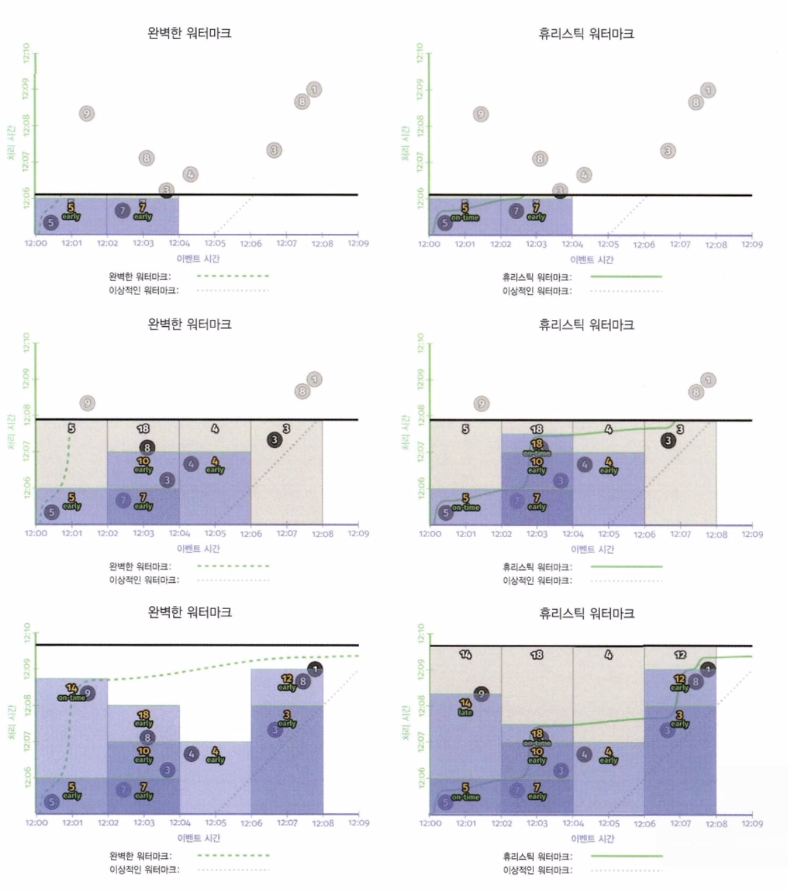
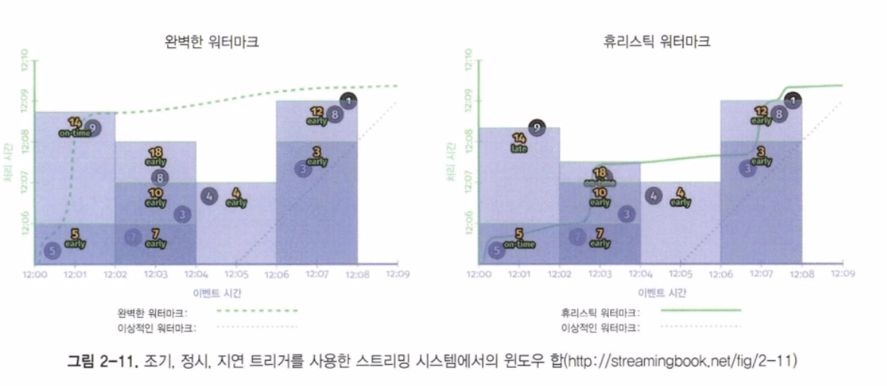

위 버전은 기존 워터마크만 사용한 버전 대비 두 가지 장점을 갖는다.
- 두 번째 윈도우인 \[12:02, 12:04) 에서 워터마크가 너무 느린 경우는 이제 주기적으로 이뤄지는 1분 단위 조기 업데이트를 통해 해결되고 있다. 차이는 완벽한 워터마크의 경우에 좀 더 분명한데, 첫 출력까지의 시간이 7분에서 3분 30초 정도로 줄었다.
- 첫 윈도우 \[12:00, 12:02) 에서 발생하는 휴리스틱 워터마크가 너무 성급한 경우는 이제 늦게 도착하는 9가 바로 새롭게 수정된 패널에 반영되고 올바른 값인 14를 결과로 낸다.

이 새로운 트리거의 흥미로운 점 중 하나는 완벽한 워터마크와 휴리스틱 워터마크를 사용한 두 경우의 차이가 좁혀진다는 점이다. 거기에 더해 워터마크 트리거를 사용하기 때문에 완결성에 대한 판단을 내릴 수 있게 된다. 따라서 데이터 누락을 고려할 필요가 있는 외부 조인, 이상 감지 등의 상황 역시 잘 다룰 수 있게 된다.

조기/정시/지연 트리거를 사용할 때 완벽한 트리거와 휴리스틱 트리거 사이의 남아 있는 가장 큰 차이는 바로 윈도우의 수명이다. 완벽한 워터마크에서는 워터마크가 윈도우 끝을 통과하고 나면 더 이상 해당 윈도우를 위한 데이터가 남아 있지 않음을 알게 돼 윈도우와 관련된 모든 상태 정보를 버릴 수 있다.
하지만 휴리스틱의 경우에는 지연 데이터의 가능성이 있기에 일정 시간 윈도우 정보를 유지해야 한다. 하지만 현재로서는 시스템이 얼마나 긴 시간 각 윈도우의 상태를 유지해줘야 하는지 알 방법이 없다.
이제 허용된 지연 범위에 대한 이야기를 나눌 차례다.

###### 언제: 허용된 지연 범위(가비지 컬렉션)
결국 모든 현실의 비순서 처리 시스템은 윈도우 수명을 제한할 방법이 필요하다. 이를 위한 명쾌하고 간결한 방법은 시스템 내에 허용된 지연 범위를 정의해주는 것이다. 즉, 워터마크를 기준으로 입력 데이터가 얼마나 지연될 수 있는지 한계를 두는 것이다. 이 한계 이후에 도착하는 데이터는 무시된다.

워터마크가 윈도우 끝마다 설정된 지연 범위를 넘어설 때까지만 윈도우 상태를 유지하면 된다. 또한 이로써 시스템이 한계를 지나 도착한 데이터를 즉각 버리도록 해줘, 버려질 데이터를 처리하기 위해 자원을 낭비하지 않도록 해줄 수 있다.

아래 예시를 통해 확인해보겠다. 첫 윈도우 중간에 6 이라는 데이터가 추가된 상황이다

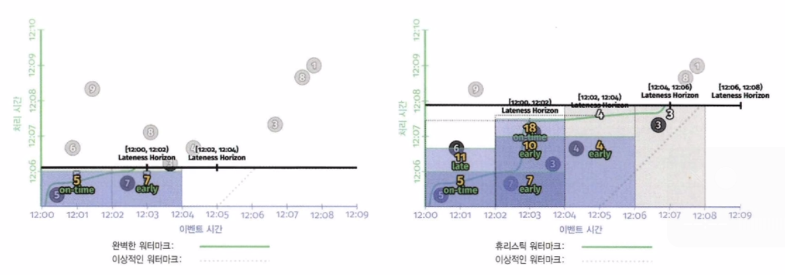
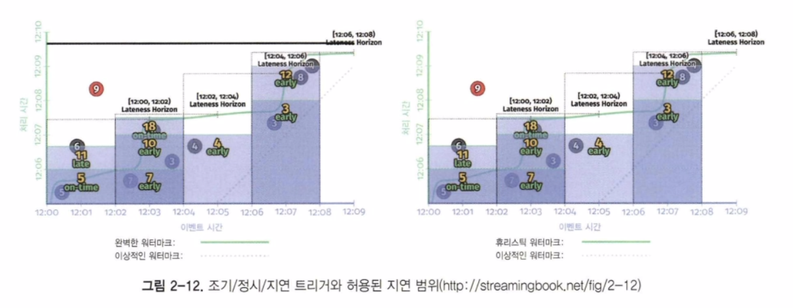

> 참고로 위 그림에서 실선이 완벽한 워터마크로 표시되지만, 오타이고 휴리스틱 워터마크를 의미한다.

워터마크가 윈도우의 지연 한계치(Lateness Horizon)를 지나갈 때, 해당 윈도우는 닫히게 된다. 위 그림에서 검은 점선 사각형이 윈도우가 커버하는 시간 영역이다. 12:00 ~ 12:02 윈도우 구간을 살펴보면 6 데이터는 지연 데이터이지만, 윈도우의 지연 한계치 내에 속하기 때문에 윈도우에 포함돼 최종적으로 11의 결과를 내게 된다. 반면 지연 데이터 9는 윈도우의 지연 한계치 밖에 있어 포함되지 않는다.

지연 한계치에 대해 두 가지 사실만 더 강조하고 넘어가도록 하자.
- 완벽한 워터마크를 사용할 수 있는 경우라면 지연 데이터를 걱정할 필요가 없다.
- 휴리스틱 워터마크를 사용하는 경우라 해도 지연 한계치가 필요 없는 주요한 예외 중 하나는, 제한된 개수의 키로 전체 시간에 대해 총합을 계산하는 식과 같은 경우이다.

이제 마지막 질문으로 넘어가보자.

#### 어떻게: 누적
하나의 윈도우에 대해 트리거가 여러 패널을 결과로 생성하는 경우, 마지막 질문인 "결과 사이의 관계가 어떻게 되는가?"에 답을 해야 한다. 지금까지 봤던 예에서는 각각의 이어지는 패널은 이전 패널을 위에 놓이는 형태였다. 하지만 실제로는 세 가지 다른 종류의 누적 모드(accumulation mode)가 존재한다.

무시(discarding)
	패널이 구체화될 때마다 이전에 저장된 값을 더하거나 하지 않고 무시한다. 이는 각각의 패널이 전에 존재하던 패널과 독립적인 값을 담고 있음을 의미한다.
	무시 모드는 이후에 데이터를 받아 처리하는 시스템이 누적 작업을 스스로 하고자 할 때 유용하다.
	예를 들어 이후 시스템으로 차이값을 보내고 이후 시스템에서 이를 받아 합을 구하는 식이다.

누적(accumulating)
	위 예시들에서 처럼, 패널이 구체화될 때마다 이전에 저장된 상태가 보존되고, 기존 상태와 함께 새로운 값이 결정된다. 이는 각각의 패널이 갖는 값이 이전 패널 값을 바탕으로 형성됨을 의미한다.
	누적 모드는 이후의 결과가 이전 결과를 간단히 덮어쓰는 형태일 때 유용하다.
	HBase 나 Bigtable 같은 키/값 저장소에 결과를 출력하는 경우가 이에 해당한다.

누적 및 철회(accumulating and retracting)
	누적 모드와 유사하지만 새 패널을 생성할 때 이전 패널과 독립적인 철회 정보도 함께 생성한다.
	이 철회 정보는 새로 생성된 누적 결과와 함께 "이전에는 결과가 X라고 했지만, 이는 틀렸고, 마지막에 말한 X를 제거하고 Y로 교체하라"는 정보를 모두 담고 있다.

아래 표는 누적 모드에 따른 값에 대한 비교이다. 12:06 ~ 12:08 범위에 속한 패널에 대한 값이다.
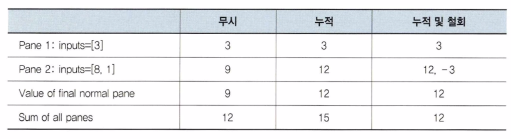

아래 표는 차례로 무시, 누적, 누적 및 철회 모드에 대한 위 예시 그래프이다.
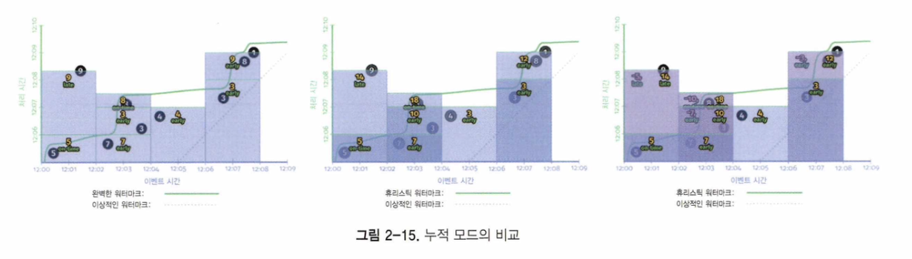

예상하고 있겠지만 무시, 누적, 누적 및 철회 모드의 순으로 저장 공간과 계산 비용을 더 사용하게 된다. 이런 점에서 누적 모드는 정확성, 지연, 비용의 세 축을 따라 절충이 필요한 부분에 또 다른 선택이 필요한 부분이다.

이번 챕터에서는 네 가지 중요한 질문을 만나봤다.
- 무슨 결과가 계산되는가? = 변환
- 이벤트 시간의 어디서 결과가 계산되는가? = 윈도우
- 처리 시간의 언제 결과가 구체화되는가? = 트리거와 워터마크
- 결과 사이의 관계가 어떻게 되는가? = 누적

