#### 정의
이벤트 시간 윈도우 문제를 해결하기 위한 단순한 접근 방법은 이벤트 시간 윈도우를 현재 처리 시간을 기반으로 두는 것이다. 하지만 지금까지 살펴본것처럼 이 방법은 할당되는 윈도우에 대해 보장을 해줄 수 없기에 실패한 방법이다.

중요한 문제는 진행 정도만으로는 완결성(completeness)이라는 근본적인 질문, 특히 일정 시간 간격 동안 모든 입력을 봤는지 여부에 답을 해주지 못한다는 점이다. 진행 정도를 측정하기 위한 강력한 방법이 필요하다.

이를 위해 스트리밍 데이터에 근본적인 가정을 하나 깔아 두고자 한다. 즉, 각 데이터는 논리적인 이벤트 시간 타임스탬프를 포함하고 있다는 것이다. 대부분의 경우 실제 이벤트의 발생 시점을 논리적인 이벤트 시간 타임스탬프로 다룰 수 있다. 파이프라인에서 처리 중인 데이터의 이벤트 시간의 분포를 확인하면 아래 그림과 같은 모양이 될 것이다.

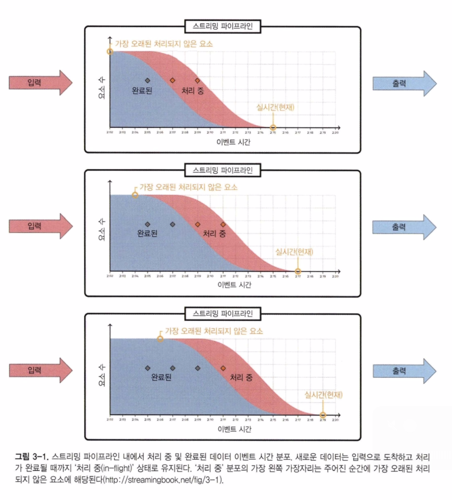

각 데이터는 처리 중 상태, 즉 데이터를 받았지만 아직 처리가 완료되지 않은 상태이거나, 완료 상태, 즉 데이터에 대한 처리가 더 이상 필요하지 않은 상태 중 하나에 놓일 것이다.

여기서 핵심은 파이프라인에서 처리되지 않은 데이터 중 가장 오래된 이벤트 시간에 해당하는 '처리 중' 부분의 가장 왼쪽 끝이다. 워터마크 정의에는 이 값을 사용한다.

> 워터마크는 아직 완료되지 않는 가장 오래된 작업이 갖는 단조 증가(monotinically increasing) 타임스탬프이다.

이 정의에 의해 제공되는 두 가지 근본적인 특성은 다음과 같다.

완결성(completeness)
	워터마크가 어떤 타임스탬프 T를 지나 진전이 이루어진 경우, 단조라는 속성으로 인해 시간 T를 기준으로 정시 또는 그 전에 발생한 이벤트는 만나지 않음을 보장받는다. 따라서 T에서의 혹은 그 이전의 모든 결과를 생성해도 올바르다.
	다시 말해 워터마크를 사용하면 윈도우를 닫을 수 있는 시점을 알 수 있다.

가시성(visibility)
	메시지가 어떤 이유로든 파이프라인 내에서 처리되지 않고 있으면, 워터마크가 진행되지 않는다. 또한 워터마크의 진행을 방해하는 데이터를 검토해 문제의 원인을 찾을 수 있다.

## 소스 워터마크 생성

데이터 소스에 워터마크를 설정하려면 해당 소스에서 파이프라인으로 들어가는 모든 메시지에 논리적인 이벤트 시간을 할당해야 한다. 모든 워터마크는 완벽한 워터마크나 휴리스틱 워터마크 두 범주 중 하나에 속한다.

완벽한 워터마크는 워터마크가 모든 데이터를 고려했음을 보장한다는 점이고, 휴리스틱은 지연 데이터가 발생할 수 있음을 인정한다는 점이다. 워터마크가 두 형태 중 하나로 만들어진 후에는 파이프라인 동작 내내 그 형태로 남아 있다. 워터마크의 생성 형태는 소비되는 입력 소스의 특성에 크게 의존한다.
그 이유를 이해하기 위해 워터마크의 생성 형태에 관한 예를 살펴보자.

#### 완벽한 워터마크 생성
완벽한 워터마크를 생성하려면 워터마크가 그보다 작은 이벤트 시간을 갖는 데이터가 입력으로 들어오지 않도록 엄격하게 보장해주는 방식으로 입력 데이터에 타임스탬프를 할당해야 한다.
완벽한 워터마크를 생성하려면 입력에 대한 완벽한 지식이 필요하므로 실제 대부분의 분산 입력 소스에는 적용이 어렵다. 다음은 완벽한 워터마크를 생성할 수 있는 몇 가지 사례다.

인입 타임스탬프(ingress timestamp)
	시스템에 입력되는 데이터의 인입 시간을 이벤트 시간으로 설정하는 경우라면 완벽한 워터마크를 생성할 수 있다. 이 경우 소스 워터마크는 파이프라인에서 관찰되는 처리 시간을 추적하게 된다.
	이벤트 시간이 단일의 단조 증가하는 형태로 할당되기에 시스템은 스트림 안에서 다음에 올 타임스탬프의 특성을 완벽하게 추정할 수 있게 된다.
	물론 워터마크가 실제 데이터 자체의 이벤트 시간과 무관하다는 단점이 있다.

시간순으로 정렬된 정적 로그 데이터
	아파치 카프카 토픽처럼, 각 분할에 단조 증가하는 이벤트 시간이 포함돼 있는 정적 분할에 속하는 정적인 크기를 갖는 시간순 로그 데이터는 완벽한 워터마크를 생성할 수 있는 비교적 단순한 경우에 해당한다.
	시스템은 정적 분할 내 이벤트 시간이 단조 증가한다는 사실을 알고 있기에 다음 타임스탬프에 대해 문제없이 추정할 수 있다.

#### 휴리스틱 워터마크 생성
휴리스틱 워터마크 생성은 워터마크보다 이른 이벤트 시간을 갖는 데이터를 만나지 않는다는 보장이 아닌, 그럴 가능성이 적다는 추정에 대한 워터마크를 생성한다. 휴리스틱 워터마크를 생성해 사용하는 파이프라인은 지연 데이터 처리를 고려해야 한다.
휴리스틱 워터마크가 가능한 두 가지 경우를 보도록 하자

시간순으로 정렬된 동적 로그 데이터
	구조화된 동적 로그 파일(즉, 개별 파일 안에서는 이벤트 시간이 단조 증가하지만 파일 간의 이벤트 시간 관계는 고정되지 않는다)을 생각해보자.
	기존 로그 파일에서 처리되지 않은 데이터의 최소 이벤트 시간을 추적하고, 증가율을 모니터링하며, 네트워크 토폴로지 및 대역폭과 같은 외부 정보를 활용해 모든 입력에 대한 완벽한 지식이 없어도 놀라울 정도로 정확한 워터마크를 생성할 수 있다.

구글 클라우드 Pub/Sub
	클라우드 Pub/Sub은 순서를 보장하며 전달되지 않는다. 그러나 클라우드 데이터플로우 팀은 Pub/Sub 데이터에 대해 사용할 수 있는 지식을 활용해 충분히 정확한 휴리스틱 워터마크를 구축한 바 있다.

사용자가 모바일 게임을 하고 점수 처리를 위해 파이프라인으로 정보가 전송되는 경우를 생각해보자. 일반적으로 모바일 장치를 입력으로 하는 모든 소스에 대해 완벽한 워터마크를 제공하는 것은 불가능하다. 오랜 시간 동안 오프라인 상태에 놓인 기기가 있을 수 있기에 절대적인 완결성에 대한 추정 방법을 제공할 길이 전무하다.

휴리스틱 워터마크 생성과 관련해 정리하자면 소스에 대해 더 많이 알수록 휴리스틱이 향상되고 결국 더 적은 지연 데이터를 만나게 된다. 소스의 유형, 이벤트 분산 및 사용 패턴이 다양하다는 점을 고려할 때 모든 경우에 쓸 수 있는 하나의 해결책은 없다.
그러나 완벽한 워터마크든 휴리스틱이든 입력 소스에서 워터마크가 생성된 후 시스템은 파이프라인을 통해 워터마크를 문제없이 전파할 수 있다.

즉, 완벽한 워터마크는 이후 처리 시스템에서도 완벽한 상태를 유지하고, 휴리스틱 워터마크는 설정했을 때와 마찬가지로 휴리스틱으로 유지된다. 이는 워터마크의 장점이다. 파이프라인 전체에서 완결성을 추적해야 하는 복잡성을 입력 소스에서 워터마크를 생성하는 문제로 좁혀서 해결할 수 있게 된다.

## 워터마크 전파
워타마크는 이전에 설명했듯이 입력 소스에서 생성된다. 데이터가 시스템을 따라 흘러가며 처리되는 것처럼 개념적으로 워터마크도 시스템을 따라 흐른다.
파이프라인의 각 단계의 경계에서 다음과 같은 워터마크를 정의할 수 있다.

입력 워터마크(input watermark)는 해당 단계의 모든 업스트림 진행 상황(즉, 해당 단계에서 입력이 완료된 정도)을 담고 있다. 소스의 경우 입력 워터마크는 입력 데이터의 워터마크를 생성하는 소스 고유의 함수로 볼 수 있다. 
> 소스가 아닌 단계의 경우 입력 워터마크는 모든 업스트림 소스와 해당 단계의 모든 샤드/분할/인스턴스의 출력 워터마크 중 최솟값으로 정의된다.

출력 워터마크(output watermark)는 해당 단계의 진행 정도를 담으며, 기본적으로 해당 단계의 입력 워터마크와 단계 내 처리 중인 모든 비지연 데이터의 이벤트 시간 중 최솟값으로 정의된다. 여기서 '처리 중'의 의미는 주어진 단계가 실제 수행하는 작업과 스트림 처리 시스템의 구현에 따라 달라진다. 보통은 집계를 위해 버퍼링돼 있으나 아직 다운스트림으로 구체화되지 않은 데이터와 다운스트림 단계로 전달 중인 출력 데이터 등을 포함한다.

특정 단계의 입출력 워터마크를 정의함에 있어 유용한 특징 중 하나는 해당 단계로 인해 발생하는 이벤트 시간 지연을 계산할 수 있다는 점이다. 한 단계의 입력 워터마크 값에서 출력 워터마크 값을 빼면 해당 단계로 인해 발생하는 이벤트 시간 지연을 알 수 있다.

각 단계 안에서 처리 과정 역시 단일 요소로 구성돼 있지 않다. 한 단계 내 처리 과정을 여러 개념적 요소를 갖는 흐름으로 분할할 수 있으며, 각각의 요소가 출력 워터마크에 영향을 준다.

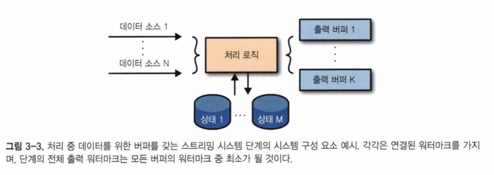

각 버퍼마다 자체 워터마크를 갖도록 해, 이와 같은 버퍼의 진행 정도를 추적할 수 있다. 각 단계의 버퍼가 갖는 워터마크의 최소가 해당 단계의 출력 워터마크를 만들게 된다. 즉, 출력 워터마크는 다음 워터마크의 최소가 된다.
- 데이터를 보내는 단계에서는 소스별 워터마크
- 파이프라인 외부 소스에 대해서는 외부 입력별 워터마크
- 기록될 수 있는 각 상태에 대해서는 상태별 구성 요소 워터마크
- 데이터를 수신하는 단계에 대해서는 출력 버퍼별 워터마크

#### 워터마크 전파 이해하기
게임 점수 예를 통해 워터마크 전파를 이해해보자. 팀 점수의 합계 대신 사용자 참여 수준을 측정해볼 것이다. 사용자의 게임에 참여 시간이 게임을 얼마나 즐기는지 보여준다는 가정을 세우고, 사용자별 세션 길이를 계산하는 작업을 수행하고자 한다.
좀 더 흥미로운 예를 만들기 위해 모바일용 점수와 콘솔용 점수 두 데이터셋으로 작업한다고 가정해, 이 두 독립적인 데이터셋에 병렬로 정수 합을 통한 계산을 동일하게 수행하려고 한다.

한 파이프라인에서는 모바일 기기에서 게임을 한 사용자 점수를 계산하고, 다른 파이프라인에서는 콘솔에서 게임을 한 사용자 점수를 계산할 것이다.

> 중요한 부분은 두 단계로 구성된 두 파이프라인이 동일한 작업을 수행하지만 서로 다른 데이터에 대해 수행돼 출력 워터마크가 매우 달라진다는 점이다.

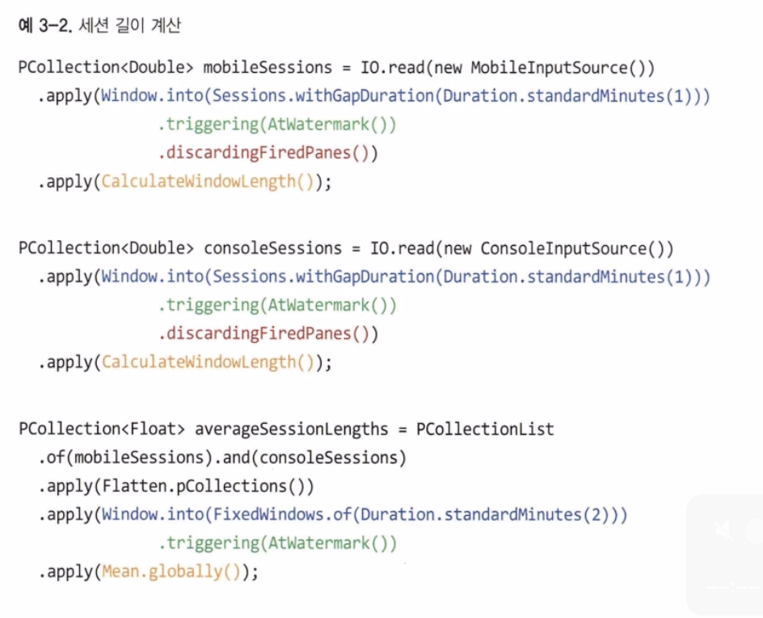

파이프라인의 첫 단계에서 세션으로 윈도우를 적용하고 CalculateWindowLength 라는 사용자 지정 PTransform을 호출한다.
이 PTransform 은 단순하게 키(사용자)를 기준으로 그룹핑한 다음 현재 윈도우 크기를 해당 윈도우의 값으로 처리해 사용자별 세션 길이를 계산한다.

다음으로 위 방법으로 구한 세션 길이를 시간의 고정 윈도우 안에서 전체 세션 길이 평균으로 변환하기 위해 다시 한 번 파이프라인을 구성할 것이다. 이를 위해 우선 데이터 소스를 단일로 구성한 후에 고정 윈도우를 적용해야 한다. 

위 코드의 파이프라인의 실제 동작은 아래 그림과 같다.

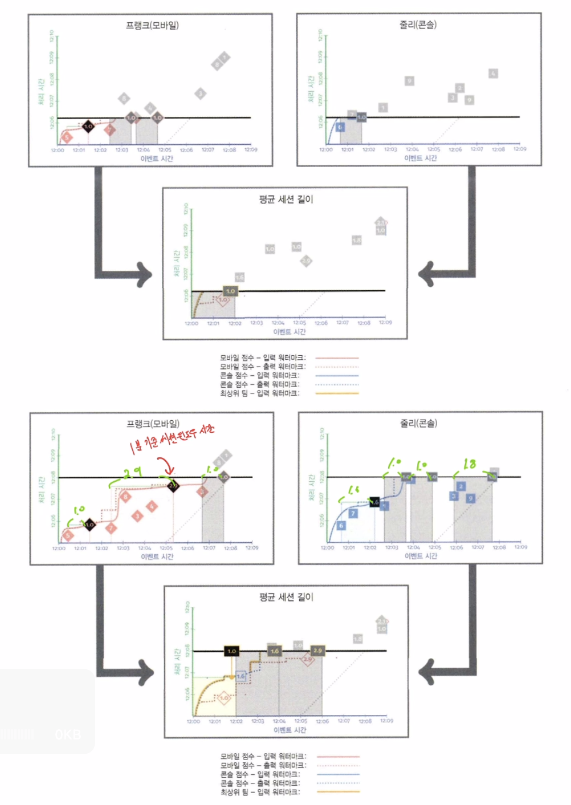
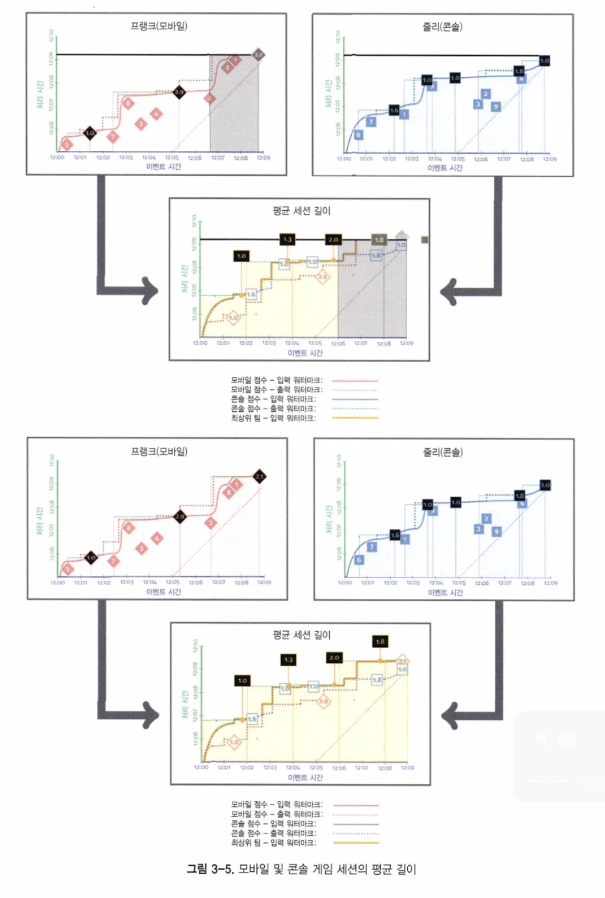

두 파이프라인은 모바일 및 콘솔의 개별 세션 길이를 계산하고 있다. 그런 다음 계산된 세션 길이가 파이프라인의 두 번째 단계로 전달돼 고정 윈도우 안에서 전체 세션 길이의 평균이 계산된다.

여기서 중요한 두 가지 사항은 다음과 같다.
- 모바일 세션과 콘솔 세션 단계의 출력 워터마크는 적어도 각각의 대응하는 입력 워터마크만큼 늦으며 실제로는 조금 더 늦게 된다. 이는 실제 시스템에서 계산 응답에 시간이 걸리고, 주어진 입력에 대한 처리가 완료될 때까지 출력 워터마크가 진행되지 않기 때문이다.
- 평균 세션 길이 단계의 입력 워터마크는 두 단계의 출력 워터마크 중 최솟값이다.

> 즉, 다운스트림 입력 워터마크는 결국 업스트림 출력 워터마크 중 최소를 뜻하는 다른 이름이라고 볼 수 있다.

처음에는 사용자별 세션 길이를 계산했고, 다음에 2분 단위로 세션 길이 전체 평균을 계산했다. 이를 통해 게임을 하는 사용자의 전반적인 행동을 훨씬 더 통찰력 있게 이해할 수 있으며, 단순한 데이터 변호나과 실제 데이터 과학의 차이점을 조금이나마 확인할 수 있다.

#### 워터마크 전파와 출력 타임스탬프

한 윈도우에 대한 유효한 타임스탬프 범위는 윈도우에서 가장 오래된 지연 없는 데이터의 타임스탬프에서 시작하고 무한대까지 확장될 수 있다고 추정할 수 있다. 이때 선택 가능한 많은 방법이 있지만 실제로는 대부분의 상황에서 의미 있는 선택은 다음 몇 가지로 제한된다.

윈도우의 끝
	출력 타임스탬프가 윈도우 경계를 나타내도록 하려면 윈도우 끝을 사용하는 것이 유일하게 안전한 방법이 된다. 가능한 방법 중 워터마크가 가장 매끄럽게 진행되도록 해준다.

첫 번째 비지연 데이터의 타임스탬프
	첫 번째 비지연 데이터의 타임스탬프를 사용하면 워터마크를 최대한 보수적으로 유지할 수 있다. 그러나 그로 인해 워터마크 진행에 방해가 될 수 있다는 단점이 있다.

특정 데이터의 타임스탬프
	특정한 경우에는 다른 임의 데이터의 타임스탬프가 올바른 선택이 되기도 한다. 특정 쿼리에 대한 스트림과 해당 쿼리 결과에 발생한 클릭 이벤트의 스트림을 조인하는 경우를 생각해보자. 조인을 수행한 후 어떤 시스템은 쿼리의 타임스탬프가 더 유용하다고 판단하기도 하며, 다른 시스템은 클릭 이벤트의 타임스탬프를 선호하기도 한다. 어느 경우든 유효하다.

다음으로는 윈도우에서 가능한 가장 빠른 타임스탬프를 사용하는 경우를 살펴본다.

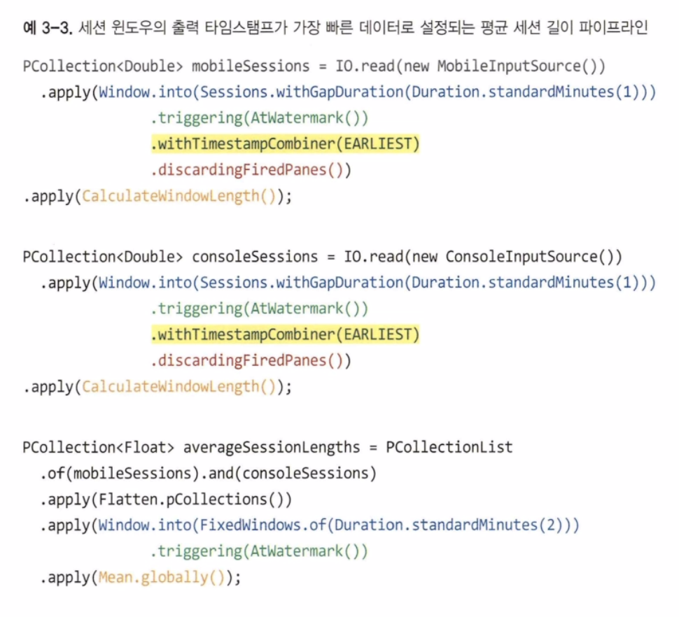

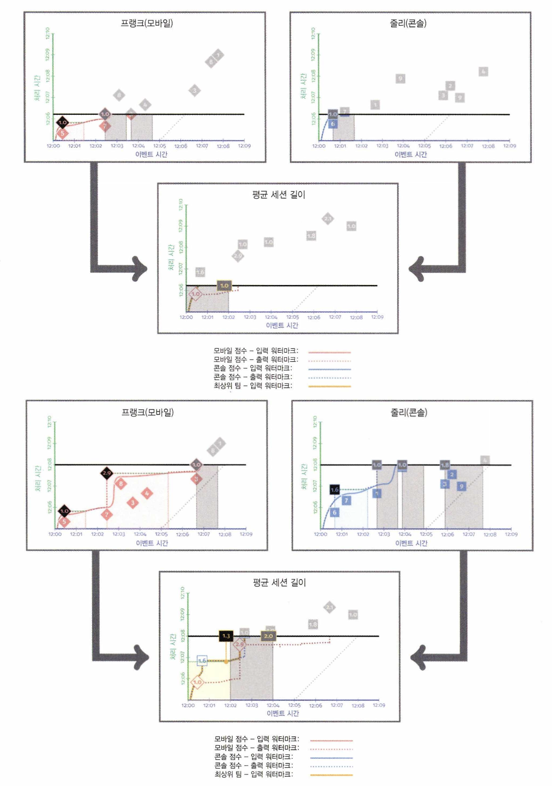
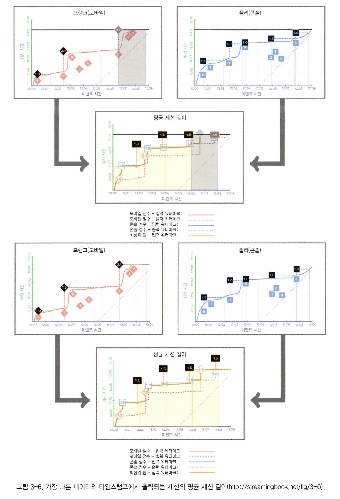

출력 타임스탬프 선택이 어떤 영향을 주는지 이해하기 위해 각 단계의 출력 워터마크가 무엇에 고정돼 있는지 보여주는 첫 단계의 점선을 살펴보자. 출력 타임스탬프가 윈도우 끝으로 선택된 그림 3-7과 3-8에 비교했을 때, 출력 워터마크가 선택된 타임스탬프 때문에 지연되고 있다. 같은 그림에서 이로 인해 두 번째 단계의 입력 워터마크도 지연되는 것을 확인할 수 있다.

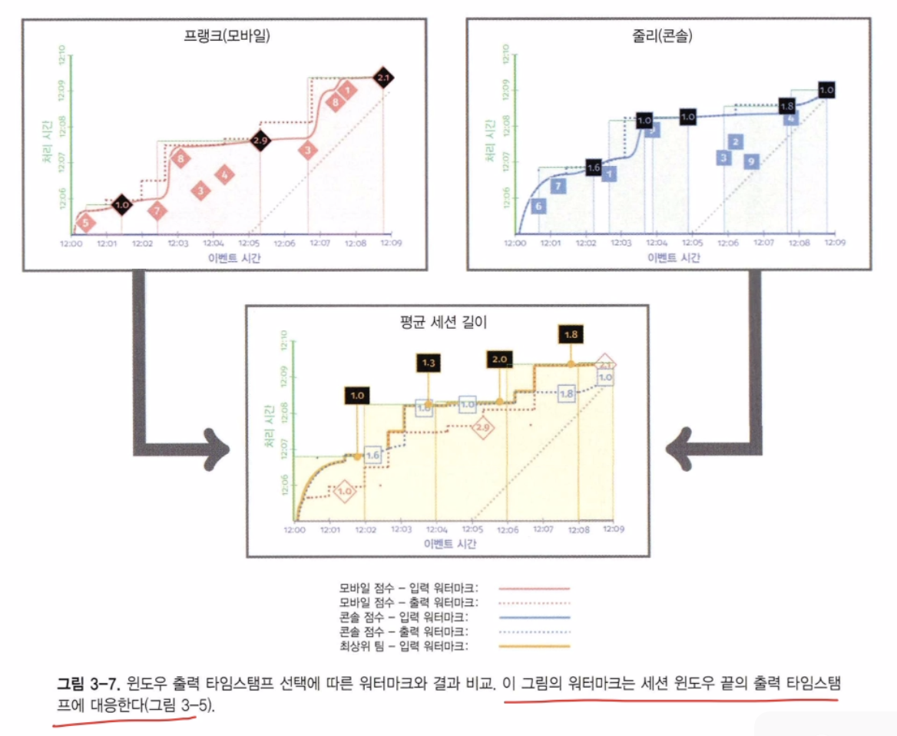

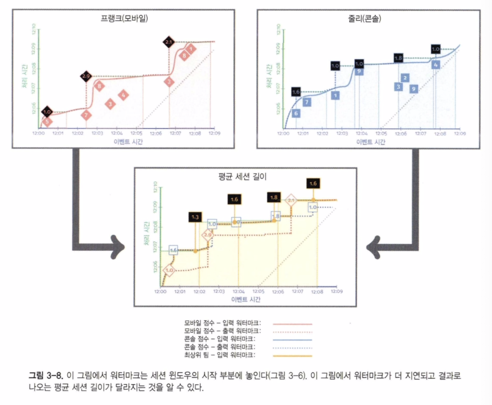

위 결과를 비교해 두 가지에 주목할 필요가 있다.

워터마크 지연
	그림 3-5와 비교해 그림 3-6에서 워터마크는 훨씬 느리게 진행된다. 이는 첫 단계의 출력 워터마크가 해당 윈도우에 대한 입력이 완료될 때까지 모든 윈도우의 첫 번째 요소의 타임스탬프로 유지되기 때문이다. 주어진 윈도우가 구체화된 이후에야 출력 워터마크가 진행될 수 있다.

의미적 차이
	이제 세션 타임스탬프가 세션에서 가장 이른 비지연 데이터와 일치하도록 할당되므로, 다음 단계에서 세션 길이 평균을 계산할 때 개별 세션이 다른 고정 윈도우 안에서 끝나는 경우가 많다. 지금까지 본 두 가지 선택 중 어느 하나가 본질적으로 옳거나 그른 것이 아니라 단지 다른 것일 뿐이다. 그러나 필요한 경우 특정 사용 사례에 대한 올바른 선택을 내릴 수 있도록 그 둘이 다를 수 있고 다를 경우 어떻게 다른지 이해하고 있어야 한다.

#### 까다로운 겹치는 윈도우의 경우
출력 타임스탬프와 관련해 미묘하지만 중요한 또 다른 문제는 슬라이딩 윈도우를 처리하는 방법이다. 출력 타임스탬프를 초기 데이터로 설정하는 단순한 접근 방식은 워터마크가 보류돼 다운스트림 지연이 발생할 가능성이 크다.

#### 백분위 워터마크(percentile watermark)
지금까지 우리는 주어진 단계에서 처리 중인 데이터의 최소 이벤트 시간으로 측정된 워터마크만을 고려했다. 최솟값을 추적해 시스템은 모든 앞선 타임스탬프가 반영된 시점을 알 수 있다. 반면, 처리 중인 데이터가 갖는 이벤트 타임스탬프의 전체 분포를 고려해 좀 더 세분화된 워터마크 조건을 만들 수도 있다.

데이터 분포의 최소 지점을 고려하는 대신 분포의 백분위를 고려해 일정 시점보다 앞선 타임스탬프를 갖는 데이터의 일부 퍼센트를 처리했음을 보장해줄 수 있다.

이 방식의 장점은, 만약 대부분 올바른 결과만 얻어도 충분한 경우라면, 백분위 워터마크를 통해 데이터 분포의 특이값을 워터마크에서 배제함으로써 최소 이벤트 시간을 추적했을 때보다 빠르고 부드럽게 진행되는 워터마크를 얻을 수 있다.

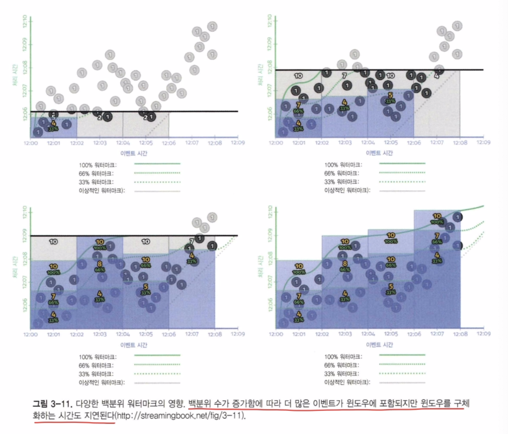

위 그림에서는 예상대로 전체를 포함하는 워터마크를 추적하는 경우보다 일찍 경계를 그릴 수 있다. 따라서 백분위 워터마크는 결과를 구체화하는 대기 시간과 결과의 정확성 간의 균형을 조절할 수 있는 방법을 제공한다.

#### 처리 시간 워터마크(processing-time watermark)
지금까지 시스템을 통해 흘러가는 데이터와 관련된 워터마크에 관해 살펴봤다. 워터마크를 통해 가장 오래된 데이터와 실시간 사이의 전반적인 지연을 확인할 수 있음도 알아봤다. 그러나 이것만으로는 늦게 도착하는 데이터와 시스템에서 발생하는 지연을 구분하기에는 충분하지 않다. 다시 말해, 이벤트 시간 워터마크만 검사해서는 1시간 전의 데이터를 신속하고 지체 없이 처리하는 시스템과 실시간 데이터를 처리하다가 1시간 동안 지연이 발생한 시스템을 구분할 수 없다는 뜻이다.

이러한 구분을 위해서는 처리 시간 워터마크가 필요하다. 스트림 처리 시스템은 단계 간의 데이터 셔플, 데이터를 영구적인 저장 상태에서 읽어오거나 쓰는 행동, 또는 워터마크 진행에 맞춰 지연된 집계를 시작하는 식의 작업을 지속적으로 수행하고 있다.

처리 시간 워터마크는 아직 완료되지 않은 가장 오래된 연산의 처리 시간 타임스탬프를 사용한다. 처리 시간 워터마크에 발생하는 지연의 예로는 한 단계에서 다른 단계로 메시지가 전달되지 못하는 상태나, 상태나 외부 데이터를 읽기 위한 입출력이 진행되지 못하거나 처리가 완료되지 못하도록 발생하는 예외 상황 등이 있을 수 있다.

따라서 처리 시간 워터마크는 데이터에서 발생하는 지연과는 별개로 처리가 지연되는 상황을 감지할 수 있는 방법이 된다.

일반적으로 처리 시간 워터마크가 증가하면 시스템이 동작하는 데 필요한 작업이 완료되지 못하는 문제가 있음을 나타내며 이를 해결하기 위해 종종 사용자 또는 관리자의 개입이 필요할 수 있다.

아래 그림에서 처리 시간 워터마크는 별로 지연되지 않는다. 이는 시스템이 수행하는 연산에는 문제가 없음을 알려준다. 이벤트 시간 워터마크 지연이 여전히 증가하고 있다는 것은 전송되기 전 데이터가 대기를 위해 집계되고 있음을 나타낸다.

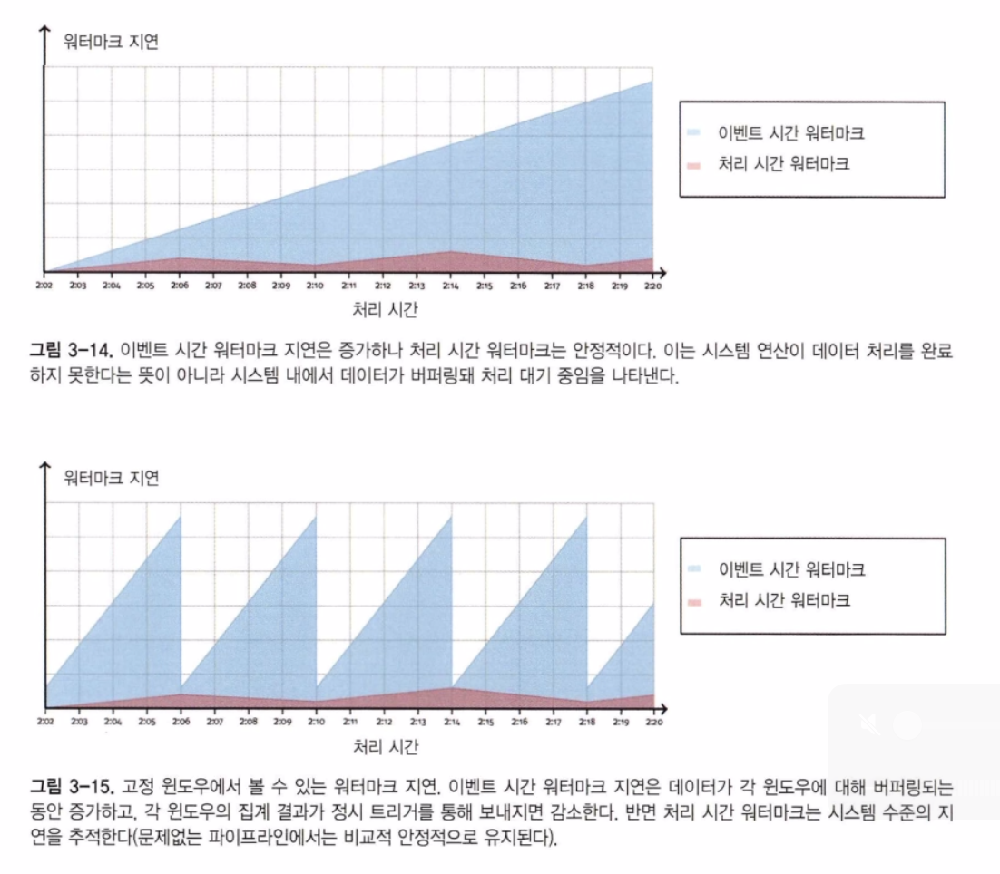

> 처리 시간 워터마크는 시스템 지연과 데이터 지연을 구분할 때 유용하다.

---

아래 논문 gpt 정리
https://www.vldb.org/pvldb/vol14/p3135-begoli.pdf

# 스트리밍 데이터 워터마킹: 통합적 접근

## 워터마크의 개념과 기존 방식의 한계

**워터마크(watermark)**는 스트리밍 데이터의 **이벤트 시간 기반 처리를 위한 “완전성 지표”**입니다. 즉, 현재 워터마크 값은 **그 시간보다 이른 타임스탬프를 가진 이벤트는 더 이상 도착하지 않았음을 의미**합니다​[vldb.org](https://www.vldb.org/pvldb/vol14/p3135-begoli.pdf#:~:text=A%20watermark%20represents%20the%20temporal,throughout%20a%20data%20flow%20graph). 워터마크는 소스에서 시작되어 데이터플로우 그래프의 각 연산자에 전파됨으로써, **순서가 뒤섞인(out-of-order) 스트림에서도 이벤트 시간 순서 의존적인 처리**를 가능하게 합니다​[vldb.org](https://www.vldb.org/pvldb/vol14/p3135-begoli.pdf#:~:text=A%20watermark%20represents%20the%20temporal,throughout%20a%20data%20flow%20graph). 이상적인 워터마크는 **모노토닉(절대 후퇴하지 않음)**하며, **정확성(워터마크 값 이하의 모든 이벤트는 이미 도착)** 및 **활성(liveness: 스트림이 계속되면 워터마크도 무한히 증가)** 속성을 갖습니다.

과거의 스트리밍 처리에서는 **이벤트 시간의 무질서**로 인해 완전성을 판단하기 어려워, **처리 시간** 기준의 타임아웃이나 **Eventually-consistent** 접근법에 의존하곤 했습니다. 그러나 이런 기존 방식에는 한계가 있었습니다. 예를 들어, **처리 시간이 기준인 윈도우 집계**는 **지연 도착 이벤트**를 제대로 처리하지 못하거나 결과를 반복 갱신해야 하는 문제가 있었습니다. 또한 **eventual consistency(최종적 일관성)** 접근은 **스트림이 끝났는지** 알 수 없으므로 **결과 완전성**을 보장하기 어렵습니다. 이러한 한계 때문에, 알림 시스템처럼 **“단 한 번의 최종 정답”**을 요구하는 경우나, 데이터 부재를 감지하는 **딥(dip) 검출**, 무한 스트림에서 부분구간만을 비증분적으로 분석하는 **비증분 통계 처리**, 사용하지 않는 상태를 안전하게 파기하는 **가비지 컬렉션**, 파이프라인 전반의 **진행 상태 모니터링** 등의 **필요성을 기존 기법들이 충족시키지 못했습니다​[vldb.org](https://www.vldb.org/pvldb/vol14/p3135-begoli.pdf#page=5#:~:text=how%20they%20address%20a%20suite,obsolete%20inputs%20and%20intermediate%20state)**.

기존 워터마크 구현들도 제각기 제한점이 있었습니다. 일부 스트리밍 엔진은 워터마크를 **제한된 용도**로만 사용했습니다. 예를 들어, Kafka Streams나 Spark Structured Streaming은 워터마크를 **고정된 유예 기간(grace period)** 형태로 두어 윈도우 결과 확정이나 상태 정리에만 사용하며, 엄밀한 **완전성 보장(=conformant)**이 아닌 휴리스틱으로 동작합니다​[vldb.org](https://www.vldb.org/pvldb/vol14/p3135-begoli.pdf#:~:text=To%20name%20a%20few%2C%20Flink,to%20provide%20final%20results). 이러한 단순 휴리스틱 워터마크는 설정된 지연 시간 이후에 **무조건 모든 데이터 도착**을 가정하기 때문에, 지연이 가변적인 실제 환경에서는 **부정확하거나 지나치게 보수적**일 수 있습니다. 다른 한편으로, 과거 연구 중 **타임스탬프 프런티어(timestamp frontier)** 모델은 다차원 시간 진행을 추적하여 일반성을 높였지만, 구현 복잡도가 높아 널리 채택되지 못했습니다​[vldb.org](https://www.vldb.org/pvldb/vol14/p3135-begoli.pdf#:~:text=Unfortunately%2C%20the%20timestamps%20that%20result,4%20Punctuations). 또한 **Punctuation** 기반 기법은 스트림에 “이 시점까지 데이터 끝”이라는 특별 마커를 삽입하는 방식인데, 시간 이외의 임의 조건에 대해서도 동작할 만큼 일반화되어 있는 대신 각 연산자별로 복잡한 로직 구현이 필요하고, **업스트림/다운스트림 연산자 간 호환성 문제**로 인해 실용성이 떨어졌습니다​[vldb.org](https://www.vldb.org/pvldb/vol14/p3135-begoli.pdf#:~:text=Unfortunately%2C%20the%20generality%20of%20punctuations,that%20downstream%20operators%20cannot%20use). 요컨대, 기존 방식들은 **고정 지연 시간 부여로 인한 처리 지연**, **복잡한 구현 부담**, **완전성 신뢰도 부족** 등의 한계를 지녔습니다.

## 새로운 워터마크 생성 및 전파 메커니즘

이 논문에서는 **스트리밍 워터마크의 통합적 모델**을 제시하며, Apache Flink와 Google Cloud Dataflow라는 두 대표적 스트림 처리 엔진의 워터마크 구현을 비교 분석합니다. 두 시스템은 **동일한 워터마크 의미론(semantics)을 제공**하지만 **구현 방법은 크게 다릅니다​[vldb.org](https://www.vldb.org/pvldb/vol14/p3135-begoli.pdf#:~:text=two%20modern%20stream%20processing%20systems%2C,so%20via%20markedly%20different%20approaches)**. 요약하면, **Flink는 워터마크를 데이터 스트림 내에 포함(in-band)시켜 전파**하고, **Dataflow는 워터마크를 별도의 경로(out-of-band)로 중앙 집계기에서 계산하여 전파**합니다​[vldb.org](https://www.vldb.org/pvldb/vol14/p3135-begoli.pdf#:~:text=In%20Flink%2C%20watermarks%20are%20computed,band%20via%20an%20external%20aggregator).

**Flink의 워터마크 생성**: Flink에서는 사용자가 **워터마크 생성 함수를 정의**하여 각 소스 파티션에서 이벤트들의 타임스탬프를 관찰해 워터마크를 주기적으로 생성합니다. 예컨대 “지금까지 본 최대 타임스탬프 - 5초” 같은 휴리스틱이나, 지연 분포에 따라 동적으로 조정하는 **적응형 알고리즘** 등을 사용할 수 있습니다​[vldb.org](https://www.vldb.org/pvldb/vol14/p3135-begoli.pdf#:~:text=Watermark%20generation%20is%20by%20far,a%20conformant%20watermark%20generator%20for)​[vldb.org](https://www.vldb.org/pvldb/vol14/p3135-begoli.pdf#:~:text=unbounded%20streams%20of%20data,3). 이렇게 생성된 워터마크는 **특수한 이벤트**로서 데이터 스트림에 삽입되고, 다운스트림 연산자들은 **각자 입력 스트림들의 워터마크를 수집하여 최소값(min)을 자신의 현재 워터마크로 결정**합니다. 워터마크는 스트림을 따라 **단계별로 증가**하며, 모든 분기에서는 **가장 느린 입력의 워터마크**에 동기화되도록 설계됩니다. Flink는 또한 **소스가 한동안 입력이 없을 때(Watermark idle)** 전체 파이프라인의 워터마크 진행이 멈추지 않도록, 해당 소스를 **idle 상태로 표시**하여 워터마크 집계에서 제외시키는 메커니즘이 있습니다​[vldb.org](https://www.vldb.org/pvldb/vol14/p3135-begoli.pdf#:~:text=Idle%20workers%20require%20special%20handling,to%20track%20current%20system%20time). 이를 통해 **데이터가 없는 정체 구간**에서도 다른 활성 소스들의 워터마크 진행을 막지 않습니다. 반면 **Dataflow의 워터마크 생성**은 소스별 특화 로직을 두는 경우가 많습니다. 예를 들어 Google Pub/Sub 소스의 경우 **수신 대기 중인 이벤트들의 타임스탬프 분포를 히스토그램으로 관리**하여 워터마크를 산출하는 맞춤 로직을 사용했다고 논문은 설명합니다​vldb.org​vldb.org. 이러한 **소스 맞춤형 알고리즘**을 통해 Dataflow는 데이터 지연 특성을 반영한 워터마크 생성을 합니다.

**Cloud Dataflow의 워터마크 전파**: Dataflow에서는 각 워커(연산 노드)가 자신의 입력으로부터 계산한 워터마크를 **외부의 중앙 **워터마크 집계기**에 보고**합니다. 이 중앙 컴포넌트는 모든 소스로부터 보고된 부분 워터마크 중 **최소값을 전역 워터마크**로 결정하고, 이를 다시 각 연산자에게 **비동기적으로 전파**합니다. 즉 **워터마크 정보가 별도 채널로 전달**되며, 데이터 스트림과 분리되어 진행됩니다​[vldb.org](https://www.vldb.org/pvldb/vol14/p3135-begoli.pdf#:~:text=In%20Flink%2C%20watermarks%20are%20computed,band%20via%20an%20external%20aggregator). 이러한 아키텍처에서는 **추가 네트워크 홉과 지속성 저장소에의 기록**이 수반되는데, 이는 워터마크 진행 상태를 체크포인트로 남겨 **내고장성(fault-tolerance)**을 높이기 위함입니다​[vldb.org](https://www.vldb.org/pvldb/vol14/p3135-begoli.pdf#:~:text=There%20are%20differences%20between%20the,sophisticated%20watermark%20systems%20are%20in)​[vldb.org](https://www.vldb.org/pvldb/vol14/p3135-begoli.pdf#:~:text=yield%20respectable%20watermark%20latencies%20in,of%20the%20user%20expe%02rience%20provided). Dataflow의 중앙 집계 방식 덕분에, **한 소스가 데이터가 없어도** 주기적으로 현재 시간을 기반으로 워터마크를 업데이트하여 **워터마크가 정체되지 않게** 합니다​[vldb.org](https://www.vldb.org/pvldb/vol14/p3135-begoli.pdf#:~:text=active%20again%20as%20soon%20as,downstream%20nodes%20in%20the%20graph)​[vldb.org](https://www.vldb.org/pvldb/vol14/p3135-begoli.pdf#:~:text=two%20source%20nodes%20can%20read,their%20watermarks%20more%20closely%20aligned). 또한 여러 소스 간 워터마크 **Skew(편차)**가 심할 경우, Dataflow는 **앞서가는 소스가 데이터를 잠시 홀드**하도록 조율하여 가장 느린 소스와 보조를 맞추는 **skew 제어 메커니즘**을 갖추고 있습니다​[vldb.org](https://www.vldb.org/pvldb/vol14/p3135-begoli.pdf#:~:text=progress%20is%20limited%20to%20the,of%20running%20a%20single%20Apache)​[vldb.org](https://www.vldb.org/pvldb/vol14/p3135-begoli.pdf#:~:text=significant%20increase%20in%20state%20size,their%20watermarks%20more%20closely%20aligned). 이러한 **동기화 기법**은 Flink에도 존재하며, 결국 **모든 분산 노드들의 워터마크를 전체적으로 조율**함으로써 **과도한 지연 데이터 버퍼링이나 처리 지연**을 완화합니다.

요약하면, **Flink는 분산된 각 연산자가 워터마크를 **데이터와 함께 직접 주고받는 구조**이고, **Dataflow는 중앙 관리자가 워터마크를 집계/분배하는 구조**를 취하고 있습니다. 두 접근 모두 **워터마크 생성-전파-소비**라는 핵심 구성요소를 가지고 동작하며, 이러한 워터마크 파이프라인을 통해 스트림 전체의 **이벤트 시간 진행 상황**을 신뢰성 있게 추적합니다​[vldb.org](https://www.vldb.org/pvldb/vol14/p3135-begoli.pdf#:~:text=current%20value%20informs%20a%20processor,in%20Kafka%20Streams%2C%20Spark%20Structured)​[vldb.org](https://www.vldb.org/pvldb/vol14/p3135-begoli.pdf#:~:text=unique%20characteristics%20%28e,band%20via%20an%20external%20aggregator).

## 시스템 구현 측면의 고려사항과 장점

**워터마크 시스템 구현**에서는 **생성(generation)**, **전파(propagation)**, **소비(consumption)**의 세 가지 요소를 고려해야 합니다​[vldb.org](https://www.vldb.org/pvldb/vol14/p3135-begoli.pdf#:~:text=current%20value%20informs%20a%20processor,in%20Kafka%20Streams%2C%20Spark%20Structured)​[vldb.org](https://www.vldb.org/pvldb/vol14/p3135-begoli.pdf#:~:text=there%20are%20just%20three%20core,Adaptive%20Watermarks). 이 중 **워터마크 생성**이 가장 어렵고 중요합니다. 스트림의 **완전성 신호**를 계산하기 위해, 소스별로 데이터 지연 특성을 추모해야 하기 때문입니다​[vldb.org](https://www.vldb.org/pvldb/vol14/p3135-begoli.pdf#:~:text=Watermark%20generation%20is%20by%20far,a%20conformant%20watermark%20generator%20for). 논문에서 소개된 바에 따르면 워터마크 생성에는 **간단 휴리스틱**(예: “지금까지 본 최대 타임스탬프 + X초”​[vldb.org](https://www.vldb.org/pvldb/vol14/p3135-begoli.pdf#:~:text=unbounded%20streams%20of%20data,timestamps%2C%20or%20Cloud%20Dataflow%E2%80%99s%20bespoke))부터 **통계적/적응적 기법**(예: Flink의 적응형 워터마크 알고리즘​[vldb.org](https://www.vldb.org/pvldb/vol14/p3135-begoli.pdf#:~:text=watermarks%20available%20in%20Kafka%20Streams%2C,3)) 그리고 **소스별 맞춤 로직**(예: Kafka 토픽처럼 **타임스탬프가 단조 증가**하는 소스에 특화된 알고리즘, Pub/Sub 전용 알고리즘 등​[vldb.org](https://www.vldb.org/pvldb/vol14/p3135-begoli.pdf#:~:text=sophisticated%20algorithms%20%28e,3))까지 다양한 전략이 사용됩니다. 시스템 구현자는 워터마크 생성 알고리즘을 잘 조정(tuning)하여 **너무 보수적이면 지연 증가, 너무 적극적이면 지각 데이터 처리 누락**의 균형을 잡아야 합니다​[vldb.org](https://www.vldb.org/pvldb/vol14/p3135-begoli.pdf#:~:text=Watermarks%20do%20have%20their%20shortcomings,their%20users%3B%20far%20better%20for)​[vldb.org](https://www.vldb.org/pvldb/vol14/p3135-begoli.pdf#:~:text=is%20watermark%20generation%20algorithms%20which,the%20problems%20of%20completeness%20within). 논문에서도 **과보수적인 워터마크로 인한 불필요한 지연**은 자주 거론되는 문제지만, 이를 개선하기 위해 **알고리즘 미세조정 또는 완전성 조건 완화** 등의 대응이 가능하다고 설명합니다​[vldb.org](https://www.vldb.org/pvldb/vol14/p3135-begoli.pdf#:~:text=Watermarks%20do%20have%20their%20shortcomings,their%20users%3B%20far%20better%20for)​[vldb.org](https://www.vldb.org/pvldb/vol14/p3135-begoli.pdf#:~:text=is%20watermark%20generation%20algorithms%20which,the%20problems%20of%20completeness%20within).

**워터마크 전파**는 분산 시스템 관점에서 **신뢰성과 확장성**이 핵심입니다. Flink 방식에서는 워터마크가 데이터 스트림과 함께 흐르므로 **네트워크 부하**에 유의해야 합니다. 워터마크는 모든 분산 태스크 사이에서 전달되기 때문에 **작업자 수나 토폴로지 깊이가 커질수록 부하가 증가**할 수 있습니다​[vldb.org](https://www.vldb.org/pvldb/vol14/p3135-begoli.pdf#:~:text=There%20are%20differences%20between%20the,sophisticated%20watermark%20systems%20are%20in)​[vldb.org](https://www.vldb.org/pvldb/vol14/p3135-begoli.pdf#:~:text=hop%20and%20persistent%20storage%20writes,and%20a%20hidden%20inefficiency%20in). 실제 평가에서 Flink의 워터마크 지연이 워커 수 증가에 따라 **슈퍼-리니어(super-linear)**하게 약간 늘어나는 경향이 관찰되었는데, 이는 워터마크 이벤트 트래픽 양이 많아지고 내부 워터마크 서브시스템의 잠재적 비효율 때문으로 추정됩니다​[vldb.org](https://www.vldb.org/pvldb/vol14/p3135-begoli.pdf#:~:text=There%20are%20differences%20between%20the,sophisticated%20watermark%20systems%20are%20in)​[vldb.org](https://www.vldb.org/pvldb/vol14/p3135-begoli.pdf#:~:text=hop%20and%20persistent%20storage%20writes,and%20a%20hidden%20inefficiency%20in). 반면 Dataflow 방식은 **추가 네트워크 홉**과 **Persistent Storage** 쓰기가 포함되지만, **체크포인트 기반의 강인한 내고장성**을 제공합니다​[vldb.org](https://www.vldb.org/pvldb/vol14/p3135-begoli.pdf#:~:text=There%20are%20differences%20between%20the,sophisticated%20watermark%20systems%20are%20in)​[vldb.org](https://www.vldb.org/pvldb/vol14/p3135-begoli.pdf#:~:text=There%20are%20differences%20between%20the,linearly%20as%20both). 중앙 집계기는 각 워커의 워터마크를 주기적으로 저장해 두므로, 노드 장애 시에도 전체 파이프라인의 **진행 상황을 복구**하기가 수월합니다. 다만 이 구조로 인해 Dataflow의 워터마크 전파 지연이 소폭 높아져, Flink보다 **수백 밀리초 정도 추가 지연**이 있는 것으로 나타났습니다​[vldb.org](https://www.vldb.org/pvldb/vol14/p3135-begoli.pdf#:~:text=There%20are%20differences%20between%20the,sophisticated%20watermark%20systems%20are%20in)​[vldb.org](https://www.vldb.org/pvldb/vol14/p3135-begoli.pdf#:~:text=There%20are%20differences%20between%20the,linearly%20as%20both). 그럼에도 **두 시스템 모두 100~200ms 수준의 낮은 워터마크 지연**을 달성하여 **실시간 처리를 원활히 지원**합니다​[vldb.org](https://www.vldb.org/pvldb/vol14/p3135-begoli.pdf#:~:text=about%20completeness,to%20the%20in%02creased%20volume%20of)​[vldb.org](https://www.vldb.org/pvldb/vol14/p3135-begoli.pdf#:~:text=yield%20respectable%20watermark%20latencies%20in,of%20the%20user%20expe%02rience%20provided).

**워터마크 소비**란 연산자가 워터마크 신호를 받아 **정해진 시점이 지나면 결과를 산출하거나 상태를 폐기**하는 작업입니다. 이는 비교적 단순하여, 예를 들어 윈도우 연산의 경우 **워터마크가 윈도우 끝 시간을 넘으면 그 윈도우의 집계 결과를 출력**하는 식으로 구현됩니다​[vldb.org](https://www.vldb.org/pvldb/vol14/p3135-begoli.pdf#:~:text=Of%20course%2C%20a%20watermark%20signal,in%20the%20100s%20of%20milliseconds). Flink와 Dataflow 모두 내부적으로 **워터마크 기반 트리거**를 사용하며, 이는 구현상 크게 다르지 않습니다. 오히려 차이는 **사용자 API에서 워터마크를 노출하는 방식**인데, 두 시스템 모두 워터마크를 **프레임워크가 자동 처리**하며 필요 시 **지연 허용 한도(lateness)나 트리거**만 설정하도록 디자인되어 **개발자 부담을 줄인 점**이 장점입니다. 논문에서도 “워터마크의 복잡성을 엔진 구현에 담아내고, 사용자에게는 단순한 개념으로 제공하는 것이 바람직하다”고 강조합니다​[vldb.org](https://www.vldb.org/pvldb/vol14/p3135-begoli.pdf#:~:text=%E2%80%A2%20Shortcomings%20such%20as%20stragglers,In%20Section%205%2C%20we%20discuss).

이러한 구현상의 고려 덕분에, **워터마크를 활용한 스트림 처리는 동적인 데이터 무질서에도 유연하게 대응**할 수 있고, **증분 처리를 진행하면서도 최종 완결 신호**를 기다릴 수 있습니다​[vldb.org](https://www.vldb.org/pvldb/vol14/p3135-begoli.pdf#:~:text=Of%20the%20approaches%20described%20above%2C,use%20cases%2C%20with%20specialized%20watermark)​[vldb.org](https://www.vldb.org/pvldb/vol14/p3135-begoli.pdf#:~:text=as%20do%20bounded%20disorder%20approaches,completeness%20constraints%20enforced%20by%20the). 또한 워터마크는 **다양한 입력 소스 타입**에 맞게 **전략을 바꾸어 적용할 수 있는 일반성**을 지니므로, 하나의 스트림 처리 엔진으로 여러 가지 실시간 시나리오에 대응하기 쉽게 합니다​[vldb.org](https://www.vldb.org/pvldb/vol14/p3135-begoli.pdf#:~:text=%E2%80%A2%20They%20allow%20incremental%20processing,by%20the%20system%2C%20as%20appropriate). 실제로 Flink와 Dataflow 모두 **대규모 실사용 환경**에서 워터마크가 **없어서는 안 될 핵심 도구**로 자리잡았으며, 파이프라인 완전성 문제를 해결하는 데 크게 기여하고 있습니다​[vldb.org](https://www.vldb.org/pvldb/vol14/p3135-begoli.pdf#:~:text=For%20Flink%20and%20Cloud%20Dataflow%2C,work%2C%20as%20well%20as%20everyone)​[vldb.org](https://www.vldb.org/pvldb/vol14/p3135-begoli.pdf#:~:text=indispensable%20tool%20that%20allows%20our,watermarks%20over%20the%20coming%20years).

## 기존 기법과의 비교 및 새로운 접근 방식의 차별점

워터마크를 통한 접근은 과거의 다양한 스트림 완전성 해결책들에 비해 **균형잡힌 비용 대비 효과**를 제공합니다​[vldb.org](https://www.vldb.org/pvldb/vol14/p3135-begoli.pdf#:~:text=Compared%20to%20other%20approaches%20for,They%20provide%20important%20signals)​[vldb.org](https://www.vldb.org/pvldb/vol14/p3135-begoli.pdf#:~:text=Compared%20to%20other%20approaches%20for,incremental%20processing%20%28e.g). **정렬된 입력을 강제하는 방법(ordered processing)**은 지연 데이터를 무시하거나 복잡한 재처리를 필요로 하고, **완전 무질서 허용 방법(order-agnostic)**은 정확한 완료 시점을 알 수 없으며, 앞서 언급한 **프런티어나 펑츄에이션** 기법은 구현 난이도 대비 얻는 이익이 크지 않았습니다​[vldb.org](https://www.vldb.org/pvldb/vol14/p3135-begoli.pdf#:~:text=In%20Section%205%2C%20we%20discuss,completeness%20in%20unbounded%20stream%20processing)​[vldb.org](https://www.vldb.org/pvldb/vol14/p3135-begoli.pdf#:~:text=%E2%80%A2%20Meanwhile%2C%20more%20general%20approaches,believe%20watermarks%20sit%20in%20the). 반면 논문에서 제시한 **통합 워터마크 접근법**은 이벤트 시간이 뒤섞인 현실 세계 스트림에서 **정확한 완료 신호**를 제공하면서도, **지연 시간을 가변적으로 최적화**할 수 있다는 점에서 차별화됩니다​[vldb.org](https://www.vldb.org/pvldb/vol14/p3135-begoli.pdf#:~:text=the%20best%20balance%20of%20costs,use%20cases%2C%20with%20specialized%20watermark). 예를 들어, **바운드된 무질서(bounded disorder)** 가정처럼 고정된 지연을 두는 대신 워터마크는 **실시간으로 지연 상황에 따라 진전 속도를 조절**하므로, **불필요한 대기 시간을 줄일 수 있습니다​[vldb.org](https://www.vldb.org/pvldb/vol14/p3135-begoli.pdf#:~:text=the%20best%20balance%20of%20costs,use%20cases%2C%20with%20specialized%20watermark)**. 또한 완전한 워터마크(=conformant watermark)는 시스템이 **늦게 도착한 데이터까지 모두 수용**하면서도, **최종 결과를 한 번만 산출**하도록 해줍니다. 이는 Kafka Streams의 grace period 같이 **완전성을 일부 포기**하는 기법과 대조적입니다. 예컨대 **Kafka Streams**에서는 윈도우 종료 후 일정 유예 기간까지는 지각 데이터를 받아들이고 그 후에 결과를 확정하지만, 만약 그 유예 기간 이후 **더 늦은 이벤트가 오면 해당 이벤트는 손실**됩니다​[vldb.org](https://www.vldb.org/pvldb/vol14/p3135-begoli.pdf#:~:text=To%20name%20a%20few%2C%20Flink,to%20provide%20final%20results). 반면 Flink/Dataflow 모델의 워터마크는 **설계상 “더 이른 타임스탬프는 없다”는 보장을 준 이후에야 결과를 확정**하므로 **정확도 측면에서 우수**합니다​[vldb.org](https://www.vldb.org/pvldb/vol14/p3135-begoli.pdf#:~:text=A%20watermark%20represents%20the%20temporal,3135).

**시스템 복잡성 측면**에서도 새로운 접근법은 **프레임워크 차원에서 복잡성을 해결**해 사용자에게 단순성으로 나타납니다​[vldb.org](https://www.vldb.org/pvldb/vol14/p3135-begoli.pdf#:~:text=%E2%80%A2%20Shortcomings%20such%20as%20stragglers,In%20Section%205%2C%20we%20discuss). Punctuation 시스템은 개발자가 스트림 중간중간 수동으로 완전성 마커를 관리해야 했지만, 워터마크 시스템에서는 **엔진이 자동으로 워터마크를 생성/전파**하여 연산자들에게 알려줍니다. 이 덕분에 사용자 코드는 **일반적인 스트림 처리 로직에 집중**할 수 있고, **완전성 검증 로직은 프레임워크에 위임**됩니다​[vldb.org](https://www.vldb.org/pvldb/vol14/p3135-begoli.pdf#:~:text=%E2%80%A2%20Shortcomings%20such%20as%20stragglers,In%20Section%205%2C%20we%20discuss). 예를 들어, **Flink/Dataflow에서는 윈도우 연산 시 워터마크에 따라 상태 정리나 결과 출력이 자동화**되어 개발자가 별도로 “언제 데이터를 확정짓고 상태를 지울지” 결정하지 않아도 됩니다. 한편 **타임스탬프 프런티어**(예: Timely Dataflow)가 여러 시간 차원을 한꺼번에 추적하는 일반성을 제공하지만, 대부분의 스트림 애플리케이션은 단일 시간 축(event time)만 필요로 하므로 이러한 일반성이 **실제 응용에서 과한 복잡성**일 수 있습니다​[vldb.org](https://www.vldb.org/pvldb/vol14/p3135-begoli.pdf#:~:text=two%20different%20implementations%20of%20watermark,completeness%20in%20unbounded%20stream%20processing)​[vldb.org](https://www.vldb.org/pvldb/vol14/p3135-begoli.pdf#:~:text=%E2%80%A2%20Meanwhile%2C%20more%20general%20approaches,believe%20watermarks%20sit%20in%20the). 논문의 결론에서도 **워터마크 기반 접근이 현재로서는 가장 실용적**이며, 향후에도 워터마크 개념을 중심으로 스트림 완전성 문제가 발전될 것으로 전망하고 있습니다​[vldb.org](https://www.vldb.org/pvldb/vol14/p3135-begoli.pdf#:~:text=For%20Flink%20and%20Cloud%20Dataflow%2C,work%2C%20as%20well%20as%20everyone)​[vldb.org](https://www.vldb.org/pvldb/vol14/p3135-begoli.pdf#:~:text=indispensable%20tool%20that%20allows%20our,watermarks%20over%20the%20coming%20years).

정리하면, **“통합적 워터마크” 접근**은 기존 기법들의 장점을 아우르면서도 단점은 보완한 균형 잡힌 솔루션입니다. **이벤트 시간 스트림 처리의 정확성**을 보장하면서 **유연한 지연 제어로 효율성**을 높였고, **시스템 수준에서 복잡성을 관리**하여 **사용자들에게는 단순한 추상화**로 제공된다는 점이 두드러집니다. 이러한 이유로 워터마크는 **끝없는 스트림의 완전성**을 다루기 위한 **사실상 표준 수단**으로 자리잡아가고 있으며​[vldb.org](https://www.vldb.org/pvldb/vol14/p3135-begoli.pdf#:~:text=Compared%20to%20other%20approaches%20for,They%20provide%20important%20signals)​[vldb.org](https://www.vldb.org/pvldb/vol14/p3135-begoli.pdf#:~:text=Compared%20to%20other%20approaches%20for,incremental%20processing%20%28e.g), Flink와 Dataflow의 사례는 서로 다른 구현 전략을 통해서도 **동등한 워터마크 기능**을 달성할 수 있음을 보여주는 좋은 예시입니다. 두 시스템의 평가 결과 **사용자 입장에서의 경험 품질은 상당히 유사**했으며, 이는 **워터마크 중심의 스트리밍 설계가 충분히 실용적이고 구현 가능함**을 시사합니다​[vldb.org](https://www.vldb.org/pvldb/vol14/p3135-begoli.pdf#:~:text=about%20completeness,to%20the%20in%02creased%20volume%20of)​[vldb.org](https://www.vldb.org/pvldb/vol14/p3135-begoli.pdf#:~:text=hop%20and%20persistent%20storage%20writes,fact%20quite%20tractable%20to%20build). 앞으로도 스트림 처리 분야에서 워터마크를 활용한 완전성 보장 기법은 지속 발전하며, 더 넓은 적용과 개선이 기대됩니다.

