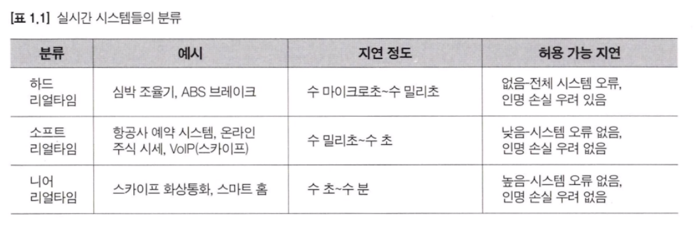
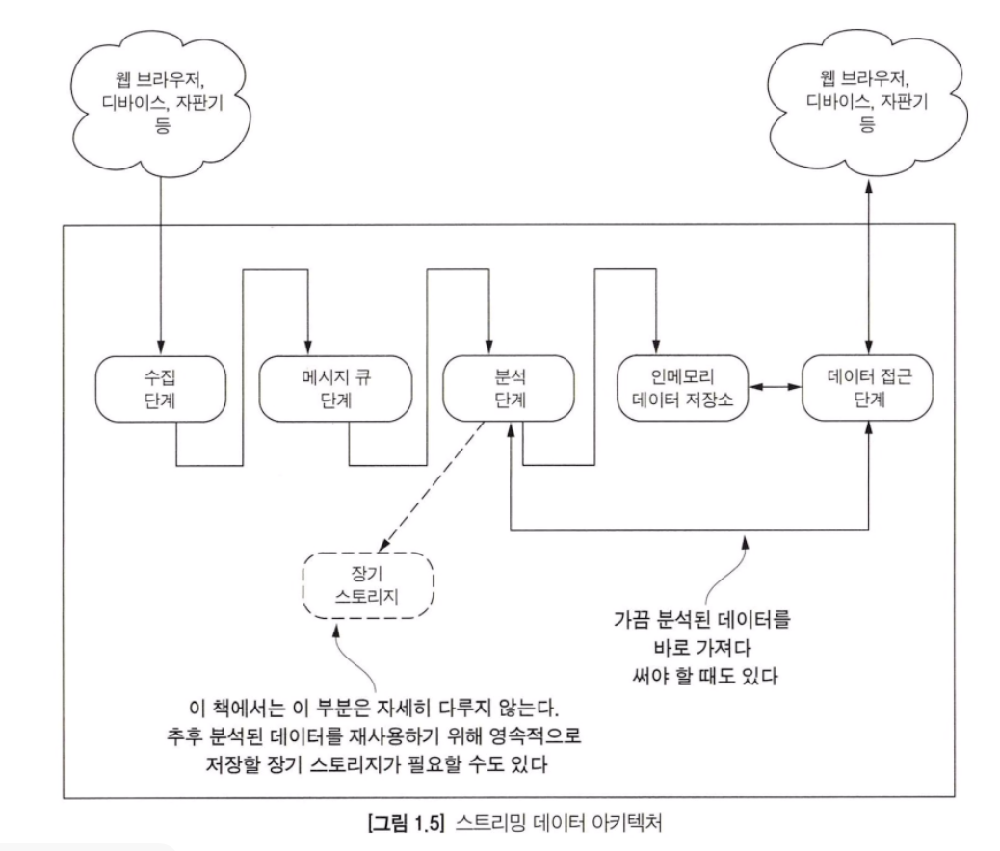
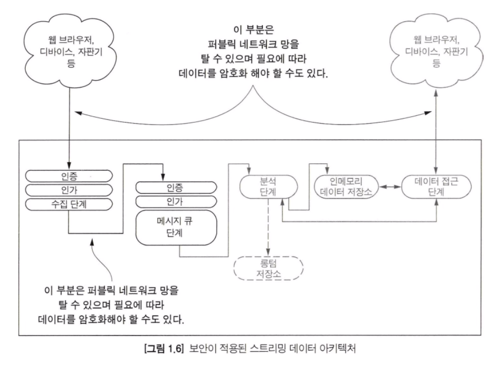

#### 실시간 시스템이란
실시간 시스템은 하드, 소프트, 니어로 분류된다. 실시간 시스템의 정의는 '실시간 또는 실시간 보다 약간 느린 데이터 처리 시스템이나 연관된 부분' 이라고 Dictionary.com 에 정확히 나와 있다.

> 소프트 리얼타임과 니어 리얼타임 시스템의 경계는 매우 불명확하고 주관적이다.

#### 실시간 시스템과 스트리밍 시스템의 차이점
소프트 리얼타임이나 니어 리얼타임으로 불리는 이 시스템은 기본적으로 데이터를 사용하는 애플리케이션이 일정 시점 이후에 데이터를 가져가는 모습을 보인다.

책에서 정의하는 스트리밍 데이터 시스템은 하드 리얼타임이 아닌 서버의 실시간 데이터를 클라이언트가 원할때 사용하는 시스템이다. 즉, 하드 리얼타임이 나닌 시스템은 클라이언트가 데이터를 필요로 하는 시점에 데이터를 가져가서 처리할 수 있도록 구현되어 있다. 이런 것을 소프트 리얼타임이나 니어 리얼타임이 아닌 스트리밍이라고 부를 수 있다.

클라이언트가 데이터를 요청하는 그 시점에 서버에서 어떤 데이터를 어떻게 전달할지 구현하는 것에 집중해야 한다. 이렇게 데이터가 필요한 시점에 전달이 가능한 시스템을 인더모먼트 시스템이라고 부를 수 있다.

#### 스트리밍 데이터 아키텍처

#### 스트리밍 시스템의 보안
위 아키텍처 사진을 보면 보안에 대해 언급하지 않았다. 아래 예시는 스트리밍 데이터 아키텍처에 보안을 적용하는 방법의 예시를 보여준다.

#### 서비스를 확장하는 방법
넓은 범위에서 서비스를 확장하는 방식은 수직 확장과 수평 확장이 있다.
수직 확장은 서비스로 하여금 하드웨어(물리 또는 가상 장비) 또는 소프트웨어에 리소스를 추가하는 방식이다.
수평 확장은 각 서버에 리소스를 추가하는 것이 아니라 서버를 추가하는 것이다.

