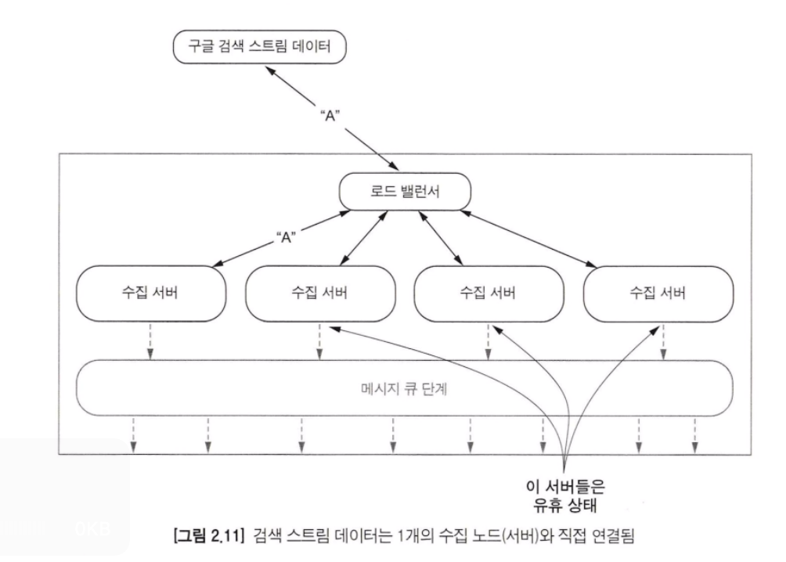

스트리밍 데이터 아키텍처에서 다루는 첫 번째 단계는 수집 단계이다. 즉, 스트리밍 시스템으로 데이터를 입수하는 지점이다.

### 일반적인 통신 패턴

#### 1) 요청/응답 패턴(Request/response pattern)
가장 간단한 패턴이다. 서버가 지연 없이 즉각적으로 응답하여 작업을 완료하는 것을 목표로 할 때 사용된다.

요청/응답 패턴은 간단하게 구현할 수 있으나, 서버에서 응답을 받기 위해 클라이언트는 기다려야 하는 시간이 반드시 필요하다는 단점이 있다. 이런 한계를 해결하기 위해 일반적으로 클라이언트에서, 서버에서, 둘 다에서 요청을 비동기로 수행하는 방법이 있다.
- 이 방식을 사용하면 클라이언트는 지속적으로 서버로 요청을 날리고 서버에서 응답이 오기 전까지 다른 일을 수행한다.
- 현대의 브라우저들은 이 방식을 주로 사용한다.

#### 2) 요청/확인응답 패턴(Request/acknowledge pattern)
요청/응답 패턴과 유사하게 통신을 해야 하지만 서버에서 반환하는 응답이 필요하지 않은 경우가 있다. 대신에 서버가 우리의 요청을 정상적으로 받았는지 확인만 해야 할 때가 있는데, 이 경우에는 요청/확인응답 패턴이 적합하다.

결국 요청에 대한 확인 응답으로 고유 식별자를 받는 것으로 이해할 수 있다. 해당 식별자를 이용해 구매 성향 점수를 확인할 수도 있다.

#### 3) 발행/구독 패턴(Publish/subscribe patter)
발행/구독 패턴은 프로듀서가 브로커에게 메시지를 전달하는 것으로 시작된다. 메시지는 논리적인 그룹으로 나뉠 수 있는 토픽으로 전송되며, 전송한 다음에는 토픽을 구독하는 모든 컨슈머에게 메시지가 전송된다.

발행/구독 패턴을 사용하여 프로듀서와 컨슈머 간에 결합도를 낮추는 작업은 매우 중요하다

#### 4) 단방향 패턴(One-way patter)
단방향 패턴은 요청을 하는 시스템이 응답이 필요하지 않을 때 보통 사용된다. 경우에 따라 단방향 패턴이 뚜렷한 이점이 있을 수 있고, 클라이언트가 서버와 통신하는 유일한 방법일 수도 있다. 기본적으로 클라이언트에서 서버로 전송하는 방식인 요청/응답 패턴이나 요청/확인응답 패턴과 유사하다고 볼 수 있다. 기존 패턴과 차이점은 '서버가 응답을 다시 보내지 않아도 된다'는 점이다.

이 패턴은 클라이언트가 충분한 리소스가 없거나 요청만 수행하는 환경에 유용하다. 예를 들어 초당 25번 데이터가 전송되는데, 이 중 5개 데이터가 유실되어 RFID 수신기에 전달되지 않는다면 분석에 결과적으로 큰 영향을 주지 않는다.

이것이 단방향 패턴의 중요한 특징 중 하나이다. 일부 데이터가 유실되는 것을 허용하고 통신의 단순화, 리소스 감소, 전송 속도를 보장해야 하는 환경에서는 단방향 패턴이 적합하다고 볼 수 있다.

#### 5) 스트림 패턴(Stream patter)
스트림 패턴은 서버가 클라이언트처럼 운영되는 정반대의 형태이다.

위 사진에서 스트림 패턴을 보면 요청/응답 패턴과 다르게 한 번의 요청에 데이터를 전달하지 않거나 지속적으로 데이터를 응답으로 보내는 특징을 가진다. 즉, 스트림 패턴을 사용하여 수집 단계와 연결하여 지속적으로 원천 스트림 데이터를 가져갈 수 있다.

### 통신 패턴 확장하기
#### 1) 요청/응답 파생 패턴
요청/응답 파생 패턴을 사용하면 수평 확장이 정말 잘 동작하는데, 그 이유는 두 가지가 있다.
- 클라이언트에서 요청을 할 때 상태 정보가 없다는 점이다. 즉, 클라이언트는 실행되고 있는 임의의 서버에 요청을 날리면 된다.
- 상태를 저장하지 않는다는 특성으로 인해 현재 실행 중인 서버에 별다른 작업 없이 신규 서버를 쉽게 추가하면 된다.

#### 2) 스트림 패턴 확장하기

아래 사진을 보면 검색 스트림 데이터가 스트림 데이터를 처리하는 서버로 직접 전달되기 때문에 4개 중 3개의 서버가 유휴상태인 것을 알 수 있다.

따라서 스트림 패턴을 확장하기 위해 몇 가지 방법이 있는데
- 스트림 데이터를 처리하는 수집 서버들을 확장
- 수집 단계에 버퍼링 계층을 도입
	- 버퍼링 계층을 수집 단계 중간에 포함되어도 괜찮은 이유는 스트림 데이터를 수집한 시점에 비즈니스 로직을 포함하지 않기 때문이다.

### 내결함성(Fault-tolerance)

어느 상호 작용 패턴을 사용하든 간에 분명히 언젠가는 하나 이상의 수집 서버에서 장애가 발생할 것이다. 수집 단계에서 수집한 데이터를 유실하면 복구가 불가능할 수 있기 때문에 내결함성은 중요하다.

내결함성을 통해 달성해야 하는 가장 중요한 목적은 바로, 수집 단계의 서버에 장애가 발생하더라도 장애가 발생하지 않는 것처럼 데이터를 유실하지 않는 것이다.

내결함성을 달성하기 위한 두 가지 방식으로 체크포인팅과 로깅이 있다.

우선 체크포인팅 기반 프로토콜의 두 가지 특징은 아래와 같다.
- 전역 스냅샷 : 수집 단계의 상태뿐만 아니라 시스템 전역 상태에 대한 스냅샷을 정기적으로 특정 저장소에 저장해야 한다.
- 데이터 유실 가능성 : 가장 최근에 기록된 전역 상태까지 복구할 수 있도록 한다. 이후에 처리되고 생성된 모든 메시지는 유실된다.

전역 스냅샷이란 수집 단계에서 데이터 접근 단계를 통해 유입되는 모든 데이터와 처리 중인 모든 데이터들을 캡처하여 안전하게 보관할 수 있는 영속적 저장소에 저장할 수 있다는 것을 뜻한다. 이렇게 마지막으로 저장된 상태를 사용하여 복구를 수행한다.
스트리밍 시스템에서 단계별로 데이터가 이동할 때마다 모든 시점에 대해 전역 스냅샷 데이터를 일관성 있게 저장하는 것은 매우 어려운 일이다. 즉, 스트리밍 시스템에서 체크포인팅을 사용하는 것은 잘못된 선택이다.

이제 로깅을 살펴보면, 로깅은 체크포인팅의 비용과 복잡성을 극복하고 장애가 발생하기 전까지 수신된 마지막 메시지까지 복구하는 기능을 제공한다. 로깅의 목표는 "메시지를 재처리할 수 있다면, 시스템은 전역 스냅샷이 없어도 전 구간에서 일관된 상태에 도달할 수 있음" 이다. 이 목표는 로깅을 지원하는 모든 기술들의 기본 아이디어이다.

결국, 로깅이라는 것은 시스템을 구성하는 각 단계가 수신한 모든 메시지를 자체적으로 저장하고 장애가 발생하면 저장된 메시지를 재처리한다. 로깅의 종류에는 RBML(Receiver-Based Message Logging), SBML(Sender-Based Message Loggin), 그리고 HML(Hybrid Message Logging) 기술들을 알아보겠다.

RBML은 서버가 데이터를 받을 때, 그리고 SMBL 은 데이터를 다음 단계로 보낼 때 데이터의 유실을 방지할 수 있다. HML 은 RBML과 SBML을 적절히 균형을 맞춘 로직이라고 볼 수 있다.

#### RBML
RBML은 전달받은 모든 메시지를 저장소에 저장한 이후에 로직을 처리하는 것을 뜻한다. 이 방식은 소프트웨어에 장애가 발생하더라도 이미 저장되어 있었던 데이터를 바탕으로 재처리하여 복구할 수 있다.

RBML 의 일반적인 메시지 흐름이다.

1. 데이터 프로듀서가 메시지를 전송함
2. 데이터 프로듀서가 보낸 메시지는 RMBL 로거 역할을 하는 수집 서버로 전달되고 저장소로 전달함
3. 메시지가 저장소에 저장됨
4. 비즈니스 로직에 따라 프로세싱을 수행함, 여기서 중요한 점은 수집 단계가 메시지를 전달받고 바로 처리를 하는 것이 아니라, 저장소에 저장한 뒤에 처리하는 점임
5. 스트리밍 시스템에서 수집 단계의 다음 단계인 메시지 큐 단계로 메시지가 전달됨

이때 저장소 처리 능력에 따른 이슈는 RBML의 단점 중 하나이다.
장애가 발생하면 수집 서버에는 더 이상 메시지가 유입되지 않는다. 그런 다음 RBML 로거는 메시지가 저장된 저장소에서 처리되지 않은 메시지를 읽고, 마치 아무 일도 없던 것처럼 로직을 처리하는 서버로 보낸다. 마지막으로 중지되었던 모든 메시지가 처리되고 나면, 서버가 복구된 것으로 간주하여 다시 로드밸런서에 연결한다.

#### SBML
SBML 은 메시지를 보내기 전에 저장소에 저장하는 것을 포함한다. RBML 은 구축한 시스템에서 장애가 발생했을 경우 외부로부터 들어오는 모든 메시지를 기록하여 안전하게 처리하는 것이다. 반면, SBML 은 서버가 처리한 데이터를 다음 단계로 보내기 전에 수집 서버에서 외부로 나가는 모든 메시지를 로깅 하는 것이다.

RBML 과 SBML 의 중요한 차이점은 RBML 은 메시지를 처리하기 전에 저장한다는 것이고, SBML 은 메시지를 처리하고 나서 다음 단계로 보내기 전에 메시지를 저장한다는 것이다. 

SBML 의 복구는 어떻게 처리할까. 이미 다음 단계로 넘어간 데이터가 잘 처리되었는지 여부를 알 수 있는 방법은 몇 가지가 있다.
1. 메시지 큐 단계를 사용하여 메시지를 정상적으로 전달받았다고 수집 단계에 확인응답을 보내는 것이다.
2. 메시지 큐 단계가 확인응답을 보낼 수 없는 경우 전송 시 장애가 발생하지 않으면 수집 단계의 영속 저장소에서 메시지를 삭제한다.

#### HBL
만약 RBML과 SBML 을 둘 다 도입하여 스트리밍 시스템을 구축하면 저장소에 저장되는 데이터가 2배로 늘어날 것이다. 실제로 이런 방식으로 구현하게 되면 처리해야 하는 데이터 양보다 로깅 하는 데 쓰이는 데이터 양이 더 많아질 수도 있다.

HBL을 도입하면 저장소의 데이터 쓰기 이슈를 해결할 수 있다. 일반적으로 HBL 을 사용하는 방식은 아래 그림으로 확인할 수 있다.

HML이 적용된 데이터 흐름은 복잡성이 RBML과 SBML 을 혼합한 방식에 비해 간단하다. 복잡도를 줄이기 위해 몇 가지 방법을 사용했는데
1. 저장소를 두 개에서 하나로 줄이는 것이다.
2. 저장소에 저장을 비동기로 처리하는 것이다.

복잡한 로깅 구조에 대해 익숙해진 상태에서 HML, RBML, SBML 중 하나를 선택해야 한다면 반드시 HML 을 선택해야 한다. HML 은 내결함성 기준을 만족시킬 뿐만 아니라 성능적인 부분에서도 상당한 이득이 있기 때문이다.

