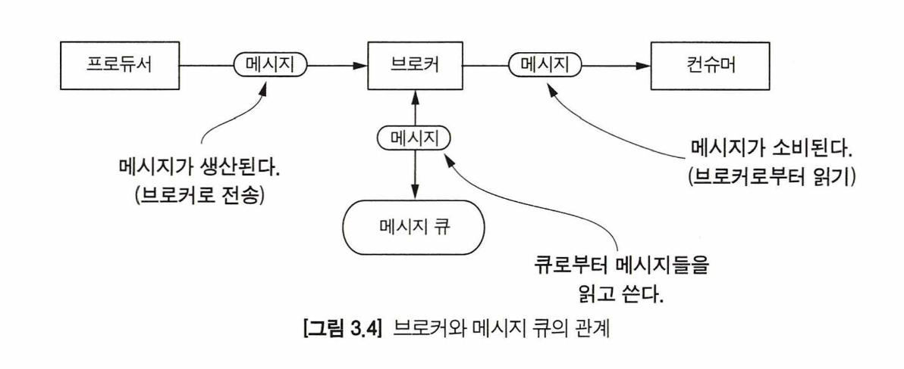

### 메시지 큐 단계가 필요한 이유

이번 장에서는 수집 단계에서 나머지 스트리밍 파이프라인으로 데이터를 전달하는 데 초점을 맞추고 알아본다. 주로 다룰 주제는 메시지 큐 단계와 통신하는 데이터이다.

일반적으로 잘 동작하는 시스템을 개발할 때는 서버들간 디커플링이 잘 되어 있어야 한다. 이때 메시지 큐 모델을 사용하면 수집 단계와 분석 단계의 커플링을 끊고 통신을 수행할 수 있다. 이를 통해 2가지 장점을 얻을 수 있다.
- 서로 다른 단계 간에 명시적인 호출을 하지 않음으로써 디커플리을 만족시킨다.
- 더 높은 수준에서 추상화된 시스템으로 구현할 수 있게 된다.

### 핵심 개념
#### 1) 프로듀서, 브로커, 컨슈머
메시지 큐는 프로듀서, 브로커 그리고 컨슈머 세 가지 주요 구성 요소가 있다. 프로듀서와 컨슈머는 이름에 걸맞게 메시지를 생성하고 가져가는 역할을 수행한다.

브로커의 중요한 특징은 여러 개의 큐들이 모여서 운영된다는 점이다.

#### 2) 프로듀서와 컨슈머의 격리
프로듀서의 데이터 생성량(수집 단계)이 컨슈머(분석 단계)의 데이터 처리량보다 많은 상황도 있다. 메시지의 지속적 저장을 제공하는 시스템은 컨슈머가 데이터를 천천히 읽어가거나 일시적으로 연결이 끊기더라도 다시 데이터를 읽어갈 수 있다.

#### 3) 메시지의 지속적 저장
메시지 큐에 메시지의 지속적 저장 기능이 있다면, 장애가 발생하더라도 복구를 할 수 있으며, 일시적인 컨슈머의 연결 종료에도 안전하게 데이터를 처리할 수 있게 된다.

### 메시지 전달 시맨틱
- 최대 한 번(At-most-once) : 일부 메시지가 유실될 수 있다. 유실된 메시지는 컨슈머에 도달하지 못한다.
- 적어도 한 번(At-least-once) : 메시지가 절대 유실되지 않는다. 그러나 컨슈머에서 동일 메시지를 두 번 이상 처리할 수 있다.
- 정확히 한 번(Exactly-once) : 모든 메시지는 절대로 유실되지 않으며, 컨슈머는 반드시 한 번만 메시지를 처리한다.

### 장애 허용(Fault tolerance)

수집과 분석 단계는 메시지 큐 단계가 중간에 위치하여 완전히 분리되었다. 여기서 우리는 장애가 발생했을 때 데이터에 어떤 일이 일어나는지 이해해야 한다. 이미 알다시피 분산 시스템에서는 장애가 발생할 수도 있는 것에 초점을 맞추는 것이 아니라 장애가 날 것에 관심을 두어야 한다.