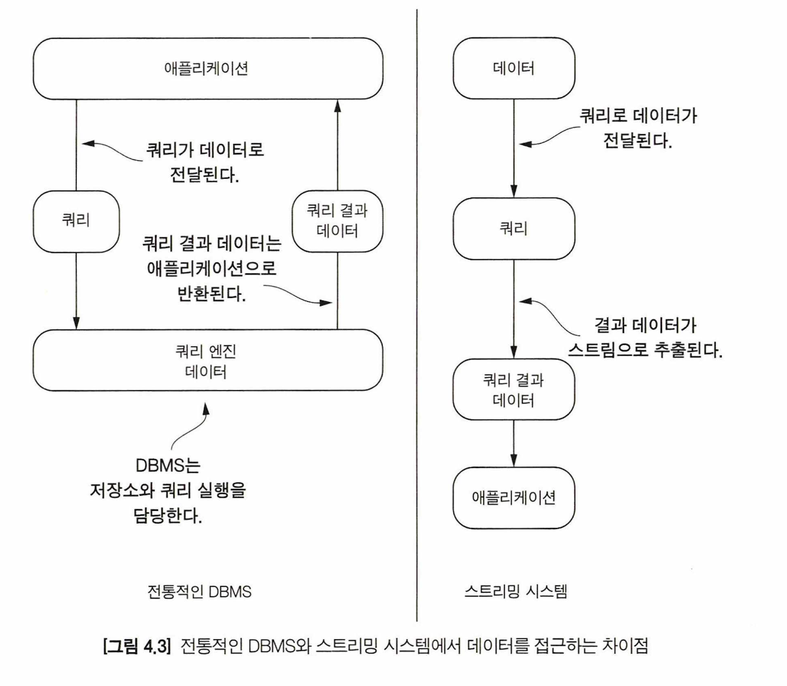
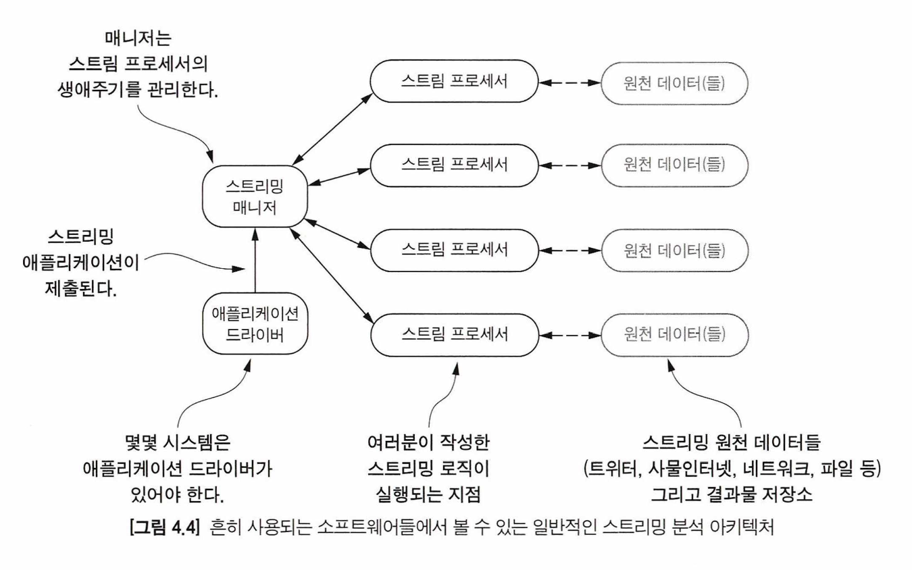
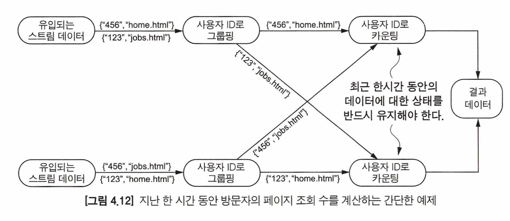

### 인플라이트 데이터 분석 이해하기

데이터에서 인플라이트라(in-flight data)는 것은 시스템에서 입력(메시징 큐 단계)과 출력 그리고 클라이언트를 묶은 시스템에서 활용되는 튜플을 뜻한다.

이상적인 상태라면 분석 계층에서 처리하는 데이터는 수집 계층에서 푸시하는 데이터의 양보다 많아야 한다. 스트리밍 시스템이 아닌 경우 기존 전통적인 DBMS가 포함된 경우는 데이터가 정지되어 있으며 데이터를 얻기 위해 쿼리를 수행해야 한다.

하지만 스트리밍 시스템은 반대로 쿼리를 하면 데이터가 지속적으로 들어온다. 이런 모델을 연속 쿼리 모델(Continous query model) 이라고 부른다.  연속 쿼리 모델에서는 새로운 데이터가 도착할 때마다 지속적으로 쿼리가 추출하는 데이터가 달라진다.

전통적인 DBMS를 사용하고 있는 시스템은 데이터의 변화에 대응하여 쿼리를 수행하는 것이 어렵다는 것을 이미 알고 있을 것이다. 반면 스트리밍 시스템에서 쿼리는 데이터가 들어올 때마다 트렌드 또는 이슈에 따라 실시간으로 대응할 수 있다. 스트리밍 시스템에서 데이터 사용자(또는 애플리케이션)가 쿼리를 등록하면 실시간으로 들어오는 데이터들에 대해 지속적으로 또는 일정 인터벌마다 쿼리를 수행할 수 있다. 쿼리 결과 데이터는 클라이언트로 보내진다.

- 전통적인 DBMS 기반 아키텍처에서 사용자가 쿼리를 하고 싶을 때, 사용자는 시스템에 쿼리를 실행하고 데이터를 추출하게 된다.
- 스트리밍 시스템에서 쿼리가 실행되고 나면 데이터가 추가되면서 지속적(일정 인터벌 또는 이벤트 트리거로 인해)으로 데이터가 추출된다. 쿼리로 추출된 데이터는 사용자 또는 애플리케이션이 있는 다음 단계로 푸시 된다.

> 스트리밍 시스템은 전통적인 데이터 관리 모델과 완전히 다르게, 사용자가 수동적으로 접근하고 데이터 관리 시스템이 능동적인 것으로 간주한다.

스트리밍 시스템은 데이터가 지속적으로 쿼리를 통해 처리되어 애플리케이션으로 전송되는 것을 확인할 수 있다.

### 분산 스트림 프로세싱 아키텍처

데이터가 커지면 서버 한 대로는 분석이 불가능할 것이다. 그렇기 때문에 분석 단계를 구축할 때는 분산 시스템이 동반된 기술을 도입해야 한다. 분석 단계에 적용을 위해 조사하면 스트림 프로세싱을 지원하는 다양한 기술들을 발견할 수 있다. 아파치 스파크 스트리밍, 아파치 스톰, 아파치 플링크, 아파치 삼자 등이 있다.

위 소프트웨어에는 공통점을 가지고 있다.
- 스트리밍 애플리케이션이 실행되고 나면 하둡의 맵리듀스 작업과 유사하게 동작한다. 애플리케이션들은 클러스터의 노드들로 전달되어 실행된다.
- 클러스터를 이루는 개별의 노드들에서 스트리밍 로직이 실행된다.
- 원천 데이터는 스트리밍 로직의 입력이 된다.

- 애플리케이션 드라이버
	- 일부 스트리밍 시스템에서는 스트리밍 코드를 작성하거나 스트리밍 매니저와 통신하기 위해 애플리케이션 드라이버를 작성해야 할 수도 있다. 드라이버는 스트리밍 매니저에 잡을 등록하고 마지막에 결과를 수집하며 잡의 생명주기를 관리하는 데 사용된다.
- 스트리밍 매니저
	- 스트리밍 매니저는 스트리밍 잡을 스트림 프로세서들로 보내는 역할을 한다. 때때로 스트림 프로세서가 필요로 하는 리소스를 제어하거나 요청할 수도 있다.
- 스트림 프로세서
	- 여기가 바로 진정한 프로세싱이 일어나는 곳이다. 스트리밍 플랫폼에 따라 동작하는 방식이 다르겠지만 잡이 제출되는 동시에 실행된다.
- 원천 데이터
	- 스트리밍 잡을 실행하는 데 필요한 데이터의 입력 또는 출력을 뜻한다.

### 스트림 프로세싱 프레임워크의 핵심 기능들

비즈니스 요구사항을 구현하기 위해 스트림 프로세싱 프레임워크를 고를 때 특별히 고려해야 하는 몇 가지 주요 기능들이 있다.
#### 1) 메시지 전달 시맨틱
최대 한 번 처리는 시스템으로 구현할 수 있는 가장 간단한 스트림 처리이며, 특별히 설계할 필요가 없다.

적어도 한 번 처리는 스트리밍 시스템이 스트림 프로세서들로 전송된 모든 메시지들이 정상적으로 전달되었는지 추적해야 하므로 복잡성이 증가한다. 적어도 한 번 처리는 스트리밍 잡에 동일한 메시지가 여러 번 전달될 수 있다. 그러므로 스트리밍 잡은 멱등성 있게 동작해야 하며, 이를 통해 동일한 메시지가 여러 번 오더라도 동일한 결과 데이터를 만들 수 있게 된다.

정확히 한 번 처리를 구현하면 잡 내부에서는 더 이상 중복 메시지에 대응할 필요가 없고, 메시지가 처리된 후에 성공 또는 실패로 응답하는지 확인하기만 하면 된다. 스트리밍 잡이 멱등하게 동작할 필요는 없으나 멱등성있게 구현하는 것을 강력하게 추천한다.

#### 2) 상태 관리(State management)
현재 처리 중인 메시지가 외부 데이터와 연동되거나 이전에 처리된 메시지를 참조하여 처리될 경우에는 구현하는 스트리밍 분석 알고리즘이 매우 복잡해진다. 이런 경우에는 상태를 유지해야 하고 프레임워크가 지원하는 상태 관리 기능을 사용해야 할 수도 있다.

위 사진에서 보면 사용자 ID 별로 조회 수를 계산하는 프로세서에서는 상태를 유지해야 한다는 것을 확인할 수 있다. 비즈니스 요구사항에 따라 다르지만 모든 상태를 메모리에 보관하여 데이터가 유실되는 부분은 어느 정도 허용할 수도 있다. 그러나 많은 비즈니스 구현 사례들에 따르면, 데이터의 유실은 간단한 문제가 아니며 상태를 어떻게 관리해야 할지 충분한 고민이 필요하다.

장애가 발생하더라도 데이터의 상태를 안전하게 유지하면서 복잡도를 낮추는 방법 중 하나는 마지막을 처리한 결과 데이터를 저장하는 것이다. 마지막으로 추출된 데이터를 다시 가져가면 장애가 발생하더라도 복구할 수 있다.

#### 장애 허용 설계
장애가 발생하지 않는 세상이면 좋겠지만, 현실에서는 이슈가 발생하는지 여부가 문제가 아니라 언제 장애가 발생하는지가 더 중요하다.

스트림 프로세싱 프레임워크의 경우, 장애를 다루기 위한 모든 기술은 복제(Replication)와 조정(Coordination)을 기반으로 한다. 스트림 매니저가 계산 중인 데이터의 상태(스트리밍 잡의 상태)를 다른 스트림 프로세서로 복제하는 것이 일반적인 접근 방법이다. 장애가 발생했을 경우 스트리밍 매니저는 장애에 대응하여 복구하기 위해 복제된 데이터를 활용한다.

스트림 프로세싱 시스템에서 종종 사용하는 첫 번째 접근 방식은 상태 머신(State-machine)이다. 이 접근 방식을 통해 스트림 매니저는 독립 노드에서 스트리밍 잡을 복제하고 동일한 입력을 모든 노드에 동일한 순서로 전송하여 복제 데이터를 조정할 수 있다.

두 번째 접근 방식은 롤백 복구(Rollback recovery) 방식이다. 롤백 복구는 스트림 프로세서는 주기적으로 계산 상태를 체크포인트로 다른 스트림 프로세서 노드 또는 디스크와 같은 비휘발성 저장소에 저장한다. 이러한 경우, 스트림 프로세서에서 장애가 발생한다면 스트림 매니저는 가장 최근의 체크포인트에서 데이터의 상태를 재구성하고 로그를 다시 처리하여 스트리밍 작업의 정확한 장애 전 상태를 복구할 수 있게 된다.

