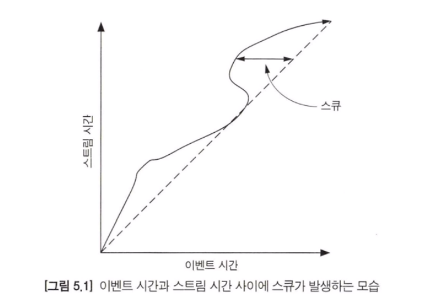
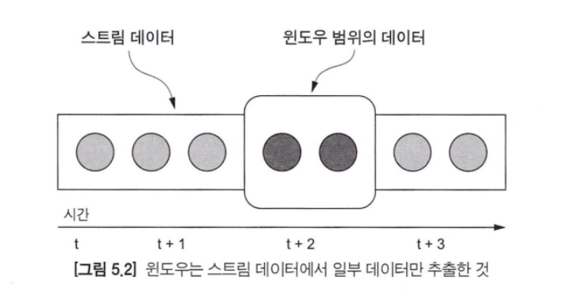
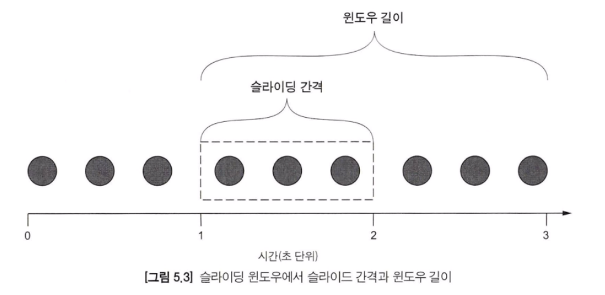
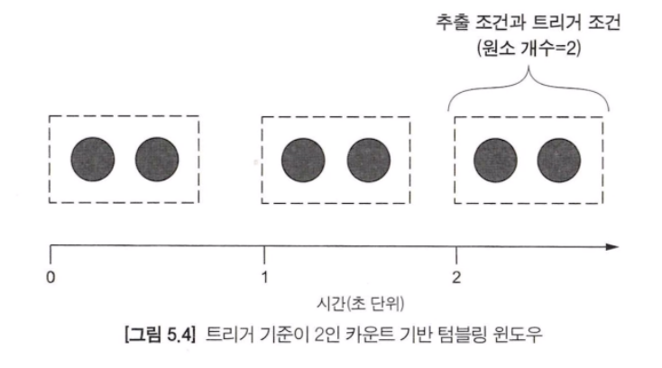
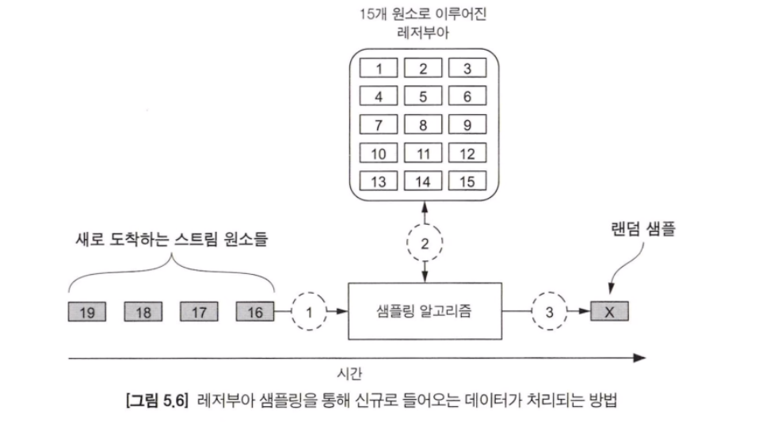
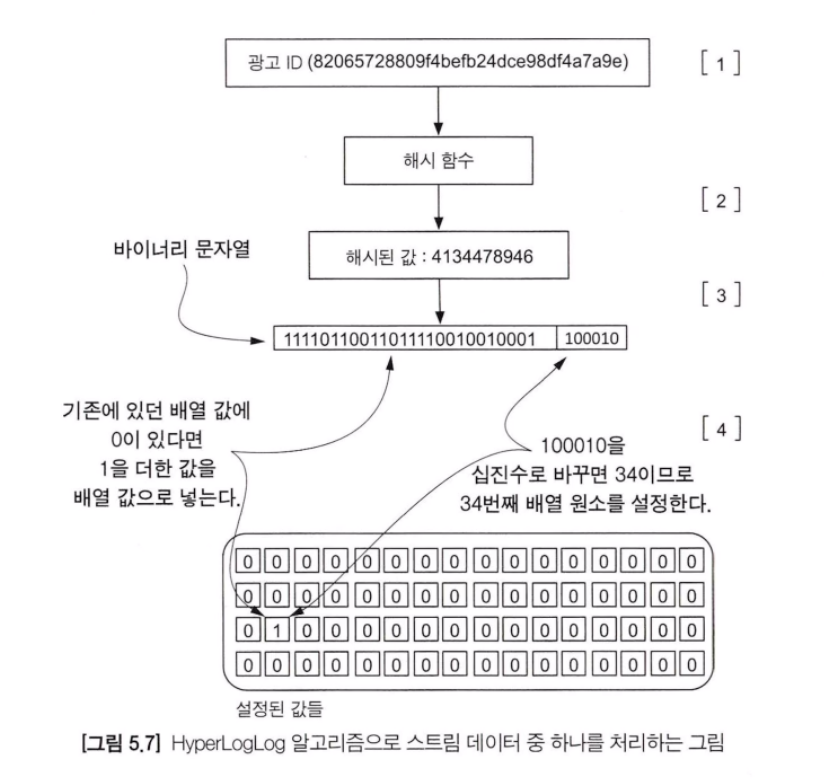
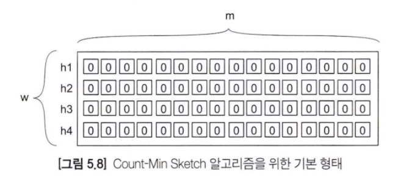
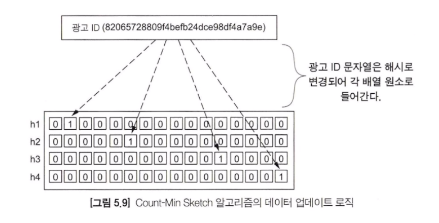
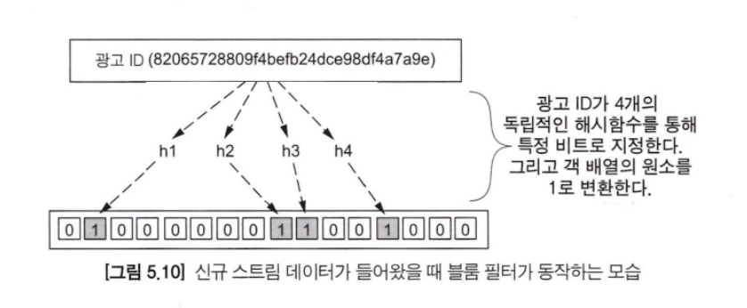

스트림 프로세싱 알고리즘 구현 측면에 대해 이야기할 것입니다. 이런 구현을 스트리밍 분석(Streaming analytics) 또는 스트림 마이닝이라고 부릅니다. 일반적으로 스트리밍 시스템에서 실행할 수 있는 쿼리에는 두 가지 유형이 있습니다.

- 애드훅 쿼리 : 스트림 데이터에서 쿼리를 한 번만 수행할 때 사용된다. 예를 들어 스트림 데이터의 최대값을 뽑는 작업. 이런 유형의 쿼리는 RDBMS 에서 수행하는 쿼리와 비슷한 것이라 보면 된다.
- 연속 쿼리 : 스트림 데이터에서 지속적으로 쿼리를 수행하는 것이다. 예를 들어 스트림 데이터에서 매 5분마다 최대 데이터를 표시하고 임계치를 초과할 경우 경고를 생성하는것과 같은 작업이 있다.

### 제약 조건 확인 및 완화

스트리밍 시스템의 고유한 특징 중 하나는 전체 스트림을 무제한으로 저장할 수 없다는 것이다. 또한 우리가 구현하는 애플리케이션은 프로세스가 종료되지 않고 쿼리를 지속적으로 수행하여 결과가 추출되어야 한다. 즉, 새로운 데이터가 분석 단계에 도착하면 결과를 계산하거나 업데이트하여 결과 데이터로 추출되어야 한다. 이런 유형의 쿼리는 다음과 같은 제약 조건이 있다.

- 한 번 호출(one-pass) - 데이터가 보관되고 있지 않으며 처리할 수 있는 기회는 단 한 번뿐이라는 가정하에 운영해야 한다.
- 개념 수정(concept drift) - 개념 수정은 구현하는 코드의 예측 모델에 영향을 미칠 수 있는 현상이다.
- 리소스 제약(resource constraints) - 대부분의 스트림 데이터는 처리 속도를 제어하지 못한다고 볼 수 있다.
- 도메인 제약(domain constraints) - 이런 제약은 특정 비즈니스 도메인에 해당될 수 있다.

### 시간에 대한 생각

#### 스트림 시간(Stream time) vs 이벤트 시간(Event time)
스트림 시간은 이벤트가 스트리밍 시스템에 진입한 시점이다.
이벤트 시간은 이벤트가 실제로 발생한 시간이다.

이벤트 시간과 스트림 시간이 항상 같지 않다는 것을 기억해야 한다. 이벤트 시간과 스트림 시간의 차이는 자주 발생하며, 때때로 이 차이는 매우 커질 때도 있다. 이렇게 이벤트 시간과 스트림 시간의 차이를 시간 스큐(Time Skew)라고 부른다.



#### 시간 윈도우
스트림 프로세싱 엔진은 크기와 종류가 무한하다는 스트림 데이터의 특성으로 인해 모든 데이터를 메모리에 보관할 수 없다. 결국, 스트림 데이터는 전통적으로 사용하던 배치 처리처럼 수행할 수 없다는 것을 의미한다. 이는 스트림 데이터 윈도우를 사용하여 계산할 수 있다.

윈도우(Window)는 우리가 계산을 수행할 수 있는 일정량의 데이터를 나타낸다.



모든 윈도우 기법에는 <span style="color:#ff0000">트리거 조건(Trigger)과 추출 조건(Eviction policies)</span>이라는 두 가지 공통 속성이 있다.
트리거는 스트림 처리 시스템에서 윈도우의 모든 데이터를 처리할 시간인 것을 코드에 알리는 규칙을 뜻한다.
반면 추출 조건은 윈도우 기간의 데이터를 추출하여 프로세싱을 할 것인지 결정하는 데 사용한다.

#### 슬라이딩 윈도우(Sliding window)
슬라이딩 윈도우는 시간에 기반한 트리거 조건과 추출 조건을 사용한다. 두 속성은 윈도우 길이와 슬라이딩 간격에 따라 설정된다.



윈도우 길이는 추출 조건을 의미한다. 위 그림에서 윈도우 길이는 2초이므로 새로운 데이터가 도착하면 2초 이상 지난 데이터는 제거된다. 그리고 슬라이딩 간격은 트리거 조건을 의미한다. 여기서 슬라이딩 간격은 1초이다. 즉, 매 초마다 코드가 트리거되고, 트리거될 때마다 윈도우 간격의 모든 데이터를 처리할 수 있는 것이다.

#### 텀블링 윈도우(Tumbling window)
텀블링 윈도우는 슬라이딩 윈도우와 약간 다른 개념이다. 여기서 추출 조건은 윈도우 간격 내부의 데이터가 일정 개수만큼 포함된 상태를 기준으로 하고, 트리거 조건은 우니도우 내부 데이터 수 또는 시간을 기준으로 한다. 그래서 텀블링 윈도우는 카운트 기반 또는 시간 기반으로 나뉜다.



### 취합 기술들
#### 1. 랜덤 샘플링(Random sampling)
스트림 데이터에서 무작위로 샘플 데이터를 추출하고자 할 때가 많다.
랜덤 샘플링을 구현하는 일반적인 알고리즘은 레저부아 샘플링(Reservoir sampling)이다. 레저부아 샘플링은 미리 결정된 스트림 데이터를 잠깐 가지고 있다는 개념을 기초로 한다. 새로운 값이 도착하면 수집 단계로 보낼지, 아니면 이미 가지고 있던 데이터 중 하나를 랜덤 샘플 데이터로 정할지 고르는 것이다.



> 새로운 데이터가 도착하면 샘플링 알고리즘을 통해 무작위로 샘플 데이터가 결정도니다.

위 상황에서 각 부분이 어떤 일이 일어나는지 순서대로 살펴본다.
1. 16번째 데이터가 도착하면 n/k 확률로 레저부아 저장소의 저장 여부를 결정한다. k 는 저장소의 크기이고 n은 도착한 데이터의 번호이다. 새로 도착한 데이터는 16번이고 저장소에 저장되어 있는 데이터 개수는 15개이므로 15/16 확률로 저장소에 저장된다.
2. 16번째 데이터를 저장소에 저장할지 여부를 결정한다. 이를 위해 0과 1 사이에 난수를 생성한다. 만약 15/16 미만이면 저장소에 저장하고, 저장소에 있는 데이터 중 하나를 출력으로 보내고 16번째 데이터로 바꾼다. 만약 15/16 보다 큰 숫자라면 16번째 데이터를 출력으로 보낸다.
3. 만약 16번째 데이터를 레저부아 저장소에 저장해야 할 경우, 저장소의 1 ~ 15 번 데이터와 16번째 데이터를 교체한다. 이 경우 출력된 데이터는 앞서 선택된 1 ~ 15번 데이터 중 하나이다.

#### 데이터 개수 카운트
스트림 데이터에서 각 데이터별로 구분하여 개수를 계산하고 싶을 때가 많지만, 메모리는 제한되어 있으며 전체 스트림 데이터를 저장하는 기능은 존재하지 않는다. 이를 해결하기 위한 알고리즘은 두 가지가 있다.

- 비트 패턴 기반(Bit-pattern based) - 이 알고리즘은 스트림 데이터의 각 데이터들을 이진수로 변환 값의 앞부분 비트 패턴에 따라 처리된다. 스트림 데이터의 해시를 이진수로 나타내고 0으로 시작하는 데이터를 확인하여 카디널리티를 결정하는 방식이다. 이 알고리즘의 종류로는 LogLog, HyperLogLog 그리고 HyperLogLog++ 가 있다.
- 순서 통계 기반(Order statistics based) - 이 알고리즘은 순서 통계를 기반으로 이루어지며, 스트림 데이터 중 가장 작은 수를 찾는 것과 같은 역할을 수행한다. 이 알고리즘은 MinCount 와 Bar-Yossef 가 있다.

현업에서 비트 패턴 기반 알고리즘이 가장 일반적으로 사용된다. 아래는 HyperLogLog 알고리즘을 사용하여 새로운 스트림 데이터 원소를 처리하는 방식을 보여준다.



1. 3단계에서 가져온 해시 데이터를 이진수 데이터로 변경하여 레지스터값과 업데이트 값을 결정한다. 이진수 해시 데이터에서 최하위 6비트는 업데이트될 레지스터 값의 위치를 결정하는 데 사용한다. 이때 사용하는 비트의 개수는 알고리즘의 정밀도로 사용된다. 여기서는 6개로 정했다.
2. 업데이트가 되어야 할 배열의 번호를 알았다. 이제 나머지 비트 문자열에서 0이 있는지 확인한다. 그 후에 1을 추가한다. 예를 들어 앞서 0이 없다면 1로 34번째 배열을 업데이트 한다.
3. 이때 모든 레지스터의 값은 조화 평균을 취하여 각 데이터별로 개수를 계산한다. 즉, 근사치를 뽑아내는 것이다.

위 알고리즘을 사용할 때는 비트 문자열의 선행 0의 개수가 스트림 데이터의 카디널리티와 관련 있다는 것을 기억해야 한다. HyperLogLog 와 관련하여 기억해야 할 부분은 HyperLogLog 는 매우 작은 메모리를 사용하여 운영이 가능하다는 점이다.

#### 빈도
앞서 스트림의 데이터 고유 개수를 계산하는 방법을 알아보았다면, 여기서는 X 데이터가 몇 번 발생했는가 라는 질문에 대답하는 방법을 알아볼 것이다. 이와 같은 요구사항에 대응하는 가장 일반적인 알고리즘은 Count-Min Sketch 이다.

- 포인트 쿼리(Point Query) - 특정 스트림 데이터값에 대해 알고 싶은 경우
- 레인지 쿼리(Range Query) - 주어진 범위에서 데이터 빈도를 알고 싶은 경우
- 이너 프로덕트 쿼리(Inner product query) - 두 스케치 알고리즘의 결합을 알고 싶은 경우, 예를 들어 광고 네트워크 서비스에서 다음과 같은 요구사항이 있는 경우 : 광고가 노출된 상품이 어떤 것이 있는가

Count-Min Sketch 는 알고리즘 구현 방법에서 이름을 따왔다. 먼저 개수를 세고 다음으로 최소값을 계산하는 형태로 구현되어 있다. 몇 가지 단어들을 정의해야 하는데

Count-Min Sketch는 카운터 라고 하는 숫자 배열의 집합으로 구성되며, 배열 개수는 w로 정의되고 각 배열의 길이는 m 으로 정의한다. 각 배열은 0부터 시작하여 배열의 범위는 0부터 m-1 까지이다. 명심해야 할 부분은 각 카운터가 서로 다른 해시 함수와 연동되어 있다는 점이다.



위 그림을 보면 2차원 배열의 모든 값이 0으로 초기화되고 각 배열 별로 각기 다른 해시 함수가 연동되어 있는 것을 볼 수 있다. 이제 데이터가 스트림 형태로 시스템에 들어올 때 Sketch 를 업데이트할 수 있다.



첫 번째 단계로 각 배열에 해시 함수를 사용하여 값을 변경하고 나서 해당 값에 해당하는 배열의 요소의 값을 1씩 증가하는 것이다.
일정 시간이 흐른 뒤, 특정 광고가 얼마나 조회되었는지 추정하고자 할 때 빈도의 추정치를 얻기 위해 아래 식을 사용할 수 있다.

```
대략적인 횟수 계산 = min(h1(~~), h2(~~), h3(~~), h4(~~))
```

이 값은 광고를 노출한 횟수에 대한 대략적인 수를 나타낸다. 이 알고리즘의 결과는 실제보다 작게 나올 수는 없고 반드시 크게 나온다. 논문에 따르면 배열의 길이가 128인 배열 8개를 사용할 때 상대 오차는 약 1.5% 이고 추정치가 정확할 확률은 99.6%라고 한다.

#### 멤버십
이 스트림 데이터는 이전에 유입된 적이 있는가 와 같은 요구사항에 대해 생각해보자. 현실적으로 모든 스트림 데이터들에 대해서 모든 ID를 저장할 수 없다. 이때는 블룸 필터(Bloom Filter) 데이터 구조를 사용하면 된다.

블룸 필터의 독특한 특징 중 하나는 긍정 오류는 가능하지만 부정 오류는 불가능하다는 점이다. 즉, 블룸 필터를 통해 나온 결과에서 특정 스트림 데이터가 입수된 적이 없다고 나오면 항상 정확한 답이라고 볼 수 있다. 그러나 특정 스트림 데이터가 이전에 입수된 적이 있다고 나오면 정답일 수도 있고 아닐 수도 있다는 것이다.

블룸 필터를 구현하기 위해 길이가 m인 이진수로 된 배열이 필요하고 각 값마다 독립적인 해시 함수들이 연동된다.



여러 번 스트림 데이터를 처리하면 당연하게도 배열의 동일 값에 처리가 일어날 수 있다. 이로 인해 블룸 필터는 거짓 음성이 발생할 수 있게 된다. 스트림 데이터가 이전에 들어왔는지 여부를 확인하기 위해 블룸 필터를 쿼리하는 방법은 다음 함수와 같이 매우 간단하다

```
스트림 데이터 Z가 이전에 입수되었는지 여부 = AND(h1(Z), h2(Z), h3(Z), h4(Z));
```

이 함수를 통해 각 해시값들을 계산한 뒤, 배열에서 모든 값들이 1인지 아니면 0인지 확인하여 해당 데이터가 이전에 들어왔었는지 여부를 확인할 수 있다. 그중 0인 요소가 4개가 있다면 이전에 유입되지 않다는 것을 보장할 수 있게 된다.

위 알고리즘을 사용하면 외부 데이터 저장소를 통해 쿼리를 하여 값비싼 서버 리소스를 사용하는 대신, 작은 메모리 사용량으로 데이터의 유입 여부를 확실히 확인할 수 있게 된다.

