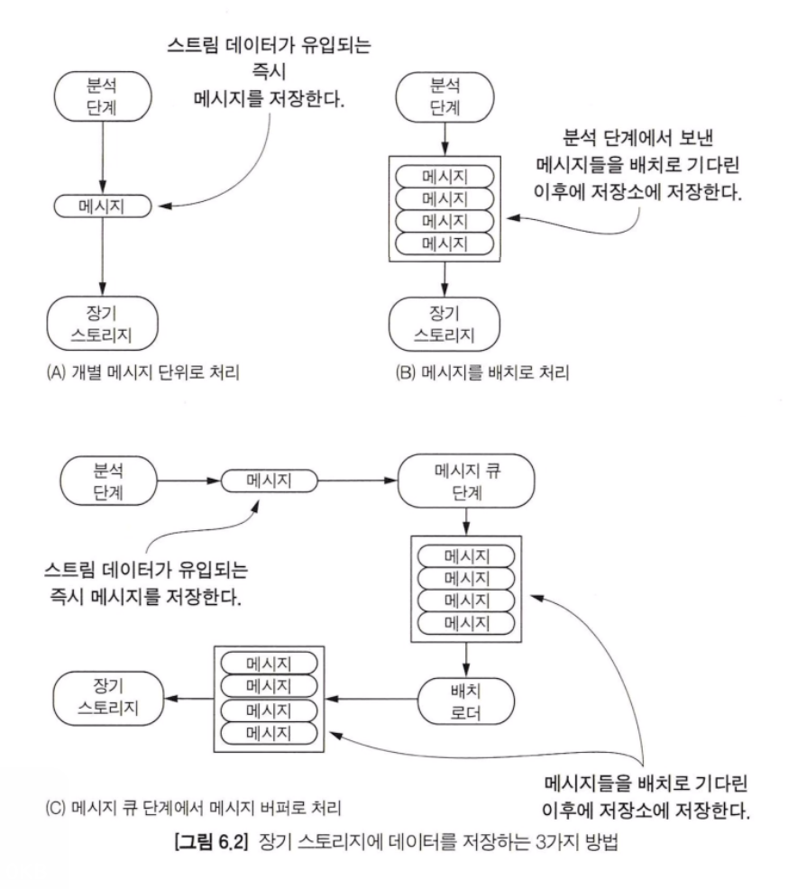
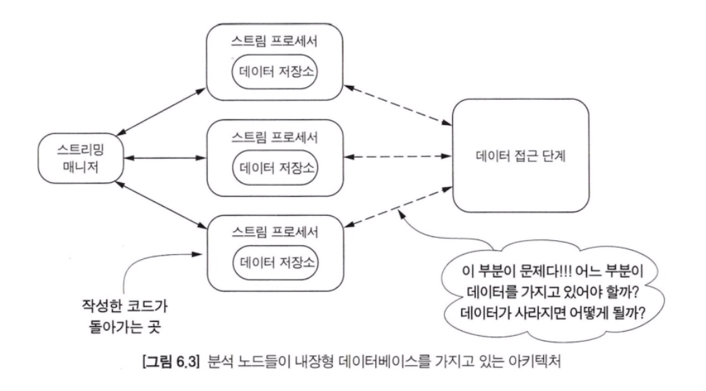
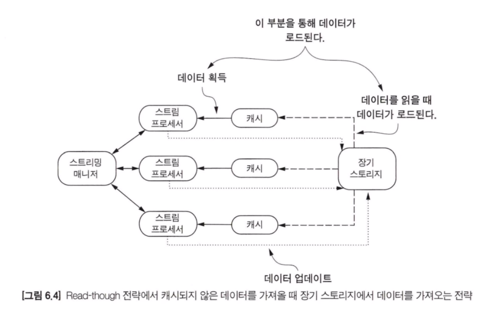
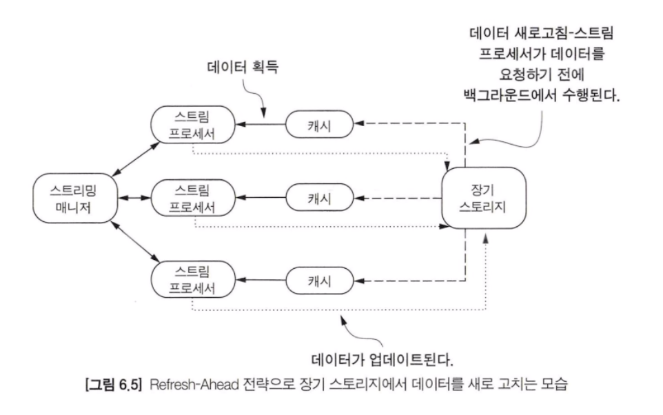
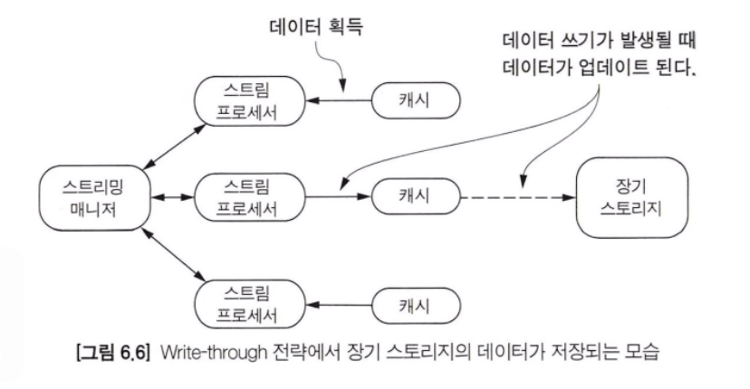
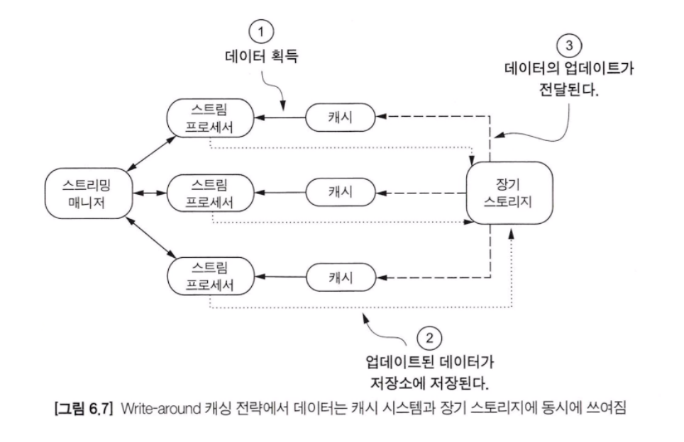
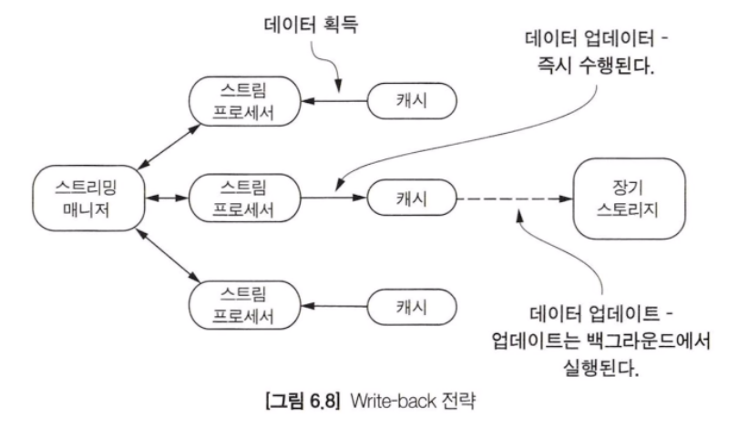
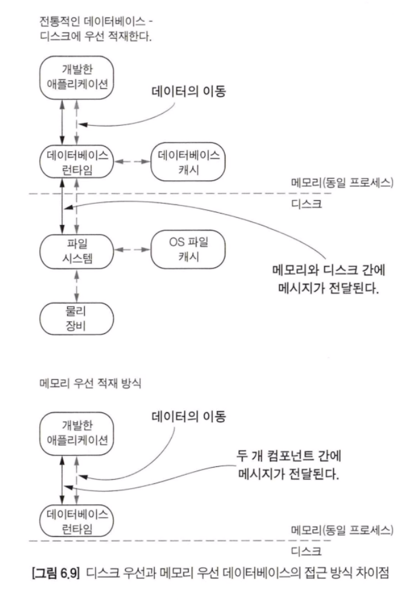

이번 챕터에서는 데이터를 처리하고 난 이후 수행할 작업들에 대해 중점적으로 설명한다. 우선 데이터를 분석하고 데이터를 사용할 준비가 되었을 때 적용할 수 있는 4가지 방법들에 대해 살펴보겠다. 다음과 같은 옵션들이 있다.

- 데이터 분석 후 폐기
- 데이터 분석 후, 다시 스트리밍 플랫폼에 전달
- 데이터 분석 후, 실시간 사용을 위해 데이터 저장
- 데이터 분석 후, 배치 또는 오프라인 접근을 위해 데이터 저장

### 장기 스토리지가 필요한 경우

스트리밍 시스템에서 처리한 데이터를 비스트리밍에 적합하게 설계된 저장소에 저장해야 할 경우가 있다. 이런 저장소는 전통적인 배치 또는 오프라인 접근을 위한 것이다. AWS S3, HDFS, HBase 또는 여러 전통적인 RDBMS 와 같은 비스트리밍 저장소에 저장하는 것이 대표적인 예이다. 아래 사진을 통해 스트림 데이터를 장기 스토리지에 저장하는 세 가지 방법에 대해 확인할 수 있다.

#### 직접 저장
위 그림의 A, B 부터 살펴보면, 둘 방법 모두 직접 저장하는 방식이라고 볼 수 있다. A와 B 같은 형태로 구현할 경우 이슈가 발생할 수 있는 가능성이 있다. 데이터가 저장되는 저장소의 저장 처리 속도가 느린 경우이다.

#### 간접 저장
C로 넘어가면 A나 B와 다르게 접근 방식이 상당히 다르다. C는 간접 저장 방식에 속한다고 할 수 있다. 이 방법은 스트림 데이터를 저장하는 장기 스토리지와 물리적으로 분리하는 방식이다. 여기서는 분석이 완료된 스트림 데이터를 메시지 큐 단계에 저장한다. 이는 스트리밍 분석 단계와 장기 스토리지의 커플링을 분리하는 데 도움이 된다.

결과적으로 복잡성이 조금 더 추가되었지만 데이터 저장소를 더 적절한 위치로 옮길 수 있게 되었다. 이런 복잡성에서 우리가 구현해야 하는 구성요소는 배치 로더이다. 배치 로더의 목표는 메시지 큐 단계에서 배치 메시지들을 읽고 이를 장기 스토리지에 저장하는 것이다.

이 방식은 두 가지 장점이 있다.

1. 메시지 큐 단계는 스트림 데이터 처리 속도와 볼륨에 대응할 수 있도록 설계되어 있으므로 성능상 이슈가 발생하지 않는다.
2. 대용량 데이터 저장 처리는 배치 로더에 위임함으로써 스트리밍 분석 단계에서는 스트림 데이터를 분석하는 데 집중할 수 있게 된다.

지금까지 스트리밍 분석된 데이터를 장기 스토리지로 저장하는 세 가지 주요 방법들에 대해 설명했다. 다음으로 인메모리 저장소에 저장하는 방식과 실시간으로 데이터를 사용할 수 있는 방식에 대해 알아본다.

### 인메모리 저장소에 저장하기
스토리밍 분석 시스템을 구축할 때 가져야 할 목표는 이벤트가 발생했을 때 가능한 빨리 실시간으로 데이터를 처리해야 하는 것이다.
#### 인메모리/플래시 메모리 기반 데이터베이스
인메모리 또는 플래시 메모리를 저장소로 가지는 내장형 데이터베이스 소프트웨어들은 기업들에서 널리 사용되고 있다. 이런 내장형 데이터베이스들은 싱글 노드 기반 저장 및 접근 방식을 제공한다. 그리고 전통적인 데이터베이스가 제공하는 관리 기능들을 지원하지 않는다.

위 그림을 보면 구현한 스트림 프로세서가 내장형 데이터베이스를 가지고 있는 것을 볼 수 있다. 스트림 프로세서의 노드는 스트림 프로세싱, 로컬 데이터 저장 역할, 데이터 접근 단계에 데이터를 제공하는 것과 같은 많은 역할을 수행한다. 아래 목록은 ㅐㄴ장형 데이터베이스들의 이름이다.

- SQLite - 로컬 스토리지를 가진 애플리케이션 또는 디바이스를 위해 설계된 서버리스 임베디드 데이터베이스이다. 대부분의 표준 SQL 문법을 지원한다.
- RocksDB - LevelDB 를 기반으로 설계된 고성능의 키-값 기반 내장형 데이터베이스다. 전통적인 클라이언트 서버 방식으로도 활용할 수 있다.
- LevelDB - RocksDB 의 모태가 되는 데이터베이스, 정렬된 키-값 저장소를 제공하는 내장형 데이터베이스다.
- LMDB - 버클리디비(Berkley DB)를 대체하기 위해 개발된 키-값 내장형 데이터베이스이다. 트랜잭션을 지원하고 메모리에 매핑된 파일에 접근하여 읽기 작업에 높은 성능을 높이도록 설계되었다.
- Perst - 자바와 닷넷을 위해 만들어진 내장형 데이터베이스이다. 트랜잭션 오브젝트를 저장할 수 있고 속도가 빠르며 쉽게 개발할 수 있다. 그리고 데이터베이스와 클라이언트 언어가 호환이 되도록 설계되었다.

#### 캐싱 시스템
캐싱 시스템은 오브젝트 캐싱 시스템, 인메모리 데이터베이스 또는 인메모리 키-값 데이터베이스로 불린다. 캐싱 시스템은 다양한 전략을 사용하는데, 캐시 키의 값을 업데이트하는 전략에 대해 알아보겠다.

Read-Through
이 전략은 캐싱 시스템이 캐시에 없는 항목을 요청받았을 때 영구 저장소에서 데이터를 읽어온다. Read-Through 전략은 시스템에 존재하지 않는 캐시 키를 요청받았을 때 영구 저장소에서 읽는 비용이 발생한다. 이 전략은 캐시 클라이언트에 명확한 방식이지만 영구 저장소에서 데이터를 읽고 기록되어야 하므로 성능에 영향을 미치게 된다.

Refresh-Ahead
이 전략은 캐시가 만료 또는 삭제되기 전에 최근에 접근했던 데이터로 새로 바꾸는 것이다. 이렇게 하면 캐시가 만료되어 캐시에서 삭제될 때마다 영구 저장소에 데이터를 검색해야 하는 Read-Through 에 따른 성능 저하를 피할 수 있다.
새로고침 주기를 백업 저장소에 있는 데이터의 업데이트 빈도와 거의 일치하도록 설정한다면, 캐시는 클라이언트에게 가장 최신의 값을 반환하여 백업 저장소와 동기화 상태를 유지하도록 설정할 수 있다.

Write-Through
이 전략은 캐싱 시스템이 업데이트된 데이터를 백킹스토어(Backing store)에 기록한다. 이 방식은 데이터를 백킹스토어에 저장하거나 변경사항을 캐시에 로드하는 아웃오브밴드(out-of-band) 처리를 없앴다. 이 전략은 데이터가 캐싱 시스템의 백킹스토어에 기록되기 전까지는 쓰기가 성공한 것으로 간주하지 않는다. 그리고 다른 캐싱 전략드렝 비해 백킹스토어에 쓰는 지연 시간이 발생한다는 단점이 있다.

#### Write-Around
이 전략은 캐시가 영구 저장소를 업데이트하여 아웃 오브 밴드 현상을 발생시킨다. 이 경우 캐싱 시스템은 영구 저장소에 기록되는 변경사항을 알지 못한다. 그리고 영구 저장소에 데이터가 업데이트되고 나서 캐시를 업데이트하기 위한 또다른 프로세스를 따로 실행시켜야 하므로, 영구 저장소와 캐시 두 공간의 데이터를 업데이트해야 하는 복잡성이 추가된다. 그러나 캐싱 시스템이 영구 저장소와 연동되지 않아도 된다는 장점이 있다.

#### Write-Back(Write-Behind)
이 전략은 캐싱 시스템이 영구 저장소에 새로운 데이터를 쓰는 방식이다. 데이터가 즉시 저장되는 Write-Through 방식과 다르게 이 전략은 캐시에 대한 쓰기가 인식되고 나면 백그라운드에서 데이터가 영구 저장소에 저장되거나 업데이트가 발생한다. 이렇게 하면 Write-Through 의 I/O 부하가 발생하지 않는다는 장점이 있다. 그러나 데이터가 메모리에만 보관되는 동안에는 데이터가 유실될 가능성이 있다.

#### 인메모리 데이터베이스와 인메모리 데이터 그리드
IMDB(In-memory database)는 인메모리 데이터베이스 관리 시스템 또는 IMDG(In memory Data Grids) 라고도 불린다. 캐싱 시스템과 다르게 IMDB와 IMDG는 데이터의 영속성을 보장하기 위해 디스크를 사용하도록 설계되었다. 메모리에 우선 저장하고 디스크에 저장한다는 특징을 반드시 기억해야 한다.
디스크에 데이터를 저장하는 이유는 장애 발생에 대비하여 로깅 및 주기적 스냅샷에만 사용되는 경우가 많다.

> 참고로 전통적인 기존 데이터베이스는 모두 디스크에 우선 데이터를 저장하고 메모리를 보조로 사용하도록 설계되어 있다.

메모리 접근 방식에서 소프트웨어는 메모리만 사용하도록 설계되고 디스크는 신뢰성을 위해 2차적으로 사용된다.

