### 네트워크 통신 패턴
우리는 API 를 통해 클라이언트가 데이터를 가져가도록 할지 아니면 서버가 클라이언트로 푸시할지 고민해야 한다. 일반적인 푸시 또는 풀 방식뿐만 아니라 추가적으로 RMI/RPC, 심플 메시징 그리고 발행-구독과 같은 패턴들이 있다.

#### 데이터 동기화
동기화는 API의 데이터베이스 또는 데이터 저장소를 클라이언트와 동기화하는 것이다.

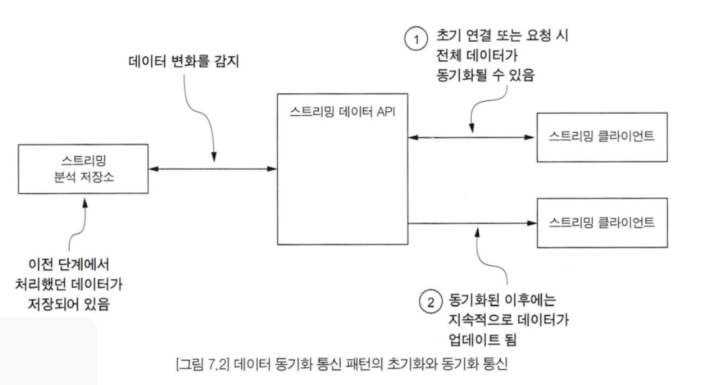

이 통신 패턴은 서버에서 스트리밍 분석을 마치고 로컬에 저장된 데이터의 변경사항을 감지(알림 방식으로 동작할 수도 있음)하여 스트리밍 클라이언트에 업데이트된 데이터를 보내는 방식으로 동작한다. 이 패턴은 간단해 보이지만, 장단점이 있다.

장점
- 프로토콜이 간단함
- 클라이언트는 모든 데이터를 조회할 수 있음
- 개발하기 매우 쉬운 API, 초기 동기화의 변경된 데이터에 대한 시간 또는 로컬 데이터 기반 동기화로 동작함
- 클라이언트는 항상 최신 데이터를 조회할 수 있음

단점
- 모든 데이터를 가지기 때문에 용량으로 인해 전송 시 상당한 대역폭이 필요할 수 있음
- 데이터들이 클라이언트에 모두 저장되지 못할 수도 있음
- 데이터의 버전 차이로 인한 충돌 문제가 생길 수 있음
- 클라이언트 또는 서버에서 변경한 데이터의 병합 정책을 정해야 함

#### RMI 와 RPC
RMI(Remote Method Invocation) / RPC(Remote Procedure Call) 패턴은 API 서버에 새로운 데이터가 도착하거나 클라이언트가 필요로 하는 데이터가 도착했을 때, 클라이언트에 있는 메서드를 원격으로 호출하는 방식이다.

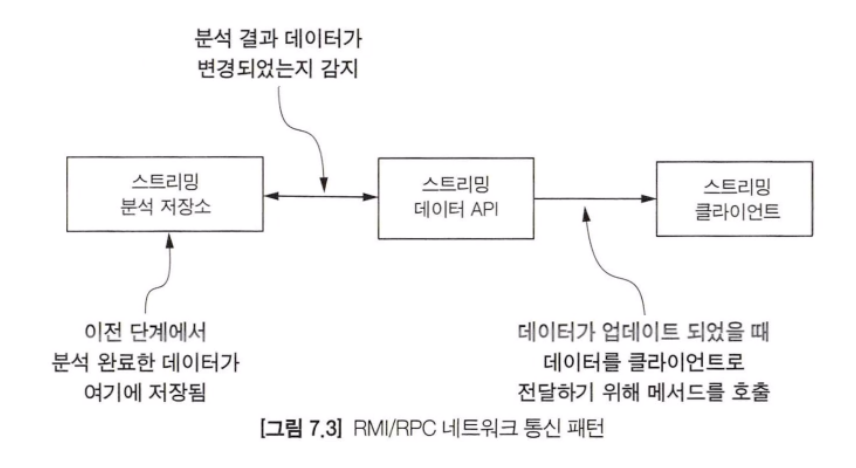

스트리밍 데이터 API 서버는 분석 단계에서 처리 완료된 데이터가 저장소에 저장되었는지 모니터링한다. 저장소의 데이터가 변경되면 원격 메서드를 호출하여 클라이언트에 변경된 데이터를 전송한다.

장점
- 간단한 프로토콜
- 클라이언트는 다른 처리를 수행한 뒤에 핸들러가 호출되면 그때 처리를 수행
- 매우 직관적으로 개발할 수 있는 API, 클라이언트의 엔드포인트만 알면 개발 간으

단점
- 장애를 감지하기 매우 어려움 - 클라이언트에 장애가 발생한다면? 클라이언트가 데이터를 받았는지 여부를 서버가 알 수 있는 방법은?
- 업데이트의 빈도에 따라 클라이언트에 영향이 갈 수 있음
- 클라이언트에 장애가 발생했을 경우에 API 서버는 무엇을 할 수 있나?

#### 심플 메시징
심플 메시징(Simple Messaging) 패턴으로 구현되면 클라이언트는 스트리밍 API 서버에 가장 최근의 데이터를 요청하고 응답으로 가장 최신 데이터가 전달된다.

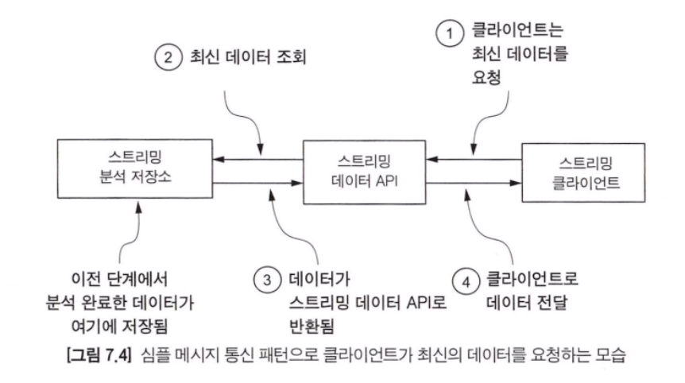

스트리밍 클라이언트는 최신 데이터를 API로 요청한다. 스트리밍 데이터 API는 저장소에서 데이터를 가져와서 클라이언트로 전달한다.

장점
- 간단한 프로토콜, 컨슈머가 API 호출을 할 수 있음
- 클라이언트는 가장 최신 데이터만 받을 수 있음
- 클라이언트는 간단한 메타데이터를 사용하여, 가장 최신 데이터만 받을 수 있음
- API가 클라이언트의 상태를 추적할 필요 없음

단점
- 클라이언트는 계속해서 신규 데이터를 요청하기 때문에 통신량이 많은 상태를 유지함
- 신규 데이터가 들어왔을 경우 클라이언트에 알리는 기능이 없음
- 클라이언트가 종료된 시간이 길거나 대규모 데이터 전송 시 신규 데이터 전송 용량이 급증할 수 있음

#### 발행 - 구독
발행 구독 패턴은 클라이언트가 특정 채널을 구독하고, API는 데이터가 변경될 때 해당 채널을 구독하고 있은 모든 클라이언트에 메시지를 보내는 형태이다. 가장 큰 장점은 스트리밍 API가 특정 채널을 구독한 모든 클라이언트에게 새로운 데이터가 들어왔을 때 메시지를 전달할 수 있다는 것이다.

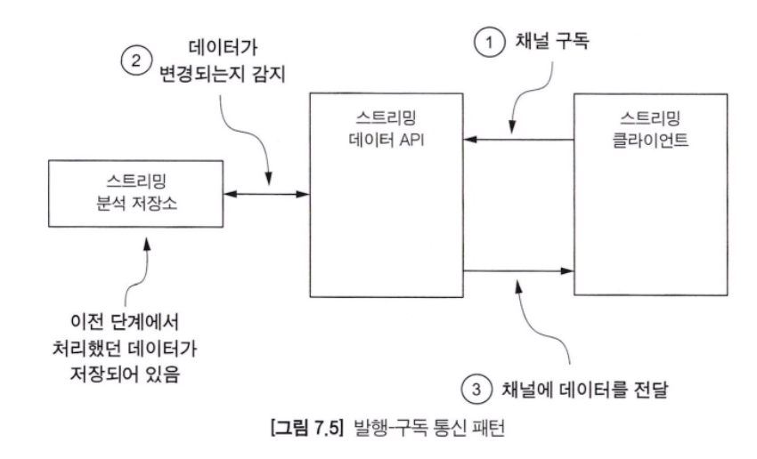

발행 구독 패턴은 점점 더 널리 사용되고 있으며 빠른 응답이 필요한 리액티브 프로그래밍이나 스트리밍 시스템에서 많이 활용된다.

장점
- 클라이언트는 새로운 데이터가 도착했을 때만 처리를 수행하면 됨
- 클라이언트는 처리한 데이터에 대한 메타데이터를 유지, 관리할 필요가 없음
- 스트리밍 API는 다수의 클라이언트들로 데이터 전송을 처리하는 방법을 최적화할 수 있음

단점
- API를 구현하기 위해 복잡한 프로토콜이 필요함
- API는 클라이언트와 관련된 모든 메타데이터를 추적해야 하며, 장애가 발생했을 경우에도 안전하게 처리될 수 있도록 API 서버들에 분산하여 저장해야 함

### 클라이언트에 데이터를 전달하는 프로토콜 방식

스트리밍 API를 개발하기 위해서는 기존에 사용되던 다양한 프로토콜들에 대한 이해가 필요하다. 각 프로토콜들은 다음과 같은 특징을 가지고 있다.
- 메시지 업데이트 빈도
- 통신 방향
- 메시지 지연 시간
- 효율성
- 내결함성/신뢰성

#### 웹훅
새로운 데이터가 도착하거나 기타 여러 조건이 충족되었을 때 클라이언트를 호출하기 위해 HTTP 엔드포인트로 호출하는 방식으로 많이 사용되어 왔다. 콜백과 비슷하다. 그러나 웹훅과 콜백의 분명한 차이점이 있다.

첫 번째는 여기서 호출은 HTTP의 POST 메서드를 통해 실행되며, 두 번째는 클라이언트는 다른 팀 개발자가 개발한다는 점이다.

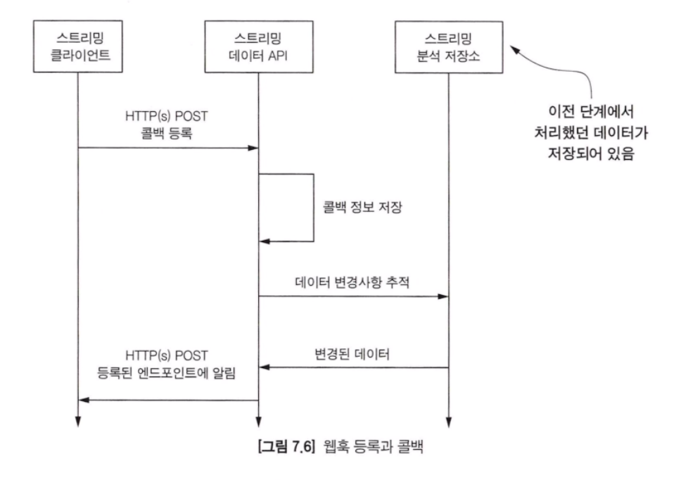

- 메시지 업데이트 빈도 - 업데이트 빈도가 많은 경우에는 적합하지 않다.
- 통신 방향 - 콜백 엔드포인트 변경이 필요할 경우에는 클라이언트가 직접 수행해야 한다.
- 메시지 지연 시간 - 메시지 지연 시간은 평균이다.
- 효율성 - 스트리밍 API 관점에서 이 프로토콜은 매우 효율적이다.
- 내결함성/신뢰성 - 웹훅은 내결함성도 없고 신뢰성도 없다. 이를 구현하는 것은 개발자의 몫이다.

> 메시지를 누락하더라도 상관이 없고, 데이터 전송량이 적은 시스템에서 많이 사용하는 방식이라고 볼 수 있다.

#### HTTP 롱폴링
HTTP 롱폴링 프로토콜은 클라이언트가 서버에 네트워크 통신이 맺어진 상태로 데이터를 지속적으로 클라이언트로 보낸다. 클라이언트가 통신 요청을 하면 서버와 계속해서 연결된 상태를 유지한다. 그리고 전송해야 할 데이터가 생기면 지속적으로 통신하여 전송한다.

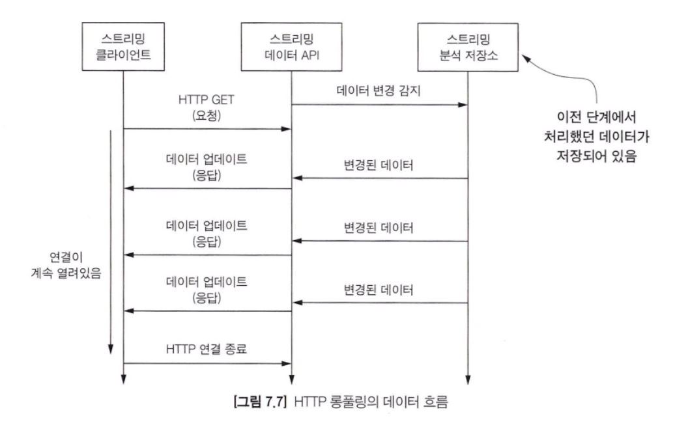

- 메시지 업데이트 빈도 - 다른 HTTP 기반 프로토콜과 유사하게 HTTP 롱폴링은 통신 빈도가 높더라도 이슈가 없다.
- 통신 방향 - 클라이언트가 서버와 연결되고 나면 원하는 데이터를 요청하여 응답을 받을 수 있다.
- 메시지 지연 시간 - 웹훅처럼 HTTP를 통해 전달되는 메시지의 지연 시간은 다른 프로토콜과 비교했을 때 평균적이라고 볼 수 있다.
- 효율성 - 데이터를 전송하는 HTTP 프로토콜은 일반적인 아키텍처에서 효과적일 수 있지만 가장 효율적인 프로토콜은 아니다.
- 내결함성/신뢰성 - 웹훅처럼 HTTP 롱폴링 내결함성과 신뢰성 둘 다 없다.

#### SSE
SSE(Server Sent Event) 는 HTTP 롱폴링을 개선하기 위해 개발된 W3C 권장 프로토콜이다. SSE 는 HTTP 롱폴링이 가지고 있는 두 가지 이슈를 해결할 수 있다.
첫 번째는 클라이언트가 지속적으로 네트워크가 연결되고 끊기는 부분에서 발생하는 비효율적인 통신 방식을 해결할 수 있다.
두 번째는 모바일 디바이스와 같이 리소스가 제한된 장치를 사용할 때, 푸시 프록시 서버를 사용해서 장치가 유휴 상태이더라도 메시지를 푸시할 수 있다.

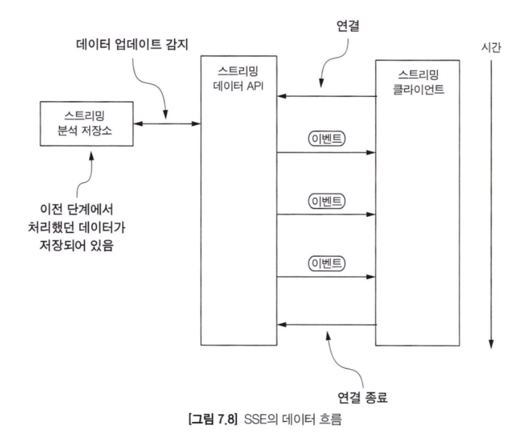

모든 메시지에 대해서 네트워크 연결이 맺었다가 끊어지는 HTTP 롱폴링과 다르게 모든 이벤트가 한번 맺어진 네트워크를 통해 지속적으로 전송된다. 그러나 여전히 클라이언트는 네트워크 연결을 유지해야 한다는 단점은 그대로다. 이를 해결하기 위해 SSE는 비연결 푸시(Connection push)를 지원한다.

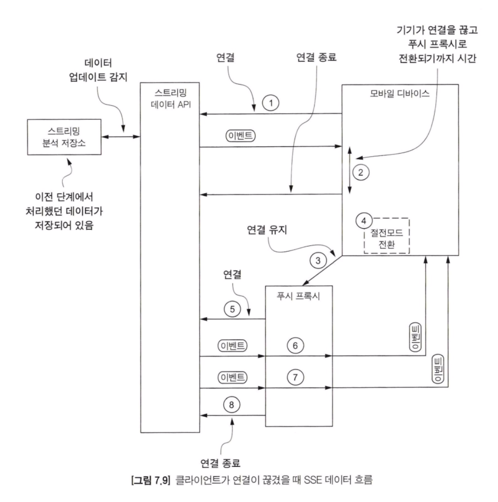

위 사진의 순서는 아래와 같다.
1. 클라이언트(여기서는 모바일 디바이스의 웹 브라우저)가 스트리밍 API와 네트워크 통신을 연결한다.
2. 첫 이벤트를 수신한 이후에 충분한 시간(브라우저에서 조절함)이 지나면 디바이스는 절전모드로 전환한다.
3. 모바일 디바이스가 절전모드로 전환하기 직전에 푸시 프록시 서버와 연결 상태를 유지하라는 메시지를 보낸다. 마지막으로 받은 이벤트의 ID를 전송하여 푸시 프록시 서버는 해당 ID를 가지게 된다.
4. 모바일 디바이스는 절전 모드로 전환된다.
5. 푸시 프록시는 스트리밍 API와 연결한다.
6. 푸시 프록시가 이벤트를 수신하면 모바일 기기 전용 푸시 기술을 사용하여 모바일 디바이스로 이벤트를 전송한다. 디바이스 내부 브라우저에서 메시지를 처리하기 위해 절전 모드를 해제한다.
7. 다시 6을 반복한다.
8. 특정 시점이 되면 푸시 프록시가 스트리밍 API와 연결을 끊고 전체 데이터 흐름이 종료된다.

푸시 프록시 서버를 사용하면 약간의 복잡성은 증가하지만, 모바일 디바이스의 전력을 절약할 수 있고 데이터 사용량도 줄일 수 있다는 것을 확인할 수 있다.

- 메시지 업데이트 빈도 - 이 방식도 메시지를 전송할 때 HTTP를 사용하지만 데이터 최대 전송량은 HTTP 롱풀링 프로토콜보다 훨씬 높다.
- 통신 방향 - 초기 연결 이외에는 서버가 이벤트를 클라이언트로 푸시하는 단방향이다.
- 메시지 지연 시간 - 이전의 모든 HTTP 프로토콜 기반 통신 방식에서 설명했듯이 HTTP를 통한 통신의 전송 지연 시간은 평균이다.
- 효율성 - SSE는 데이터 전송 시 HTTP를 사용하므로 효율적이라고 볼 수 있다.
- 내결함성/신뢰성 - 아쉽게도 이 프로토콜도 이전 HTTP 기반 프로토콜처럼 내결함성과 신뢰성을 보장하지 못한다. 하지만 몇 가지 방법을 통해 개선은 가능하다.

#### 웹소켓
웹소켓(Websocket)은 2011년에 출시하였으며, 통신을 위해 TCP를 사용하는 전이중(Full-duplex) 프로토콜이다. 웹소켓은 초기 핸드 쉐이크와 프로토콜 업데이트 요청에는 HTTP를 사용하고, 이후 통신은 TCP를 사용한다는 점이 특징이다.

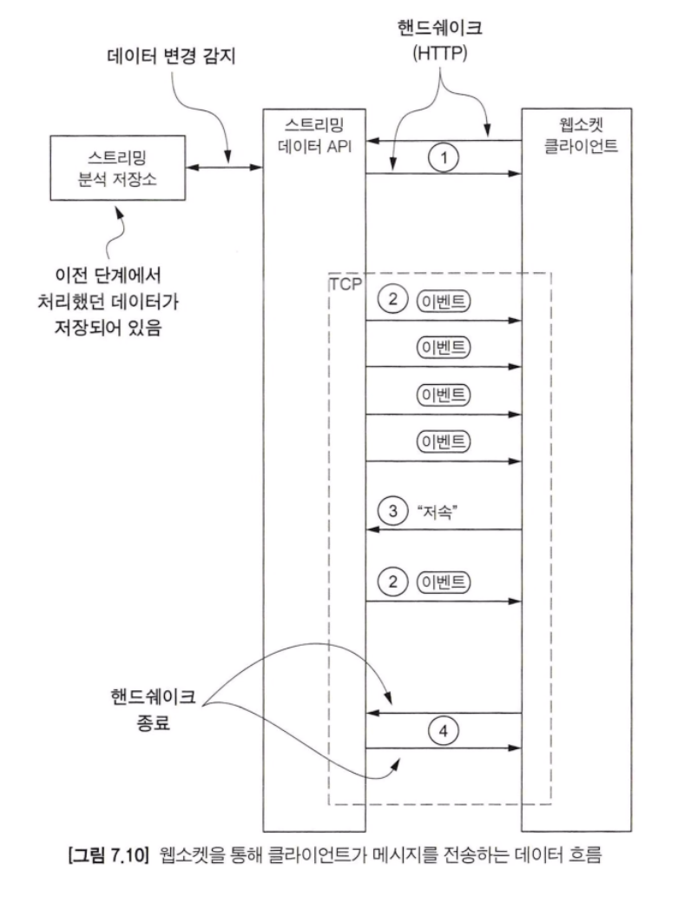

- 메시지 업데이트 빈도 - 웹소켓은 모든 데이터가 TCP를 통해 전송된다는 점을 고려하면 업데이트 빈도는 이전에 살펴본 모든 HTTP 기반 프로토콜보다 훨씬 높다.
- 통신 방향 - 이전 프로토콜들과 달리 웹소켓은 처음부터 끝까지 양방향으로 통신한다.
- 메시지 지연 시간 - 웹소켓의 모든 통신은 TCP를 통해 이루어지므로 이전의 HTTP 기반의 프로토콜에 비해 지연 시간은 적다고 볼 수 있다.
- 효율성 - 웹소켓은 모든 데이터를 TCP를 통해 전송하고 클라이언트와 서버 간에 지속적인 연결을 통해 통신하기 때문에 매우 효율적이다.
- 내결함성/신뢰성 - 아쉽게도 다른 프로토콜들과 마찬가지로 웹소켓은 내결함성과 신뢰성을 보장하지 않는다. 하지만 추가 구현을 통해 보장하도록 할 수 있다.

지금까지 살펴본 주요 특징들과 이전 프로토콜들을 비교하면, 웹소켓이 가장 효율적이고 효과적이고 유연하다는 것을 알 수 있다.
- 클라이언트가 데이터를 받기 위해 1개의 TCP 연결만 사용한다.
- HTTP를 통한 서버, 클라이언트 간 통신이 아니기 때문에 프로토콜 오버헤드가 적다.
- 통신이 쌍방향이기 때문에 클라이언트와 서버가 접속을 열거나 닫는 과정이 생략되고 단일 접속을 통해 통신을 수행한다.
- 내결함성을 구현하여 메시지 전달 가용성을 보장할 수 있다.
- 웹소켓의 저레벨 구현이라는 특성으로 인해 스트리밍 API 와 클라이언트는 높은 처리량을 가질 수 있다.
- 웹소켓을 통해 연결이 된 이후, 추가적인 메시지 처리를 위한 로직을 개발할 수 있다.

> 스트리밍 시스템에서 HTTP를 다루는 클라이언트는 웹소켓을 꽤 많이 사용하고 있다. 웹소켓은 내결함성을 가지고 신뢰성을 높이 가져가고 싶을 때 선택한다.

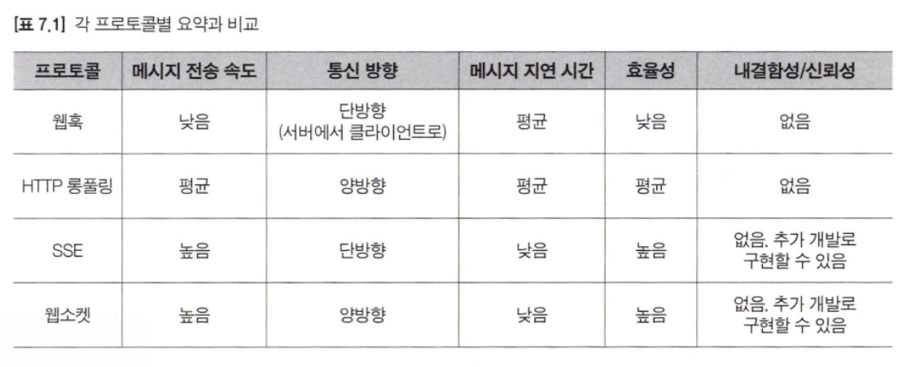

### 스트림 필터링

스트리밍 API에서 필터링은 출력되는 이벤트 중 클라이언트에서 필요한 데이터만 전달하는 것을 뜻한다. 스트림 필터링을 검토할 때는 다음과 같은 사항을 고려하고 이해해야 한다.

- 필터링이 어디서 이루어지는가 - 분석, 스트리밍 또는 클라이언트 단계
- 어떤 필터링 할 것인가 - 정적인가 동적인가

#### 어디서 필터링을 할 것인가
필터링을 어디서 할 것인지 결정하기 위해서 몇 가지 고려해야 할 점이 있다. 스트림 데이터를 취합하거나 어떤 알고리즘이 적용될 경우에는 분석 단계에서 필터링이 수행되도록 해야 한다. 이벤트 발생량이 많아지거나 계산이 복잡해지면 필터링을 분석 단계로 옮기는 것이 좋다. 만약 클라이언트로 보내는 데이터가 외부에서 입수된 데이터와 동일하거나 약간 변형된 형태라면 스트리밍 API 단계에서 필터링 하는 것이 적합하다.

#### 정적 필터링 vs 동적 필터링
필터링은 정적 필터링(Static filtering)과 동적 필터링(Dynamic filtering)으로 나뉜다. 정적 필터링은 스트림에서 필터링 될 내용을 미리 결정하고 처리하는 것이다. 저자는 이런 데이터를 깡통 데이터 또는 특별 취급(out of the box) 스트림 데이터라고 부르기도 한다. 스트리밍 플랫폼 개발자 또는 설계자만이 필터링 조건을 변경할 수 있고, 클라이언트에서는 변경할 수 없다.

동적 필터링은 런타임 애플리케이션에서 필터링이 결정되는 것이다. 바로 스트리밍 클라이언트가 필터링을 수행한다고 보면 된다.

아래 표는 앞에서 설명한 각 프로토콜별로 정적, 동적 필터링을 구현하는 방법에 대해 비교하고 설명한다.

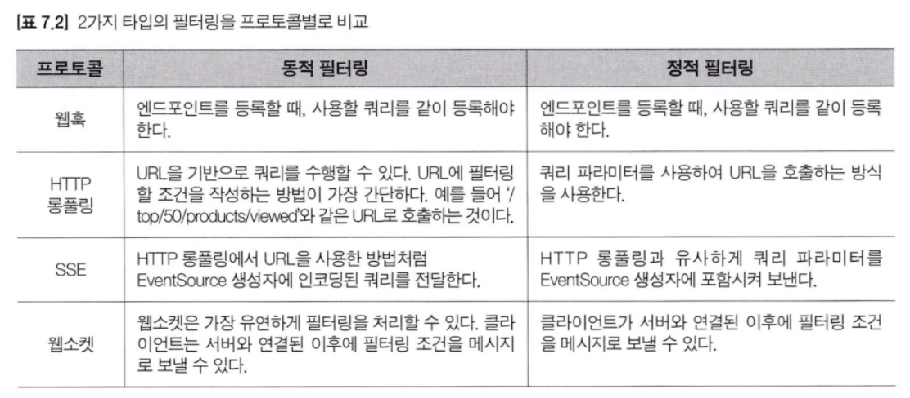

> 많은 수의 클라이언트의 연결을 원한다면 HTTP 롱폴링, SSE 또는 웹소켓을 구현하는 것이 좋다. 그러나 연결이 된 이후 필터링을 허용하는 것이 더 중요하다면, 웹소켓과 같이 더욱 강력한 기능을 가진 통신 방식을 선택하는 것이 좋다.

