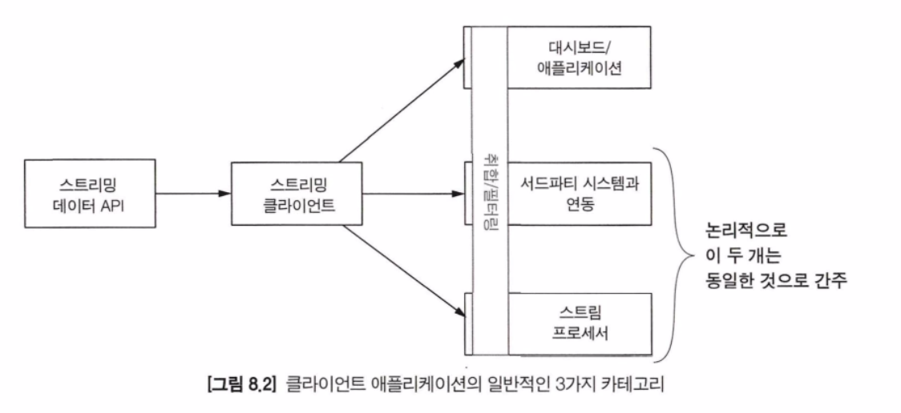
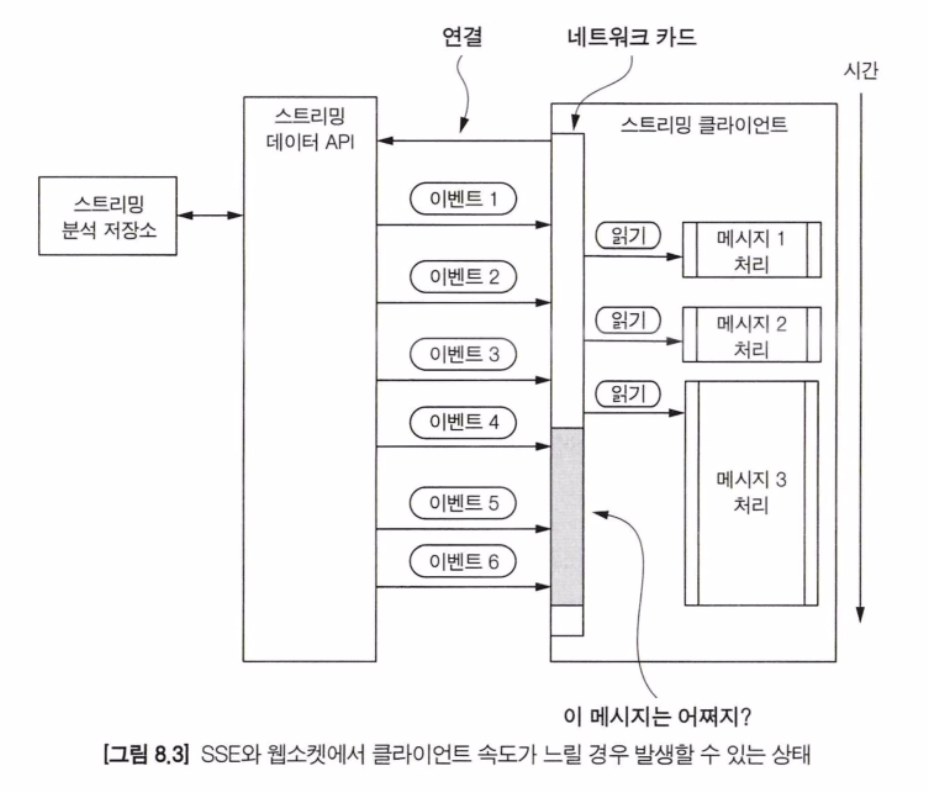
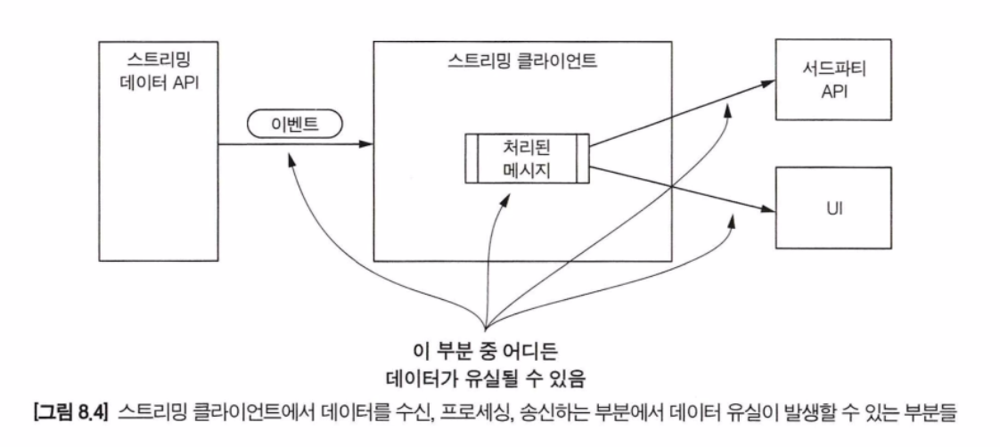
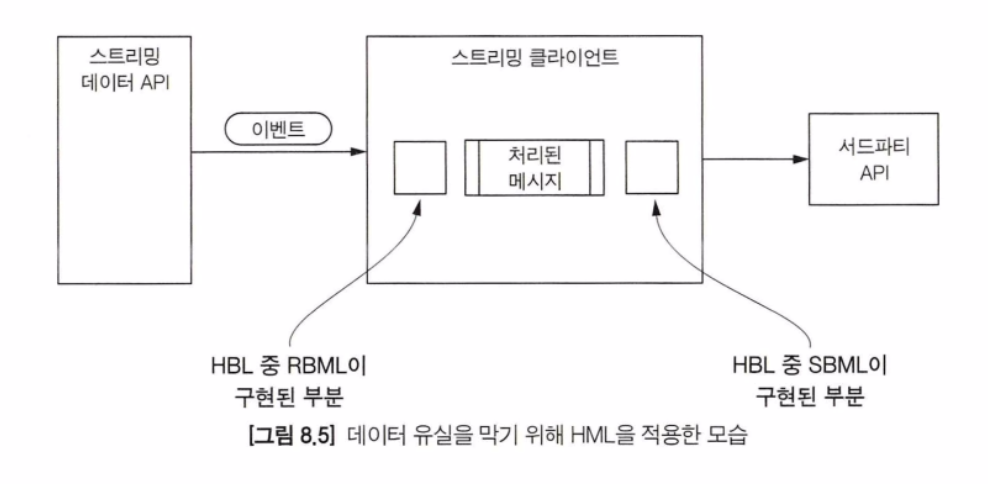
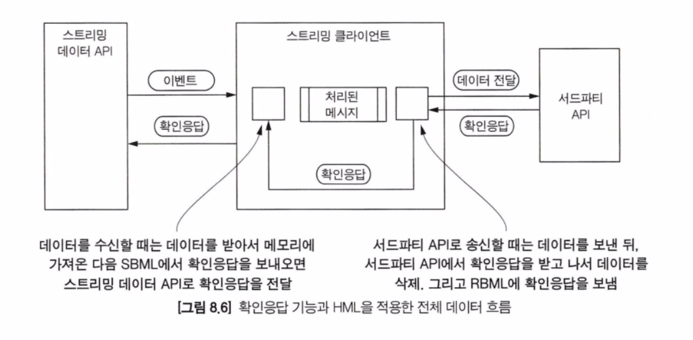
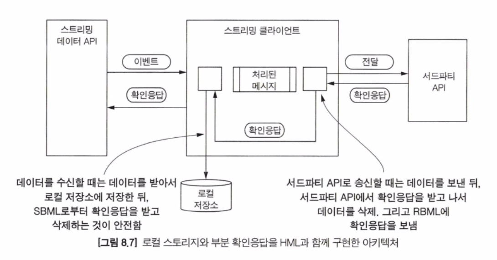
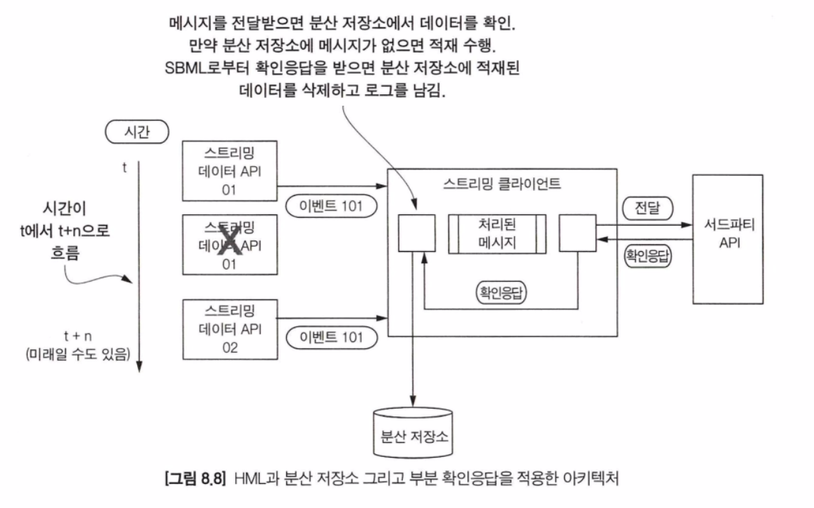
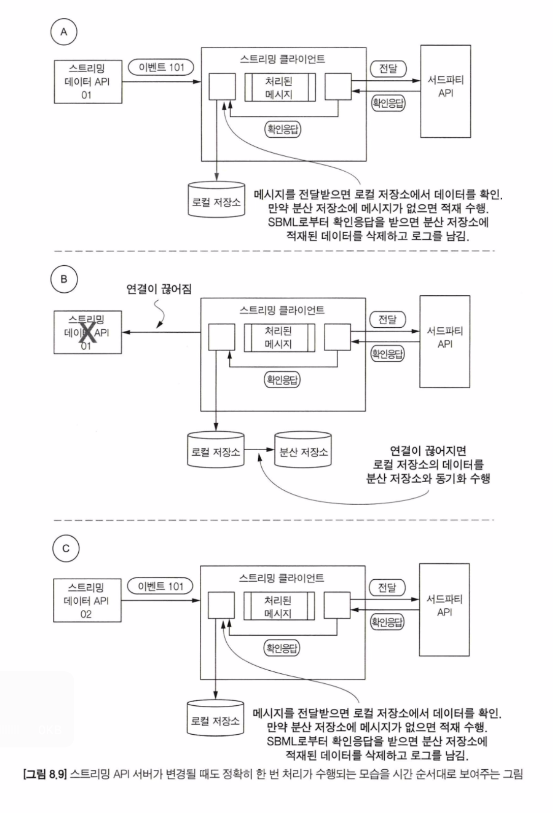
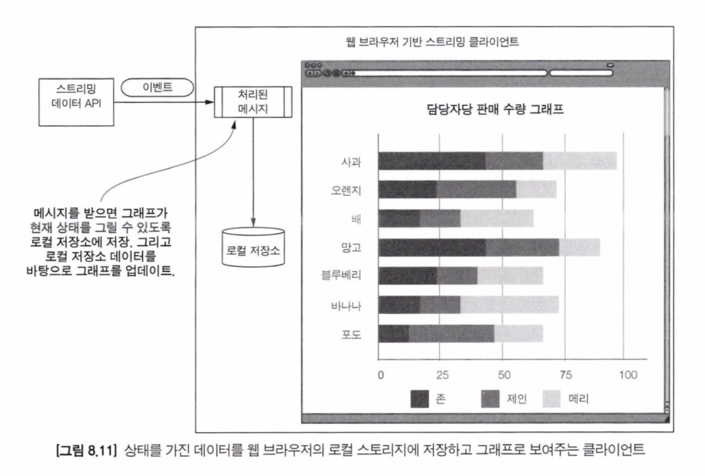
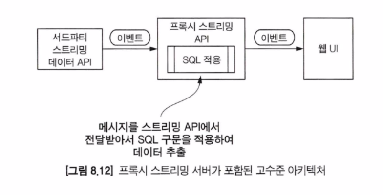

이번 장에서는 스트리밍 API를 통해 클라이언트에 데이터를 보내는 작업을 진행한다

### 핵심 개념

위 사진에서 볼 수 있듯이 구축할 수 있는 서비스는 크게 3가지 카테고리로 나누어 볼 수 있다. 중요한 것은 집계와 필터링의 경우 모든 애플리케이션들이 원하는 기능이라는 것이다. 클라이언트 애플리케이션이 무엇이든 간에 집계와 필터링 기능이 반드시 필요하다고 볼 수 있다 경우에 따라서 이 기능은 클라이언트 측에서 수행하기도 하지만 스트리밍 시스템 내부에서 수행해야 할 수도 있다.

#### UI/최종 사용자 애플리케이션
대시보드/애플리케이션은 스트림 데이터가 처리된 데이터를 지속적으로 가져가는 역할을 한다. 일반적으로 이런 애플리케이션은 스트림 서버와 직접 연동되어 클라이언트 측에서 모든 스트림 데이터를 처리한다.

#### 서드파티 애플리케이션 연동 또는 스트림 프로세서
서드파티 애플리케이션 또는 스트림 프로세서와 통합은 하나의 카테고리로 볼 수 있다. 이 애플리케이션은 일반적으로 비슷한 패턴을 가진다. 스트림 데이터를 가져가서 비즈니스 로직을 수행한 뒤 또 다른 시스템에 전달하는 것이다.

#### 1) 클라이언트의 읽기 속도가 빠를 경우
읽기 속도는 스트리밍 클라이언트 애플리케이션을 구축할 때 우선적으로 고려하는 부분은 아니지만 때때로 가장 중요한 고려사항이 될 수도 있다. 클라이언트가 충분히 빠르게 데이터를 읽고 처리하는 것이 중요한 이유는 두 가지가 있다.

첫 번째는 스트리밍 API 측면이고 두 번째는 스트리밍 클라이언트 측면이다.

클라이언트 측면에서 처리 속도가 중요한 이유는 3가지이다.
- 클라이언트가 충분히 빨리 처리하고 있는지 어떻게 알 수 있을까
- 클라이언트가 종료되면 어떻게 될까
- 스트림 데이터의 전송량이 많아질 경우, 클라이언트 성능을 높이려면 어떻게 해야 할까

서드파티 스트리밍 API
스트리밍 API가 어느 정도로 지원하느냐에 따라 다르다. 첫 번째로 클라이언트의 처리 속도가 느려질 경우 알림을 받을 수도 있고,  두 번째로 처리 속도가 느려짐에 따라 수행할 수 있는 방법을 제공할 수 있다.

만약 서드파티 스트리밍 API가 경고 메시지나 다른 기능들을 제공하고 있지 않다면 한 가지 방법은 현재 처리하고 있는 메시지의 타임스탬프를 읽고 현재 시간과 비교하는 방법이 있다. 그리고 메시지를 처리할 때 현재 시간과 메시지 시간이 차이가 나기 시작하면 클라이언트가 처리 속도가 늦어지는 이유를 찾는 것이다. 만약 메시지에 타임스탬프가 포함되지 않는다면, 다음으로 스트림의 전달 속도를 예측하는 방법이 있다.

자체 제작 스트리밍 API
클라이언트의 처리 속도가 느린 경우 스트리밍 API는 어떤 동작을 해야 할지 확실히 정해야 한다. 전달되는 스트림 메시지 또는 로깅에 포함된 상태 메시지를 통해 지연되고 있다는 것을 공식 문서로 작성하여 제공하는 것도 한 가지 방법이다.

#### 2) 데이터 처리 상태 관리
클라이언트 역할을 하는 스트리밍 애플리케이션에서 데이터 상태 처리는 다양한 방법으로 수행된다. 우선, 사용자가 애플리케이션을 재시작했을 때 어떤 메시지부터 다시 처리해야 하는지 알아야 한다. 이를 위해 마지막으로 처리한 메시지에 대한 메타데이터를 클라이언트에 저장하는 방법을 사용하여 재시작 시 활용할 수 있다. 또 다른 예로 클라이언트에서 스트리밍 데이터 분석 결과 데이터를 저장하는 방식을 활용할 때도 있다.

스트리밍 API는 계속해서 클라이언트로 데이터를 보내기 때문에 클라이언트에서 연산을 수행할 때 너무 오래된 데이터를 가지고 있지 않도록 주의해야 한다.

현실적으로 스트리밍 애플리케이션 역할을 하는 클라이언트는 데이터를 저장해야 하는 경우가 많고, 더 나아가서 집계와 연산을 하는 경우가 대다수이다. 클라이언트 애플리케이션에서 사용하는 기술 스택에 상관없이 대용량, 대규모 스트림 데이터를 다룰 때는 메모리를 잘 관리하는 방법이 중요하다.

브라우저에서 실행되는 웹 기반 스트리밍 클라이언트를 구현할 때 데이터를 저장하기 위해서 웹 스토리지 또는 IndexedDB를 사용할 수 있다. 웹 스토리지는 로컬 스토리지와 세션 스토리지로 나뉜다.

> 로컬 스토리지는 브라우저를 종료하더라도 지속적으로 데이터를 저장할 수 있도록 설계되어 있다. 반면 세션 스토리지는 데이터의 저장소는 도메인으로 구분되며 브라우저가 실행되는 동안에만 유지된다.

웹 스토리지를 사용할 때 몇 가지 제한 사항이 있다. 첫 번째 제한은 키의 저장 순서가 사용자 에이전트에 따라 다르다는 점이다. 두 번째 제한은 웹 스토리지가 5MB의 저장 공간만 제공한다는 점이다.

두 번째 옵션은 웹 스토리지와 다른 특징을 가진 IndexedDB를 사용하는 것이다. IndexedDB를 사용하면 키를 기준으로 하여 순차 검색, 값에 대한 효율적인 검색, 키에 대한 중복 저장, 많은 개수의 레코드에 대한 순차적 순회 기능을 구현할 수 있다.

브라우저 위에서 돌아가는 스트리밍 클라이언트에서 데이터를 저장할 때는 저장되어야 하는 데이터의 용량이 매우 적어야 하며, 웹 스토리지나 IndexedDB 둘 중 하나로 구현하면 된다. 스트리밍 API를 구축하는 경우 클라이언트에서 필요한 연산을 자체적으로 수행할 수 있는 방법에 대해 고민해야 한다. 여기에 추가로 클라이언트의 연결이 종료되더라도 상태를 그대로 유지할 수 있는 방법도 고민하면 좋다.

> 일정 수준 이상으로 스트림 데이터가 유입되면 클라이언트를 정상적으로 운영하기 위한 리소스가 부족해지기 마련이다. 그렇기 때문에 기술에 연연할 필요가 없다. 오히려 집계와 연산 작업을 스트리밍 API로 위임함으로써 최대한 클라이언트는 비상태기반으로 구현하고 운영하는 것이 좋다.

#### 3) 데이터 유실 줄이기

위 그림을 보면 데이터가 유실될 수 있는 세 가지 부분이 존재하는 것을 알 수 있다. 첫 번째는 스트리밍 API에서 클라이언트로 전송될 때, 두 번째는 스트리밍 클라이언트 내부에서 처리 중인 경우, 세 번째는 UI에 노출될 때 또는 서드파티로 전송될 때이다.

이때 사용할 수 있는 방법이 앞 장에서 학습한 HML 패턴을 적용하여 데이터 유실을 방지할 수 있다.

우선 스트리밍 API 서버로부터 데이터를 클라이언트가 받은 다음 HML 방식으로 수신부를 구현한다. 클라이언트 내부에서 처리한 다음 서드파티로 데이터를 전송하기 전에 HML로 발신부를 구현한다.

서드파티 API가 데이터를 성공적으로 받았을 때 성공했다는 확인응답을 리턴하면 해당 메시지가 처리 완료되었음을 확인하고 해당 로그를 삭제할 수 있게 된다.

문제는 모든 서드파티 API가 이런 방식으로 확인 응답을 리턴하는 것이 아니라는 사실이다. 이런 경우에 가장 좋은 방법은 쓰고-읽기 패턴을 적용하는 것이다. 메시지를 보낸 다음 바로 시스템을 조회하여 방금 보낸 데이터가 정상적으로 처리되었는지 검색하는 방법이다.

#### 4) 정확히 한 번으로 처리
메시지를 정확히 한 번만 처리해야만 할 때가 있다. 서드파티 API를 직접 구현한 것이 아니기 때문에 정확히 한 번으로 처리가 가능할지 미지수이다. 따라서 서드파티 API와 연동할 때, 스트리밍 클라이언트는 메시지를 중복해서 보내지 않도록 유의해야만 한다.

이상적인 구현 방법으로 스트리밍 API의 확인응답 기능을 활용하는 것도 좋은 방법이다. 처리 중인 메시지에 대해 서드파티 API 및 스트리밍 클라이언트의 통신에서 확인응답 기능을 구현한 것을 아래 그림에서 확인할 수 있다.

위 사진의 경우 서드파티 API에서 확인응답을 보내주지만, 만약 확인응답이 없는 경우 어떻게 처리할 수 있을까?

이 경우 일정 기간 처리한 모든 메시지를 기록하면 된다. 고유한 메시지 ID가 존재한다고 가정할 경우 "메시지 저장소에서 처리된 것들"을 저장하면 된다. 또 다른 방법으로는 데이터를 해시로 처리하거나 핑거프린팅 메커니즘을 활용하면 된다. 우리가 처리한 모든 메시지를 기록하면 클라이언트의 복잡성은 높아지고 저장소에 대한 요구사항이 늘어난다. 그러나 이를 통해 스트리밍 API는 이슈가 발생하더라도 정확히 데이터를 한 번만 처리할 수 있게 된다. 이를 구현한 아키텍처는 아래 그림에서 확인할 수 있다.

스트리밍 API가 두 개 이상 있을 때는 어떻게 구현할 수 있을지 고민해야 한다. 스트리밍 API 서버는 클라이언트에 이미 전달한 메시지를 모든 경우에 추적하기는 어렵다. 이 문제를 잘 처리하기 위해서는 이전에 전송한 메시지를 기록하기 위한 분산 저장소가 필요하다.

위 사진은 스트리밍 API가 두 개 이상 있는 경우에 대한 그림이다.
시간의 흐름에 따라 설명하자면 01번 서버가 이슈로 종료되었을 때, 02번 서버는 클라이언트에서 이미 처리한 메시지를 한 번 더 스트리밍 클라이언트에 보낸다. 클라이언트 측에서는 전달받은 메시지가 처음 유입되는 메시지인지 확인하고, 만약 중복 처리 메시지라면 처리하지 않는다.

이 아키텍처에서 주의해야 할 점은 이미 처리된 메시지의 중복 작업을 막기 위해서 분산 저장소를 사용하고 있다. 이를 토앻 중복으로 들어온 메시지에 대해 재처리를 막을 수 있게 된다. 만약 성능상 이슈가 있는 경우라면 로컬 저장소에 임시로 저장한 이후에 분산 저장소로 플러시하는 것도 고려할 수 있다.

여기서 중요한 점은 스트리밍 클라이언트가 스트리밍 API 서버와 네트워크 연결이 끊겼을 때 로컬 저장소를 분산 저장소와 동기화한다는 것이다. 신규 메시지를 처리하기 전에 이런 이슈를 미리 감지하여 메시지를 중복 처리하지 않도록 설계하는 것이 중요하다.

### 웹 클라이언트 소개
웹 클라이언트는 트랜잭션이나 멱등성을 보장해야 하는 서드파티 API와 연동하지 않기 때문에 훨씬 간단하다고 볼 수 있다.
스트림 데이터양이 많을 경우에 웹 브라우저 기반 스트리밍 클라이언트의 처리 속도는 반드시 느려지게 된다. 하지만 큰 문제는 아니다. 일부 데이터가 누락될 수는 있지만 비즈니스에 필요한 전체 지표의 동향이 달라지는 것은 아니기 때문이다.

그래프의 전체 데이터를 로컬 스토리지에 저장하면 사용자가 웹 페이지를 껐다가 다시 켜도 이전 데이터들을 포함한 형태의 그래프를 조회할 수 있다는 장점이 있다. 다만 세션 스토리지에 저장하는 경우에는 해당되지 않는다.

위 방법을 사용할 때 유의해야 할 두 가지 사항이 있다.
첫째, 데이터를 로컬 스토리지에 저장하고 유지할 경우 보안 담당자에게 보안성 검토를 받아야 한다.
둘째, 스트리밍 API 서버가 실시간 현재 데이터를 보내는 것이 아니라 증분값만 전송하는 경우가 있다. 이런 경우 이전 데이터가 존재해야만 다음 데이터를 그릴 수 있다. 만약 여러 스트리밍 API 서버에서 데이터를 받을 경우 로컬 스토리지를 사용하는 것이 아니라 IndexedDB를 사용하는 편이 좋다.

### SQL 쿼리 적용

웹 기반 스트리밍 클라이언트를 구축하든 또 다른 클라이언트를 구축하든 간에, 스트리밍 데이터 API와 연동하고 나면 사용자는 데이터를 필터링하거나 다른 기준으로 조회가 가능한지 문의할 것이다. 아쉽게도 모든 스트림 프로세싱 엔진이 SQL과 같은 기능을 제공하는 것은 아니다. SQL을 지원하는 서드파티 스트리밍 API를 사용하거나 직접 개발해야 할 수도 있다.

스트리밍 서버가 쿼리 언어를 지원하지 않고 SQL 또는 여타 쿼리 언어로 연동이 필요할 경우에는 팀에서 쿼리를 지원하는 프록시 서버를 자체적으로 구축하는 것으로 해결할 수 있다.

위와 같은 아키텍처를 통해 브라우저에서 실행되는 애플리케이션은 복잡한 쿼리 기능을 수행할 수 있게 된다. 프록시 스트리밍 서버를 연동하면 마치 스트리밍 서버와 통신하는 것처럼 운영할 수 있다. 브라우저에서 사용자가 SQL 쿼리를 입력하면 프록시 서버는 실제 스트림 데이터가 있는 스트림 서버로 요청을 보내는 방식으로 동작한다.

